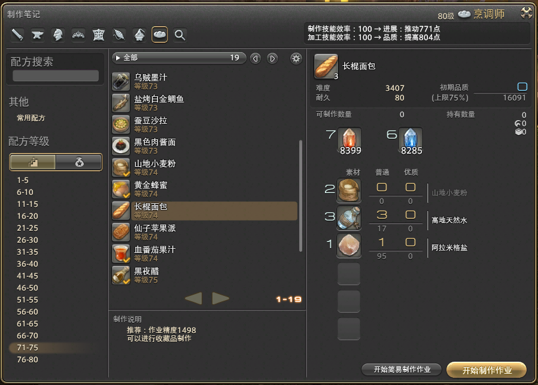

# 能工巧匠

能工巧匠是FF14中对所有生产职业的统称，FF14的生产有其独特的玩法，需要在有限的耐久（回合）内，消耗制作力使用技能，来推进制作的进展和品质，如何权衡制作力的消耗，以及获得进度、品质的效率，是各位能工巧匠们钻研的主要课题。

FF14拥有庞大的材料库和成熟的市场，因此工匠们通过自己勤劳的双手和智慧的头脑，积累财富。

## 基本信息

和战斗职业一样，生产职业行会也分布在3个主城各处，需要玩家前往各个主城学习。获得生产主手之后，切换主手工具就可以切换职业。

然而生产职业并不会对战斗职业提供任何属性或者其他加成。生产职业可以为对应的武器、装备进行修理（在装备信息最下方显示），修理后的耐久值=原有耐久+100%，也就是说，玩家自行修理的装备耐久可以突破100%的上限达到~~199%~~。另外生产职业也可以给对应的武器装备进行禁忌镶嵌（普通的魔晶石镶嵌可以由NPC完成）。

## 生产基础

玩家习得生产职业之后，需要通过==制作笔记==（默认快捷键`N`）选择配方，并进入制作状态。

;;;.guide .cols2
;;;.guide .col

;;;

;;;.guide .col .grow

在5.1中，简易制作被更改为只要超过规定的作业精度就一定成功，而不是需要三要素共同决定成功率的现在，而HQ数量的多少取决于你的加工精度。

同时，下图中蓝框代表了你现有的属性在无Buff状态下使用作业/加工效率100的技能可以推进的工数/加工精度的大小，你会发现你搓不同物品的时候这两个值会变动，不过这就不属于新手工艺学介绍的范畴了。

黄框代表了你可垫一些HQ品质的物品，这会使你的要搓的物品的初期品质上升，一类物品会有相同的上限，可以看到我们要搓的这个物品的初期品质上限是75%，而有类物品会是50%。

;;;
;;;

同前面所述，玩家需要在有限的耐久（回合）内，消耗制作力使用技能，来推进制作的进展和品质。把进展推倒100%就可以获得物品，而提升品质则可以提升物品的HQ概率，高品质的装备才能卖出高价钱，而NQ的物品的价值则非常有限。~~而根据吉田概率学，只有100%品质才能获得HQ。~~

### 作业系技能

正所谓千里之行，始于足下，正确的运用作业系技能可以让你从零到一成功搓出相应的物品，此类技能包含如下技能：

* <action name="制作" />/<Action name="模范制作" />
 CP消耗0/7，制作这个技能的效率是100(等级31级前)/120(等级31级后)，而模范制作则是固定的150，这类技能是陪伴你从1级到满级的，不可或缺的小伙伴，当你升级到31级时，会自动获取一个被动：令你“制作”这个技能的效率由100提高至120。
* <action name="高速制作" />
 搏一搏，单车变摩托是这个技能的最佳写照，不消耗CP的300作业效率的它不香吗？Ps.此技能会在63级时自动升级到500作业效率。
 不，好像不香，由于此技能的成功率为50%，对于一向寻求稳定的宏制作来说，是绝对不会使用的，但是此技能仍然有几种用途：
 我有充足的耐久，可以让我使用多次
 我想快速搓出来，我的时间非常值钱
 万策尽，只能搏一搏
* <action name="观察" />与<action name="注视作业" />的Combo
 CP消耗7与5，最为经典的观察系Combo，当你使用观察后再使用注视作业(共消耗12CP)，它就会100%地为你推进200作业效率，如果不使用观察的话，注视作业的成功率只会有50%(那么为什么不去用高速制作呢？)。
* <action name="元素之美名" /> 与<action name="元素之印记" />的Combo
 CP消耗30与6，作业效率最高的Combo，是你以后生产练级的绝对利器，这两个技能在5.1中得到了相当程度的改动： 
 元素之美名的效果是：根据剩余元素之美名的状态工次，提高元素之印记的效果(最高+200%)，3回合内有效，此技能只能使用一次。(此技能也许需要勘误) 
 元素之印记的效果是：成功率100%，制作效率100的作业系技能。
 所以，我们可以发现，开元素之美名buff的下个工次，若我使用元素之印记，其效果是100%成功率的300作业效率，如果我们继续使用，需要我们衡量其与其他制作技能的收益，但是显然，元素之美名+元素之印记至少需要消耗36CP，对于CP的消耗，需要我们重视。
* <action name="集中作业" />
 CP消耗6，仅能在高品质状态下使用，故无法进入宏中使用，仅在手搓下有一席之地，作业效率300。
* <action name="坚信" />
 消耗CP6，仅能在首回合使用，效果是：消耗10耐久，300作业效率。追加效果：令下一次作业系技能效果提高100%，5回合内有效。第一个取得的首回合限定技能，看起来就比一般技能超模(实际上也是这样)，可以多加利用，但要注意不要一下捅穿作业条嗷。

### 加工系技能

正所谓故不积跬步，无以至千里；不积小流，无以成江海，为了搓出心仪的HQ，需要加工系技能的精密配合：
* 加工系技能的核心：<action name="内静" />和<action name="比尔格的祝福" />
 内静Buff可以理解为：使用这个Buff后，每当产品的品质条成功上升时，此Buff层数+1；以1层时的面板为准，每层提供20%加工精度；上限11层，此技能上限加工精度的获取为3000点。
 而比尔格的祝福时是一个消耗24CP的加工技能，其效果是：根据内静层数的多少决定该技能的加工效率，效率为：100+20*(内静层数-1)，成功率100%，使用后内静Buff消失：所以一个满层数内静的比尔格的祝福的加工效率是300。
 一般认为，内静越高加工效果越强，除非使用技能主动消耗，否则内静Buff会一直存在。由此可见：加工的主要方式是以低耐久/低CP消耗加工技能堆叠内静，在高层内静下利用比尔格的祝福一口气获得大量加工数值。
* <action name="加工" />/<action name="中级加工" />/<action name="俭约加工" />/<action name="坯料加工" />
 这四个技能可以归为一类，均是成功率100%的加工技能，CP消耗分别为18/32/25/40，效率分别为100/125/100/200，俭约加工耐久消耗减半(相当于只消耗5耐久)，坯料加工耐久消耗加倍(相当于消耗20耐久)。前期的加工系技能CP消耗大，性价比远不如仓促，到中后期的俭约加工是叠加内静的主力，而坯料加工，由于其耐久的加倍消耗，通常与其他耐久Buff技能配合使用。
* <action name="仓促" />
 最被新人低估的技能，没有之一，不消耗CP的代价是成功率只有可怜的60%，很多新人看到60%的概率就会认为这技能是弟中弟中弟，实际上，他是你前期堆叠内静的可靠选择(当然它以后就被其他技能代替了)，在你的前期制作中，可以配合耐久技能轻松使用10个以上的仓促。如果它们都成功，可以轻松使内静接近上限！(但是很显然不会的)。
 对于此技能和加工技能的堆叠内静效率，这两者是差不多的(仓促略略略略优于加工)，同时大量运用加工技能可以有效缩短宏的长度，对于初期堆叠内静的方法见仁见智。
* <action name="观察 " />与<action name="注视加工" />的Combo
 CP消耗7与18，最为经典的观察系Combo，当你使用观察后再使用注视作业(共消耗25CP)，它就会100%地为你推进150加工效率，如果不使用观察的话，注视加工的成功率只会有50%
* <action name="精密作业" />
 它改变了生产，虽然他是精密“作业”，一次使用，100作业效率+100加工效率，成功率还是100%，CP仅消耗32，还能叠一层内静，不香么？(香疯了)，当然此技能需要一定的规划和设计，有时候作业条都要捅穿了，加工条还没怎么动呢。
* <action name="闲静" />
 硬实力技能，效果是：消耗CP24与10耐久，仅可在首回合才能发动。加工效率100。追加效果：赋予自身3档内静状态(即以初始状态推进一次100效率的加工，而后自身获得3层内静)。
 看起来就很强(实际上就是强)，白嫖3层内静tql，是的还不用开内静Buff，一般来说69级拿到它之后就取代了作业系技能坚信的位置，相比于坚信更像是设计组亲妈生的，太顶了，而不像坚信那样是后妈生的。
* <action name="专心加工" />
 赢了会所嫩模，输了下海干活的技能你喜欢吗？
 成功率50%，加工效率100，成功了内静层数翻倍，失败了直接减半。
 你去赌吧我不敢，溜了溜了。
* <action name="集中加工" />
 CP消耗18，仅能在高品质状态下使用，故无法进入宏中使用，仅在手搓下有一席之地。加工效率150，100%成功附带内静层数额外+1。
* <action name="工匠的神速技巧" />
 CP消耗250，直接把低于自身等级10的物品加工槽推满(相当于70级及其以下的物品)虐菜神技，没有之一。

 同时在生产过程中，每个回合里，材料的状态都会发生变化，当材料处于高品质的时候，加工技能的效率将会变为平时的1.5倍，而当材料处于最高品质的时候，加工技能的效率将会变为4倍，每个最高品质之后的回合，材料都会变成低品质。

### Buff类技能
Buff类技能主要分为三类：耐久Buff、制作加工Buff和其他。

* 加工Buff，主要有：新颖(Lv15)/阔步(Lv21)/改革(Lv26)
 * <action name="新颖" />：CP消耗22，接下来的5次工序作业和品质的推进量提高
 * <action name="阔步" />：CP消耗32，接下来的3次工序内下一次使用的加工系技能效果提高100%
 * <action name="改革" />：CP消耗18，接下来的4次工序内作业系和加工系技能的效果提高20%
 需要注意的是，阔步仅能在3次工序内发挥一次作用，如果你阔步后使用三次加工，仅有阔步后的第一次加工可以吃到阔步的Buff，后两次是吃不到的，需要注意。
 上面已经提及到了“先用小锤扣缝，然后大锤搞定”，显然在最后的比尔格阶段中，Buff自然是越多越好。可能有的时候会发现，为什么我用了新颖之后，并没有推进更多的品质啊，不过这就不属于新手工艺学的范畴了，文末我会给出延伸阅读供各位参考。
* 耐久类Buff主要有：俭约(Lv15)/长期俭约(Lv47)/精修(Lv7)/掌握(Lv65)
 * <action name="俭约" />：CP消耗56，接下来的4次工序耐久消耗减半
 * <action name="长期俭约" />：CP消耗98，接下来的8次工序耐久消耗减半
 * <action name="精修" />：CP消耗88，直接回复30耐久
 * <action name="掌握" />：CP消耗96，接下来的8次工序结束时耐久回复5
 可以很明显的看到，如果工序内不掺入其他Buff技能，均为耐久消耗10点，显然俭约可以视作一个回复20耐久的技能，长期俭约为40，掌握亦为40。
 可能你会说如果加入坯料加工，那岂不是俭约/长期俭约的效果要比掌握好的多？
 实际上的确可以这样说，但是不全面，实际上其他的制作加工Buff也经常会掺杂在耐久Buff的序列中，如果在俭约buff下一回合内不消耗耐久，那么俭约类技能的效果就会打折扣，但是掌握并不用考虑这些，因为其不管下几个序列中干了什么，仍然会每个工序回复5耐力。对于耐久类Buff的选取，要具体问题具体分析。
* 其他类Buff仅介绍一些常用技能：秘诀(Lv13)和再利用(Lv74)
 秘诀仅能在高品质下使用，效果是直接回复20CP，故不能在宏中使用。
 再利用比较复杂，效果是：当你的加工条推满后的下一工次，有1/3的概率可以使用，使用后若成品制作成功，可以回收一项制作成品所用的原材料，绝大多数配方固定回收制作列表里的第一行材料一个。

[能工巧匠大型综合攻略](https://bbs.nga.cn/read.php?tid=12513963)，[新人升级指南](https://bbs.nga.cn/read.php?pid=280981488)（写攻略的人负责挣钱，抄攻略的人负责花钱）。
<UnderConstruction />
