# 水晶冲突
<FloatTOC />
;;;.guide .cols2
;;;.guide .col
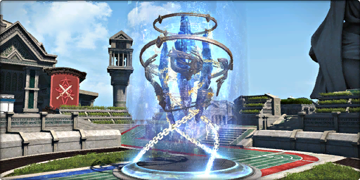 

;;;

;;;.guide .col .grow

水晶冲突是6.1新开放的5v5对战，继承已关闭的4v4群狼盛宴的相关成就。

在水晶冲突中，玩家需要将场地中央的战术水晶，运送到对方的目标点以取胜。

;;;
;;;

## 界面介绍

 

参赛者将分为“星极队”与“灵极队”进行5v5对战，屏幕上方为进度提示条

;;;.guide .cols2
;;;.guide .col
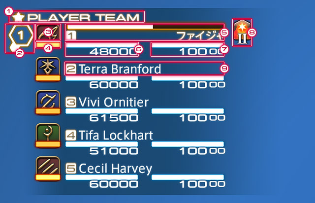 

职业图标下方(4)显示极限技的充能情况
;;;

;;;.guide .col .grow

进入场地后，我们可以看到敌人与小队列表，并在上面看到每个人当前的状态栏及极限技充能情况。

::: collapse 内容说明

1. 队伍名称
2. 标记
3. 职业图标
4. 极限技充能情况
5. 咏唱条
6. HP
7. MP
8. buff/debuff
9. 角色名字

:::

在水晶冲突中，玩家id的左侧及目标栏名字的最后会显示玩家的职业信息

;;;
;;;

;;;.guide .cols2
;;;.guide .col
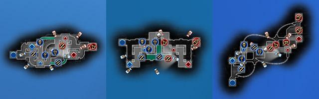 

;;;

;;;.guide .col .grow

在小地图中，可以看到双方每一名玩家的当前位置

;;;
;;;

## 战斗机制

战术水晶会根据目标圈内的双方人数情况按照固定路线移动：

;;;.guide .cols4
;;;.guide .col
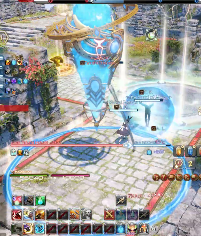 

己方推进中
;;;

;;;.guide .col

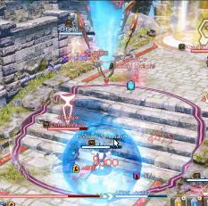 

敌方推进中

;;;
;;;.guide .col

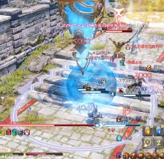 

水晶中立

;;;
;;;.guide .col

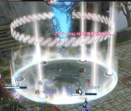 

检查点突破中

;;;
;;;

* 仅有一方玩家：向着另一方移动
* 包含两方玩家：中立状态，不移动
* 不包含任意一方玩家：中立状态，一定时间后返回起始点

水晶的移动状态及目标圈中的人数情况可以通过最上方状态栏来确定（白色的小菱形，战斗刚开始时位于正中央）

;;;.guide .cols2
;;;.guide .col
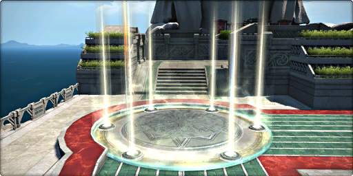 

检查点
;;;

;;;.guide .col .grow

战术水晶抵达检查点时，会解除运送状态并开始突破

* 己方玩家的人数大于敌方玩家，则突破率会上升，且人数越多，上升越快；
* 敌方玩家人数更多，水晶将向己方移动；
* 突破率不会清零，再次达到检查点时可以继续推进。

;;;
;;;

### 胜负判定

胜利条件：成功将地图上的“战术水晶”运送至敌方目标点的队伍即可获得胜利。

加时赛：在倒计时结束时尚未推送至终点，则进入加时赛：
* 进度领先的队伍，将对手全部驱赶出战术水晶圆圈持续3秒即可获得胜利；
* 进度落后的队伍，超过对手的进度即可获得胜利。
* 平局：在加时赛中仍未分出胜负则计算平局

复活：第一次被击倒时的复活时间为10s，随后每多被击倒一次，复活所需时间增加1s

## 地图介绍

;;;.guide .cols2
;;;.guide .col
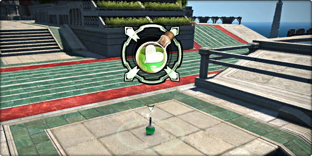 

医疗道具包
;;;

;;;.guide .col .grow

场地上固定刷新的医疗包，非满血的玩家接触后会立刻回复自身30000HP。

满血的玩家无法使用，同一包只能有一名玩家使用，使用后经过一定时间会再次刷新。

;;;
;;;

水晶冲突每90分钟切换一次举办的地图，进入地图后，有30秒的准备时间，期间不可切换职业。

目前有3张地图，每张地图都有特殊的地图机制：

### 角力学校

;;;.guide .cols2
;;;.guide .col .figcap
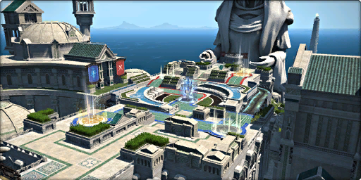 

角力学校
;;;

;;;.guide .col .figcap

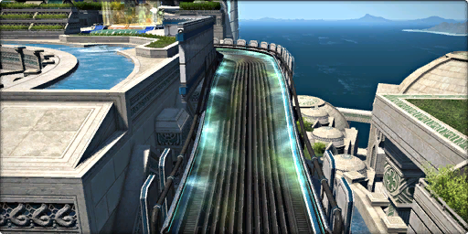 

冲刺带：进入冲刺带后会被附加超级冲刺，移动速度极大程度提升

;;;
;;;

### 火山之心

;;;.guide .cols3 .base
;;;.guide .col .figcap
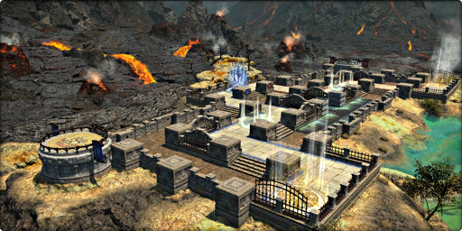 

火山之心 火山之心也有和角力学校效果相同的冲刺带
;;;

;;;.guide .col .grow

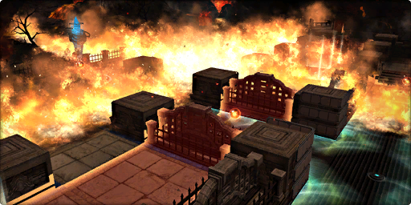 

火山喷发：到达预告时间后，火山喷发会落下爆弹怪，一定时间后爆弹怪会发动十字范围AOE，伤害30000，在十字交叉地点会受到两次伤害，可以被减伤技能减轻伤害。

;;;
;;;.guide .col .grow

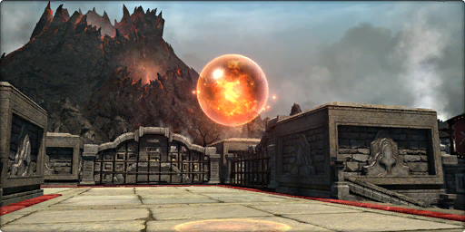 

爆弹怪之魂：爆弹怪爆炸后留下的圆球，玩家接触后会获得伤害提升及极限技充能的效果。

;;;
;;;

### 九霄云上

;;;.guide .cols3 .base
;;;.guide .col .figcap
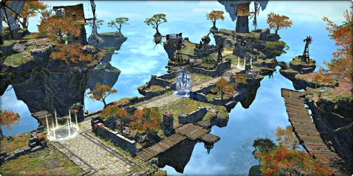 

九霄云上
;;;

;;;.guide .col .grow

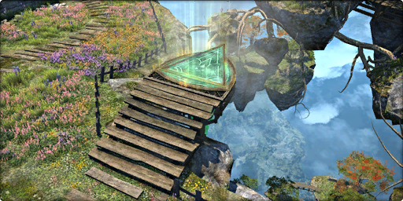 

跳跃台：可以快速移动到指定地点

;;;
;;;.guide .col .grow

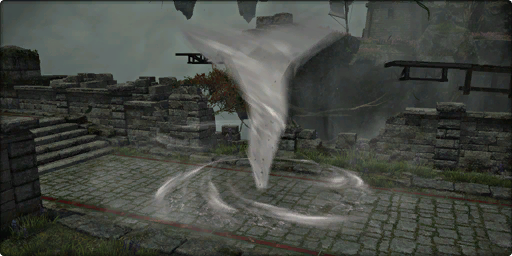 

变天后场地上会出现龙卷风，造成小幅度的击退。
;;;
;;;

;;;.guide .cols2
;;;.guide .col 
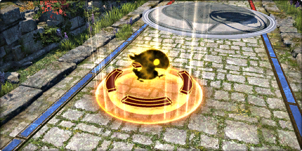 

黑陆行鸟羽毛
;;;

;;;.guide .col .grow

湍流：到达预告时间后，玩家会被抛上高空，一定时间后落地造成30000伤害。接触黑陆行鸟羽毛不仅可以回避掉伤害，同时还会获得持续GCD加速及极限技充能效果。该效果可以利用防御回避掉。

;;;
;;;

## 与队友交流

55对战中不能打字，只能使用快捷发言（角色-对战资料-快捷发言）及标点，请善用标点和快捷发言与队友沟通吧！

## 自定赛

自定赛是水晶冲突的特殊模式，不会影响玩家的积分、排名等任何pvp数值，但是可以设置场地特效和观战模式。

;;;.guide .cols2
;;;.guide .col 
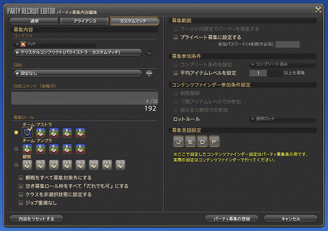 

自定赛需要通过招募组队
;;;

;;;.guide .col .grow

想参与自定赛，需要自行通过招募组队，招募时可以选择参战队伍或观战席。

观战玩家可以设置8个固定机位，也可以通过数字键切换10名对战玩家的第一视角。

;;;
;;;