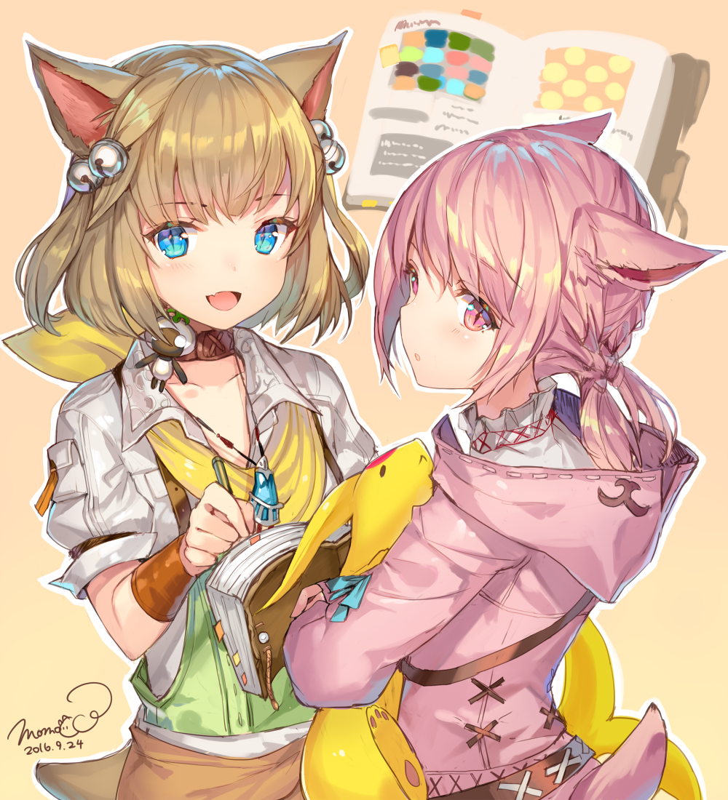
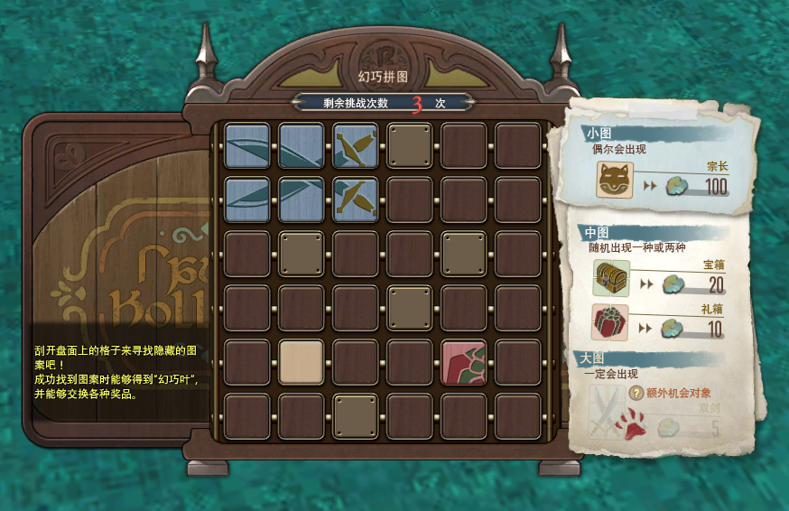

# 每日/每周任务

FF14里有一些任务是每天、每周刷新的，通常它们能够帮你练级，获得一些[货币点数](/advanced/currency.md#战斗通货——亚拉戈神典石)来兑换高级装备，或者能获得一些特殊道具。

就算你没有满级，也可以做这些任务来补充一点经验，排解一下主线的疲惫，非常贴心又方便。

每日活动刷新的时间是每天北京时间23:00，筹备型任务的刷新时间是每天04:00。

## 每日随机

;;;.guide .cols2
;;;.guide .col

;;;

;;;.guide .col .grow

每日随机任务从16级开启第二个副本开始，就可以通过任务搜索器[参加随机任务](/basic/dungeon.md#随机副本)了（默认快捷键`U`，第一页第一栏==随机任务==）。

不满级的职业打每日随机任务可以获得额外的经验和军票奖励。而满级职业打每日随机会获得额外的[亚拉戈神典石](/advanced/currency.md#战斗通货——亚拉戈神典石)奖励。随机任务赠送的金币是这个游戏给玩家的保底收入。

诗学点数可以兑换到50、60、70级的最高级别装备，非常适合练级时使用，具体兑换可以查看[这里](/advanced/currency.md#战斗通货——亚拉戈神典石)。

如果你不想挑战高难度8人副本，每天划划水看看风景，==高难度==可以为你提供大量点数，用来兑换当前版本较高品级的装备，非常推荐休闲玩家完成。

**随机任务结算以击倒副本中最后一个BOSS的时刻为准，如果你在22:38进本，23:01完成任务，这也会被计算为第二天的随机任务，晚上打随机的玩家请务必注意。**

;;;
;;;

<IncludePage file="_includes/basic/daily.md" />

## 蛮族日常

在艾欧泽亚的大地上存在着名为“蛮族”的族群，他们通常有着不同的外貌，并且有着自己独特的文化和生活方式。冒险者们通过与蛮族的接触，帮助他们生活、解决问题，增进与蛮族之间的友谊，可以**为副职练级**，逐步开放蛮族商店，最后可以购买到**蛮族主题坐骑、小宠物**等等。

目前一共有11个蛮族，分别对应了2.0~5.0各个版本，每个版本中都会有一个生产专属蛮族，可以辅助生产职业练级（4.0开始，生产蛮族也可以辅助采集职业练级）。

::: collapse 蛮族列表及日常开启任务

* 2.0 蛮族
  * 地灵：<quest name="人造硝石的盗贼" />
  * 妖精：<quest name="拜访妖精暂留地" />
  * 蜥蜴人：<quest name="荒野之乱" />
  * 鱼人：<quest name="来自深海" />
  * 鸟人（生产）：<quest name="雷雨将至" />
* 3.0蛮族
  * 瓦努：<quest name="花冠的逃亡者" />
  * 骨颌：<quest name="没有名字的骨颌族" />
  * 莫古（生产）：<quest name="困扰人类的修复团！" />，这个任务需要先完成<quest name="目标入团" />及其后续一系列任务才可接取。
* 4.0 蛮族
  * 阿难陀族：<quest name="新的伙伴是光之战士" />，这个任务需要同时完成<quest name="不屈不挠" />和<quest name="隐蔽的真相" type="plus" />两个支线任务（及其后续任务）才可以接取。
  * 甲人：<quest name="宝物殿之缘" />
  * 鲶鱼精（生产&采集）：<quest name="滋润吧鲶鱼精" />，这个任务需要同时完成<quest name="痴迷赏花" type="plus"/>和<quest name="黑鼻" type="plus" />两个支线任务（及其后续任务）才可以接取。
* 5.0 蛮族
  * 仙子：<quest name="梦境与现实的夹缝" type="plus" />，完成伊尔美格地区主线任务<quest name="命运再次转动" type="main" />之后，就可以在水晶都接取并开启仙子族日常。
  * 奇塔利族（采集）：<quest name="史官到来" type="plus" />，完成大森林地区主线任务<quest name="宁静" type="main" />，以及支线任务<quest name="隆卡的守护者们" type="plus" />之后开启，隆卡的守护者需要同时完成<quest name="昏暗森林的守护者" type="plus" />和<quest name="双胞胎与双元灵" type="plus" />两个支线任务（及其后续任务）。
  * 矮人族（生产）：<quest name="拯救工匠村！" type="plus" />，完成珂露西亚岛地区支线任务<quest name="惨剧之村" type="plus"/>和<quest name="矮人族的不良青年" type="plus" />及其后续之后接取。

:::

其中2.0的蛮族需要玩家41级之后才能开放接取，而3.0之后的蛮族都有职业等级锁定的同步系统（用A职业接任务，则必须用A职业完成并提交，中途更换职业则无法继续进行任务）。

一开始蛮族任务的限额是每天3个，当声望提升或开启多个蛮族之后，总体限额也会提升，每人每天的蛮族任务总限额是12个。限额是每天23点刷新，以接取任务的时间为准，如果刷新之后身上有尚未完成的蛮族任务，需要先完成或放弃已经接取的蛮族任务，才能够接新的蛮族任务。

当蛮族声望达到==信赖==（或==誓约==）时，就可以在蛮族商人处购买蛮族坐骑、专属家具和小宠物。同时信赖级别的蛮族任务会赠送蛮族货币，用这些货币可以交换60级元灵武器所需的神秘材料，如果你想要发光武器，提前做蛮族日常是一个推荐的选择。关于蛮族等级、声望、商店出售的具体信息，可以查看[这个页面](https://ff14.huijiwiki.com/wiki/%E8%9B%AE%E6%97%8F)，比较受欢迎的坐骑包括地灵族的爆弹怪秋千椅（<item name="爆弹角笛" />），库啵族的棉花糖（<item name="孢云棉花糖种子" />），阿难陀族(蛇女)的纯白狮鹫（<item name="真狮鹫角笛" />），鲶鱼精的大轿子（<item name="巨鲶鱼神轿笛" />）；另外有些绅(hen)士(tai)也喜欢妖精的古菩猩猩（<item name="月桂冠古菩猩猩角笛" />）…

最后，每个版本的蛮族都达成==信赖==（或==誓约==）声望之后，就会开启新的蛮族联合任务：2.0的<quest name="蛮族之风再起" />，3.0的<quest name="修复团之乱" />，4.0的<quest name="人鱼之肉" />，完成这些任务及其后续，就可以获得特殊的奖励，以及所有的蛮族声望一起升级到盟友。

## 挑战笔记（每周）

每周活动是北京时间每周二<i class="xiv local-time-chs"></i>16:00刷新，游戏版本更新一般也会选择在周二下午进行服务器维护。 光之战士的一周从周二16点开始

15级之后，在海都的沉溺海豚亭可以接到<quest type="plus" name="遗失的挑战笔记" />任务，从==手册管理==→==挑战笔记==中可以打开它。

挑战笔记每周刷新，在当周完成挑战笔记中的内容，就会获得额外的奖励。

除了一般的打怪打本会给额外经验之外，搭档陆行鸟的挑战笔记会给搭档陆行鸟额外经验，金碟的挑战笔记则会给金碟币，PVP挑战笔记则会给狼印，如果有这些方面的需要，千万不要错过挑战笔记了。

另外70级需要做发光武器的玩家，也推荐完成优雷卡部分的挑战笔记。

## 天书奇谈（每周）

;;;.guide .cols2
;;;.guide .col

来自[ももこ Twitter](https://twitter.com/momoco_haru/status/779635719794929664?s=20)
;;;

;;;.guide .col .grow
60级之后，就可以在田园郡接到<quest type="plus" name="天书奇谈" />任务。每周和我们可爱的猫萝库洛对话就可以获得新的天书（在背包的任务道具栏里）。一本天书的有效期是2周，请格外注意。

天书上有16个任务，你每完成一项，就可以获得一枚贴纸，贴纸会随机贴在天书的格子上。贴满9枚贴纸就可以获得奖励。

而如果4枚贴纸连成一条线的话，就可以获得额外奖励…

所有奖励包括亚拉戈点数、金蝶币、小宠物、家具、兑换魔晶石所需的道具，以及华美型的装备等等。推荐需要练级，想要额外奖励的玩家完成，三线一等奖的奖品还是非常好的。

[这里查看3条线的图案组合…](https://www.ffxiv.cn/detail/article/251)

贴完贴纸之后，要在天书过期之前把它交还给库洛并选择奖励 ~~，否则你就会像我一样在库洛面前哭成汪洋大海……~~
;;;
;;;

## 宗长的幻巧拼图（每周）

;;;.guide .cols2
;;;.guide .col

幻巧拼图
;;;

;;;.guide .col .grow
80级之后，田园郡可以接任务<quest type="plus" name="某妖狐的幻巧拼图" />任务。

开启任务之后，就可以挑战幻巧战。幻巧战是将以往的极蛮神，以现在版本的数值再现的特殊蛮神战（仅保留机制不变）。以别样的方式体验过往版本的极蛮神战斗。

完成战斗后就可以与宗长对话，挑战幻巧拼图。拼图下会固定隐藏 2 x 3 大小的双剑， 2 x 2 大小的礼盒或宝箱，并且有概率存在 1 x 1 的宗长。翻开完整的双剑图标，可以在本周再多挑战一次幻巧战（仅限一次），翻开完整图案可以获得幻巧叶，继而在宗长（<pos name="田园郡" :x="5.7" :y="6.1" />）处兑换各种奖品。

注意拼图必须一次性翻完，关闭就算本次挑战结束。
;;;
;;;

## 其他日常、周常

其他涉及到刷新时间的的信息可以从==任务情报==→==任务情报==中查询。
