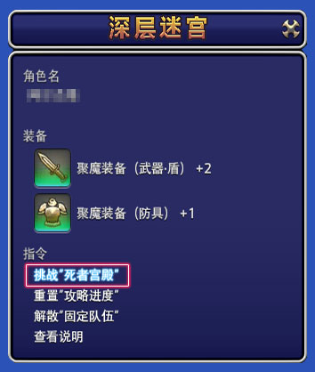
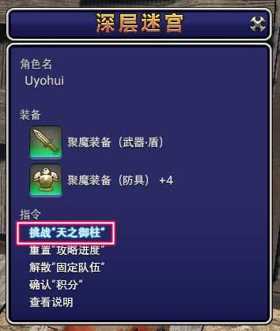
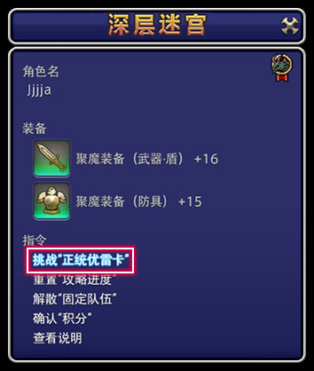

# 深层迷宫

深层迷宫是类似于不可思议的迷宫（Roguelike）的一种特殊玩法，目前有死者宫殿、天之御柱和正统优雷卡三个深层迷宫。

深层迷宫在低层可以为玩家的未满级职业练级，而高层迷宫则有相当高的难度，也会产出稀有的坐骑、宠物和外观。

## 死者宫殿

完成17级主线任务<Quest name="消失在铜铃中的梦" type="main" />之后，在<Pos name="格里达尼亚新街" :x="12.0" :y="13.1" />接任务<Quest name="奇异地宫" type="plus" />，就可以开启死宫了。

;;;.guide .cols2
;;;.guide .col

;;;

;;;.guide .col .grow
和<Pos name="黑衣森林南部林区" :x="25.2" :y="20.6" />的鬼哭队调查队长对话，就可以打开图示窗口进入死宫。

选择 ==挑战“死者宫殿”== 就可以申请进入死宫，通常为了练级的玩家，可以选择匹配队进入；组好固定队伍（4人）或想要挑战单人死宫成就的，可以选择固定队进入。

每名玩家只能保留2个死宫存档，如果2个存档均有游戏内容，则需要先通过 ==重置“攻略进度”== 删除存档，才可以建立新挑战。
;;;
;;;

死宫中有完全独立的等级和装备强度，玩家需要找到位于每层的==转移石冢==，通过击杀本层的小怪激活转移石冢，并前往下一层。

每10层会有一个守层BOSS，完成守层BOSS后，会结算死宫外的职业经验，并进入存档层。在存档层可以选择退出死宫，或继续深入。在存档层退出死宫的玩家，可以在下次游戏时继续挑战。如果在非存档层退出、团灭，则会被视为挑战失败，无法获得任何经验。

完成50层的玩家会回到黑衣森林南部林区，可以接到任务<Quest name="深渊地宫" type="plus" />，完成任务后就可以从51层开始挑战死宫。

当玩家以固定队的方式进入死宫，并且在没有团灭记录的情况下通过100层，就可以继续挑战101~200层。

在死宫中，玩家会遇到下列物品、机关：
* 金宝箱：会开出名为魔陶器的特殊物品，按背包的快捷键（默认`I`）可以打开。全小队共享魔陶器，每种最多可以保留3个。每种魔陶器都有自己独特的功能，可在游戏内查看说明。随机队伍完成挑战退出死宫之后，魔陶器就会消失，固定队的魔陶器会一直保留。
* 银宝箱：会随机强化玩家的装备，强化值从1~99。强化的成功率随着自身装备强化度的提升而降低，更深层的死宫对装备强化有一定要求，若不满足强化度的要求则有可能无法前往，此时需要返回低层找银宝箱进行强化。同时有的银宝箱还有可能是地雷，因此在战斗中开银宝箱是风险极大的行为。
* 铜宝箱：通常会开出复活、回血药，但有极低的概率开出<item name="格尔莫拉陶器碎片" />，可以用来兑换坐骑、乐谱等。同时还有一定概率会变成**拟态怪**，若不能及时击杀，拟态怪就会随机给队伍成员施加<Status :id="1087" name="诅咒" />debuff（只能使用专用的魔陶器驱散），危险性较高。
* 转移石冢：地图上为钥匙图标，用于前往下一层的通道。需要击杀一定数量的小怪才能激活，每层需要激活的小怪数量不等，通常在3~8只。==若队伍中有玩家掉线，需要等掉线玩家再次上线之后，才可以前往转移石冢，否则会被判定为团灭。==
* 再生石冢：地图上为祭坛图标，使用再生石冢可以复活本层玩家。同样需要击杀一定数量的小怪才能激活。
* 陷阱：平时无法看到，可以通过魔陶器显形（地面上的发光红色图腾）或解除。陷阱不会出现在房间边缘或过道中，在深层死宫中，贴墙走是主流的防止踩到陷阱的策略。
* 宝藏：平时无法看到，可以通过魔陶器探索。宝藏可以拿到外面的鉴定师处鉴定，深层的<item name="金饰宝藏" />可以开出珍惜的坐骑等等。

玩家可以通过消耗装备强度的方式获得<item name="聚魔柄" />，然后可以使用它兑换死宫中所使用的武器外观。

> * [死者宫殿官方介绍](http://act.ff.sdo.com/project/170420deepdungeon/index.html)
> * [死者宫殿维基介绍](https://ff14.huijiwiki.com/wiki/%E6%AD%BB%E8%80%85%E5%AE%AB%E6%AE%BF)：含宝箱、陷阱、宝藏等内容的详细说明
> * [死宫详细攻略](https://bbs.nga.cn/read.php?tid=14509371)：每一层小怪、BOSS的威胁程度、回避方法的详细介绍

## 天之御柱

通过死宫50层，并且完成63级主线任务<Quest name="片刻的风平浪静" type="main" />之后，在<Pos name="红玉海" :x="6.2" :y="11.7" />接任务<Quest name="深渊的天之御柱" type="plus" />，就可以开启天宫了。

;;;.guide .cols2
;;;.guide .col

;;;

;;;.guide .col .grow
和<Pos name="红玉海" :x="21.4" :y="9.2" />的九星对话，就可以打开图示窗口进入天宫。

选择 ==挑战“天之御柱”== 就可以申请进入天宫，通常为了练级的玩家，可以选择匹配队进入；组好固定队伍（4人）或想要挑战单人天宫成就的，可以选择固定队进入。

每名玩家只能保留2个天宫存档，如果2个存档均有游戏内容，则需要先通过 ==重置“攻略进度”== 删除存档，才可以建立新挑战。
;;;
;;;

天宫和死宫的玩法类似，有独立的等级、装备强度。需要击杀一定数量的小怪激活转移灯笼，前往上一层。开银箱子强化装备，通过10层的BOSS结算经验存档。

天宫完成30层后，会开启支线任务<Quest name="我等虽为凡夫" type="plus" />。之后可以选择从21层开始挑战天宫，没有团灭记录的固定队可以前往31~100层。

天宫中会有一些与死宫不同的道具、机关：
* 打开银宝箱时，会有一定概率获得==魔石==，魔石可以清空本层的所有普通小怪，黑色的奥丁魔石在BOSS层可以斩杀BOSS。
* 天宫某些层会出现“大房间”，大房间并没有墙壁，但是会有多个转移灯笼，而其中只有一个是真的。使用魔陶器：隐身可以避免触发到假的转移灯笼，一旦触发了假的转移灯笼，会有概率触发陷阱。
* 天宫某些地方会出现宠物形态的NPC，靠近NPC会获得5分钟的增强buff。每个NPC只能触发一次。

玩家可以通过消耗装备强度的方式获得<item name="天之聚魔柄" />，然后可以使用它兑换天宫中所使用的武器外观。

> * [天之御柱官方介绍](http://act.ff.sdo.com/project/170420deepdungeon2/index.html)
> * [天之御柱维基介绍](https://ff14.huijiwiki.com/wiki/%E5%A4%A9%E4%B9%8B%E5%BE%A1%E6%9F%B1)：含宝箱、陷阱、宝藏等内容的详细说明
> * [天宫详细攻略](https://bbs.nga.cn/read.php?tid=16406640)：每一层小怪、BOSS的威胁程度、回避方法的详细介绍

## 正统优雷卡

通过死宫50层，并且完成90级主线任务<Quest name="晓月之终途" type="main" />之后，在<Pos name="摩杜纳" :x="21.8" :y="8.1" />接取任务<Quest name="谜团笼罩的正统优雷卡" type="plus" />，就可以开启优宫了。

;;;.guide .cols2
;;;.guide .col

;;;

;;;.guide .col .grow
和<Pos name="摩杜纳" :x="34.8" :y="19.2" />的合敦对话，就可以打开图示窗口进入优宫。

选择 ==挑战“正统优雷卡”== 就可以申请进入天宫，通常为了练级的玩家，可以选择匹配队进入；组好固定队伍（4人）或想要挑战单人天宫成就的，可以选择固定队进入。
    
每名玩家只能保留 2 个优宫存档，如果 2 个存档均有游戏内容，则需要先通过 重置 ==“攻略进度”== 删除存档，才可以建立新挑战。
;;;
;;;

优宫同样拥有经典的深层迷宫玩法，每层需要击杀一定数量小怪开启 ==转移石冢== ，前往下一层。每10层击杀BOSS后结算一次存档。

突破30层后，可在<Pos name="摩杜纳" :x="34.7" :y="19.3" />截取任务<Quest name="强梁霸道终覆灭" type="plus" />。完成任务后，再次进入迷宫时就可选择从1层进入或从21层进入。

当选择从21层进入时，将从90级开始挑战。

优宫有一些与死者宫殿不同的道具、机关：

* 在打开金宝箱时，可能会出现以下新道具：
1.  ==缓速== ：当前层敌人获得10分钟<Status :id="3493" name="缓速" dispel />，使用后新出现的敌人无效。
2.  ==大漩涡== ：将本层的敌人的体力降至个位数。
3.  ==恐慌装甲化== ：自身变为恐慌装甲形态，能够使用以下两种技能：猛碎：秒杀级单体攻击，如果击退无效则不造成伤害；粉碎铁球：远程单体技能，对攻击目标附加最多累积5层的受伤加重。
* 在冒险时，强力魔物 ==恶名精英== 会在随机层数出现，此时系统将会提示“能够感受到强大魔物的气息……”。恶名精英身上冒红光，而且拥有高血量高伤害，比较难击杀。但是击杀后，能获得30分钟的buff和额外的随机宝藏。

玩家可以通过消耗装备强度的方式获得<item name="正统聚魔柄" />，然后可    以使用它兑换天宫中所使用的武器外观。

> * [正统优雷卡官方介绍](https://actff1.web.sdo.com/project/170420deepdungeon3/index.html)
> * [正统优雷卡维基介绍](https://ff14.huijiwiki.com/wiki/%E6%AD%A3%E7%BB%9F%E4%BC%98%E9%9B%B7%E5%8D%A1)：含宝箱、陷阱、宝藏等内容的详细说明
> * [正统优雷卡详细攻略](https://bbs.nga.cn/read.php?tid=36970853)：正统优雷卡 1-99全BOSS文字攻略 附B站传送门 by苦茶子