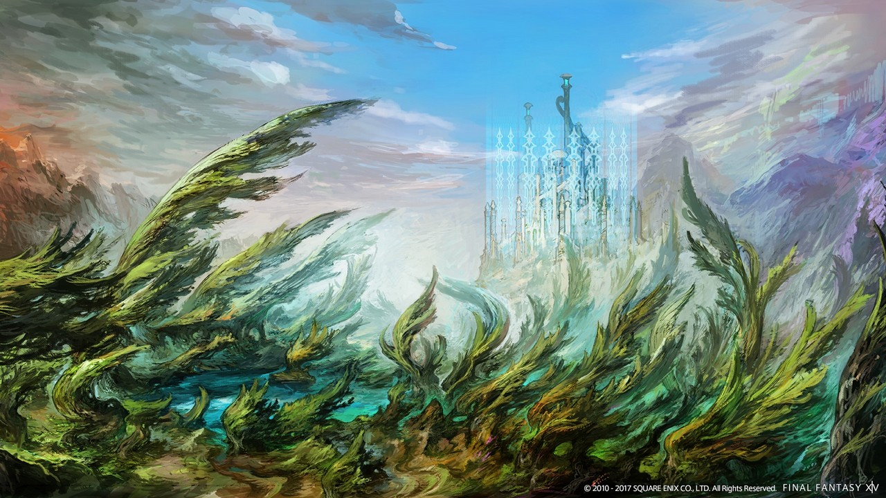
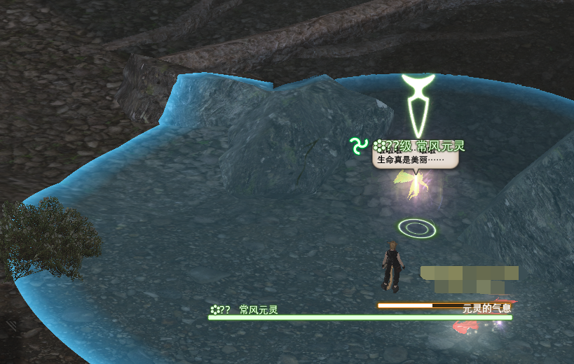

# 禁地优雷卡

::: segment red
**本篇攻略仅介绍优雷卡的游戏内容，发光武器、装备的制作攻略请查看[这个页面](./eureka-weapon.md)**
:::

<FloatTOC /> 

优雷卡是4.0时期的特殊游戏内容，玩家进入优雷卡之后会拥有专属的<i class="xiv elv"></i>元素等级以及元素属性，按照篇章进行分别是常风之地（<i class="xiv elv"></i>1-20）-恒冰之地（<i class="xiv elv"></i>21-35）-涌火之地（<i class="xiv elv"></i>36-50）-丰水之地（<i class="xiv elv"></i>51-60）。

随着玩家的探索进行，玩家们会逐渐解开禁地优雷卡的秘密，并通过从中获得的元素之力加强武器、装备，制作可以发光的武器等等。

;;;.guide .cols2
;;;.guide .col

半灵奥兹玛
;;;

;;;.guide .col .grow
在每个篇章（地图）中，按地区分布大量小怪，并按某些条件触发名为**恶名精英**的类似FATE的特殊战斗，击杀NM就会获得一定数量的该岛的属性水晶，玩家可以使用该水晶升级禁地兵装。另外部分NM会掉落特殊宠物、坐骑等。

除了NM之外，恒冰、涌火及丰水的岛上还有名为幸福兔的挖宝内容。

由于优雷卡属于以往版本的游戏内容，目前玩家进入优雷卡主要以++制作发光武器、校服升级、挖宝挣钱以及56人兵武塔（完成后可获得坐骑<item name="半灵奥兹玛" />）为主++。
;;;
;;;

## 优雷卡基本特征

玩家可以在优雷卡内随意组队（也可以在外面组队后进入优雷卡），优雷卡内外的队伍关系互不影响，优雷卡每个岛的上限是144人，超过144人后会形成“新岛”（即另一个副本空间）。玩家每次在优雷卡中持续在线的时间不能超过180分钟，在时间快结束的时候会获得<Status :id="1464" name="探索时间限制" />debuff，时间彻底结束后会被强制踢出。

在<i class="xiv elv"></i>11之后，在优雷卡中陷入无法战斗状态的玩家返回据点会被扣减经验值，如果扣减经验值大于当前等级所拥有的经验值，则会掉级。通常玩家会避免挑战比自己强大太多的怪物，或组队击杀（以追求更高的经验），如果不慎陷入无法战斗状态，可以试着喊话（`/sh`）求救，避免自动返回据点（退出优雷卡视为返回据点）。

::: segment orange

优雷卡中的小怪大都较为强力，不建议贸然穿行有高等级怪物的区域。另外优雷卡中的小怪有不同的敌人感知方式（部分地图会标注小怪的感知方式）：

- 视线感知：大部分小怪都属于这种，只要从它背后走就可以不被发现。
- 声音感知：没头或者睡着的小怪基本属于这种，只要切换成走路（小键盘`/`或轻推摇杆）就可以不被发现。
- 魔法感知：元精或者元素怪都属于这种，不使用魔法就不会被发现（包括复活、加血等等）。
- 血量感知：夜间出现的亡灵怪基本是这种，需要保持满血就不会被发现。

玩家高于小怪2级以上，对方就不会理你啦。

:::

### 魔素板与魔素石

;;;.guide .cols2
;;;.guide .col .figcap

魔素板
;;;
;;;.guide .col .figcap

魔素融合器
;;;
;;;

在优雷卡中有独特的元素属性克制，在魔素板中可以看到风火冰、雷水土2组克制关系，通过完成优雷卡内的任务可以获得魔素石，并使用据点内的魔素融合器就可以把魔素石镶嵌到魔素板上，加强玩家的属性之力。玩家可以通过旋转魔素板调整需要加成的属性，所以通常会把所有魔素石镶嵌在同一个属性上，在战斗中旋转魔素板进行攻防转换。

魔素板的旋转需要消耗特定次数，次数会随着时间自动恢复，绝大多数情况下只要不乱转魔素板，这个次数都是够用的。

::: collapse 魔素板攻防宏

可以制作宏切换魔素板的攻防属性：

- `/魔素板攻势`：切换到适合进攻当前目标的属性
- `/魔素板守势`：切换到适合防守当前目标的属性
- `/魔素板自动 攻势`或`/魔素板自动 守势`：自动按攻势/守势切换魔素板，不推荐在野外使用该指令（容易导致次数清空），但在兵武塔内可能需要使用。

:::

在涌火之地可以获得<Item name="雷姆普里克斯骰子" />、<Item name="阴·阳的皮膜" />和<Item name="斯库尔的牙" />3样道具，集齐后可以向NPC兑换新的魔素石（道具可交易，但非必要）。

在丰水之地可以获得<Item name="摩洛的角" />、<Item name="刻托的爪子" />和<Item name="戈尔德马尔的角" />3样道具，集齐后可以向NPC兑换第新的魔素石（道具可交易，但非必要）。

### 恶名精英（NM）与触发

击杀一定数量某种小怪后，会有一定概率令与之关联的恶名精英出现，该小怪即为该恶名精英的触发怪。具体NM与触发怪之间的关系请参考后文各岛地图（部分触发怪或NM有其他出现条件，比如夜间、强风等等）。

成功击杀NM后会获得大量经验值，以及对应地图的水晶和宝箱，低级打高级NM会无法获得全部奖励。上锁的宝箱可以在黄金港的锁匠<Pos name="黄金港" :x="8.0" :y="14.0" />那里开箱（各个据点里也有锁匠）。

由于触发怪与NM之间的触发关系是玩家整理的，NM的触发也不完全依赖于触发怪的击杀，因此长时间击杀大量触发怪却没能触发NM的情况也是存在的，此时建议尝试清理地图上已有的其他NM。

一般优雷卡岛上可以通过建立Tracker的方式跟踪、记录岛上的NM触发情况。Tracker是由玩家制作的第三方网站，每个“岛”中的Tracker也由各岛的玩家自行维护，Tracker记录可以通过密码传递，拥有维护Tracker权限的玩家也会被大家称为“史官”，上一任“史官”需要离开该岛时，通常会将密码及网站发在喊话频道中，任何有意向的玩家都可以接手并继续维护（尽量避免记录失传）。

没有Tracker的岛屿可以使用[Eureka Tracker](https://ffxiv-eureka.com/)或[优雷卡综合管理平台](https://eureka.ffxivsc.cn/)进行Tracker的创建与管理（两个平台的密码不通用）。

### 战斗连锁

;;;.guide .cols2
;;;.guide .col

;;;
;;;.guide .col .grow

在一定时间内连续击杀小怪可以累计连锁，连锁积累到一定数量后可以提升获得的经验值，也可以提高某些怪的宝箱掉率。无论是练级还是刷宝箱，都应该尽可能积累连锁。

连锁上限为30，超过30后会清空连锁，从0计数。

;;;
;;;

### 幸福兔

;;;.guide .cols2
;;;.guide .col

;;;
;;;.guide .col .grow

在恒冰之后优雷卡内有幸福兔系统，地图内会刷新与幸福兔有关的NM（屏幕提示为元素冲突），完成击杀后，参与击杀的玩家会有一定概率获得<Status :id="1531" name="指引财宝" />buff，同时身后出现一只跟随的幸福兔。

使用任务列表中的幸运胡萝卜可以让幸福兔为玩家指引财宝的方向，如果玩家已经在财宝附近，幸福兔就会心满意足地消失，原地留下一个宝箱。

幸福兔NM的位置及宝箱坐标可查看各个地图具体分布。

;;;
;;;

幸福兔在以下几种情况下就会消失：
- 玩家无法战斗
- 幸福兔被野怪打死（通常是野怪的AOE技能）
- 点掉buff或发现了宝箱
- buff时间结束
- 退出优雷卡或退出游戏

由于幸福兔的宝箱位置经常刁钻诡谲，而且很有可能要穿过高等级怪区，因此也有不少玩家称之为“杀人兔”。

### 文理技能

;;;.guide .cols2
;;;.guide .col

文理碎晶 - 文理融合器（最终样式） - 文理技能（开满6槽）
;;;
;;;.guide .col .grow

在涌火之后优雷卡追加了文理技能系统，通过各种活动获得未鉴定的文理碎晶，将其交给德雷克（<Pos name="优雷卡涌火之地" :x="15.7" :y="23.9" />）就可以鉴定出各种文理碎晶。然后使用旁边的文理融合器就可以将文理碎晶融合成文理技能。

;;;
;;;

::: collapse 文理碎晶的获得方式

文理碎晶可以通过交易板交易。

| 碎晶名称 | 获得方式 |
| -- | -- |
|<Item name="未鉴定的新锐文理碎晶" />| 等级大于等于自身的元精类敌人 幸福兔宝箱（铜）（涌火） |
|<Item name="未鉴定的熟练文理碎晶" />| <i class="xiv elv"></i>41雷暴元精 幸福兔宝箱（铜）（涌火） 30次连锁（涌火） |
|<Item name="未鉴定的攻势文理碎晶" />| 幸福兔宝箱（金） <Status :id="1581" name="环境适应" />的雷暴元精（丰水） <Status :id="1581" name="环境适应" />的筑巢祖 |
|<Item name="未鉴定的守势文理碎晶" />| 幸福兔宝箱（金）（涌火）、幸福兔宝箱（铜）（丰水） NM：佛劳洛斯、阿斯卡拉福斯、来萨特、佣兵雷姆普里克斯、明眸、斯库尔 |
|<Item name="未鉴定的治愈文理碎晶" />| 幸福兔宝箱（银）（涌火）、幸福兔宝箱（铜）（丰水） NM：琉科西亚、格拉菲亚卡内、埃托洛斯、伊丽丝、樵夫杰科、彭忒西勒亚 |
|<Item name="未鉴定的斥候文理碎晶" />| <Item name="发生变异的爆炎上锁宝箱" />、<Item name="发生变异的浸水上锁宝箱" /> |
|<Item name="未鉴定的妨碍文理碎晶" />| 幸福兔宝箱（银）（丰水）、幸福兔宝箱（金）（丰水） <i class="xiv elv"></i>50以上的<Status :id="1581" name="环境适应" />元精 NM：诡辩者、巴钦大公爵、火巨人、闪电督军、阴·阳 |
|<Item name="未鉴定的支援文理碎晶" />| 幸福兔宝箱（银）（丰水） <i class="xiv elv"></i>46雷暴元精 <Status :id="1581" name="环境适应" />的余烬、雷暴元精 <Status :id="1581" name="环境适应" />的不死系敌人|
|<Item name="未鉴定的封印文理碎晶" />| NM：卡拉墨鱼、剑齿象、摩洛、各个NM的触发怪 兵武塔内宝箱 30连锁（丰水）
</ul>

:::

合成好的文理技能会储存在专门的试验管中，退出优雷卡再次进入也仍然保留，但使用文理技能之后，试验管中的技能会消失，自己身上出现对应buff，此时退出优雷卡或在优雷卡内死亡的话，文理技能就会失效（<Action name="英杰的记忆" />除外）。

文理技能是禁地兵装升级的必要条件，也是挑战优雷卡及巴尔得西昂兵武库时非常重要的技能，具体文理技能的使用需求可以参考后文或其他攻略举例，或自行探索。

另外随着探索的推进，玩家可以解锁同时合成2个文理技能的功能。在丰水之地的幸福兔银宝箱中获得<Item name="试制炼金容器" />就可以增加文理技能插槽数量。

推荐通过[文理系统](https://ffxiv-eureka.com/logograms)页面登记、追踪、查询文理技能的效果及合成情况。

## 常风之地

;;;.guide .cols2
;;;.guide .col

;;;
;;;.guide .col .grow
完成主线任务<Quest name="红莲的解放者" type="main" />后，接任务<Quest name="未知的岛屿，其名为优雷卡" type="plus" />就可以通过罗德尼（<Pos name="黄金港" :x="8.5" :y="14.2" />）进入常风之地了。

击杀常风之地的NM可以获得<item name="常风水晶" />和<item name="常风地带上锁的宝箱" />，点击名称可以查询具体获得数量信息及宝箱检定信息（比较珍惜且不可交易的奖品有<item name="暴龙角笛" />和<item name="赤红装甲" />）。
;;;
;;;

::: collapse 练级指南
;;;.guide .cols2
;;;.guide .col

;;;

;;;.guide .col .grow

地图内分布有**常风元灵**（俗称肠粉），可喊话咨询或自己寻找，尽可能吃到元灵提供的<Status :id="1461" name="元灵加护：经验值提高" />和<Status :id="1463" name="元灵加护：战斗力提高" />buff（注意元灵是可以被其他怪的AOE打死的，请注意避免在元灵附近战斗）。

另外可以适当准备<item name="静魔药" />提升练级效率（这个道具是工匠制作的，材料为优雷卡内获得）。

;;;
;;;

常风以完成挑战笔记为主，通过招募板，或进本后喊话的方式找适合自己等级的挑战笔记的人组队即可（组队情况下可以找比自己高3~5级的怪挑战以获得更多经验，若没有队伍则尽量找低于自己1~2级的怪以保证存活和连锁）。

**组队时若等级差异过大，低级玩家可能无法获得经验，甚至无法完成笔记，要注意！**（建议玩家等级差在2级以内）。

另外常风之地的NM已经为半自动触发，因此不用特地去打触发怪，只要及时打NM就行（或者选择触发怪作为挑战笔记的项目完成）。

:::

::: collapse NM特殊掉落

部分NM会掉落特殊物品。

| NM名称 | 掉落物 |
|  --  |  --  |
| <i class="xiv elv"></i>2 章鱼统领——常风领主 | <Item name="常风王子" /> |
| <i class="xiv elv"></i>4 御驾亲征——常风皇帝 | <Item name="皇帝飞虫的薄翼发饰" /> |
| <i class="xiv elv"></i>11 幻魔蝎——塞尔凯特 | <Item name="毒蝎格斗服" />，<Item name="米斯拉人偶" /> |
| <i class="xiv elv"></i>15 狂怒怪鸟——阔步西牟鸟 | <Item name="阔步高筒靴" /> |
| <i class="xiv elv"></i>17 狂乱暗龙——法夫纳 | <Item name="迷你法夫纳" /> |
| <i class="xiv elv"></i>20 暴风魔王——帕祖祖 | <Item name="帕祖祖的羽毛" />，<Item name="帕祖祖的祭坛" /> |
:::

## 恒冰之地

;;;.guide .cols2
;;;.guide .col

;;;
;;;.guide .col .grow

完成常风之地<i class="xiv elv"></i>17的任务，且<i class="xiv elv"></i>20之后，可以在黄金港优雷卡入口处接任务<Quest name="冰雪之地，其名为恒冰地带" type="plus" />打开恒冰之地。

击杀恒冰之地的NM可以获得<item name="恒冰水晶" />和<item name="恒冰地带上锁的宝箱" />，点击名称可以查询具体获得数量信息及宝箱检定信息。
;;;
;;;
恒冰之地的小怪会发生<Status :id="1589" name="突然变异" />或<Status :id="1581" name="环境适应" />，变异或适应后的小怪会变大、变强，并提供更多的经验，同时变异的小怪还有可能掉落<item name="发生变异的结冰上锁宝箱" />（比较珍惜的奖品有<item name="演技教材·好冷" />）。

恒冰的部分掉落、幸福兔宝箱成品市价较高，建议调查板子售价后再决定处理方式，[幸福兔宝箱内容](https://ff14.huijiwiki.com/wiki/%E7%A6%81%E5%9C%B0%E4%BC%98%E9%9B%B7%E5%8D%A1_%E6%81%92%E5%86%B0%E4%B9%8B%E5%9C%B0#.E5.BC.80.E7.AE.B1.E5.A5.96.E5.8A.B1)。

::: collapse 练级指南
;;;.guide .cols2
;;;.guide .col
<!--肠粉读条证件照-->

;;;

;;;.guide .col .grow

地图内分布有**恒冰元灵**（俗称冰粉），可喊话咨询或自己寻找，尽可能吃到元灵提供的<Status :id="1461" name="元灵加护：经验值提高" />和<Status :id="1463" name="元灵加护：战斗力提高" />buff（注意元灵是可以被其他怪的AOE打死的，请注意避免在元灵附近战斗）。

另外可以适当准备<item name="静魔药" />提升练级效率（这个道具是工匠制作的，材料为优雷卡内获得）。

恒冰练级以挖兔子为主，一般推荐在常风用笔记顶到<i class="xiv elv"></i>21之后再来恒冰打低级的兔子，以及触发NM。其他等级在恒冰地区也不一定好做笔记，可以在恒冰内询问组队。

**组队时若等级差异过大，低级玩家可能无法获得经验，甚至无法完成笔记，要注意！**（建议玩家等级差在2级以内）。
;;;
;;;

:::

::: collapse NM特殊掉落

部分NM会掉落特殊物品（概率不定）。

| NM名称 | 掉落物 |
|  --  |  --  |
| <i class="xiv elv"></i>20 纯白的支配者——雪之女王 | <Item name="九宫幻卡：雪童子" /> |
| <i class="xiv elv"></i>25 五行眼的主人——白泽 | <Item name="视觉尖角帽" />（需要使用<Item name="白泽的五行眼" />获得金牌后才能掉落） |
| <i class="xiv elv"></i>29 圆桌的雾王——亚瑟罗王 | <Item name="速度腰带" /> |
| <i class="xiv elv"></i>32 雷云的魔兽——哈达约什 | <Item name="贝希摩斯的毛皮" />、<Item name="贝希摩斯之角" /> |
| <i class="xiv elv"></i>34 暗眼王——总领安哥拉·曼纽 | <Item name="发生变异的结冰上锁宝箱" /> |
| <i class="xiv elv"></i>35 模仿犯——复制魔花凯西 | <Item name="凯西耳坠" /> |
| <i class="xiv elv"></i>35 苍蓝冰刃——娄希 | <Item name="娄希的冰片" />、<Item name="九宫幻卡：娄希" /> |

:::

## 涌火之地

完成恒冰之地<i class="xiv elv"></i>35的任务之后，可以在黄金港优雷卡入口处接任务<Quest name="冰炎之地，其名为涌火地带" type="plus" />打开涌火之地。

击杀涌火之地的NM可以获得<item name="涌火水晶" />和<item name="涌火地带上锁的宝箱" />，点击名称可以查询具体获得数量信息及宝箱检定信息。

涌火之地的小怪会发生<Status :id="1589" name="突然变异" />或<Status :id="1581" name="环境适应" />，变异或适应后的小怪会变大、变强，并提供更多的经验，同时变异的小怪还有可能掉落<item name="发生变异的爆炎上锁宝箱" />（比较珍惜的奖品有<item name="演技教材·说明计划" />等等）。

涌火的部分掉落、幸福兔宝箱成品市价较高，建议调查板子售价后再决定处理方式，[幸福兔宝箱内容](https://ff14.huijiwiki.com/wiki/%E7%A6%81%E5%9C%B0%E4%BC%98%E9%9B%B7%E5%8D%A1_%E6%B6%8C%E7%81%AB%E4%B9%8B%E5%9C%B0#.E5.BC.80.E7.AE.B1.E5.A5.96.E5.8A.B1)。

::: collapse 练级指南

地图内分布有**涌火元灵**，可喊话咨询或自己寻找，尽可能吃到元灵提供的<Status :id="1461" name="元灵加护：经验值提高" />和<Status :id="1463" name="元灵加护：战斗力提高" />buff（注意元灵是可以被其他怪的AOE打死的，请注意避免在元灵附近战斗）。

另外可以适当准备<item name="静魔药" />提升练级效率（这个道具是工匠制作的，材料为优雷卡内获得）。

涌火练级以触发NM及挖兔子为主，可以通过触发完成笔记，实在不行也可返回常风之地完成笔记。

另外还有使用文理反射技能反射敌人的魔法攻击进行练级的方式，由一名玩家负责引怪（抗怪），其他玩家脱光站在魔法攻击的AOE范围圈内，使用<Action name="文理反射" />就可以几乎秒杀野怪。另外30级职业154以上防御力+<Action name="文理护盾" />可以形成物理无敌效果，很多时候可以由物理无敌的玩家负责拉怪（吃平A）（需要使用70级以上的职业进入优雷卡后切换职业）。

**组队时若等级差异过大，低级玩家可能无法获得经验，甚至无法完成笔记，要注意！**（建议玩家等级差在2级以内）。

:::
::: collapse NM特殊掉落

部分NM会掉落特殊物品（概率不定）。

| NM名称 | 掉落物 |
|  --  |  --  |
| <i class="xiv elv"></i>38 恐怖的人偶——格拉菲亚卡内 | <Item name="卡尔克" /> |
| <i class="xiv elv"></i>45 奇迹的生还者——佣兵雷姆普里克斯 | <Item name="雷姆普里克斯骰子" /> |
| <i class="xiv elv"></i>47 樵夫杰科的死亡对决 | <Item name="艾尔凡人偶" /> |
| <i class="xiv elv"></i>49 相反的双子——阴·阳 | <Item name="阴·阳的皮膜" /> |
| <i class="xiv elv"></i>50 嘲讽的霜狼——斯库尔 | <Item name="斯库尔的牙" /> |
| <i class="xiv elv"></i>50 炎蝶的女王——彭忒西勒亚 | <Item name="彭忒西勒亚的火种" />、<Item name="九宫幻卡：彭忒西勒亚" /> |

:::
## 丰水之地

完成涌火之地<i class="xiv elv"></i>50的任务之后，可以在黄金港优雷卡入口处接任务<Quest name="决战之地，其名为丰水地带" type="plus" />打开丰水之地。

击杀丰水之地的NM可以获得<item name="丰水水晶" />，并有一定概率获得<item name="丰水晶簇" />及未鉴定的文理碎晶，<item name="丰水地带上锁的宝箱" />，点击名称可以查询具体获得数量信息及宝箱检定信息。

丰水之地的小怪会发生<Status :id="1589" name="突然变异" />或<Status :id="1581" name="环境适应" />，变异或适应后的小怪会变大、变强，并提供更多的经验，同时变异的小怪还有可能掉落<item name="发生变异的浸水上锁宝箱" />（比较珍惜的奖品有<item name="演技教材·振作精神" />等等）。

丰水的部分掉落、幸福兔宝箱成品市价较高，建议调查板子售价后再决定处理方式，[幸福兔宝箱内容](https://ff14.huijiwiki.com/wiki/%E7%A6%81%E5%9C%B0%E4%BC%98%E9%9B%B7%E5%8D%A1_%E4%B8%B0%E6%B0%B4%E4%B9%8B%E5%9C%B0#.E5.BC.80.E7.AE.B1.E5.A5.96.E5.8A.B1)。

::: collapse 练级指南

地图内分布有**丰水元灵**，可喊话咨询或自己寻找，尽可能吃到元灵提供的<Status :id="1461" name="元灵加护：经验值提高" />和<Status :id="1463" name="元灵加护：战斗力提高" />buff（注意元灵是可以被其他怪的AOE打死的，请注意避免在元灵附近战斗）。

另外可以适当准备<item name="静魔药" />提升练级效率（这个道具是工匠制作的，材料为优雷卡内获得）。

丰水练级以触发NM及挖兔子为主，可以通过触发完成笔记。

另外还有使用文理反射技能反射敌人的魔法攻击进行练级的方式，由一名玩家负责引怪（抗怪），其他玩家脱光站在魔法攻击的AOE范围圈内，使用<Action name="文理反射" />就可以几乎秒杀野怪。另外30级职业154以上防御力+<Action name="文理护盾" />可以形成物理无敌效果，很多时候可以由物理无敌的玩家负责拉怪（吃平A）（需要使用70级以上的职业进入优雷卡后切换职业）。

**组队时若等级差异过大，低级玩家可能无法获得经验，甚至无法完成笔记，要注意！**（建议玩家等级差在2级以内）。

:::
::: collapse NM特殊掉落

部分NM会掉落特殊物品（概率不定）。

| NM名称 | 掉落物 |
|  --  |  --  |
| <i class="xiv elv"></i>52 落泪的君主——摩洛 | <Item name="摩洛的角" /> |
| <i class="xiv elv"></i>56 异界的锻冶王——戈尔德马尔王 | <Item name="戈尔德马尔的角" />、<Item name="九宫幻卡：矮儒" /> |
| <i class="xiv elv"></i>59 魔蛇女王——刻托 | <Item name="刻托的爪子" /> |
| <i class="xiv elv"></i>60 水晶之龙——起源守望者 | <Item name="水晶龙之鳞" />、<Item name="九宫幻卡：起源守望者" /> |

:::