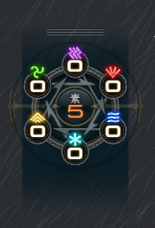
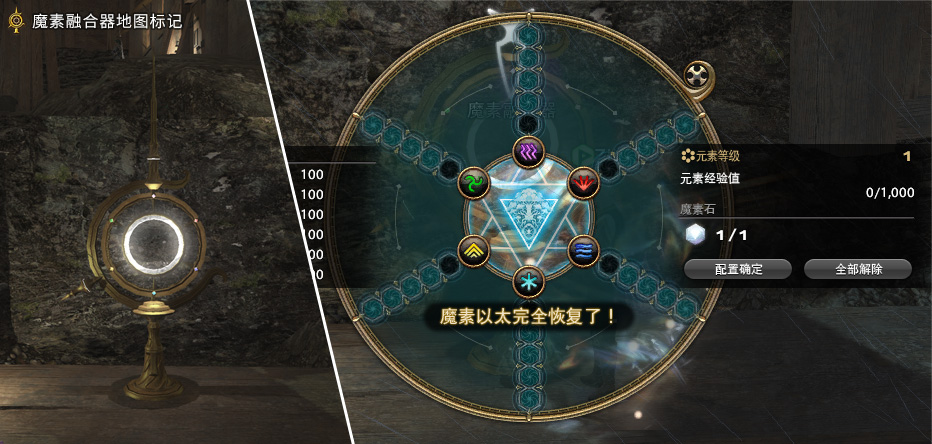
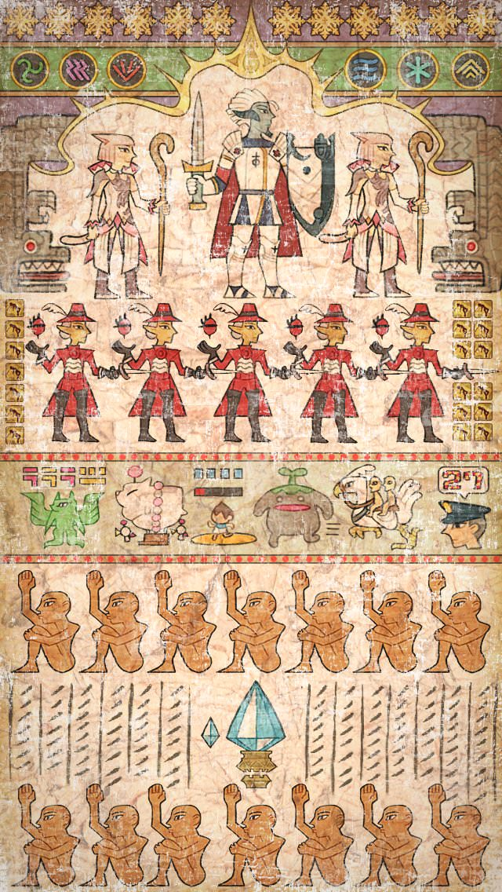
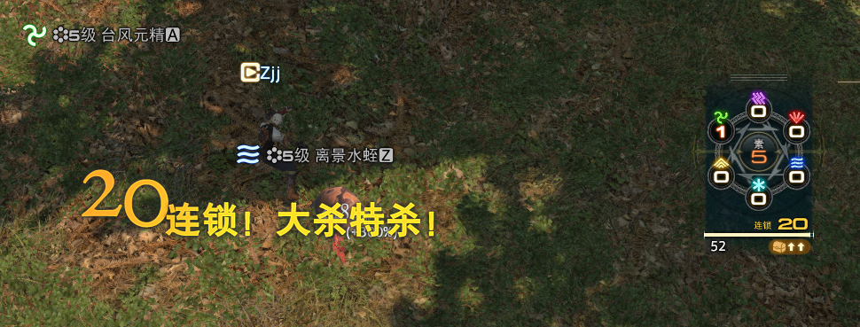
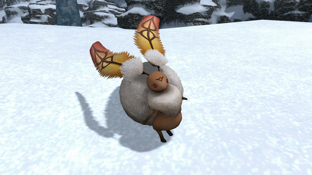
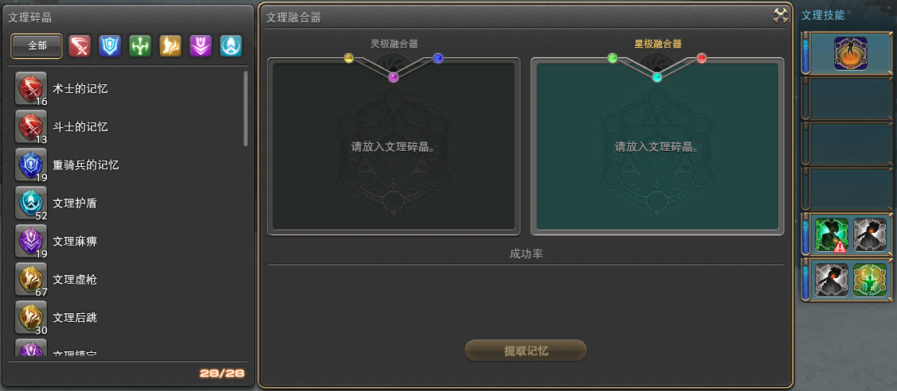

# 禁地优雷卡
<FloatTOC /> 
::: segment red
**本篇攻略仅介绍优雷卡的游戏内容，发光武器、装备的制作攻略请查看[这个页面](./eureka-weapon.md)**
:::

优雷卡是4.x时期的特殊探索内容，需要完成70级主线<Quest name="红莲之狂潮" type="main" />之后才能开启。玩家进入优雷卡之后会拥有专属的<i class="xiv elv"></i>元素等级以及元素属性，按照篇章进行分别是常风之地（<i class="xiv elv"></i>1-20）-恒冰之地（<i class="xiv elv"></i>21-35）-涌火之地（<i class="xiv elv"></i>36-50）-丰水之地（<i class="xiv elv"></i>51-60）。

随着玩家的探索进行，玩家们会逐渐解开禁地优雷卡的秘密，并通过从中获得的元素之力加强武器、装备，制作可以发光的武器等等。

;;;.guide .cols2
;;;.guide .col

半灵奥兹玛
;;;

;;;.guide .col .grow
在每个篇章（地图）中，按地区分布大量小怪，并按某些条件触发名为 **恶名精英（俗称NM）** 的类似FATE的特殊战斗，击杀NM就会获得一定数量的该岛的属性水晶，玩家可以使用该水晶升级禁地兵装。另外部分NM会掉落特殊宠物、坐骑等。

除了NM之外，恒冰、涌火及丰水的岛上还有名为幸福兔的挖宝内容。
;;;
;;;
由于优雷卡属于过往版本的游戏内容，目前玩家进入优雷卡主要以++制作70级发光武器、校服升级（染色）、挖宝开箱挣钱以及56人巴尔德西昂兵武塔（完成后可获得坐骑<item name="半灵奥兹玛" />）为主++。

> - [常风之地](/topic/eureka/anemos.md)
> - [恒冰之地](/topic/eureka/pagos.md)
> - [涌火之地](/topic/eureka/pyros.md)
> - [丰水之地](/topic/eureka/hydatos.md)

## 优雷卡基本情报

玩家完成70级主线任务<Quest name="红莲之狂潮" type="main" />后，在黄金港接任务<Quest name="未知的岛屿，其名为优雷卡" type="plus" />就可以开启优雷卡探索。玩家只能使用70级的职业申请进入优雷卡岛屿，但是进入优雷卡后可以随意切换职业，玩家强度与装备属性及<i class="xiv elv"></i>元素等级相关。

玩家可以在优雷卡内随意组队（也可以在外面组队后进入优雷卡），优雷卡内外的队伍关系互不影响（组队进入后可以解散重组，退出优雷卡后会恢复进本前的组队状态）。进入优雷卡后按`O`可以打开玩家名单，名单即当前岛内所有玩家。

优雷卡每个岛的上限是144人，超过144人后会形成“新岛”（即另一个副本空间）。玩家每次在优雷卡中持续在线的时间不能超过180分钟，在时间还剩5分钟的时候会获得<Status :id="1464" name="探索时间限制" />debuff，时间彻底结束后会被强制踢出。但只要岛里仍有玩家存在就不会关闭，部分岛屿会在一定情况下停止进入，也有可能在一定情况下重新开放进入（无规律可循）。

在<i class="xiv elv"></i>11之后，在优雷卡中陷入无法战斗状态的玩家返回据点会被扣减经验值，如果扣减经验值大于当前等级所拥有的经验值，则**会掉级**。通常玩家会避免挑战比自己强大太多的怪物，或组队击杀（以追求更高的经验），如果不慎陷入无法战斗状态，可以试着喊话（`/sh`）求救，避免自动返回据点（退出优雷卡视为返回据点）。

::: segment orange

优雷卡中的小怪大都较为强力，不建议贸然穿行有高等级怪物的区域。另外优雷卡中的小怪有不同的敌人感知方式（部分地图会标注小怪的感知方式）：

- 视线感知：大部分小怪都属于这种，只要从它背后走就可以不被发现。
- 声音感知：没头、瞎眼或者睡着的小怪基本属于这种，只要切换成走路（小键盘`/`或轻推摇杆）就可以不被发现（但注意不要往怪怀里贴，贴太近也有可能被感知）。
- 魔法感知：元精或者元素怪都属于这种，不使用魔法就不会被发现（包括复活、加血等等）。
- 血量感知：夜间出现的亡灵怪基本是这种，需要保持满血就不会被发现。

玩家高于小怪2级以上，对方就不会理你啦。

:::

优雷卡中的玩家和小怪都拥有元素属性，玩家需要调整自身属性元素来进行挑战，在后期玩家可以获得具有元素属性补正的装备帮助挑战最后的难关巴尔德西昂兵武塔。对于新入优雷卡的玩家，则可以考虑购买带有元素补正的[麒麟大袖](https://ff14.huijiwiki.com/wiki/ItemSearch?name=%E9%BA%92%E9%BA%9F%E5%A4%A7%E8%A2%96)（物理小黑衣）或[朱红斗篷](https://ff14.huijiwiki.com/wiki/ItemSearch?name=%E6%9C%B1%E7%BA%A2&itemlevel_min=300&itemlevel_max=300)（魔法小红衣），若成品售价过高，也可以购买<item name="神秘印章" /> x2或<item name="大马士革织物" /> x3前往似曾相识的男人<Pos name="黄金港" :x="7.8" :y="14.2" />处自行兑换。

小黑衣或小红衣在优雷卡攻略中不是必须的，但是在巴尔德西昂兵武库的攻略中是最低配置，平时有元素补正的装备可以一定程度上提升优雷卡游戏体验，可以根据自己的游戏目标决定是否购买。

### 魔素板与魔素石

;;;.guide .cols2
;;;.guide .col .figcap

魔素板
;;;
;;;.guide .col .figcap

魔素融合器
;;;
;;;

在优雷卡中有独特的元素属性克制，在魔素板中可以看到风火冰、雷水土2组克制关系，通过完成优雷卡内的任务可以获得魔素石，并使用据点内的魔素融合器就可以把魔素石镶嵌到魔素板上，加强玩家的属性之力。玩家可以通过旋转魔素板调整需要加成的属性，所以通常会把所有魔素石镶嵌在同一个属性上，在战斗中旋转魔素板进行攻防转换。

魔素板的旋转需要消耗特定次数，次数会随着时间自动恢复，绝大多数情况下只要不乱转魔素板，这个次数都是够用的。

::: collapse 魔素板攻防宏

可以制作宏切换魔素板的攻防属性：

- `/魔素板攻势`：切换到适合进攻当前目标的属性
- `/魔素板守势`：切换到适合防守当前目标的属性
- `/魔素板自动 攻势`或`/魔素板自动 守势`：自动按攻势/守势切换魔素板，不推荐在野外使用该指令（容易导致次数清空），但在兵武塔内可能需要使用。

:::

在涌火之地可以获得<Item name="雷姆普里克斯骰子" />、<Item name="阴·阳的皮膜" />和<Item name="斯库尔的牙" />3样道具，集齐后可以向NPC兑换新的魔素石（道具可交易，但非必要）。

在丰水之地可以获得<Item name="摩洛的角" />、<Item name="刻托的爪子" />和<Item name="戈尔德马尔的角" />3样道具，集齐后可以向NPC兑换新的魔素石（道具可交易，但非必要）。

### 恶名精英（NM）与触发

;;;.guide .cols2
;;;.guide .col

优雷卡著名迷因 by [@shimaya_yashima](https://twitter.com/shimaya_yashima/status/980369163171450880?s=20)
;;;
;;;.guide .col .grow
击杀一定数量某种小怪后，会有一定概率令与之关联的恶名精英（俗称NM）出现，该小怪即为该NM的触发怪。具体NM与触发怪之间的关系请参考后文各岛地图（部分触发怪或NM有其他出现条件，比如夜间、强风等等）。

成功击杀NM后会获得大量经验值，以及对应地图的水晶和宝箱，低级跨2级以上打高级NM会无法获得全部奖励。基本上练级的玩家和需要做发光武器的玩家都会不遗余力地参与每个NM。上锁的宝箱可以在黄金港的锁匠<Pos name="黄金港" :x="8.0" :y="14.0" />那里开箱（各个据点里也有锁匠）。

由于触发怪与NM之间的触发关系是玩家整理的，NM的触发也不完全依赖于触发怪的击杀，因此长时间击杀大量触发怪却没能触发NM的情况也是存在的，此时建议尝试清理地图上已有的其他NM。

一般优雷卡岛上可以通过建立Tracker的方式跟踪、记录岛上的NM触发情况。Tracker是由玩家制作的第三方网站，每个“岛”中的Tracker也由各岛的玩家自行维护，Tracker记录可以通过密码传递，拥有维护Tracker权限的玩家也会被大家称为“史官”，上一任“史官”需要离开该岛时，通常会将密码及网站发在喊话频道中，任何有意向的玩家都可以接手并继续维护（尽量避免记录失传）。史官可以清晰掌握岛上资源的分布情况，也可以在一定程度上调动岛内玩家（岛主要刷了去触发岛主等等）。

没有Tracker的岛屿可以使用[Eureka Tracker](https://ffxiv-eureka.com/)或[优雷卡综合管理平台](https://eureka.ffxivsc.cn/)进行Tracker的创建与管理（两个平台的密码不通用）。
;;;
;;;

### 战斗连锁

;;;.guide .cols2
;;;.guide .col

;;;
;;;.guide .col .grow

在一定时间内连续击杀小怪可以累计连锁，连锁积累到一定数量后可以提升获得的经验值，也可以提高某些怪的宝箱掉率。无论是练级还是刷宝箱，都应该尽可能积累连锁。

连锁上限为30，超过30后会清空连锁，从0计数。

;;;
;;;

### 幸福兔

;;;.guide .cols2
;;;.guide .col

;;;
;;;.guide .col .grow

在恒冰之后优雷卡内有幸福兔系统，地图内会刷新与幸福兔有关的NM（屏幕提示为元素冲突），完成击杀后，参与击杀的玩家会有一定概率获得<Status :id="1531" name="指引财宝" />buff，同时身后出现一只跟随的幸福兔。

使用任务列表中的幸运胡萝卜可以让幸福兔为玩家指引财宝的方向，如果玩家已经在财宝附近，幸福兔就会心满意足地消失，原地留下一个宝箱。

幸福兔NM的位置及宝箱坐标可查看各个地图具体分布。

;;;
;;;

幸福兔在以下几种情况下就会消失：
- 玩家无法战斗
- 幸福兔被野怪打死（通常是野怪的AOE技能）
- 点掉buff或发现了宝箱
- buff时间结束
- 退出优雷卡或退出游戏

由于幸福兔的宝箱位置经常刁钻诡谲，而且很有可能要穿过高等级怪区，因此也有不少玩家称之为“杀人兔”。

### 文理技能

;;;.guide .cols2
;;;.guide .col

文理碎晶 - 文理融合器（最终样式） - 文理技能（开满6槽）
;;;
;;;.guide .col .grow

在涌火之后优雷卡追加了文理技能系统，通过各种活动获得未鉴定的文理碎晶，将其交给德雷克（<Pos name="优雷卡涌火之地" :x="15.7" :y="23.9" />）就可以鉴定出各种文理碎晶（鉴定出的单种文理碎晶上限200）。然后使用旁边的文理融合器就可以将文理碎晶融合成文理技能。

;;;
;;;

::: collapse 未鉴定的文理碎晶的获得方式

未鉴定的文理碎晶可以通过交易板交易。

| 碎晶名称 | 获得方式 |
| -- | -- |
|<Item name="未鉴定的新锐文理碎晶" />| 等级大于等于自身的元精类敌人 幸福兔宝箱（铜）（涌火） |
|<Item name="未鉴定的熟练文理碎晶" />| <i class="xiv elv"></i>41雷暴元精 幸福兔宝箱（铜）（涌火） 30次连锁（涌火） |
|<Item name="未鉴定的攻势文理碎晶" />| 幸福兔宝箱（金） <Status :id="1581" name="环境适应" />的雷暴元精（丰水） <Status :id="1581" name="环境适应" />的筑巢祖 |
|<Item name="未鉴定的守势文理碎晶" />| 幸福兔宝箱（金）（涌火）、幸福兔宝箱（铜）（丰水） NM：佛劳洛斯、阿斯卡拉福斯、来萨特、佣兵雷姆普里克斯、明眸、斯库尔 |
|<Item name="未鉴定的治愈文理碎晶" />| 幸福兔宝箱（银）（涌火）、幸福兔宝箱（铜）（丰水） NM：琉科西亚、格拉菲亚卡内、埃托洛斯、伊丽丝、樵夫杰科、彭忒西勒亚 |
|<Item name="未鉴定的斥候文理碎晶" />| <Item name="发生变异的爆炎上锁宝箱" />、<Item name="发生变异的浸水上锁宝箱" /> |
|<Item name="未鉴定的妨碍文理碎晶" />| 幸福兔宝箱（银）（丰水）、幸福兔宝箱（金）（丰水） <i class="xiv elv"></i>50以上的<Status :id="1581" name="环境适应" />元精 NM：诡辩者、巴钦大公爵、火巨人、闪电督军、阴·阳 |
|<Item name="未鉴定的支援文理碎晶" />| 幸福兔宝箱（银）（丰水） <i class="xiv elv"></i>46雷暴元精 <Status :id="1581" name="环境适应" />的余烬、雷暴元精 <Status :id="1581" name="环境适应" />的不死系敌人|
|<Item name="未鉴定的封印文理碎晶" />| NM：卡拉墨鱼、剑齿象、摩洛、各个NM的触发怪 兵武塔内宝箱 30连锁（丰水）
</ul>

:::

合成好的文理技能会储存在专门的试验管中，退出优雷卡再次进入也仍然保留。点击试验管上的文理技能（组），试验管中的技能会消失，并出现任务专用技能栏，此时退出优雷卡或在优雷卡内无法战斗的话，文理技能就会失效。可以在战斗中随时使用任务专用技能栏的技能（按`P`→共通技能中可以把任务技能拖到自己的技能栏中），另外部分文理技能的使用次数是有限的。

文理技能是禁地兵装升级的必要条件，也是挑战优雷卡及巴尔得西昂兵武库时非常重要的技能，具体文理技能的使用需求可以参考后文或其他攻略举例，或自行探索。

另外随着探索的推进，玩家可以解锁同时合成2个文理技能的功能。在丰水之地的幸福兔银宝箱中获得<Item name="试制炼金容器" />就可以增加文理技能插槽数量。

推荐通过[文理系统](https://ffxiv-eureka.com/logograms)页面登记、追踪、查询文理技能的效果及合成情况。

## 巴尔德西昂兵武塔

巴尔德西昂兵武塔（BA）是优雷卡的最终内容，是一个可以容纳56人的超大规模副本，官方[更新笔记](http://ff.sdo.com/web8/index.html#/newstab/newscont/307387)是如此描述它的：

> 公共迷宫，即使是将禁地优雷卡攻略至炉火纯青的冒险者，达成进入条件也并不容易，即使进入了兵武塔，也可能会面对多次的队伍全灭，是超高难度的副本任务。 
> 突破公共迷宫所必须的是'羁绊''不屈之心''大量的时间''智慧''勇气''力量'，以及'运气'。 
> 没有必胜的觉悟是不可能通关的，在此提前告知。

玩家在完成丰水之地的剧情之后，就可以签生死状开启兵武塔副本。这是比较后期的游戏内容，难度也较高，副本内自带<Status :id="1755" name="复活限制" />debuff导致容错率极低。推荐找自己大区的BA车队跟车，大多数车队都会对参加者提出具体的要求和指引，我们在这里只提供一些攻略参考：

- [踏破巴尔德西昂兵武塔——国服优雷卡BA完全攻略（NGA）](https://bbs.nga.cn/read.php?tid=21730238)
- [BA BOSS技能详解（灰机wiki）](https://ff14.huijiwiki.com/wiki/%E5%B7%B4%E5%B0%94%E5%BE%B7%E8%A5%BF%E6%98%82%E5%85%B5%E6%AD%A6%E5%A1%94)
- [【视频】4.5超浓缩考据攻略 巴尔德西昂兵武塔+完结纪念（子言）](https://www.bilibili.com/video/av50231536)
