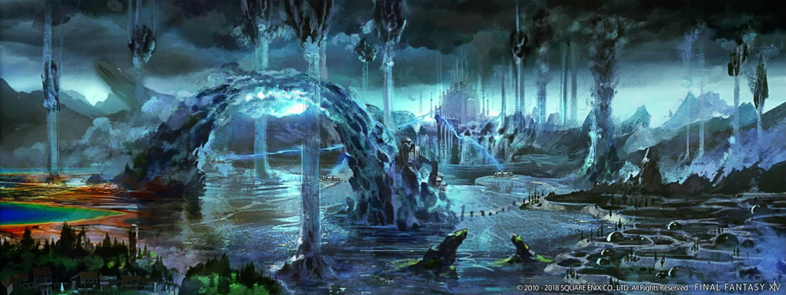

# 禁地优雷卡 丰水之地

;;;.guide .cols2
;;;.guide .col

;;;
;;;.guide .col .grow

完成涌火之地<i class="xiv elv"></i>50的任务之后，可以在黄金港优雷卡入口处接任务<Quest name="决战之地，其名为丰水地带" type="plus" />打开丰水之地。

击杀丰水之地的NM可以获得<item name="丰水水晶" />，并有一定概率获得<item name="丰水晶簇" />及未鉴定的文理碎晶，<item name="丰水地带上锁的宝箱" />，点击名称可以查询具体获得数量信息及宝箱鉴定信息。

;;;
;;;

丰水之地的小怪会发生<Status :id="1589" name="突然变异" />或<Status :id="1581" name="环境适应" />，变异或适应后的小怪会变大、变强，并提供更多的经验，同时变异的小怪还有可能掉落<item name="发生变异的浸水上锁宝箱" />（比较珍惜的奖品有<item name="演技教材·振作精神" />等等）。

丰水的部分掉落、幸福兔宝箱成品市价较高，建议调查板子售价后再决定处理方式，[幸福兔宝箱内容](https://ff14.huijiwiki.com/wiki/%E7%A6%81%E5%9C%B0%E4%BC%98%E9%9B%B7%E5%8D%A1_%E4%B8%B0%E6%B0%B4%E4%B9%8B%E5%9C%B0#.E5.BC.80.E7.AE.B1.E5.A5.96.E5.8A.B1)（比较珍惜的产物有<item name="优雷卡盐蓝燕角笛" />等等）。

::: collapse NM特殊掉落

部分NM会掉落特殊物品（概率不定）。

| NM名称 | 掉落物 |
|  --  |  --  |
| <i class="xiv elv"></i>52 落泪的君主——摩洛 | <Item name="摩洛的角" /> |
| <i class="xiv elv"></i>56 异界的锻冶王——戈尔德马尔王 | <Item name="戈尔德马尔的角" />、<Item name="九宫幻卡：矮儒" /> |
| <i class="xiv elv"></i>59 魔蛇女王——刻托 | <Item name="刻托的爪子" /> |
| <i class="xiv elv"></i>60 水晶之龙——起源守望者 | <Item name="水晶龙之鳞" />、<Item name="九宫幻卡：起源守望者" /> |

:::

### 练级指南

- 地图内分布有**丰水元灵**（俗称水粉），可喊话咨询或自己寻找，尽可能吃到元灵提供的<Status :id="1461" name="元灵加护：经验值提高" />和<Status :id="1463" name="元灵加护：战斗力提高" />buff（注意元灵是可以被其他怪的AOE打死的，请注意避免在元灵附近战斗）。 
  另外可以适当准备<item name="静魔药" />提升练级效率（这个道具是工匠制作的，材料为优雷卡内获得，原材料价格很低，有工匠职业的玩家可以考虑自己做）。

- 丰水练级以触发NM及挖兔子为主，可以通过触发完成[挑战笔记](/topic/daily.md#挑战笔记（每周）)。丰水小怪较强，可以适当尝试文理系统带来的技能增强，没有补正和文理技能不建议越级单挑。
- 有使用文理反射技能反射敌人的魔法攻击进行练级的方式，由一名玩家负责引怪（抗怪车头），其他玩家脱光站在魔法攻击的AOE范围圈内，连续使用<Action name="文理反射" />就可以以极高效率杀怪。
  + [文理技能获得方法、合成配方介绍](#文理技能)。
  + （外部）30级职业154以上防御力+<Action name="文理护盾" />可以形成物理无敌效果，很多时候可以由物理无敌的玩家负责拉怪（吃平A）（需要使用70级以上的职业进入优雷卡后切换职业）。
  + 如果没有物理无敌职业，可以选择（外部）60级以下非T职业+<Action name="重骑兵的记忆" />做车头（需要其他队友反射或输出）。
  + 不带车头直接反射元精类敌人（不需要拉仇恨，无物理攻击）。
    - 雷元精会反弹物理攻击，注意不要平A。

**组队时若等级差异过大，低级玩家可能无法完成笔记，甚至无法获得经验，要注意！**（建议打笔记玩家等级差在2级以内，练级控制在3~4级以内）。

丰水可以反射升级的小怪有：
- <i class="xiv elv"></i>58 自走人偶013BL（偶反）：白天魔法普攻，晚上双刀，晚上需要车头。
- <i class="xiv elv"></i>60 暗黑虚无鬼鱼（章鱼）：物理普攻，AOE魔法，需要车头。
- <i class="xiv elv"></i>64 丰水达菲妮（蛇反）：物理普攻，AOE普攻，有对1仇的无范围提示魔法AOE，需要车头拉住之后其他人跟着车头一边躲AOE一边反射==火投枪==。
- <i class="xiv elv"></i>65 元精：不需车头，地图右下角小岛晴天以外刷新各种元精，一般从兵武库出来的玩家在此升级，俗称劳改岛。
  + 反射等级建议相差6以内，即最好<i class="xiv elv"></i>52之后再去偶反，以此类推。
  + 小怪等级高于玩家8级以上则无法获得经验。