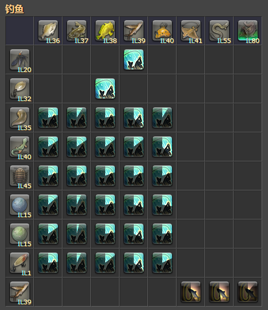
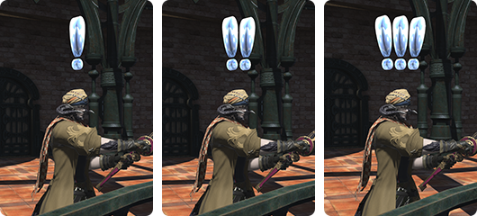

# 挥杆降龙
<FloatTOC />

在海都接任务<quest name="如何加入捕鱼人行会" />成为捕鱼人之后，就可以钓鱼了。

钓鱼本身不是很挣钱，除了满级捕鱼人参与灵砂精选，基本上就没他什么事了。但是钓鱼可以获得一些稀有的宠物，另外钓鱼本身也是一项充满乐趣的活动。捕鱼人可以获得各种专属称号：挥杆降龙、烟波钓徒、鱼太公、鱼龙骑士、八爪旅人等等，可以下跳[进阶说明](#捕鱼人进阶)查看。

在钓鱼之前务必在[角色设置](/basic/config.md)中调出艾欧泽亚时间显示，捕鱼人们过的可都是真真正正的艾欧泽亚时间。

## 渔场与选饵

基本上只要是水边就都是渔场，只要成功钓起过一次鱼的渔场就会被记录在手册（默认快捷键`Y`）中，随着等级的提升还会开放沙海、云海、岩浆等等不同的钓场，因此捕鱼人需要及时完成职业任务，以便前往更高级的渔场。

渔场主要是分为海水与淡水，鱼饵也会分为海水饵和淡水饵两大类。购买鱼饵后，使用<Action name="选饵" />技能将鱼饵挂在鱼竿上，之后找到钓场，使用<Action name="抛竿" />就可以开始钓鱼了。

::: collapse 经验丰富的老渔夫一定会做的几件事

抛竿后使用`/sit`命令掏出小板凳，这样当鱼王上钩时，角色会有站起来拉钩的动作（如果没站起来就意味着脱钩了）。

开始钓鱼之后使用<action name="垂钓之光" />点亮鱼竿，在没有叹号提示的年代，自己鱼竿尖端的光芒是重要的钓鱼辅助（现在不那么重要了~~但是亮着好看~~）

:::

有鱼咬钩之后，鱼竿会有响应动作，角色头顶会蹦出叹号（如果设置为特效简易、不显示则无叹号特效），手柄也会发生震动，此时使用<Action name="提钩" />就可以把鱼钓起来了。如果是有目的的垂钓，通常会建议使用钓鱼网站辅助选饵：

;;;.guide .cols2
;;;.guide .col

;;;

;;;.guide .col .grow

比如35级职业任务所需的<item name="沙鲶鱼" />，在钓鱼网站饿猫上可以搜到，它出自[撒沟厉沙丘](https://cn.ff14angler.com/spot/30405)钓场，钓场大约位于<pos name="南萨纳兰" :x="26.3" :y="36.3" />，钓场信息如图所示。

钓场表格中每行为鱼饵，纵列是鱼。可以看到沙鲶鱼所在列的鱼饵中，45级鱼饵<item name="滚石" />的上钩率明显是最高的，而35级可以使用的<item name="沙蛭" />对沙鲶鱼的上钩率只有滚石的一半还少。

因此如果等级足够可以使用<item name="滚石" />，那么使用<item name="滚石" />来钓沙鲶鱼明显是更好的选择。

;;;
;;;

另外也有其他特殊的鱼类，比如30级职业任务的<item name="满月沙丁鱼" />以及40级职业任务<item name="求雨鱼" />，顾名思义前者只有在夜晚能钓到，后者则只能在下雨的时候能钓到。这些信息也都可以通过[饥饿的猫](https://cn.ff14angler.com/)或[鱼糕](https://fish.ffmomola.com/)网站查到。

所有的鱼类都有固定的脱钩率，如果真的是装备属性不足会提示获得力不足，其他时候遇到脱钩就只要洗洗脸就好啦。

## 以小钓大与HQ

以小钓大是把上钩的HQ（<i class="xiv hq"></i>）鱼作为鱼饵进行钓鱼的技能，为了使用<action name="以小钓大" />，首先我们要获得HQ鱼。

::: segment blue

获得HQ鱼的根本是提升鉴别力，如果鉴别力过低的话是不可能钓起HQ鱼的（装备尽可能接近自己等级即可）。玩家可以使用<action name="耐心" />来增加HQ鱼的咬钩率。

### 杆型判断

;;;.guide .cols2
;;;.guide .col

;;;

;;;.guide .col .grow

鱼上钩的时候会有3种杆型，通常被称为小杆（轻杆）、中杆、大杆（重杆、鱼王杆），手柄会配合3种杆型有不同的震动模式，玩家头顶会出现不同数量的感叹号（如果简易显示或不显示特效，则无法看到感叹号）。

在使用<action name="耐心" />或<action name="耐心II" />之后，原本<Action name="提钩" />的成功率会大幅降低，需要配合杆型选择另外的技能。通常使用<action name="精准提钩" />提小杆（一个叹号）的鱼，用<action name="强力提钩" />提中杆、大杆的鱼。

但是部分鱼王虽然表现为大杆（3个叹号），但却有可能需要使用<action name="精准提钩" />，推荐通过[饥饿的猫](https://cn.ff14angler.com/)或[鱼糕](https://fish.ffmomola.com/)调查。

;;;
;;;

HQ鱼必定能满足各类收藏品的收藏要求，所以在挑战收藏品垂钓的时候，也可以使用<action name="耐心" />增加HQ的概率。

:::

获得HQ鱼之后，<action name="以小钓大" />技能会亮起，此时使用<action name="以小钓大" />就可以了。

玩家不能使用包里已有的HQ鱼直接以小钓大，在钓起HQ鱼之后也不能使用<action name="放生" />、<action name="耐心" />、<action name="撒饵" />等技能，也不能脱离钓鱼状态（比如按移动键站起来），否则都会打断以小钓大准备的状态。

随着等级提升，玩家可以习得<action name="以小钓大II" />技能，<action name="以小钓大II" />可以将NQ鱼用于以小钓大，但是这个准备状态只能持续15s，超过15s，以小钓大II就无法使用了。

## 刺鱼

完成63级主线<quest name="遨游大海！" type="main" />之后可以接任务<quest name="刺鱼的方法" type="plus" />并获得渔叉，装备上渔叉之后就可以刺鱼了。

刺鱼的方法与另外两个采集职业类似，需要找到特定的采集点，右键采集点进入采集状态。当采集点出现气泡之后，按<action name="刺鱼" />技能，就可以了。

刺鱼时不使用鱼饵，而是使用<action name="渔叉尖" />技能选择大中小渔叉，具体渔场与渔叉尖的关系可以查看[饥饿的猫](https://cn.ff14angler.com/)或[鱼糕](https://fish.ffmomola.com/)。

## 捕鱼人练级

| 练级方式 | 说明 |
| -- | -- |
| 理符 | 理符鱼都可以在市场上交易，可以自己钓了买，也可以从板子上买鱼交理符。 |
| 大国防联军筹备 | 每天1次，推荐交。可以交易。 |
| 收藏品 | 换票效率不如另外2个采集，手法参见上述HQ鱼的采集方法。 |


## 捕鱼人进阶

::: collapse 技能栏折叠宏

由于捕鱼人有2套技能，分别对应钓鱼与刺鱼。因此可以利用热键栏复制和粘贴功能，将钓鱼和刺鱼技能完全分开，节省热键防止误触。

将捕鱼人1、2号热键栏设为共通热键栏，把钓鱼技能放到4、5号热键栏，刺鱼技能放到6、7号热键栏。

```
/ac 选饵
/hotbar copy 捕鱼人4 捕鱼人1
/hotbar copy 捕鱼人5 捕鱼人2
/micon 选饵
```

这个宏是指按下选饵技能的时候，自动将技能栏切换成钓鱼使用的技能（把4、5号热键栏的技能复制到1、2号热键栏使用）。同理可以利用渔叉尖技能切换刺鱼技能：

```
/ac 渔叉尖
/hotbar copy 捕鱼人6 捕鱼人1
/hotbar copy 捕鱼人7 捕鱼人2
/micon 渔叉尖
```

技能中标注**钓鱼**字的为钓鱼技能，标注**刺鱼**的为刺鱼技能。

:::

捕鱼人有一系列进阶技巧，主要是用于挑战更高级别的鱼王、鱼皇时使用。鱼王、鱼皇是ff14中捕鱼人生涯的顶点，各种称号（挥杆降龙、烟波钓徒、鱼太公、鱼龙骑士、八爪旅人等等）都是大家追逐的目标。

如果想要获得这些炫酷的称号，最好能够掌握下面的技巧。

PS 捕鱼人是对GP要求最高的，平时常备大量<item name="轻型强心剂" />（<i class="xiv hq"></i>可对齐耐心II）、<item name="强心剂" />、<item name="高级强心剂" />是非常重要的。

### 计时宏与放杆

每个钓场中，每种鱼饵对于每条鱼的上钩时间是在某个固定值之间浮动，时间配合杆型，就可以在鱼咬钩的时候大概估计出咬钩的鱼。比如惋惜之晶遗迹钓场的<item name="风暴骑士" />，是一条3~5s的大杆鱼，而鱼皇<item name="兰代勒翼龙" />的咬钩时间几乎超过20s。由于提钩动画需要一定的时间，有经验的捕鱼人会选择不提钩，让鱼自己逃走，以节省时间，另外也可以防止<Status :id="1803" name="拍水" />buff（<action name="拍击水面" />提供）失效。

::: collapse 计时宏示例

抛竿宏：

```
/ac 抛竿 <wait.5>
/micon 抛竿
/e 5s <wait.5>
/e 10s <wait.5>
/e 15s <wait.5>
/e 20s <wait.5>
/e 25s <wait.5>
```

以小钓大、以小钓大II也可以做类似的宏（把上面宏的“抛竿”改成对应的技能名即可），时间可以自行往下加，当然也可以把间隔改为3s甚至1s（但是每个宏命令只能保存15行，所以1s的宏计时时间非常短）。目前已知最长的鱼王需要将近50s才会咬钩。

另外还可以制作提钩宏（利用宏打断宏的特性，打断抛竿宏的计时）：

```
/merror off
/ac 提钩
/micon 提钩
```

精准提钩、强力提钩也可以做类似的宏。

:::

鱼的咬钩时间可以在[饥饿的猫](https://cn.ff14angler.com/)的渔场页面看到，每个鱼饵对应一条轴，绿色表示现实时间（1格1s），红色表示艾欧泽亚时间（1格1min），通常看绿格子即可。另外由于饿猫显示的是平均时间，所以实际咬钩时间会比饿猫显示的更长。

### 鱼王与鱼皇

在遍布艾欧泽亚的钓场中，有名为鱼王和鱼皇的鱼类，它们的图标是绿色背景，也被俗称为“绿鱼”，是每个钓场中最难以挑战的对手。

完成50级职业任务之后，在捕鱼人行会会出现任务<quest name="海川鱼神" />及其后续任务<quest name="爆钓艾欧泽亚" />，这就是带领大家走向鱼王、鱼皇的道路（不接任务也可以钓到任务要求的几条鱼，分别是<item name="锯鲛" />、<item name="海神剑" />、<item name="内角石" />、<item name="旋齿鲨" />、<item name="波太郎" />、<item name="杀手库诺" />、<item name="秀尼鱼龙" />和<item name="涅普特龙" />，如果你提前钓起了这些鱼，记得留着交任务……

目前国服推荐使用[鱼糕](https://fish.ffmomola.com/)进行鱼王、鱼皇的信息追踪，下文部分解说也以该网站提供的信息为主。

#### 时间与天气

大部分的鱼王、鱼皇都有时间或天气的要求（甚至有前置天气的要求），这些信息可以从[鱼糕](https://fish.ffmomola.com/)查到，跟着时间表去钓即可。但有些渔场距离较远，或需要连续以小钓大起钩，或者喜欢套娃等等情况，那么就建议提前一些抵达渔场做准备。例如：

- <item name="皱鳃鲨" />需要在薄雾、阴天、微风这三种天气中，于<i class="xiv eorzea-time-chs"></i>17-3，使用任意低级鱼饵→<item name="梅尔托尔虾虎" />→<item name="梭子鰆" />→<item name="巨型乌贼" />→<item name="皱鳃鲨" />，一共需要3次以小钓大。可以提前一些时间抵达渔场，使用<action name="耐心" />钓起<item name="巨型乌贼" hq/>，等艾欧泽亚时间变为<i class="xiv eorzea-time-chs"></i>17:00之后，直接使用以小钓大，这样可以节省前置时间。
- <item name="众神之爱" />需要在雨转晴的<i class="xiv eorzea-time-chs"></i>5:30-6:30，使用<item name="嗡嗡石蝇" />垂钓，窗口期非常短。一般会选择提前钓起一条<item name="月神恩惠" />，然后使用<action name="拍击水面" />，这样等艾欧泽亚时间变为<i class="xiv eorzea-time-chs"></i>5:30之后立刻抛竿，这样就能保证咬钩的都是<item name="众神之爱" />（同理还有<item name="莫古尔古球球" />等鱼王）。
- <item name="红龙" />需要在薄雾→阴云的<i class="xiv eorzea-time-chs"></i>4-8，使用<item name="蓝矶沙蚕" />→<item name="苦尔鳗" />→<item name="红龙" />，但是<item name="苦尔鳗" />本身也能钓起<item name="苦尔鳗" />（俗称套娃），因此大部分捕鱼人会选择<i class="xiv eorzea-time-chs"></i>0:00就提前去钓<item name="苦尔鳗" hq/>，场面蔚为壮观（注意钓起苦尔鳗<i class="xiv hq"></i>后不要使用任何技能，否则会打断以小钓大准备状态）。

#### 钓组与鱼眼

打开<action name="钓组" />可以钓起非鱼类的东西（比如贝类、宝图等等），如果只是针对鱼王的话，可以参考[鱼糕](https://fish.ffmomola.com/)的提示打开，平时可以不开。

鱼眼技能仅能用于2.0~3.x钓场中，钓场之皇以外的鱼，效果为无视鱼的上钩时间。基本上只有在老版本的钓场中补图鉴时需要开。

#### 捕鱼人之识

在满足某些特殊条件之后，会触发一种全新的buff：<Status :id="568" name="捕鱼人之识" />，在鱼识buff的加成下，可以钓起非常稀有的鱼，但由于buff时长通常非常短，渔夫需要综合前面的技巧进行选饵、提前准备、计时放杆、<action name="撒饵" />加速等等。

一般作为触发buff的鱼被称为**门票**，可以使用<action name="双重提钩" />、<action name="专一垂钓" />等等技能进行准备（俗称施工）。

- <item name="沙里贝涅" />需要5条<item name="冰战神" />作为门票。由于CD时间很短，一般渔夫会选择提前钓起4条冰战神，然后开<action name="专一垂钓" />，在<i class="xiv eorzea-time-chs"></i>23:55左右开耐心抛竿钓最后一条冰战神（如果没专一钓起阿巴拉提亚公鱼可以使用拍击水面），这样就能尽可能保证<i class="xiv eorzea-time-chs"></i>0时准时打开<Status :id="568" name="捕鱼人之识" />buff，接下来以小钓大即可。
- <item name="莫名熔岩鱼" />需要5只<item name="花岗蟹" />和3只<item name="化石骨舌鱼" />作为门票，由于<item name="化石骨舌鱼" />需要鱼眼，而且只有用花岗蟹以小钓大才能获得，所以通常获得3只化石骨舌鱼的时候，早就满足了5只花岗蟹的要求。使用<item name="花岗蟹" />以小钓大的时候，有2种策略：
  1. 开<action name="耐心" />/<action name="耐心II" />以小钓大，只拉中杆（<action name="强力提钩" />）
  2. 使用<action name="以小钓大II" />强行抛竿，然后使用<action name="双重提钩" />强行提中杆。

::: segment orange
**NOTE:关于门票**

在同一个钓场连续垂钓计算门票，切图（包括死亡返回）、换钓场都会清零计数，站着发呆、生产则不会清计数（采集不明）。只要门票数量足够，就会立刻触发<Status :id="568" name="捕鱼人之识" />（而不论对应鱼王是否在CD中），鱼识buff结束后，计数重新开始（也就是说在鱼识buff生效期间，就算再钓起门票鱼也不计数）。
- <item name="云海蝴蝶螺" />需要3条<item name="夕月天女" />和3条<item name="蛉蝎" />门票，可以先<action name="双重提钩" />钓夕月天女（10s以内轻杆，超过15s基本都是星花），然后钓2条蛉蝎，开<action name="专一垂钓" />。<i class="xiv eorzea-time-chs"></i>4:56左右抛竿钓起第3条蛉蝎触发buff，（可<action name="拍击水面" />/<action name="撒饵" />）开始钓蝴蝶螺。
- <item name="镰甲鱼" />需要2条<item name="怨妇虾" />作为门票，由于怨妇虾是鱼王，不能使用双重提钩或专一垂钓…但是可以拉起第二条怨妇虾后使用<action name="拍击水面" />，然后拼命<action name="撒饵" />钓就可以了。
- <item name="胸脊鲨" />需要2条<item name="雕塑家" />作为门票，雕塑家是可以作为收藏品的，所以玩家通常会在钓这个鱼的时候打开<Status :id="805" name="收藏品采集" />buff，不开耐心以小钓大，咬钩后使用<action name="双重提钩" />（通常25s以上才有可能出现雕塑家，30s以上是雕塑家的概率较高）。如果上钩的是雕塑家，那么会出现收藏品确认窗口。等到<i class="xiv eorzea-time-chs"></i>16:00时点“否”，钓起的雕塑家会变为2条普通雕塑家进包，并触发<Status :id="568" name="捕鱼人之识" />。
  + 雕塑家有天气要求，但胸脊鲨没有，如果雕塑家上钩的时间太晚（比如<i class="xiv eorzea-time-chs"></i>17:30之类的），可以选择捏着窗口等到第二天的<i class="xiv eorzea-time-chs"></i>16:00再确认收藏。

由于渔场有警惕机制（即在一个渔场同一个位置停留过久，会导致无法抛竿），在挑战门票时间较长的鱼王/鱼皇（比如<item name="七彩天主" />）时，建议在快要触发门票的时候更换位置，避免因为警惕无法抛竿，更换位置浪费时间。

:::

## 海钓

海钓是FF14版本5.2中为捕鱼人新增的副本内容，仅限捕鱼人参与。每两小时，玩家可以单人或组队报名搭乘捕鱼人行会运营的渔船“努力号”出海，一船最多能载24名渔夫一起出海钓鱼。

和捕鱼人的整体系统一样，海钓费时，带来的经济收益也不可观，对于不喜欢钓鱼的人，可能只是练个级刷点黄票的好去处。它的直接收益包括经验和黄票，达成一定的条件可以获得白票和各种成就奖励。

但对于热爱钓鱼的玩家们来说，能和渔友们一起组队钓鱼是一件非常有趣的事情。出海能够钓到全新的鱼类丰富图鉴，还可能遭遇幻海流，享受杆杆绿鱼的快乐，更有传说中的蓝鱼等你来钓。海钓中出现的绿鱼都不属于钓场之王。

> [海钓手册](/topic/ocean-fishing.md)

## 常用钓鱼工具

- [鱼糕](https://fish.ffmomola.com/)：中文钓鱼数据库（含海钓）。
- [饥饿的猫](https://cn.ff14angler.com/)：完整的钓场、鱼饵、时间、杆型等信息；天气信息有误差，有少量鱼饵错误。
- [Fish Tracker](http://fish.senriakane.com/)：鱼王、鱼皇时钟（包括有特殊条件的普通鱼）。有极少量鱼饵错误。
- [Garland钓鱼时钟](http://www.garlandtools.org/ffxivfisher/)（英文）
- [Teamcraft](https://ffxivteamcraft.com/search)（需要科学上网）：按鱼或渔场检索信息，有完整的钓场、鱼饵、时间、上钩率等信息。部分鱼数据量较少，可以配合饿猫查看。