# 纷争前线
<FloatTOC />
法外战区为24vs24vs24，共计72人的三方混战战场。场地内会有各种阵营旗帜，以及用于争夺的点位，通过占领点位和击杀敌军获得积分，先获得指定分数的一方获胜。若在时间结束时均为到达指定分数，则取分数最高的为获胜方。分数相同为并列获胜。

## 界面介绍

;;;.guide .cols3 
;;;.guide .col
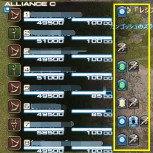 

小队列表可以看到所有队友的状态、战意
;;;

;;;.guide .col 
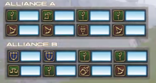 

与团队任务相同，可以在团队列表看到其他队伍的状态

;;;
;;;.guide .col .grow

进入战场后，可以看到小队列表和团队列表，整体和PVE相同。

刚进入战场时的区域也是复活区，玩家可以在复活区自由切换职业，一旦离开复活区则无法切换。

;;;
;;;

;;;.guide .cols2 
;;;.guide .col
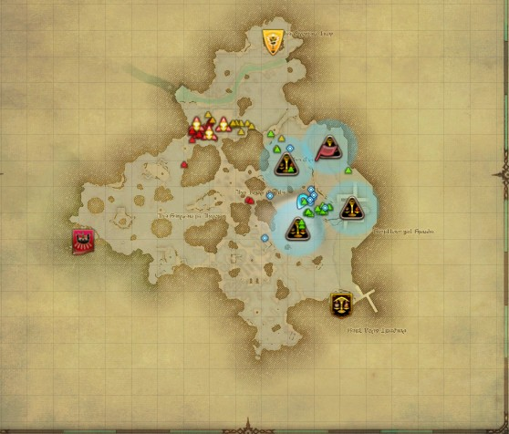 

黄色-双蛇党；蓝色-恒辉队；红色-黑涡团； 绿色-己方其他小队玩家；蓝色-自己所在小队玩家

;;;

;;;.guide .col .grow

在地图（默认快捷键`M`）上，会显示出队友、友方、敌方的位置及点位状态，其中点位需要刷新/激活之后才会显示（不同场地的点位图标不同）。

将鼠标移动到己方队友上可以看到具体的id，移动到点位上可以看到点位的各种信息。

在不熟悉战场的时候，可以在安全的地方多看点位信息来熟悉环境。

;;;
;;;

::: segment red 
### 将地图锁定在最前面

;;;.guide .cols2 
;;;.guide .col
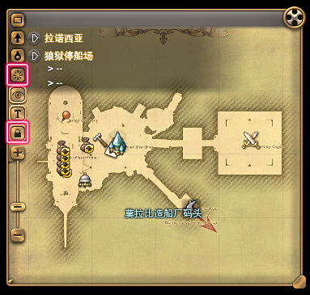 

缩小并锁定地图
;;;

;;;.guide .col .grow

战场形势瞬息万变，可以将地图缩小并放在合适的地方。关闭==非激活时地图变为半透明==，并打开==地图锁定==，就可以一直关注到战场的状况了。

;;;
;;;
:::

;;;.guide .cols2 .base
;;;.guide .col .figcap
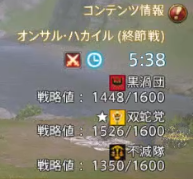 

在任务情报栏，可以进行三家分值的确认，其中，己方会被标注五角星
;;;

;;;.guide .col  .figcap
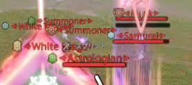 

在战场中，敌方目标仅会显示职业名，其战意将显示在职业之前

;;;
;;;

### 战意

在战场的多人数PVP中拥有的特殊系统，随着战意的增高，可以增加自身造成的伤害与治疗量，击倒敌人可以获得10战意、参与助攻可以获得2战意。如果自身陷入无法战斗状态后，战意值会减半。

「战意值」最大可增长到「100」，每增长「20」点值都可提升「斗志昂扬」的等级。根据「斗志昂扬」的等级，可提升不同程度的伤害以及体力恢复量。

| 斗志昂扬 | 战意值 | 效果 |
| -- | -- | -- |
| <Status :id="2131" name="斗志昂扬I" /> | 20～39  | 伤害及治疗量提升10% |
| <Status :id="2132" name="斗志昂扬II" /> | 40～59 | 伤害及治疗量提升20% |
| <Status :id="2133" name="斗志昂扬III" /> | 60～79 | 伤害及治疗量提升30% |
| <Status :id="2134" name="斗志昂扬IV" /> | 80～99	 | 伤害及治疗量提升40% |
| <Status :id="2135" name="斗志昂扬V" /> | 100 | 伤害及治疗量提升50% |

因此，高战意的玩家也常常会成为被集火的目标。

### 补正系统

战场针对LB积攒速度及职业间伤害进行了补正：
* LB蓄积速度：第一名0.75倍、第二名1.0倍、第三名1.25倍 
该蓄积速度可与占星术士卡牌效果共同存在
* 伤害补正：
  * <Role name="tank" />防护职业/<Role name="melee" />近战物理职业受到的伤害降低60%
  * <Role name="ranged" />远程物理/<Role name="magic" />远程法系/<Role name="healer" />治疗职业受到的伤害降低30%
  * <Role name="smn" />召唤/<Role name="sch" />学者/<Role name="whm" />白魔法师造成的伤害降低10% 
* 该伤害补正为全局补正，可与各职业减伤共同存在

## 战场地图及机制介绍

战场共分为4种场地，每种场地都有不同的得分机制与方式，下面将按顺序依次介绍。

### 周边遗迹群（阵地战）

阵地战主要包通过占点（俗称翻井盖）、击倒无人机（俗称飞机）、击杀敌人的形式得分，先取得1600分的阵营获得胜利。

;;;.guide .cols2 
;;;.guide .col 
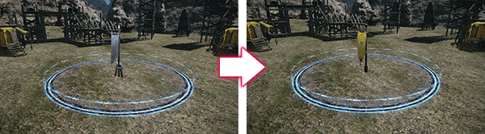 

阵地战据点（占点）
;;;

;;;.guide .col .grow

场地上存在6个据点，当某一方有多人在圈内时可以提升占领度，占领度跳满就可以占领该据点，并获得10分。当进入敌方占据的据点时，据点会先慢慢降低原本的占领度进入中立状态（俗称翻白），之后再进行一轮占领的判定。

占领据点时，会以圈内人数较多的一方进行计算，人数越多占领速度越快，4人时即达到最高速度。

占领期间，据点会提供3秒一跳，一跳2点的分数。因此在阵地战的战斗中，占点是十分重要的一环，与另一方在据点附近拉扯、战斗的时候，请不要忘记确认一眼据点的状态哦！

;;;
;;;

;;;.guide .cols2 
;;;.guide .col 
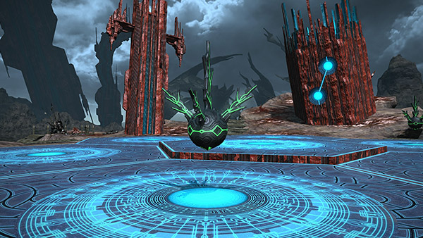 

高台无人机
;;;

;;;.guide .col .grow

阵地战中央俗称高台，开场1分钟高台刷新第一批截击无人机，击杀全部无人机后4分钟刷新下一批，10分刷新截击系统。截击无人机提供25的分值、截击系统提供250的分值，分值会根据阵营伤害量判定分数归属。在无人机刷新前30s时，小地图上会有预告。

飞机是很重要的分值来源，因此高台往往成为冲突的焦点，由于高台的跌落伤害超过了血量上限，因此请不要直接从高台上一跃而下！

;;;
;;;

在阵地战中，击杀会获得5分，被击杀会失去5分。

### 尘封秘岩（争夺战）

尘封秘岩俗称尘封或CD，主要通过摸点、击杀敌人的形式得分，先取得800分的阵营获得胜利。

;;;.guide .cols2 
;;;.guide .col 
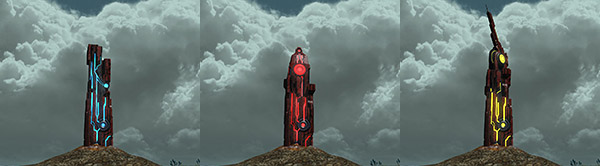 

亚拉戈石文（从左至右分别为B、A、S级）
;;;

;;;.guide .col .grow

尘封秘岩场地中有一些位置固定的亚拉戈石文柱，开场1分钟后，场地上随机激活刷4个柱子，激活的柱子会同时显示在小地图上，每个柱子消失后15s就会刷新新的柱子，每轮刷新的4个柱子中必定包含一个A级或S级柱子。开场9分钟之后，同时只会存在3个柱子。

;;;
;;;

激活刷新的柱子会随机刷为B、A或S级，不同级别的柱子有不同的分数：
* S级：总分160，3秒一跳，一跳4分
* A级：总分120，3秒一跳，一跳3分
* B级：总分80，3秒一跳，一跳2分

;;;.guide .cols2 
;;;.guide .col 
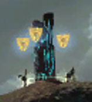 

被双蛇党占领的B级石文柱
;;;

;;;.guide .col .grow

柱子刷新激活时为中立状态，当玩家右键柱子并完成读条后，柱子变为占领状态，同时柱子周围出现占领方的旗帜。当地方右键被占领的柱子时，需要先读条将其变回中立状态（俗称翻白），然后再读条进行占领。读条可以被伤害或控制打断，所以请不要尝试在激烈的战斗中翻柱子，极容易被打断的同时也会因为来不及使用技能而被击倒。

当柱子被占领时，柱子周围会出现占领方的旗帜，同时可以在地图上看到该柱子剩余的分及占领方。占领方可以按时间获得柱子的分数，当柱子的总分清零之后，这个柱子消失（从平面地图上消失，但场地上仍可以看到）。

;;;
;;;

在尘封秘岩中，击杀会获得5分，被击杀会失去5分。

由于柱子可以被翻，因此在尘封秘岩中存在“守点”，即在点位附近蹲守防止其他阵营翻点的玩家，也存在一些四处游走翻其他阵营点位的游击小队，如果刚进入战场的你尚不了解地图和机制，那么跟随大部队在正面战场打出伤害也是一种很不错的选择。

### 荣誉野（碎冰战）

碎冰战主要通过打冰、击杀敌人等形式得分，先取得1600分的阵营获得胜利。

;;;.guide .cols2 
;;;.guide .col 
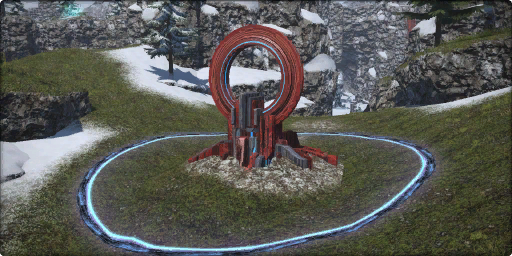 

据点亚拉戈石文
;;;

;;;.guide .col .grow

场上三方的复活点门口存在一个可以被占领、翻白的据点。当某一方有多人在圈内时可以提升占领度，占领度跳满就可以占领该据点。当进入地方占据的据点时，据点会先慢慢降低原本的占领度进入中立状态（俗称翻白），之后再进行一轮占领的判定。

占领据点时，会以圈内人数较多的一方进行计算，人数越多占领速度越快，4人时即达到最高速度。

据点被占领时，每3秒一跳，1跳2分。

;;;
;;;

;;;.guide .cols2 
;;;.guide .col 
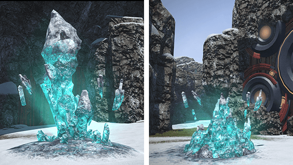 

大冰（左）和小冰（右）
;;;

;;;.guide .col .grow

碎冰战中，冰的位置是固定刷新的，并按照一定的规律进行激活，激活前30s会在地图上进行预告，其中小冰可以提供70的分值、大冰可以提供300的分值，分值根据阵营伤害量判定分数归属。

::: collapse 碎冰时间表
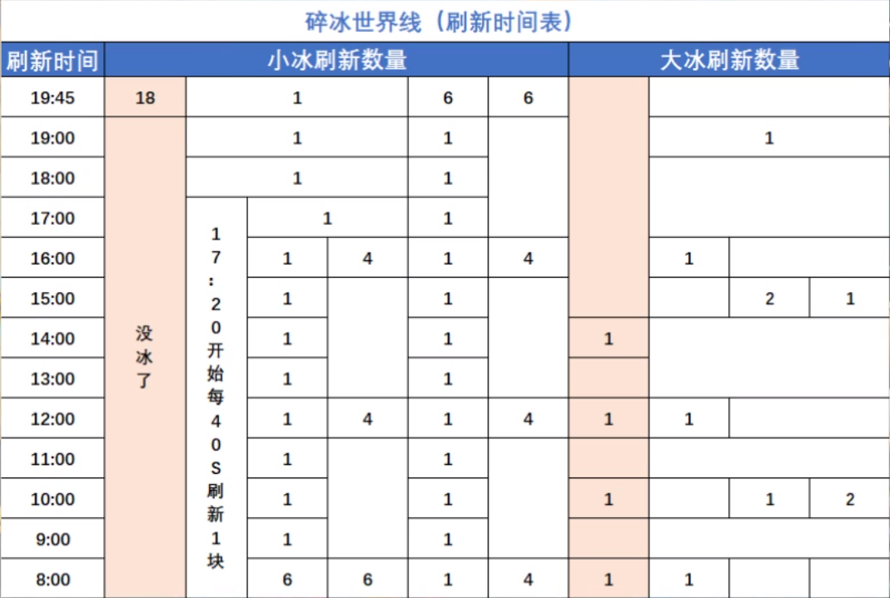 

每一纵列是一种刷新可能性，比如开场刷新6个小冰，那么可能接下来就是每分钟刷新1个小冰，或每4分钟刷新4个小冰。

图片来自[灰机wiki](https://ff14.huijiwiki.com/wiki/%E8%8D%A3%E8%AA%89%E9%87%8E%EF%BC%88%E7%A2%8E%E5%86%B0%E6%88%98%EF%BC%89)。
:::

;;;
;;;

在碎冰战中，击杀会获得10分，被击杀会失去5分。

进入6.1版本后，由于击杀分的占比量上升，因此碎冰战会更加频繁的进入三方战斗，碎冰战环境地势复杂，多处高台的跌落伤害均超过了最大血量上限，因此需要合理的使用小平台进行两次下落来回避摔死的结局（俗称二段跳），同时由于岔路较多，新人很容易迷路，可以紧跟大部队并把地图放置在不影响但又可以看到的位置上！

### 昂萨哈凯尔（竞争战）

昂萨哈凯尔俗称大草原，主要通过契约（摸点）、击杀敌人等形式得分，先取得1600分的阵营获得胜利。

;;;.guide .cols2 
;;;.guide .col 
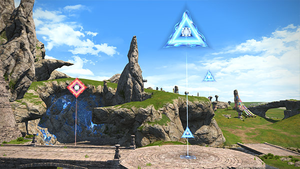 

无垢的大地（可契约状态）
;;;

;;;.guide .col .grow

地图上固定分布“无垢的大地”，无垢的大地会随机刷新进入预告状态，预告状态结束后变为可契约状态，大地一旦被契约不可再更改，契约需要读条，读条可以被伤害或控制打断。契约结成后则不可更改。

依据剩余时间19:30-14:30-9:30-4:30刷新数量依次为6、5、4、3个，且越往后S点和A点出现的几率越大，其中4:30开始就只会刷出S点了。

;;;
;;;

;;;.guide .cols2 
;;;.guide .col 
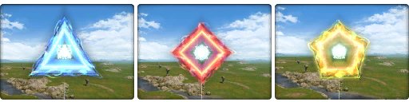 

无垢的大地（从左往右分别是B级、A级、S级）
;;;

;;;.guide .col .grow

无垢的大地存在B、A、S三种等级，其中S级可以提供200分，A级可以提供100分，B级可以提供50分。

有时候放弃一些低等级点去争夺高等级点也不失为一种战术选择。

;;;
;;;

在大草原中，击杀会获得8分，被击杀会失去8分。

大草原多为平地，是战斗最多发的地方，与尘封秘岩一样，由于契约读条可以打断，因此在混战中，请不要尝试走上去摸点，等待己方建立了优势，再上去签订契约吧~

## 新手入门指南

1. 战场与5V5不同，战场可以在复活点内切换职业，而结算经验是根据排本职业判定的，所以不管你用什么职业排本，请在战场中切换成自己熟悉的职业吧！
2. 在战场中可以骑乘坐骑，但是在坐骑上不能使用任何技能，同时在坐骑上被攻击会被附加Debuff<Status :id="1394" name="移动速度降低" />，因此如果在坐骑上被打，请立刻下坐骑！
3. 在倒计时集火前，请不要交过多的核心输出技能，将伤害高的AOE、控制技能留在倒数结束时，对对面造成致命一击吧！

6.1版本起，疾跑开启后只要不使用下一个技能就是常驻的，因此在短距离的战斗拉扯中，相比于坐骑，疾跑是更优的选择。

战场中的返回可以令你返回到复活点，但是记得，这个过程会被敌人的攻击打断。

刚从复活点内出来的玩家会获得短时间的无敌。

战场中存在各种各样的夹击、反打，因此请不要过于恋战，队友撤退时立刻跟随队友后撤，防止自己成为队伍的尾巴而被对面围殴~

请杜绝挂机、强退、辱骂等消极行为，如果遇到这些玩家，可以通过[违规处理平台](https://actff1.web.sdo.com/project/20210621ffviolation/index.html#/index)进行举报。
