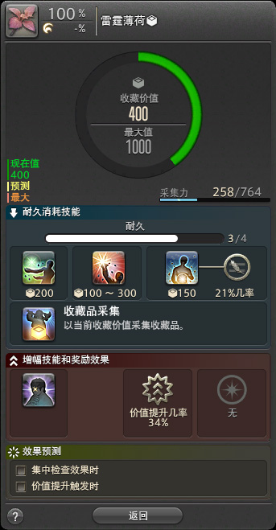

# 大地使者
<FloatTOC />
大地使者是FF14中对所有采集职业的统称，采集职业需要穿梭在各个采集点之间，挖掘生产所需的各种素材，或在各个钓场中挥洒时间。

采集业并不会对战斗职业提供任何属性或者加成。基本上它是作为工匠的材料提供方，从最基础的媒触水晶，到珍惜的材料，这保证了他们有最基本的稳定收入。

采集职业通过50级之后挖掘到的收藏品<i class="xiv collectables"></i>兑换各种票据，然后使用这些票据兑换采集秘籍、采集用魔晶石等素材道具。

## 采集基础

和战斗职业一样，采集职业行会也分布在3个主城，海都是捕鱼人行会；森都是园艺工行会；沙都是采矿工行会。获得采集主手之后，切换主手工具就可以切换职业。

采集职业有自己的专属属性：获得力、鉴别力及采集力（GP）。采集职业的装备可以为他们提供这些属性（1级新人可以先去商会回购一下自己出生时的种族套装凑合穿一下，裸奔毕竟不文明）。

;;;.guide .cols2
;;;.guide .col

;;;

;;;.guide .col .grow

准备好装备及主手之后就可以前往野外了，矿工和园艺工需要前往野外地图中的“采集点”进行采集。

在野外使用<Action name="矿脉勘探" />或<Action name="三角测量" />，就可以发现“采集点”。

如果附近没有采集点的话，还可以使用<Action name="大地勘察" />或者<Action name="树木之声" />探访距离我们最近的采集点。

;;;
;;;

;;;.guide .cols2
;;;.guide .col

;;;

;;;.guide .col .grow

找到采集点后，右键点击采集点打开列表，选择物品就可以开始采集。

采集点有一定的耐久值，每采集一次，耐久就会下降，可以使用技能恢复耐久，耐久降为0之后，这个采集点就会消失。采集点消失后，只要打开附近任意其他3个采集点，就会重新刷新。

在手册管理→采集笔记中可以查看各种可以采集的资源的地图分布，不过由于这些笔记做得不太好，通常建议使用其他三方工具配合搜索采集。

;;;
;;;

;;;.guide .cols2
;;;.guide .col

;;;

;;;.guide .col .grow

捕鱼人比较特殊，需要先购买鱼饵，然后根据海水或淡水进行<Action name="选饵" />，之后找到一个水边使用<Action name="抛竿" />就可以开始钓鱼了。

有鱼咬钩之后，鱼竿会有响应动作，角色头顶会蹦出叹号（如果设置为特效简易、不显示则无叹号特效），手柄也会发生震动，此时使用<Action name="提钩" />就可以把钓上的鱼拉起来了。 ~~然后渔线断了，鱼带着鱼饵跑了~~

捕鱼人相对于其他2个采集职业，性质不太一样，不稳定性也更多，甚至在某些时候提到采集职业并不包含捕鱼人。所以我们准备了单独的[钓鱼指南](/topic/fisher.md)用于参考。

;;;
;;;

> - [练级指南](/topic/gather-levelup.md)
> - [钓鱼指南](/topic/fisher.md)

## 特殊采集点

采集过程中会有一些特殊的采集点，它们通常只在某些特殊特殊时间出现，甚至需要传承录才能够发现。

### 未知采集点

玩家46级之后，在使用<action name="山岳之相" />或者<action name="丛林之相" />之后，有可能会遇到==发现未知采集地点==的提示。这些采集点通常会产出一些非常有价值的资源，因此它们的出现是有时限的。同时打开这些采集点的话，会发现它的8条资源都是被盖住的，其中大部分资源都是假的，只有为数不多的1~3条里面藏有资源。但事实上，**所有“未知采集点”出现的时间、消失的时间，以及资源所在的确切位置都是固定的(部分未知采集点还有隐藏资源，隐藏资源的位置是随机的)。**

这些采集点在采集笔记中，采集的具体地点会被记为？？？。如果采集笔记中完全查询不到该材料的采集地点，那么有可能需要使用传承录才能够习得，传承录则需要使用票据进行购买。

如果没有采集完毕就关闭这个采集点，这个采集点也会立刻消失。对此类采集点进行采集时，请务必先确认好GP情况，料理buff等。

### 限时采集点

练级的玩家较少接触此类采集点，它们会混迹在普通采集点之中，跟普通采集点一样刷新(即在这一区采集3个采集点后，第一个被采集的采集点会被刷新)。这种采集点通常与灵沙精选有关。

限时采集点在采集笔记中，地点记录后面会有一个时钟的图标。

这些采集点同样需要采集时钟进行辅助。

> **采集时钟可在文末[常用工具](#常用工具)里随便挑一个顺眼的用。**

## 收藏品与精选

玩家50级之后，可以在<pos name="伊修加德基础层" :x="10.2" :y="10.5" />接任务<quest name="一流工匠的新工作" type="plus" />开启收藏品（<i class="xiv collectables"></i>）功能，然后完成后续任务<quest name="打开新世界的大门" type="plus" />就可以开启罗薇娜商会。之后在神拳、水晶都也都有对应的商会开启任务。

仅有部分道具可以采集收藏品，这些收藏品也仅能用于罗薇娜商会、老主顾或灵砂精选。

;;;.guide .cols2
;;;.guide .col

;;;

;;;.guide .col .grow

打开收藏品采集界面之后，会出现收藏品价值和相关技能。使用提纯技类能和<action name="收藏品采集" />会消耗耐久，耐久为0则采集结束。

每次使用提纯类技能会提升相应的收藏价值（显示在技能下方），所有提纯类技能都有概率触发<Status :id="2418" name="洞察" />，触发洞察后，<action name="大胆提纯" />和<action name="慎重提纯" />的最低提升价值提升到与<action name="提纯" />一致。同时提纯类技能会有一定概率触发收藏价值提升（触发时收藏价值的数字后会有一个感叹号）。

使用<action name="慎重提纯" />时，会有一定概率不消耗耐久。使用<action name="集中检查" />可以提升下次提纯时的价值。

无论用于何种目的的收藏品采集，目标价值均为满价值（1000）。手法参考：<action name="集中检查" /> → <action name="慎重提纯" />（记录是否触发价值提升） → <action name="集中检查" /> → <action name="慎重提纯" />（记录是否触发价值提升） → （若2次都触发价值提升）<action name="收藏品采集" />/（若仅触发1次价值提升）<action name="慎重提纯" /> → <action name="收藏品采集" />/（若没有触发价值提升）<action name="提纯" /> → <action name="收藏品采集" />

;;;
;;;

捕鱼人需要使用<action name="收藏品采集" />技能打开<Status :id="805" name="收藏品采集" />，然后使用<action name="耐心" />等技能钓大鱼。具体钓法请参见[钓鱼指南](/topic/fisher.md)。

### 精选

玩家在摩杜纳接任务<quest name="生命、精选，另一个答案" type="plus" />之后，就可以获得<action :id="10229" name="精选" />技能。在收藏品上右键，或在技能菜单中直接使用精选，就可以精选指定物品。

精选收藏品主要用于获取灵砂（满级制作中的一种必备素材），收藏价值越高，可以获得灵砂的概率和个数就越高。

## 采集游戏内容

采集职业和生产有大量交叠的游戏内容（毕竟本质供货商），但也有自己独有的游戏内容。

### 商会、收藏品及票据

玩家50级之后，可以在<pos name="伊修加德基础层" :x="10.2" :y="10.5" />接任务<quest name="一流工匠的新工作" type="plus" />开启收藏品（<i class="xiv collectables"></i>）功能，然后完成后续任务<quest name="打开新世界的大门" type="plus" />就可以开启罗薇娜商会。随着主线推进，在神拳、水晶都、拉札罕也都有对应的商会开启任务。

玩家可以按上面的说明采集商会指定的收藏品，可以获得大量经验和专用的采集票据，票据可用于兑换秘籍、魔晶石等等道具。具体兑换列表可查看[大地白票](https://ff14.huijiwiki.com/wiki/%E5%A4%A7%E5%9C%B0%E7%99%BD%E7%A5%A8)，[大地紫票](https://ff14.huijiwiki.com/wiki/%E5%A4%A7%E5%9C%B0%E7%B4%AB%E7%A5%A8)。（白票推荐最优先兑换各个级别的传承录，传承录可以解锁各个地区的特殊采集）

### 重建伊修加德&空岛

完成主线任务<quest name="绝命怒嚎" type="main"/>之后，在<pos name="伊修加德基础层" :x="9.7" :y="11.6" />接任务<quest name="仰望天穹之街" type="plus" />，就可以开启伊修加德重建。

;;;.guide .cols2
;;;.guide .col

空岛中的采集LB。
;;;

;;;.guide .col .grow

10级以上的采集职业，可以从<pos name="天穹街" :x="10.8" :y="14.0" />奥瓦埃尔处申请前往云海群岛（空岛）。在空岛上采集素材，带出来提交给<pos name="天穹街" :x="10.8" :y="14.0" />弗洛帕桑鉴定，就可以获得相应的积分和振兴票，并用振兴票兑换外观、动作、坐骑、宠物等等道具。具体奖励兑换列表可以查看[天穹街振兴票](https://ff14.huijiwiki.com/wiki/%E5%A4%A9%E7%A9%B9%E8%A1%97%E6%8C%AF%E5%85%B4%E7%A5%A8)。

在空岛采集时，矿工和园艺工可以积累LB槽，并释放特殊的采集专属LB技能，打掉岛上的怪物之后也可以掉落采集素材。出岛鉴定时以10个材料为一个计数单位向下取整（即如果你采集了99个，则视为90个，如果你采集了6个，则视为0）。

在空岛采集的物品，经过检验之后，可以用作天穹街的重建资材制作素材，也可以出售。

;;;
;;;

* [重建伊修加德官方介绍页面](https://actff1.web.sdo.com/project/200103ishgardian/index.html)

### 老主顾

开启收藏品之后，跟随主线进度，会开启各个地区的老主顾。

::: segment green 
各地区老主顾开启方式：
- <quest name="打开新世界的大门" type="plus" />→<quest name="熙洛·阿里亚珀的老主顾" type="plus" />。
- <quest name="红莲之狂潮" type="main" />+<quest name="熙洛·阿里亚珀的老主顾" type="plus" />+<quest name="阿答儿金部的继承者" />→<quest name="亚德基拉的老主顾" type="plus" />。
- <quest name="英雄归来" type="main" />+<quest name="生意兴隆" />→<quest name="梅·娜格的老主顾" type="plus" />。
- <quest name="梅·娜格的老主顾" type="plus" />+<quest name="紫水宫的异变" type="plus" />及其后续支线→<quest name="红的老主顾" type="plus" />。
- <quest name="迈向未来" type="main" />+<quest name="诚信为本——莫雯卓越商会" />→<quest name="凯·希尔的老主顾" type="plus" />。
- <quest name="打开新世界的大门" type="plus" />+<quest name="缔造新篇龙诗之翼" type="plus" />（苍穹街相关任务，起点为<quest name="仰望天穹之街" type="plus" />）→<quest name="艾尔·图的老主顾" type="plus" />。
- <quest name="打开新世界的大门" type="plus" />+<quest name="吹进云雾街的变革之风" type="plus" />+<quest name="天穹之下露出笑容" type="plus" />（苍穹街相关任务，起点为<quest name="仰望天穹之街" type="plus" />）→<quest name="老主顾狄兰达尔伯爵" type="plus" />
:::

向各位老主顾提交指定收藏品可以获得工票和经验，另外随着与老主顾好感度的提升，还可以为老主顾换装（仅限部分主顾）。非常适合练级，以及大量获取工票。

每周向老主顾上交的收藏品数量为单人6件，总和12件（与生产提交数合计）。当周的收藏品列表可以在任务情报菜单中查询，每周二<i class="xiv local-time-chs"></i>16:00更新。

### 友好部族/蛮族

在各个地区分布着专精于生产或采集的友好部族，完成他们的声望任务需要有对应的生产采集职业，提升声望之后可以获得友好部族专属坐骑，并开启专属商店。

* 鲶鱼精需要完成66级主线<quest name="红色的祈愿" type="main" />及支线<quest name="黑鼻" type="plus" />、<quest name="痴迷赏花" type="plus" />各自后续之后，接任务<quest name="滋润吧鲶鱼精" type="plus" />开启，达到血誓声望后可购买坐骑<item name="巨鲶鱼神轿笛" />。
* 奇塔利族需要完成75级主线<quest name="宁静" type="main" />及支线<quest name="昏暗森林的守护者" type="plus" />、<quest name="双胞胎与双元灵" type="plus" />各自后续之后，接任务<quest name="史官到来" type="plus" />开启，达到誓约声望后可购买坐骑<item name="隆卡魔笛" />。
* 奥密克戎族需要完成90级主线<quest name="晓月之终途" type="main" />及支线<quest name="电脑梦境斯提格玛四" type="plus" />之后，接任务<quest name="宇宙尽头的咖啡厅" type="plus" />开启，达到誓约声望后可购买坐骑<item name="缪·缪咻角笛" />。

## 常用工具

- [Teamcraft](https://ffxivteamcraft.com/gathering-location)（需要科学上网）
- [素素采集时钟](https://caiji.ffxiv.cn/)
- [灰机wiki采集计时器](https://ff14.huijiwiki.com/wiki/GatheringTimer)
- [花环采集时钟](http://www.garlandtools.org/bell/)（英文）
- [俺Tool采集时钟](https://ffxiv.gt.exdreams.net/)（日文，可切英文）
