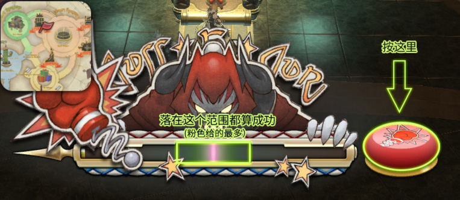
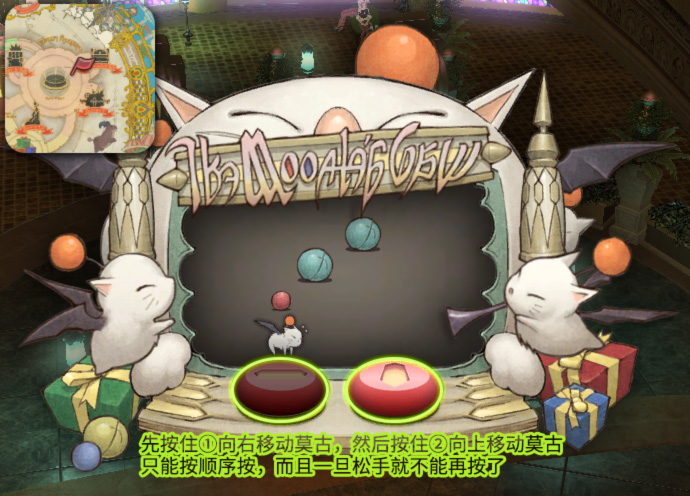
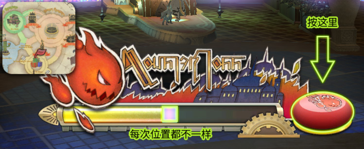
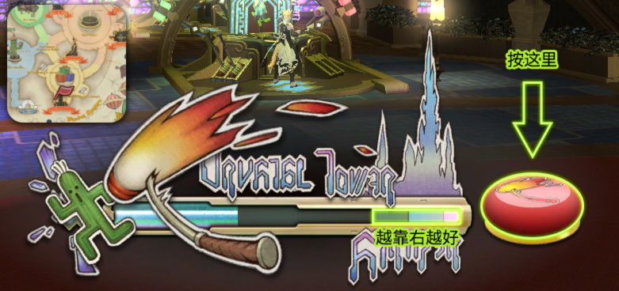
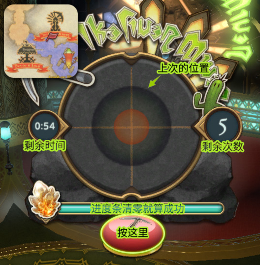
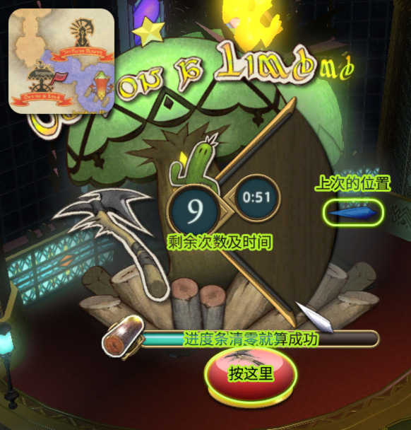
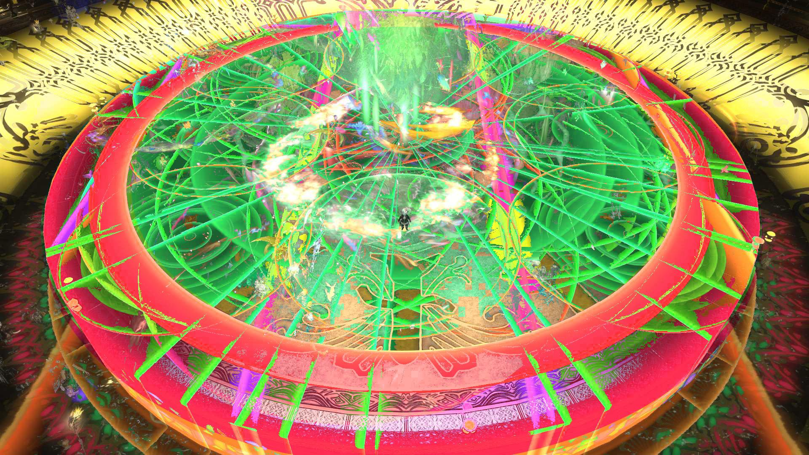
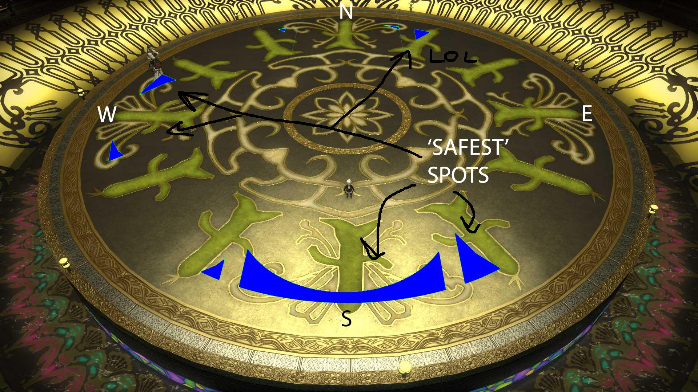
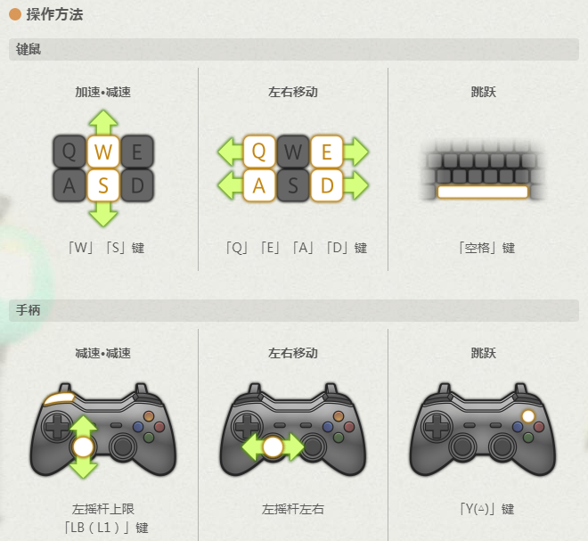
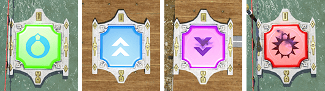

# 金碟游乐场

当玩家15级后(如果你不是沙都出生的，那么当你抵达这里时就应该已经满足等级要求了)，在乌尔达哈接任务<quest name="前往游乐场" type="plus" />，就可以从乌尔达哈坐飞艇来到金碟游乐场了！

虽然接下来的任务<quest name="金碟欢迎您" type="plus" />有为玩家详细介绍金碟游乐场的各个设施和玩法…但是如果各位迷糊的冒险者有好好看并且记住的话，也不用来看指南了，所以这里还是要再啰嗦一下。

;;;.guide .cols2
;;;.guide .col

;;;

;;;.guide .col .grow

简单来说，金碟游乐场就是通过各种各样小游戏获得特殊代币——**金碟币**，然后使用金碟币兑换各种外观、坐骑的地方。

金碟游乐场有专用的特殊道具<item name="金碟优待券" />，可以让你参与活动获得的金碟币+15%(回收幻卡无效)，这个道具可以通过[冒险者分队](/advanced/grandCompany.md#冒险者分队)的特殊任务获得。

具体的金碟币获取规划和优待券使用策略，请移步[货币兑换指南金碟币章节](https://bbs.nga.cn/read.php?tid=15299927)查阅，这里我就不多赘述了。

金碟币主要用于购买坐骑、宠物、服装、乐谱、家具，所有这些都可以在入口广场的综合柜台周围的NPC看到。具体兑换列表及价格可以同样在[货币兑换指南金碟币章节](https://bbs.nga.cn/read.php?tid=15299927))或[灰机wiki](https://ff14.huijiwiki.com/wiki/%E9%87%91%E7%A2%9F%E6%B8%B8%E4%B9%90%E5%9C%BA#.E7.BA.AA.E5.BF.B5.E5.93.81)查询。
;;;
;;;

## 小游戏

金碟游乐场的小游戏散布在奇妙广场、演出广场和二楼走廊（地图上黑色带红色缎带的地方就是），基本上都是眼神杀类型的游戏，看好时机一锤定音。所有小游戏都需要1金碟币的费用（很像街机了）。另外玩家可以在综合柜台用金碟币购买==强袭水晶塔==、==怪物投篮==和==重击加美什==的家具，带回家摆在家里，就可以在家玩这些小游戏了！
### 重击加美什 

在演出广场西北角。在蓄力条接近中央的地方，按下右侧的红色按钮即可出拳，越接近中央获得的金碟币越多(最多25金碟币)。

如果迟迟不挥拳的话，蓄力条的移动速度会越来越慢。

### 莫古抓球机

演出广场东北角。跟娃娃机一样操作，先按住向右移动莫古力爪子，松开后再按它右边的按钮向上移动。大球10金碟币，小球25金碟币。只要蘑菇肚子碰到球基本就算成功(不会有娃娃机调爪子力度这种事拉！)

### 怪物投篮

奇妙广场北侧。类似投篮机，在进度条走到高亮(蓝色)区域按下按钮即可投中(得1分)，30s内投中5球以上就可以获得50金碟币。

### 强袭水晶塔

奇妙广场南侧。进度条走到最右侧的时候按下按钮(跟加美什那台非常接近了)，进度条越靠右，获得的金碟币越多。

如果迟迟不砸的话，蓄力条的移动速度会越来越慢。

### 矿脉探索

二楼北侧(可以小水晶传送宠物广场，或综合广场西侧坐电梯上二楼)。据说是1.0真实矿工采集系统的重现。首先需要选择难度，然后会出现一个像是雷达一样的盘，和一个不断缩放的红圈，如果玩家按下按钮时，红圈的大小与“正确尺寸”接近，那么雷达下方的进度条就会减少一部分。雷达上会留下上次按钮时红圈尺寸的记录，当进度条为0时，就算挑战成功。

可以多次挑战(奖励也会增长)，但如果挑战失败，将无法获得之前积累的奖励。

因为难度很高，所以目前还没有人知道这个最多能获得多少金碟币(有记载的是中级成功3次给360)

### 孤树无缘

二楼北侧(可以小水晶传送宠物广场，或综合广场西侧坐电梯上二楼)。据说是1.0真实园艺采集系统的重现。首先需要选择难度，然后会出现一个扇形的木盘，和一个不断上下移动的游标，如果玩家按下按钮时，游标的位置与“正确位置”接近，那么木盘下方的进度条就会减少一部分。木盘上会留下上次按钮时游标位置的记录，当进度条为0时，就算挑战成功。

总计1分钟时间里，可以多次挑战(奖励也会增长)，但如果挑战失败，将无法获得之前积累的奖励。

| | | | | |
| ----- | ----- | ----- | ----- | ----- | ----- | ---- |
|  初级  |  50  |  100  |  150  |  400  |  500  |  600  |
|  中级  |  60  |  125  |  185  |  500  |  625  |  750  |
|  高级  |  85  |  175  |  260  |  700  |  875  |  1050  |

## 机遇临门
每小时整点、20分、40分出现的限时任务，在时限内参加挑战并成功的话，就可以获得大量金碟币。当前没有活动时，可以找场地内的“活动解说员”咨询接下来的活动，并可以免费传送到任务起始地点。

| | | |
| ----- | ----- | ----- |
|  整点  |  20分  |  40分  |
|  小雏鸟的营救者 空军装甲驾驶员 王像跳跳乐大挑战  |  喷风中的幸存者 必中一闪快刀斩魔 王像跳跳乐大挑战  |  喷风中的幸存者 必中一闪快刀斩魔 王像跳跳乐大挑战  |

### 小雏鸟的营救者
在圆形广场科瑞尔山，或者奇妙广场巨人柱上方举办，算是简易版的跳跳乐。一条路线走到头就是终点，唯一要注意的是沿途掉落的炸弹，如果在波及范围里就会被炸飞。因为时间肯定是非常充分的，所以不要着急，遇到炸弹冷静躲开，就很容易完成。如果不慎跌落，只要活动时间没结束，就可以找起始NPC再来一圈。报酬2000金碟币。
::: collapse 小技巧提示
科瑞尔山的营救中，推荐贴着山体内侧走，这样就算被炸弹炸了， 也不会被弹下山。跨过接近山顶的最后一块木板(如果你离山崖够近，直接走过去也可以)，就可以直接左转90度跳上顶台，不用再绕最后半圈。

奇妙广场的营救中，中途的台阶+空档的combo是很容易掉下去的，推荐从第一阶台阶去跳第三阶台阶，第二阶台阶直接跳第三阶或者从第二阶直接起跳都容易失误。接近终点的3连窄台阶，可以直接一个大跳(按住前进+空格)就能跨过第一阶直接落在第二阶上。如果控制不好跳跃的距离，可以转身退着跳(传统模式请同时按左右+后退+跳)，在那边如果有炸弹，位置合适的话，可以让一个炸弹直接给你弹到终点(忍者缩地也好使)。
:::

### 空军装甲驾驶员

起点在圆形广场，和跳跳乐一样类似于单人副本(玩这个不能排其他副本)，进入游戏后会驾驶小飞机，沿既定路线飞行，在飞行过程中，周围会出现金银铜的靶子和红黑色的爆弹怪靶子，玩家需要用鼠标点击靶子的位置发射子弹，射中金银铜靶子会获得300/100/50分，而射中爆弹怪靶子的话则会扣分。飞行结束后统计获得的分数，并根据分数发放金碟币。

|  分数  |  报酬  |
| ----- | ----- |
|  PERFECT (5000)  |  金碟币×4000  |
|  S (4000～4999)  |  金碟币×3000  |
|  A (1500～3999)  |  金碟币×1500  |
|  B(500～1499)  |  金碟币×500  |
|  C (0～499)  |  金碟币×100  |
::: collapse 小技巧提示
有些爆弹怪靶子会移动，保持冷静，这个小游戏没有弹道问题，只要鼠标靶心命中靶子即可得分。
:::

### 王像跳跳乐大挑战
在圆形广场举办，不过其实只是个入口，会传送到~~贝拉哈迪亚遗迹~~跳跳乐活动场，场地内一共有6个铜仙人刺，3个银仙人刺和1个金仙人刺，一边捡仙人刺一边前往终点。如果在时限内没有抵达终点，会给额外1分钟时间，如果在时限内“抵达过”终点(进入过终点范围圈)，时间结束后就会自动结算退出(点终点也可以手动退出，按U退出也可以)。成功抵达终点报酬为2000金碟币，未能成功抵达为100金碟币，另外金的仙人刺500金碟币，银的仙人刺300金碟币，铜的仙人刺100金碟币。如果能完整拿到所有仙人刺雕像并抵达终点，可获得4000金碟币。
::: collapse 小技巧提示
挑战这个活动推荐先在黄金港的望海楼和潮风亭练习一下，两个跳跳乐的设计思路是非常相似的，要区分大小跳，找空气墙。跳过黄金港之后再来挑战这个活动就会很简单了。

跳的时候推荐按ScrollLock把屏幕UI隐藏起来，这样视野会更好。衣服尽量选紧身衣，大袍子也是很挡视线的。

跳跳乐的场地大致会分成低中高三个高度，若干个模块，每次跳的地图都是从这些模块中排列组合而来的，所以每次跳的地图和仙人刺的配置都会有一定差异(跳的多了就发现换汤不换药)。因此出发之前建议先观察一下金仙人刺的位置，规划一下路线，其中王像右手前方的木板，可以开疾跑从王像右手食指位置起跳，另外肩膀上一些台子也可以通过疾跑+跳跃的方式抵达。

如果一开始觉得困难，不要气馁，多参加几次一定会取得长足进步。
:::

### 喷风中的幸存者
在演出广场举办，应该是金碟最受欢迎的机遇任务之一了。站在台上之后，NPC会为玩家附加“不许动”debuff，然后提丰老师会随机释放范围AOE，如果被AOE打到即告失败。老师一共会喷5次，一轮游会获得100金碟币，接下来依次是200、400、800、1600金碟币，如果5轮都没有被吹下台，就可以获得7500金碟币。
::: collapse 小技巧提示
老师的喷风有扇形、方形、随机圆形和场边几种。很早就有玩家统计并测绘过老师喷风的轨迹，叠加如下图：

~~Holy shit you're dead you're all dead. No matter where you stand, Typhon has an attack that can hit you.~~

不过去掉完全随机的扇形和大圈之后，就能找到相对安全的位置：

现在这三个位置上都能见到人山人海的冒险者，所以你跟着他们站基本上不会错(上台之后向后转就是图中的南场区域)，当然由于老师是很苛刻的，所以很有可能一个扇形，一堆人下去一半这种操作(总体来说喷风需要比较精准的站位)。[喷风分布(需科学上网)](https://imgur.com/a/rOFMR)
:::

### 必中一闪快刀斩魔
4.x版本新登场的保镖先生来到了金碟游乐场打工，有取代喷风成为新一代金碟游戏王的趋势。保镖会用刀将场地上的竹子切开，玩家需要根据刀痕判断竹子的倒向，只要不被竹子砸到就算过关。小游戏分为3轮5段：

|  阶段  |  内容  |
| ----- | ----- |
|  躲竹子1  |  依次出现1根、2根、2根竹子。通过的话给1000金碟币。  |
|  捡钱  |  地面上出现钱币，捡到一次给1000金碟币，如果捡钱的时候被大五郎（狗）撞飞则一分钱都得不到。  |
|  躲竹子2  |  2根、2根、3根、3根。通过给2000金碟币。  |
|  猜篮筐  |  场地上会出现3个竹篮，分别扣住金碟币、大五郎，经过一系列交换之后，玩家需要从个篮筐中选择一个（站在相应的区域），如果是大五郎则一分不得；如果是金币则获得金碟币翻倍。  |
|  躲竹子3  |  3根x2 + 4根x3。通过的话给2000金碟币。  |

如果全部完成的话，最高可以一口气拿到12000金碟币，向着最高的目标努力吧！

[参考视频](https://www.weibo.com/6461276308/IsQUKl9u2)

::: collapse 小技巧提示

保镖劈竹子会有3种模式：乱切（以竹子为中心的圆形），半劈（向两侧倒），侧斩（向一侧倒），整体来说在场地边缘会比较容易躲开。

捡钱阶段，可以通过观察大五郎头的方向确认它接下来要扑的方向，不过由于落地判定范围比较大，建议没有把握的人还是不要去捡。

猜篮筐阶段基本完全看运气，加~油~哦~

:::

### 火眼金睛的追踪者（已删除）
::: collapse 已删除小游戏
在奇妙广场举办，会有一名妖异猎人NPC，并散落5个可疑NPC，玩家需要挑选出和猎人一模一样的NPC，并向他投掷烟雾球。如果人太多看不清的话，可以右键NPC，选择检查，就可以进入检查界面。如果猜对的话可以获得2500金碟币。

主要的区别是在手套、鞋子、武器的纹章。另外脸部(发型)也会是比较重要的地方。如果是半裸的男性角色，肌肉量很有可能也是区别点(这就很难了…)另外5名可疑NPC的分布是随机的，不同玩家的正确答案的位置不一定相同。

**小技巧提示**

日本玩家发现NPC的的台词与正确答案的台词有着唯一对应的关系，也就是说，只要知道妖异猎人NPC的台词和性别，就可以知道正确答案的NPC的台词。
**女性NPC**
| | |
| -- | -- |
|  那个，金碟游乐场的人委托我找一只小魔精， 结果这只小魔精变成了我的样子逃跑了！  |  总感觉大家都在注视着我…… 哼哼，太美也是一种罪啊！  |
|  在这金碟游乐场混进了一只会换肤的小魔精， 最糟糕的是它变成了我的模样在附近徘徊！  |  这是怎么回事？总感觉有人在盯着我……  |
|  哎呀呀，这下糟糕了。 有只小魔精变成了我的样子在附近徘徊呢。  |  在这里总感觉时间过得很快， 你也这么觉得吧。  |
|  嗯……我有事想要拜托你啊…… 能不能在那些奇怪的冒险者当中， 找出外观与我一样的人？  |  都说这附近藏着一只喜欢捣乱的小魔精， 真的有么？  |
|  那个，我有件事想拜托你…… 其实，有只小魔精变成了我的样子藏在这游乐场里， 估计是想要捉弄别人搞恶作剧。  |  嗯！！今天要好好玩一玩！ 哼哼哼，谁也别想打搅我！  |
|  你听我说…… 有只捣乱的小魔精用换肤变成了我的样子！  |  哈哈哈哈哈！ 这地方太好玩了喵！  |
|  请问，你有没有在附近看到和我长得一样的人？ 有只小魔精变成了我的样子在附近徘徊才对， 找了很久都没找到，愁死了。  |  就算在金碟游乐场玩一整天都不会腻啊。 嗯，接下来去玩什么呢？  |
|  哇……怎么办啊…… 捣蛋的小魔精逃跑了…… 而且还是变成了我的样子逃跑的……  |  真没想到捣乱的小魔精潜入游乐场里了啊。 我难得玩得这么开心，可别扫了我的兴。  |
|  哎……捣乱的小魔精还真是让人伤脑筋呢…… 本以为能抓住它了，可没想到它却变成了我的样子逃跑了…… 我已经不行了……  |  总觉得自己被注视着喵。 ……是我的错觉吗喵？  |
|  啊……跟丢了…… 大姐姐/大哥哥可以的话请帮帮我吧！ 我正在找一只小魔精，它变成了我的样子。  |  虽然可能是我想太多了， 但总觉得大家都在盯着我啊……  |
|  该死！本来说捕获一只爱捣乱的小魔精， 结果却被它跑掉了，还变成了我的样子…… 真是狡猾的妖异！  |  真是个热闹的地方啊。 既然如此，就算有妖异混入了人群中，也没有人知道吧。  |
|  我刚要抓住小魔精的时候，它却突然变成了绝世美女…… 我仔细一看那位绝世美女，没想到竟然是我自己！ 看来小魔精是变成了我的样子！  |  总觉得我被人瞟了好几眼。 究竟是怎么回事……  |
|  我正在追捕溜进这里的小魔精…… 结果它却变成了我的样子逃跑了……  |  我总觉得有人在盯着我。 虽说我觉得自己并没有做什么引人注目的事吧。  |
|  我算是服了这捣乱的小魔精…… 它竟然变成了我的样子…… 你能不能帮我找出小魔精啊？  |  你、你也找我有事？！ 刚刚就好多莫名其妙的人过来跟我搭话，还盯着我的脸看…… 总觉得有点可怕……  |
|  总感觉大家在用奇怪的目光看我…… 好像是因为有只小魔精变成了我的样子在捣乱…… 能不能请你在它把事情弄大之前把它找出来？  |  有这么多好玩的娱乐设施， 究竟从哪个玩起呢，好纠结……  |

**男性NPC**
| | |
| -- | -- |
|  有一只小魔精混入了金碟游乐场之中。 它会使用一种叫做换肤的能力变身成人类。 这家伙似乎变成我的样子在到处恶作剧……  |  发生了什么…… 总感觉大家都在盯着我啊……  |
|  糟、糟糕了…… 捣乱的小魔精变成了我的样子在附近徘徊！  |  ……你老盯着我的脸看什么看？ 上面有什么吗？  |
|  我有一事相求， 有只小魔精好像变成了我的样子在附近徘徊……  |  哈哈，金碟游乐场还真是有趣。 ……不过，总感觉有人在盯着我。  |
|  我想要拜托你一件事啊！ 有只捣乱的小魔精变成了我的样子在附近逃窜， 我希望你能帮我把它找出来！  |  偶尔来这里休息休息也不错啊……  |
|  请问，你有没有在附近看到和我长得一样的人？ 我正在找一只小魔精， 你说它变谁不好，非要变成我逃跑！  |  是我的错觉么？怎么感觉大家都在看我。  |
|  你有没有看到过我啊？ 有只小魔精变成了我的样子在附近徘徊， 虽说是工作，但自己找自己实在感觉别扭。  |  哇哇！金碟游乐场…… 我只听过传闻，没想到这么赞…… 今天要玩个够！  |
|  啧啧，找不到啊…… 有只小魔精利用换肤变成了我的样子。  |  难道说……我的举止很奇怪？ 要注意不能被其他人看出来我是乡下来的才行……  |
|  ……变得麻烦了呢。 本来想抓住跑进这里的小魔精， 结果它却变成了我的样子逃跑了。  |  总感觉有人盯着我，好难受……  |
|  该死！可恶的小魔精！ 你要没事也帮我找找那只恶作剧的小魔精。 你说它变谁不好，非要变成我的样子逃跑。  |  这么豪华的地方我还是第一次看见。 真是太棒了。  |
|  我……长得有那么丑么…… 其实我在追一只小魔精，可它却变成了我的模样， 结果我被我的样子震撼到了，导致小魔精逃走了……  |  今天我要痛快地玩一场！ 不过从什么开始呢，真头疼。  |
|  该死！可恨的小魔精！ 竟然变成了我的样子胡搞瞎搞！ 请你帮我找出变成了我的样子的小魔精！  |  啊哈哈，太开心了，笑得停不下来了！  |
|  我在追捕小魔精的时候，它竟然变成了我的样子…… 结果我被英俊潇洒的自己迷得神魂颠倒， 不小心让小魔精跑掉了……  |  我说，你知道这是怎么一回事吗？ 总感觉自己在被各种各样的家伙盯着看……  |
|  拥有换肤能力的小魔精变成了我的样子在附近徘徊…… 要是它以我的样子做了坏事就不好了！ 能不能在它做坏事之前帮我找到它？  |  难道说，我很引人注目？ 大家终于发现我的魅力了啊！  |
|  捣乱的小魔精变成了我的样子在到处恶作剧…… 这里客人很多，我想抓它也抓不住…… 请你帮我找出那只小魔精好不好？  |  我感受到了奇怪的气息…… 难道有什么不是人类的东西混入了这里？  |
|  该死的小魔精，刚要抓住它的时候，它却变成了我的样子…… 结果我被那高大的身躯所吓倒……使得小魔精跑掉了…… 它应该还在附近才对，能不能帮我把它找出来？  |  好像有捣乱的小魔精混入了这里啊。 别担心，要是让我发现了我会把它收拾掉的！  |
|  你有没有看到过另一个我啊？ 好像有只小魔精变成了我的样子在附近徘徊…… 我想在它用我的样子做坏事之前抓住它！  |  嗯，这里就是金碟游乐场啊…… 跟我听说的一样，是个热闹又欢乐的地方。  |
|  不好了不好了！小魔精变成了我的样子跑掉了！ 如果它在这游乐场里瞎搞的话，我就要破产了！  |  你为什么一直盯着我看？ 难道说你知道我中了大奖？ 哼，别想从我这拿到一枚金碟币，求我也没用！  |
|  呜呜……果然人多的地方最可怕了…… 有小魔精变成我的样子逃到这附近来了。 不好意思，能不能麻烦你替我去找找它？  |  今天就忘记冒险的事，先玩个痛快吧。  |
|  喂，你啊，能不能帮我点忙？ 是这样的，有捣乱的小魔精潜伏在这附近。  |  捣乱的小魔精似乎就在这附近啊。 真是的，这妖异净给人找麻烦。  |
|  呜呜，为什么谁都不相信我说的话…… 你……你会相信我的对吧？ 有个小魔精变成了我的样子混入了游客中！  |  有好多人都在盯着我看…… 究竟发生了什么，我不记得我做过什么引人注目的事……  |
:::

## 每日/每周活动

金碟游乐场同样提供每日/每周活动，九宫幻卡大赛和萌宠大赛会在之后的部分介绍（基本是每周一次），另外每周的挑战笔记也会有金碟的挑战部分，会赠送大量金碟币，千万不要忘记做了。

### 仙人微彩
每天23点刷新，可以在综合柜台的仙人微彩发放员购买仙人微彩(刮刮乐)。基本玩法是刮开彩票上的3个数字(加上一开始给你的，一共是4个数)，然后选择一条直线，根据这条直线上的3个数字的和决定获得的金碟币数量。每次购买需要10金碟币，每天可以购买3次。

通常推荐使用微彩计算器：[Cactpot Solver](https://ff14-cactpot.wotax.net/)，另外也有大佬用phton写的[本地版计算器](https://bbs.nga.cn/read.php?tid=14587834)(可以了解计算器原理顺便看看源码……

### 仙人仙彩

在演出广场2楼，甚至有专门的传送点。每周六21点现场开奖(有开奖表演，推荐去围观)。这是数字型彩票，100金碟币向仙人仙彩发放员购买彩票，每张彩票上可以依次选择4个数字，每周可以购买3张。每次开奖后1小时(周六晚9~10点)有前期兑换奖励(有额外的金碟币加成)，在本周六开奖后，到下周六开奖前，都是兑奖期，无论是否中奖都记得去兑奖哦。
::: segment blue
奖券数字将以个位开始依次向左(高位)计算，比如大奖数字是1234，那么如果你购买的彩票是1230，则视为没有猜中（五等奖阳光普照），如果你购买的是7654，那么视为猜中1个数字，可以获得四等奖。若购买的是2334，则是猜中2个数字（三等奖），以此类推。
:::

### 时尚品鉴
在奇妙广场1层东侧举办，每周二16点公布主题，周五16点开始挑战。玩家需要穿着与指定主题相匹配的装备(若有幻化，则已幻化后的样子为准)参与评分，每周可评分5次。

只要参加就可以获得10000金碟币，而获得80分以上的评价则可以获得50000金碟币(每周限定获得一次)。由于暖暖每周都会更换主题，所以每周都会有不一样的正确答案，可以移步[小号攻略](https://bbs.nga.cn/read.php?tid=14561874)或[呜呜栗子大佬微博](https://weibo.com/wuwulizi)查看本周高分/满分答案。

累计获得300分/500分可以在旁边的时尚商店解锁春意系列服装的购买[套装外观预览](https://www.ffxivcollection.com/%E3%82%B9%E3%83%97%E3%83%AA%E3%83%B3%E3%82%B0%E3%82%B7%E3%83%A3%E3%83%84/)。

## 九宫幻卡
九宫幻卡是来自FF8的一种策略型卡牌游戏，基础规则是比较卡牌临边大小，若己方数字大于对方数字，则可以将对方的卡牌翻过来。
### 基本玩法
<UnderConstruction />

### 特殊规则
<UnderConstruction />

### 成长规划
解锁幻卡功能之后，首先去幻卡广场，把广场上的几位大哥都殴打到掉卡，其中最里面的幻卡王可使用攻略：[论殴打幻卡王的55种姿势](https://bbs.nga.cn/read.php?tid=15688531))、[新手5卡先手95%胜幻卡王拿巴哈姆特卡打法](https://bbs.nga.cn/read.php?tid=8462015))

把金碟游乐场广场几位大师的幻卡全拿到之后，要开始解锁卡组，由于卡组限制与获得的卡牌数量有关，因此玩家的第一个目标是集齐60张卡牌，解锁4张3星+1张5星的卡组许可：

把刷巴哈拿到的废卡全部卖掉，然后把青铜包开完，能刷副本掉的尽量刷副本(多余的卡牌记得拿来卖)

[幻卡列表](https://ff14.huijiwiki.com/wiki/%E4%B9%9D%E5%AE%AB%E5%B9%BB%E5%8D%A1%E5%8D%A1%E7%89%8C)中的一星和二星卡的掉率相对都是比较高的，还有像苔小妖这样的幻卡只能通过购买获得(就早点买下)，仅1~2星所有卡牌加起来就有88张，等解锁了60张卡牌就可以组高位卡组了。

通常来说和NPC对战的对战费(以及获胜给所给的金碟币)一定程度上反映了这个NPC的难度，常见的策略比如等地区流行规则切换为逆转时，用低星卡组翻盘，或者是打天选/混乱这种赌脸玩法。

## 陆行鸟竞赛
陆行鸟竞赛是一种传统赛车游戏，有固定赛道和道具系统。在前期是比较消耗时间和精力的玩法，但一旦你拥有了满星9代鸟，那赛鸟就变成了你的金碟币提款机，要多轻松有多轻松。

### 基本规则
初次造访金碟的玩家需要在陆行鸟广场(金碟2楼，可以小水晶传送陆行鸟广场，或入口广场西侧坐电梯上二楼)接任务<quest name="初为训练师" type="plus" />，去中森弯枝拿到陆行鸟出赛登记书并接任务回到金碟后，就可以在竞赛柜台登记出赛了。

登记时需要为自己的赛鸟取名，懒得取也可以点随机(…)

陆行鸟竞赛有2种主要比赛模式：竞速挑战和陆行鸟竞赛。

通常我们跑的都是陆行鸟竞赛：按`U`(任务搜索器)在金碟游乐场分类选择陆行鸟竞赛(不要选“仅限小队成员”)，然后随便选一个赛道就可以。

竞速挑战需要赛鸟具有一定羽力才会开放，只能从柜台参赛登记员处登记出赛，比赛中会有若干名标记为“敌人”的陆行鸟，只要战胜“敌人”就算挑战成功。初次挑战成功会获得金碟币奖励，挑战失败或多次挑战只会获得经验值。
::: collapse 竞速挑战基本信息
|  比赛  |  羽力  |  赛道  |  奖励(金碟币)  |
| -- | -- | -- | -- |
|  第1关：抢占内圈赛道  |  41  |  恬静小路  |  20000  |
|  第2关：躲避范围攻击  |  61  |  太阳海岸  |  21000  |
|  第3关：能力不是万能的  |  81  |  荒野大道  |  22000  |
|  第4关：沉重的竞赛(上)  |  101  |  恬静小路  |  23000  |
|  第5关：站住别跑  |  121  |  太阳海岸  |  24000  |
|  第6关：打击竞争对手  |  141  |  荒野大道  |  25000  |
|  第7关：梦幻的结界  |  161  |  太阳海岸  |  26000  |
|  第8关：鹬蚌相争渔翁得利  |  181  |  恬静小路  |  27000  |
|  第9关：体力之战  |  201  |  荒野大道  |  28000  |
|  第10关：逃亡者和追赶者  |  221  |  太阳海岸  |  29000  |
|  第11关：全速冲刺  |  231  |  荒野大道  |  30000  |
|  第12关：活用竞赛能力  |  241  |  恬静小路  |  35000  |
|  第13关：突破对手的协作  |  251  |  荒野大道  |  40000  |
|  第14关：沉重的竞赛(下)  |  261  |  太阳海岸  |  45000  |
|  第15关：究极陆行鸟竞赛  |  271  |  恬静小路  |  50000  |
:::

;;;.guide .cols2
;;;.guide .col

;;;

;;;.guide .col .grow

赛鸟按`前进`是加速，`后退`是减速，`左右`键是左右移动(赛道)，`空格`(手柄`Y`)是跳跃。界面下方（原本显示玩家血量、蓝量和技力的地方）变为鸟的体力，鸟在奔跑时，体力会逐渐下降，加速超过一定速度后，会显示“超速”，超速时，体力下降速度会加快。就算不按减速，鸟也会自己慢慢减速。

由于赛鸟是赛道制，因此可以有堵人等操作，在同一赛道是不能超车的，只会顶牛。

;;;
;;;

;;;.guide .cols2
;;;.guide .col

;;;

;;;.guide .col .grow

赛鸟场地中会放有魔法踏板，分别是回复体力，加速，减速

;;;
;;;

另外赛道上还有宝箱，宝箱有2种，里面会出现随机的道具

|  道具名称  |  效果  |
| --------- | ------ |
|  陆行鸟恢复药  |  恢复自身最大体力的10%。  |
|  体力之药  |  10秒内不会消耗体力。并且体力为0时会恢复少许。  |
|  陆行鸟跑鞋  |  使陆行鸟全力奔跑。  |
|  陆行鸟以太药  |  将一个已使用的能力恢复成可再次使用状态。  |
|  酒神之水  |  使跑在自己前面的竞赛陆行鸟陷入失控状态。  |
|  重力球  |  使跑在自己前面的竞赛陆行鸟陷入加重状态。  |
|  荆棘种子  |  在自身周围生成结界，消耗其他进入范围的竞赛陆行鸟的体力。  |
|  英雄药  |  使自己的竞赛陆行鸟能力上升15秒，并让所有弱化效果无效。  |
|  陆行鸟陨石  |  向跑在自己前面的所有竞赛陆行鸟降下陆行鸟陨石。  |
|  体力互换  |  从跑在自己前面的竞赛陆行鸟中随机选择一只与自己的竞赛陆行鸟互换现有的体力。对体力比自己低的竞赛陆行鸟无效。  |
|  蜘蛛丝  |  使跑在自己后面的竞赛陆行鸟陷入不可使用道具的状态。  |

### 赛鸟属性
赛鸟的基本属性在==角色-金碟游乐场-陆行鸟==查看。其中**羽力**指的是赛鸟的综合水平，类似于战斗职业的装等x等级，赛鸟参加比赛的级别是由羽力确定的，升级或者提升各个属性都可以提升羽力值。

| | |
|-|-|
|  最高速度  |  赛鸟能跑出的最高速度。  |
|  加速力  |  在更短时间里达到最高速度。  |
|  体力  |  增加可消耗的体力最大值。  |
|  持久力  |  体力下降的速度。  |
|  适应力  |  受地形、转弯等情况的减速程度，适应力越高，减的越少。  |

在柜台用品商购买陆行鸟饲料(也可以用生产职业自己做)，然后找训鸟师训练，就可以提升赛鸟的各个属性。属性上限和每次训练提升的属性值，是根据鸟的血统、代数和饲料等级决定的。一般来说中间代际的鸟用金币购买的1级饲料就可以，而最终成型的顶配鸟则需要金碟币购买的3级饲料喂养。

推荐优先提升最高速度、体力和持久力。

竞赛能力则是指的赛鸟的技能/被动，每只鸟可以持有2个能力，先天性和后天性。当陆行鸟10级的时候如果还没有后天能力，就会自动学会一个，先天能力是从父母遗传来的(随机一个)，后天能力可以使用教材学(在柜台旁边的用品商购买)，另外后天能力也可以通过训鸟师学习/遗忘。
::: collapse 常用能力
练级期间的鸟必备经验值提高能力，顶配鸟可以使用超级冲刺+体力消耗降低III，其他能力可以按各位喜好选择，都有它的用武之地。

上面提到的两个顶配能力需要参加竞速挑战才能获得。
:::
最后有利天气是指赛场天气对陆行鸟表现的影响，这个就看看就行了
。
### 配种

当玩家的第一只赛鸟达到40级后，陆行鸟广场就有任务<quest name="将希望托付于未来" type="plus" />，任务会带玩家到中森弯枝的牧场去给陆行鸟配种。

配种需要一公一母两只陆行鸟，如果你手上没有异性证书的话，可以从商人那购买一张(不能直接购买两张来配，最少是一张退役证书+一张配种证书)。

子鸟的属性是由亲鸟的父母决定的，也就是说，子鸟的属性是从自己的爷爷奶奶外公外婆四只鸟的属性中4选1获得的，而陆行鸟的代数最高是9代，因此9代鸟的属性来源于7代鸟的属性，以此类推。

而柜台卖的鸟证属性不稳定，售价又高，因此玩家通常选择用自家鸟 骨科 杂交，如果你的5代鸟有3~4个四星，那么它对应的7代鸟就很容易获得满星血统，满星鸟生出的必然是满星子代。如果你是跨代际杂交，比如1代鸟和4代鸟配种，那么生出来的会是2代鸟。

因此陆行鸟的培育基本上就是：练到40级，退役，配种，无限循环，争取在较低代际获得较高星等的鸟(高级鸟培育起来要累一点)。

## 萌宠之王

萌宠之王是策略型游戏，使用玩家的宠物进行对战。 但是这个游戏策划的不太好总之快冷宫了 ，通常配合挑战笔记成为周提款机。

### 基本玩法
<UnderConstruction />

## 多玛麻将
<UnderConstruction />

多玛麻将采用日麻规则，并且提供警示牌功能。

[多玛方城战有效的役](http://act.ff.sdo.com/project/190624goldsaucer/doman/index.html)