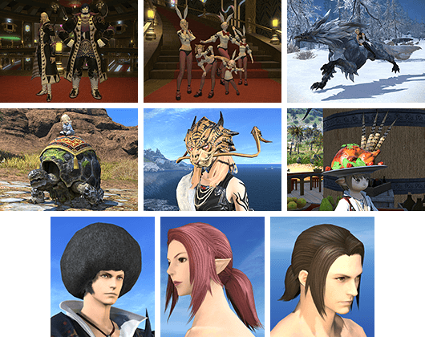

# 金碟游乐场

当玩家15级后(如果你不是沙都出生的，那么当你抵达这里时就应该已经满足等级要求了)，在乌尔达哈接任务<quest name="前往游乐场" type="plus" />，就可以从乌尔达哈坐飞艇来到金碟游乐场了！

虽然接下来的任务<quest name="金碟欢迎您" type="plus" />有为玩家详细介绍金碟游乐场的各个设施和玩法…但是如果各位迷糊的冒险者有好好看并且记住的话，也不用来看指南了，所以这里还是要再啰嗦一下。

;;;.guide .cols2
;;;.guide .col

;;;

;;;.guide .col .grow

简单来说，金碟游乐场就是通过各种各样小游戏获得特殊代币——**金碟币**，然后使用金碟币兑换各种外观、坐骑的地方。

金碟游乐场有专用的特殊道具<item name="金碟优待券" />，可以让你参与活动获得的金碟币+15%（挑战笔记和回收幻卡无效），这个道具可以通过[冒险者分队](/advanced/grandCompany.md#冒险者分队)的特殊任务获得。

金碟币主要用于购买坐骑、宠物、服装、乐谱、家具，所有这些都可以在入口广场的综合柜台周围的NPC看到。具体兑换列表及价格可以在[货币兑换指南金碟币章节](https://bbs.nga.cn/read.php?tid=15299927))或[灰机wiki](https://ff14.huijiwiki.com/wiki/%E9%87%91%E7%A2%9F%E6%B8%B8%E4%B9%90%E5%9C%BA#.E7.BA.AA.E5.BF.B5.E5.93.81)查询。
;;;
;;;

> 金碟游乐场活动一览
> - [机遇临门](/topic/gs-gate.md)
> - [迷你小游戏](/topic/gs-minigame.md)
> - [仙人彩](/topic/gs-cactpot.md)
> - [时尚品鉴](/topic/gs-fashion.md)
> - [九宫幻卡](/topic/triple-triad.md)
> - [陆行鸟竞赛](/topic/gs-race.md)
> - [多玛方城战](/topic/ga-mahjong.md)
> - [萌宠之王](/topic/gs-minion.md)

## 金碟币获取指南

只要参加金碟游乐场的活动就可以获得金碟币，但多少会有些效率差异。

金碟游乐场会不定期（通常是每年春夏季）举办嘉年华活动，在嘉年华活动中，所有金碟币获取量+50%，是不可多得的好机会。

### 休闲获取

每周的[挑战笔记](/topic/daily.md#挑战笔记（每周）)，[时尚品鉴](/topic/gs-fashion.md)都尽可能完成，项目简单收益也是最高的。

每周和每天的[仙人彩](/topic/gs-cactpot.md)也尽可能摸满，有对应的成就。

### 爆肝获取

首先尽量让部队打开金碟币获取提升的buff，另外可以准备好<item name="金碟优待券" />再去做金蝶项目（推荐覆盖周六晚上的仙人仙彩开奖）。在双buff加持下完成挑战笔记所有项目之后，可以留在金碟，用[陆行鸟竞赛](/topic/gs-race.md)/[迷你小游戏](/topic/gs-minigame.md)（小游戏中效率最高的是砍树）利用时间，然后积极参加每次的[机遇临门](/topic/gs-gate.md)活动。

### 获取途径说明

- 副本掉落的九宫幻卡可以在金碟游乐场柜台回收，如果需要收集幻卡的话，可以满世界打牌，然后把多余的牌拿来回收（只适合用来收集幻卡，挣金碟币的效率是很低的）。
- 赛鸟初期培育成本较高，但是如果获得满星毕业鸟之后，完全可以把赛鸟当做提款机，是所有同类活动中（可随时参加且没有限制）收益最高的。
- 九宫幻卡和萌宠大赛每周都会举办比赛，参与大赛并获得名次的话可以获得大量金碟币（但是有一定难度）。
- 多玛方城战本身没有金碟币，只有挑战笔记中的多玛方城战项目会给。

### 金碟以外获取金碟币

运营活动、萌新招待等等活动经常会送一些<item name="金碟币金卡" />或<item name="金碟币白金卡" />，另外参加[天书奇谈](/topic/daily.md天书奇谈（每周）)也有一定概率获得这两种道具。

[冒险者小队](/advanced/grandCompany.md)在某些吉兆下会带回来金碟币，属于额外的添头。