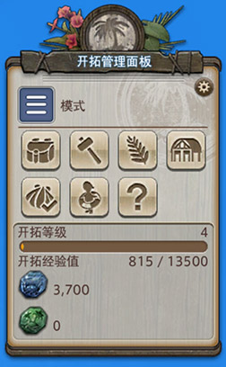
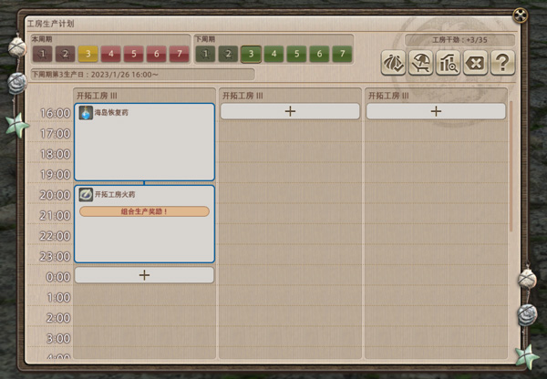
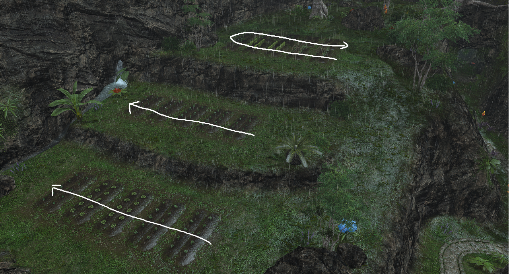

# 开拓无人岛
<FloatTOC />
;;;.guide .cols2
;;;.guide .col

无人岛坐骑
;;;

;;;.guide .col .grow

无人岛是6.0开启的特殊区域休闲经营玩法，玩家可以在无人岛区域采集素材、制作工具、捕捉动物、种植/养殖，并以此获得群岛内的代币。

无人岛代币可以用于兑换外观、坐骑、乐谱、魔晶石等。

;;;
;;;

::: collapse 无人岛专属物品产出一览

NOTE：没有生产、采集职业的玩家也可以在这里获得9、10型魔晶石，和之前仅能在天穹街获得的染剂。

| 名称 | 类型 | 获取方式 |
| -- | -- | -- |
| <item name="海岛蔓德拉" /> | 坐骑 | <item name="谢尔达莱青船币" />x 12000 |
| <item name="海岛洋葱王子" /> | 坐骑 | <item name="谢尔达莱青船币" />x 12000 |
| <item name="海岛茄子骑士" /> | 坐骑 | <item name="谢尔达莱青船币" />x 12000 |
| <item name="加隆德GL-II钥匙" /> | 坐骑 | <item name="谢尔达莱青船币" />x 24000 |
| <item name="海岛探险者" search/>装备 | 装备 | <item name="谢尔达莱青船币" />兑换（点击名称查看详情）  |
| <item name="管弦乐琴乐谱：冒险途中的小憩" /> | 乐谱 | <item name="谢尔达莱青船币" />x 4000 |
| <item name="管弦乐琴乐谱：丰饶之岛" /> | 乐谱 | <item name="谢尔达莱青船币" />x 4000 |
| <item name="发型样式：高马尾辫" /> | 发型 | <item name="谢尔达莱青船币" />x 6000 |
| <item name="发型样式：朴素单马尾" /> | 发型 | <item name="谢尔达莱青船币" />x 6000 |
| <item name="海岛开拓者装甲" /> |陆行鸟甲| <item name="谢尔达莱青船币" />x  |
| <item name="猫耳小小员" /> | 宠物 | <item name="谢尔达莱青船币" />x 4000 |
| <item name="蓝色仙子族之翼" /> | 时尚配饰 | <item name="谢尔达莱青船币" />x 4000 |
| <item name="椰汁" /> | 桌上家具 | <item name="谢尔达莱青船币" />x 1000 |
| <item name="农场麦秆床" /> | 家具 | <item name="谢尔达莱青船币" />x 1000 |
| <item name="陆行鸟饲养用具" /> | 庭具 | <item name="谢尔达莱青船币" />x 1000 |

:::

## 无人岛基本情报

完成主线任务<Quest name="晓月之终途" type="main" />之后，就可以在旧萨雷安的大繁荣商店的新人店员（ <Pos name="旧萨雷安" :x="11.9" :y="11.0" />）处接任务<Quest name="出发！前往无人岛！" type="plus" />解锁无人岛了。完成任务之后，都可以从巴尔丁（<Pos name="拉诺西亚低地" :x="24.9" :y="34.8" />）处对话进入自己的无人岛。

在无人岛上，玩家通过采集、制造提升开拓等级，并通过出售岛屿产品获得<item name="谢尔达莱青船币" />（下称“蓝币”）购买各种奖励，另外也可以出售材料获得<item name="谢尔达莱绿岛币" />购买素材等等。

在升级阶段玩家需要手动管理岛屿上的各项事务，随着开拓等级的提升，可以逐渐将各类事务托管给魔法人偶，只要每个礼拜上岛布置一下工作就可以坐享其成了。

**练级阶段切勿随意消费蓝币，岛屿的建设和魔法人偶都需要使用蓝币，等满级后再去购买想要的东西。**

;;;.guide .cols2
;;;.guide .col

开拓管理面板
;;;

;;;.guide .col .grow

玩家需要在这个界面上进行开拓管理，前期主要使用的是锤子图标的【开拓制作】，另外采集时也可以打开【开拓包】检查素材储备。

左上角的蓝色【模式】按钮可以在采集、捕兽、喂食、播种、浇水等模式间切换。

::: segment blue
刚上岛是一系列引导任务：
1. 采集指定素材，使用【开拓制作】制作开拓用石斧。
2. 采集指定素材，建设据点小岛木屋。
3. 开放耕地，切换模式【播种】、【浇水】。
4. 开放牧场，人偶送给玩家几个捕兽网，切换为【捕兽】模式，出据点去抓动物回来喂食。
5. 开放空地，采集指定素材【制作】开拓用石锤，然后在空地上建设【开拓工房I】（建设用的素材数量可以在管理面板的【管理开拓据点】上查到）。

完成引导任务之后，就需要玩家自己努力探索升级啦。
:::
;;;
;;;

### 升级指南

1. 建设完最初的工房后，找营地木屋门口的【监工小员】排上工作。根据当日剩余时间可以参考[这个帖子中【登岛首日如何安排】](https://bbs.nga.cn/read.php?tid=34810413)列出的产品清单。
  :连打是指重复清单上的产品，触发**组合生产奖励**（很重要）
2. 根据下面清单采集扩建、【开拓制作】所需的素材，到达对应等级后立刻制作、扩建解锁的工具和地块。
3. 有新地块立刻盖上新建筑，建筑可以升级时也立刻去升级，升级建设完成后要记得找门口的人偶验收，不验收是不给经验的。
3. 把牧场动物抓满，耕地田地种满；牧场需要每天收1次，耕地48小时收一次（托管不给经验，满级之前都需要手工收获）。
4. 耕地、牧场扩建后及时抓满动物、种满作物。（动物种类需要根据工房所需要的材料数量进行调整）
5. 9级完成所有建筑、农牧场升级，地标建设并验收后，会获得大量开拓经验并解锁<quest name="稀客？晚年的慢生活计划" />，完成任务后可以获得一套外观。

如果能保证做到以上几条并且努力采集的话，大约可以在1周内满级；如果觉得这样太累，也可以慢慢挖，坐享工房、农牧场产出经验，大约2~3周可以满级。

10级后可以解锁飞行功能。

::: collapse 各等级解锁内容及所需素材

| 等级 | 开拓制作的工具 | 据点建设、扩建 |
| -- | -- | -- |
| 3 | <b>开拓用石锤</b> 无人岛石材 x 3 无人岛原木 x 2 无人岛藤蔓 x 4 | <b>开拓工坊I</b>（2座） 无人岛原木 x 10 无人岛棕榈叶 x 10 无人岛石灰岩 x 10 无人岛藤蔓 x 5 无人岛砂砾 x 5 |
| 4 | <b>魔法人偶用开拓设备</b> 无人岛棕榈原木 x 10 无人岛藤蔓 x 10 无人岛铜矿 x 10 无人岛石灰岩 x 10  制作完<b>魔法人偶用开拓设备</b>后，可以在地标空地上建设地标了 地标所需材料根据玩家选择的地标种类会有所不同， 下面用另一个表格单独列出，也可以在 开拓管理面板的【管理开拓据点】功能中随时查看。 | <b>小岛木屋II</b> 无人岛棕榈原木 x 15 无人岛藤蔓 x 10 无人岛石灰岩 x 10 无人岛棕榈叶 x 5 无人岛铜矿 x 5  建造并验收完小岛木屋II后，就可以扩建耕地和牧场了 扩建需要1000蓝币2小时。 |
| 5 | <b>开拓用铁铲</b> 无人岛原木 x 3 无人岛藤蔓 x 3 无人岛铜矿 x 4  制作完开拓用铁铲才能采集到下面所需的材料  <b>真厉害级魔法人偶用开拓设备</b> 无人岛黏土 x 10 无人岛锡砂 x 10 无人岛棕榈原木 x 10 无人岛铜矿 x 10 无人岛石灰岩 x 10 | 制作完<b>真厉害级魔法人偶用开拓设备</b>后， 可以消耗1000蓝币扩建据点，扩建完成后就可以建造 屯货仓库I（2座）和新的地标了  <b>屯货仓库I</b> 无人岛棕榈原木 x 10 无人岛原木 x 10 无人岛黏土 x 10 无人岛铜矿 x 10 无人岛藤蔓 x 5 |
| 6 | <b>开拓用铜镰</b> 无人岛原木 x 3 无人岛黏土 x 3 无人岛铜矿 x 4  制作完开拓用铜镰才能采集到下面所需的材料  <b>捕兽绳</b> 无人岛麻 x 3 无人岛铜矿 x 1  捕兽绳是用于捕捉中型动物的消耗品。 | 可以升级开拓工房和屯货仓库了， 但部分材料需要制作完开拓用铜镰才能采集到  <b>开拓工房II</b> 无人岛原木 x 15 无人岛石灰岩 x 15 无人岛麻 x 10 无人岛黏土 x 5 无人岛铜矿 x 5  <b>屯货仓库II</b> 无人岛棕榈原木 x 15 无人岛原木 x 15 无人岛麻 x 10 无人岛黏土 x 5 无人岛锡砂 x 5 |
| 7 | <b>开拓用青铜鱼叉</b> 无人岛原木 x 3 无人岛铜矿 x 3 无人岛锡砂 x 3 无人岛麻 x 3  <b>十分厉害级魔法人偶用开拓设备</b> 无人岛棉花 x 10 无人岛麻 x 10 无人岛黏土 x 10 无人岛锡砂 x 10 无人岛原木 x 10  制作完<b>十分厉害级魔法人偶用开拓设备</b>后，可以 消耗1500蓝币扩建据点，扩建后可以建造第三座开拓工房和新的地标 | <b>小岛木屋III</b> 无人岛原木 x 15 无人岛石灰岩 x 10 无人岛棉花 x 10 无人岛麻 x 10 无人岛黏土 x 5  建造并验收完小岛木屋III之后，就可以扩建耕地和牧场了， 扩建需要消耗1500蓝币5小时。扩建后就可以制作设备进行托管了 （满级之前不推荐托管，托管不给经验） <b>魔法人偶耕种设备</b> 无人岛棕榈原木 x 6 无人岛铜矿 x 6 无人岛锡砂 x 6 无人岛麻 x 6 <b>魔法人偶饲养设备</b> 无人岛原木 x 6 无人岛铜矿 x 6 无人岛锡砂 x 6 无人岛棕榈叶 x 6 |
| 8 | <b>开拓用鹤嘴锄</b> 无人岛原木 x 3 无人岛铜矿 x 4 无人岛锡砂 x 4 无人岛棉花 x 3  <b>捕兽用睡眠球</b> 无人岛球藻 x 2 无人岛树液 x 1 无人岛水母 x 2  | 可以升级开拓工房和屯货仓库了， 但部分材料需要制作完开拓用鹤嘴锄才能采集到 另外还有部分材料需要通过远征获得  <b>开拓工房III</b>（3座） 无人岛铁矿 x 15 无人岛花岗岩 x 15 无人岛原木 x 10 无人岛麻 x 10 无人岛石榴石原石 x 3  <b>屯货仓库III</b>（2座） 无人岛原木 x 15 无人岛铁矿 x 15 无人岛花岗岩 x 10 无人岛黏土 x 10 无人岛云杉原木 x 3 |
| 9 | 扩建并验收完3级农牧场后，解锁非常厉害级魔法人偶用开拓设备 <b>非常厉害级魔法人偶用开拓装备</b> 无人岛铁矿 x 10 无人岛石英 x 10 无人岛花岗岩 x 10 无人岛麻 x 10 无人岛黏土 x 10 | 完成非常厉害级魔法人偶用开拓装备后， 可以消耗3000蓝币开拓据点，建设最后一块地标了。 |

:::

## 据点

据点是主要的功能建筑所在地，有以下建筑及功能：
* <b>小岛木屋</b>：可以在屋里切换岛屿的BGM。另外==收购小员==可以将多余的岛屿素材兑换为蓝币或绿币；==贸易小员==可以使用蓝币、绿币购买各种道具。
* <b>开拓工房</b>：最主要的生产基地，完成建设后和据点门口的==监工小员==对话，可以进行生产安排。安排方式参见下面的介绍。
* <b>屯货仓库</b>：可以派遣魔法人偶进行远征探索，一共有5个目的地，每个目的地会提供若干普通素材和1种稀少开拓素材。完成屯货仓库后和据点门口的==采集小员==对话，可以安排远征。最初的远征需要安排前往【森林】和【溪流】，带回用于升级开拓工房和屯货仓库所需的石榴石和原木，之后的远征需要根据工房的排班以及工期进行规划。
  * 屯货仓库不能带回玩家从未采集过的材料，仓库升级可以带回更多材料。
* <b>地标</b>：可以提升工房的干劲上限（干劲的解释参见下面的介绍），地标建设的建筑类型不影响效果。另外每块地标只有第一次建设提供经验，之后只需要提供相应的材料，就可以随意切换为其他类型的地标建筑。

::: collapse 地标列表及所需材料

**地标建完务必记得验收（和门口的小人对话）**

|风车 4级解锁，建造需要11~12h|树屋 4级解锁，建造需要11~12h|
| -- | -- | 
|无人岛原木x15 无人岛石灰岩x15 无人岛棕榈原木x10 无人岛藤蔓x5 无人岛铜矿x5 | 无人岛棕榈原木x10 无人岛原木x15 无人岛石灰岩x10 无人岛草叶x5 无人岛藤蔓x5|

|温泉小屋 5级解锁，建造需要11~12h|灯塔 9级解锁，建造需要11~12h|
| -- | -- | 
|无人岛原木x15 无人岛石灰岩x15 无人岛黏土x10 无人岛棕榈叶x10 无人岛双壳贝x3|无人岛花岗岩x20 无人岛麻x10 无人岛原木x10 无人岛黏土x10 无人岛银矿x3|

岛屿9级，并且验收完全部据点建筑之后，会解锁獭獭喷泉修建许可。需要使用<item name="獭獭喷泉建造用部件" />x2、<item name="獭獭喷泉建造用金属材料" />x2、<item name="獭獭喷泉建造用合成树脂" />x2在小岛木屋的==贸易小员==处兑换<item name="獭獭喷泉建造许可证书" />，持有许可证书之后，就可以将任意一处地标换为獭獭喷泉了。

兑换证书所需的材料为生产职业制作，属于高难度配方，也可以直接从市场交易板上购买成品。

- 獭獭喷泉所需材料： 
无人岛花岗岩 x 15
无人岛石灰岩 x 15
无人岛黏土 x 10
无人岛草叶 x 10
无人岛香荠 x 3

:::

## 采集

在管理面板中，将【模式】切换为收获模式，即可进行采集。初始玩家可以采集到的物品比较有限，随着开拓等级的提升，制作新的工具，就可以解锁并采集到更多的素材：

::: collapse 采集点名称与采集品、工具对应关系
| 采集点名称 | 徒手采集 | 工具采集 | 所需工具/工具解锁等级 |
| -- | -- | -- | -- |
| 啃食过的南瓜 | 海岛南瓜的种子 | 无 |
| 啃食过的甘蓝 | 海岛甘蓝的种子 | 无 |
| 大甘巴豆树 | 无人岛小树枝 | 无人岛原木 |
| 红木树 | 无人岛树液 | 无人岛原木 |
| 棕榈树 | 无人岛棕榈叶 | 无人岛棕榈原木 | 开拓用石斧 |
| 海岛苹果树 | 无人岛藤蔓 | 无人岛苹果 | 开拓用石斧 |
| 蓝色岩石 | 无人岛石材 | 无人岛铜矿 | 开拓用石斧 |
| 结晶岩石 | 无人岛石材 | 无人岛岩盐 | 开拓用石锤 |
| 白色光滑岩石 | 无人岛石材 | 无人岛石灰岩 | 开拓用石锤 |
| 河底细沙 | 无人岛砂砾 | 无人岛锡砂 | 开拓用石锤 |
| 土山 | 无人岛砂砾 | 无人岛黏土 | 开拓用石锤 |
| 熟透的高山萝卜 | 无人岛草叶 | 海岛高山萝卜的种子 | 开拓用铁铲 Lv5 |
| 熟透的新薯 | 无人岛草叶 | 海岛新薯芽块 | 开拓用铁铲 Lv5 |
| 棉花 | 无人岛草叶 | 无人岛棉花 | 开拓用铁铲 Lv5 |
| 剑麻 | 无人岛草叶 | 无人岛麻 | 开拓用铜镰 Lv6 |
| 甘蔗 | 无人岛藤蔓 | 无人岛甘蔗 | 开拓用铜镰 Lv6 |
| 珊瑚礁 | 无人岛珊瑚 | 无人岛水母 | 开拓用铜镰 Lv6 |
| 巨大海贝 | 无人岛双壳贝 |无人岛海水鱼 | 开拓用青铜鱼叉 Lv7 |
| 茂密的海藻 | 无人岛球藻 | 无人岛乌贼 | 开拓用青铜鱼叉 Lv7 |
| 水晶块 | 无人岛石材 | 无人岛石英 | 开拓用青铜鱼叉 Lv7 |
| 深黑色岩石 | 无人岛石材 | 无人岛铁矿 | 开拓用鹤嘴锄Lv8 |
| 斑纹岩石 | 无人岛石材 | 无人岛花岗岩 | 开拓用鹤嘴锄Lv8 |
:::

采集点分布相对比较零散，推荐使用[素素无人岛采集地图](http://wrd.ffxiv.cn/#/map)查看素材位置。

部分素材需要潜水采集，如果你当时跑主线的时候改过键位的话，建议检查一下“下潜”的键位设置。

## 工房

工房是无人岛主要的经验、收入来源，也是后期全自动岛屿托管的主要目的。

;;;.guide .cols2
;;;.guide .col

工房生产计划
;;;

;;;.guide .col .grow

和监工小员对话就可以打开工房生产计划表，生产计划从每<i class="xiv local-time-chs"></i>周二16:00开始，7天一个周期。每天可生产24小时，每周需要休息2天，目前比较推荐的休息方式是休息周期的第1、2天（也就是每<i class="xiv local-time-chs"></i>周二16:00到<i class="xiv local-time-chs"></i>周三15:59），休息日可以通过面板右上方第二个按钮修改。

点击计划上的“+”，就可以从弹出的列表中选择想要制作的产品，如果连续两样产品不同，但具有相同的“产品分类”，那么就会触发“组合生产奖励！”，该奖励会让产量翻倍，同时干劲+1。因此保证每天的生产持续触发组合生产奖励非常重要。干劲和产品需求共同影响生产出的产品的实际售价。

在计划表或开拓管理面板上，都可以找到工房预计消耗的材料清单。如果材料不足，工房就会停工，切记。
;;;
;;; 

工房排好一间一天的班之后，可以右键第一件工作计划，选择==将生产计划保存为预设==，然后右键尚未排班的工房“+”，选择==使用预设生产计划==，可以快速复制排班表。

目前对工房系统收益的研究已经比较透彻，如果你只关心如何高效挣钱的话，参考以下2篇内容安排工房生产即可：

> * 未满级：[无人岛工房岛建阶段作业指南](https://bbs.nga.cn/read.php?tid=34810413)
> * 9级以上：[无人岛参考作业分享](https://docs.qq.com/doc/DTUNRZkJjTVhvT2Nv)

如果你想自己安排生产计划，可以点击计划面板右上方第三个按钮调查海岛产品需求：
* 最终售价 = 基础价 x 工坊等级系数 x 干劲系数 x 受欢迎度 x 当前市场需求

基础价可以在生产面板中找到，关于其他系数的具体数值和供需关系的预测，可以参考下面的文章：
> [浅析无人岛工坊售价影响因素与冲分路线安排](https://bbs.nga.cn/read.php?tid=33443333)

## 捕兽与养殖

无人岛中的动物主要用于每天提供牧场动物素材，给工房生产使用。捕捉动物需要先【制作】工具：<item name="捕兽网" />（小动物用）、<item name="捕兽绳" />（6级解锁，中型动物用）、<item name="捕兽用催眠球" />（8级解锁，大型动物用），然后将【模式】切换到捕兽，然后选择道具，就可以捕捉动物了。捕捉到的动物会自动传送到牧场，当超过牧场容量上限时，必须选择放生一只（目前在托管中的动物无法放生，6.3版本取消该设定）。

另外无人岛上的动物可以分为普通动物和稀有动物，普通动物随时可以抓，稀有动物只有在特定的时间和天气里才会出现。

> 动物清单、产出及时钟：
> * [素素动物时钟](http://wrd.ffxiv.cn/#/bell)
> * [鱼糕动物时钟](https://next.ffmomola.com/)

捕捉回来的的动物会饲养在据点的牧场中，可以自己给动物改名，每只动物每天固定产出一个基础素材，另外根据喂食的饲料种类提升心情之后，会有一定概率产出一个额外素材。

将【模式】切换到喂食，并选择饲料，就可以喂食饲料了。饲料同样需要自己【制作】。喂食可以增加心情和饱腹度。其中，低级饲料可以增加1档心情，最高增加到第3档。中级饲料可以增加2档心情，最高增加到第4档。高级饲料可以增加2档心情，最高增加到第5档。

无论当前饱腹度是多少，喂一次都会直接喂饱，已经饱了的动物无法继续喂食。每24小时喂一次就可以保证心情不掉了，因此原则上在每天固定时段喂食动物即可。

注意，不要想着“我先喂高级饲料涨心情，然后再用低级饲料维持”，高心情的情况下喂低级饲料会掉的。

早期没有材料制作饲料时，也可以选择不喂食，动物仍旧会每天产出。动物每天<i class="xiv local-time-chs"></i>16:00固定产出产物，收产出给经验，未满级时切勿托管。

抚摸动物没有任何效果。

## 种植

;;;.guide .cols2
;;;.guide .col

耕地编号顺序
;;;

;;;.guide .col .grow

在无人岛上种地，主要用于提供给工房生产，以及制作动物饲料。

最开始只能在岛上采集到南瓜种子与甘蓝种子。岛屿5级解锁并制作铲子后，可以在岛上挖到新薯种子和高山萝卜种子。解锁3级耕地之后，可以在门口的魔法人偶处购买其他种子。

在【模式】中切换为播种就可以给耕地播种，另外还可以切换到浇水模式浇水。耕地完全干涸后，作物会停止生长，另外无人岛下雨时，若岛主人在岛上，耕地湿润度会自动恢复满。作物在种子种下后48小时后的整点成熟，在耕地门口的NPC可以查看作物的生长情况和耕地的湿润程度。
;;;
;;; 

托管种植需要准备足够的种子，而且托管时不可更换种子类型。耕地收获时可以获得经验，未满级时切勿托管。

## 其他功能

::: collapse 关于托管

托管的价格为每块耕地每天5蓝币，每只动物每天10蓝币。在设置托管的瞬间就会扣费，之后每天的16:00扣费。同一天反复设置/取消托管不会重复扣费。

对于托管中的耕地，魔法人偶会浇水、收获、重新种上相同的作物。

对于托管中的动物，魔法人偶会用选择的饲料喂食、收获。

不过，魔法人偶只有在固定的判定点才会操作，这个判定点对于收获是开始托管的瞬间以及之后每个整点，对于其他操作是每天16:00。

托管会损失原本手动收获的经验。

当蓝币不足 or 种子或饲料耗尽 or 收获物累积到上限时会暂停托管。

建议岛屿升到满级并有一定蓝币积累之后开启托管功能。

:::

在开拓管理面板上选择==管理岛内宠物==，可以将自己持有的宠物放在岛上（没有任何实际用途）。