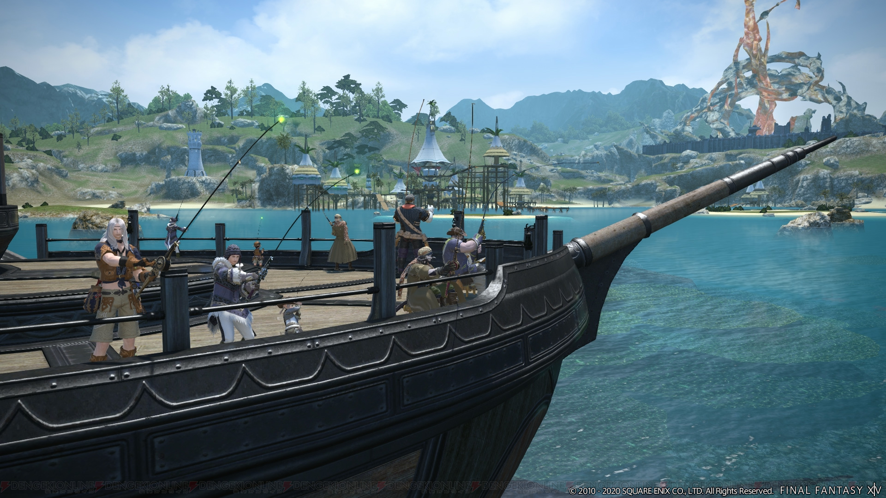
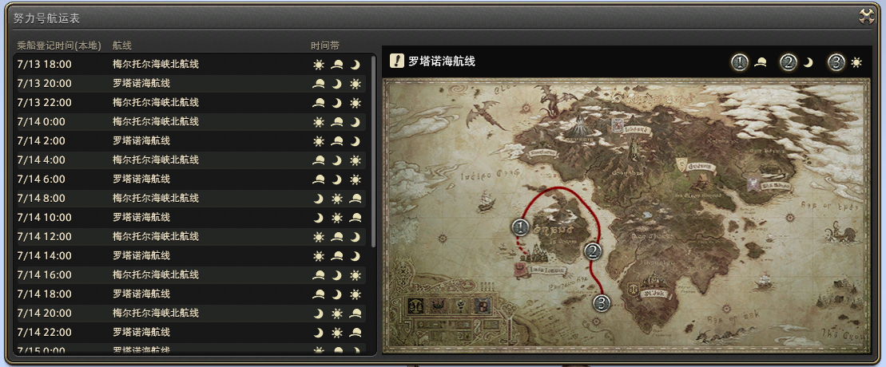
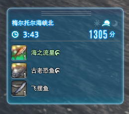
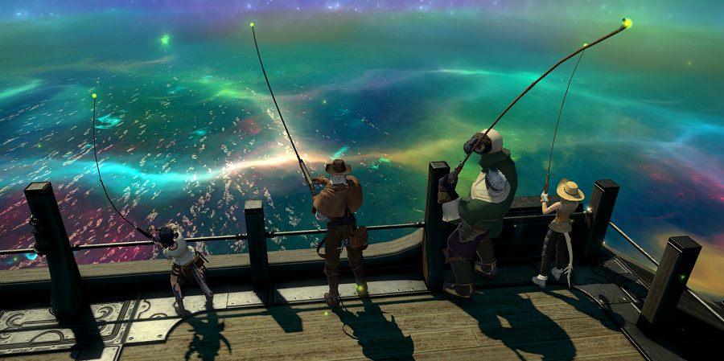
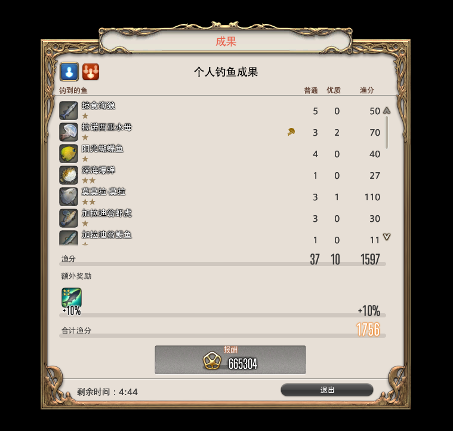
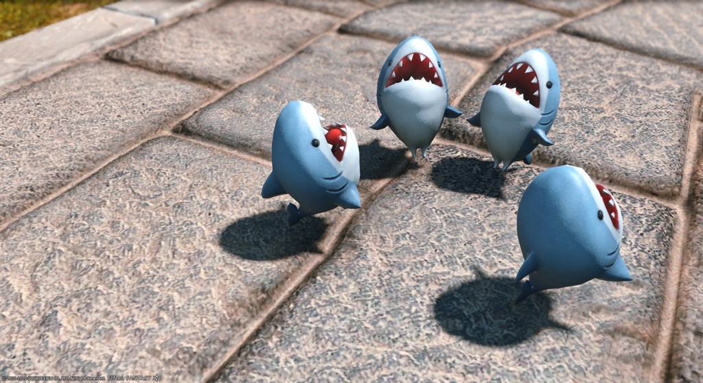
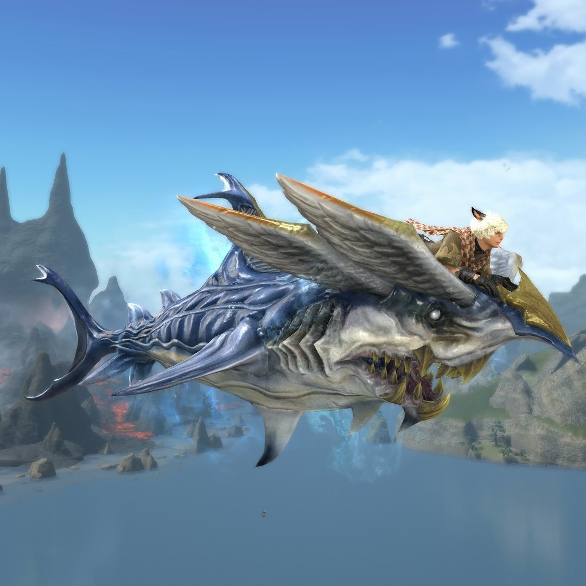

# 海钓手册
<FloatTOC />
众所周知，虽然名义上是大地使者，捕鱼人的整体系统长期游离于园艺工和采矿工之外，其独立而休闲的玩法吸引了大量咸鱼和肝帝为了鱼王鱼皇奋斗不休。

;;;.guide .cols2
;;;.guide .col

;;;

;;;.guide .col .grow

海钓是FF14版本5.2中为捕鱼人新增的副本内容，仅限捕鱼人参与。每两小时，玩家可以单人或组队报名搭乘捕鱼人行会运营的渔船“努力号”出海，一船最多能载24名渔夫一起出海钓鱼。

;;;
;;;

和捕鱼人的整体系统一样，海钓费时，带来的经济收益也不可观，对于不喜欢钓鱼的人，可能只是练个级刷点黄票的好去处。它的直接收益包括经验和黄票，达成一定的条件可以获得白票和各种成就奖励。

但对于热爱钓鱼的玩家们来说，能和渔友们一起组队出海钓鱼是一件非常有趣的事情。出海能够钓到全新的鱼类丰富图鉴，还可能遭遇幻海流，享受杆杆绿鱼的快乐，更有传说中的蓝鱼等你来钓。海钓中出现的绿鱼都不属于钓场之王。

## 海钓基础知识

### 开启海钓

开启海钓需要在捕鱼人行会完成捕鱼人1级职业任务<quest name="弱小的鱼与挑战者" />和开启任务<quest name="引人注目的出海垂钓" type="plus" />。

海钓没有等级限制。获得力和鉴别力对垂钓影响很小（双重提钩/三重提钩获得数和获得力有一定关系），但GP和部分技能，还有作为捕鱼人的态度和技术要领比较重要。

### 海钓理论

海钓需要准备全新鱼饵，码头旁商人有售，或者“努力号”船上也有售。除了海钓专用鱼饵<item name="石沙蚕" />、<item name="磷虾" />、<item name="刺螠" />，以及可以在任何地方使用的新手练级用拟饵<item name="万能拟饵" />。其他现存的海水鱼饵也可以用于海钓。

各种鱼类对各饵的喜好度不同，国际服优秀渔夫们通过分解找到了一种规律，即海钓鱼分解出的唯一非细沙产物——一种特定鱼饵就是它们的最适鱼饵（蓝鱼除外），该理论和数千份样本相对比的契合度都非常高。

海钓中的时间独立于实际艾欧泽亚时间，使用“白天”、“黄昏”、“夜晚”三个图标区分，每经过一个钓场时间都会向后推移一个。部分珍稀鱼类只在特定的时间上钩。

海钓中的天气是完全随机的，每一船每一个钓场都不一样。一共有6种天气：晴朗，阴云，薄雾，[==弱天气==：小雪/小雨/微风/扬沙]，[==强天气==：暴雪/暴雨/强风/热浪]，碧空。部分鱼类在某些天气不上钩或只在某些天气上钩，强天气可以屏蔽多种鱼。

幻海流中天气锁定为幻海流，幻海流后天气强制变为碧空（幻海触发鱼碧空不上钩，用来防止欧皇船一场触发2个幻海流）。

幻海流发生和消失时，已触发的捕鱼人之识会立刻消失，未触发的触发鱼计数也会清零。

### 报名出海

;;;.guide .cols2
;;;.guide .col

;;;

;;;.guide .col .grow

每地球时间2小时（北京时间0点起），位于<pos name="利姆萨·罗敏萨下层甲板" :x="3.0" :y="12.7" />码头的NPC会开始出海登记，登记开放15分钟，可以单排也可以最多8人组队(不能24人组排)，每凑满24人立刻发一班船。如果直到登记期结束都没有凑满24人，会让剩下的人全部登上最后一班船出发。

登船后若在中途退出（跳船），在下一次乘船登记前将无法再次登船。

;;;
;;;

另外建议清理一下背包，至少留出40格空间来装鱼，不推荐浪费时间放生。如果背包快满了，在转移钓场的30s内光速把鱼卖给船上NPC，建议将黄票清到1000以下以免溢出。

海钓一共有4个钓场四种路线，每条路线经过3个钓场，航线时间表可以在报名出海的NPC处随时确认，同时可以确认经过各钓场的“时间”。也可以使用[海钓航班表](http://fish.senriakane.com/ocean.html)或[鱼糕海钓工具](https://fish.ffmomola.com/#/oceanFishing)查询。

不知道怎么回事，如果你上次下船后还没钓过鱼，上船第一杆有可能警惕，尽管终点钓场和起点钓场不一样，推荐出海前先在码头抛一杆。

### 海钓流程

“努力号”在钓场抛锚后，会停留7分钟，其中最后半分钟是收杆准备时间，已经抛竿的渔夫可以等到把鱼钓上来，没有抛竿的渔夫则不能再抛竿了。

如果半分钟的收杆准备时间里你都没能把那条大鱼弄起来给放进包里，船开走了那就判定为没钓到。一般发生在倒数不到40s抛竿来了一杆30秒鱼王杆溜鱼10s拿到手上已经闪光了还没进包的时候船开走了。~~笔者因为这个原因失去了2条小利维亚桑~~

;;;.guide .cols2
;;;.guide .col

;;;
;;;.guide .col .grow

垂钓期间，钓上各种鱼类都会得分。得分和鱼本身尺寸无关，只HQ与否、稀有度和鱼本身有关。HQ获得双倍得分。未满级的渔夫钓上鱼时会基于鱼的稀有度和自身等级获得经验，经验非常丰富。(从1级到80级大约只需24趟海钓)

从专用UI上可以确认地点、剩余停留时间，“时间”、当前得分、最近钓果。点击钓果可以查看详细钓果。

;;;
;;;

## 通常海域

每个普通海域内有3种1星鱼，3种2星鱼，2种3星鱼，2种4星鱼，共10种，其中最后一条4星鱼需要捕鱼人之识状态才能钓起。图鉴全开会获得成就。

钓鱼最重要的技巧是见杆知鱼，即从鱼咬钩的时间和杆种（几个感叹号）立刻判断出咬钩的鱼可能是什么，要不要放竿或者双提，这需要大量的数据和经验基础。

**碧空和晴朗不是一个东西，不要搞混**

通常海域的渔场相关信息请查看[鱼糕海钓手册](https://fish.ffmomola.com/#/oceanFishing)。

## 幻海流

;;;.guide .cols2
;;;.guide .col

图片来自于[Aywren Sojourner](https://aywren.com/2020/03/02/ffxiv-ocean-fishing-guide/)

;;;

;;;.guide .col .grow

突然海面一声巨响，一道虹光直冲天际，天空仿佛极光闪耀，水中闪烁着七彩的光辉——

这就是传说中的幻海流！

当渔夫们在通常海域里钓起<item name="幻光巨齿鲨" />、<item name="幻光盘丽鱼" />、<item name="幻光海马" />、<item name="幻光鲈" />时，有一定概率会触发幻海流。

;;;
;;;

幻海流视为一个与普通海域不同的钓场，其中有5种低分4星鱼、4种对时间和鱼饵有高度选择性的高分4星鱼和1种传说中的蓝底5星鱼。5星鱼只有在捕鱼人之识状态中使用特别的鱼饵才能钓起。图鉴全开会获得成就。

在幻海流下，鱼类咬钩速度会变得非常快，大部分在5s左右，提钩速度也会变得非常快，无论哪种杆都不需要溜鱼。放杆和提起来的用时差不多，建议所有鱼都提。

**提醒一下老练渔夫，幻海流中不要习惯性坐下，因为每提一杆都会站起坐下，很浪费时间。更不要放生，一样的浪费时间。**

因为这些4星鱼的分值都远比普通海域内123星鱼类高且易钓，是一口气获得大量分数的好机会。

幻海流持续2分钟，冲鸭！

幻海流的渔场相关信息请查看[鱼糕海钓手册](https://fish.ffmomola.com/#/oceanFishing)。

在3片海域的航行中，有针对幻海流触发的补偿设计：
- 若这片海域没有触发幻海流，则下一片海域发生幻海流的概率会提高
- 若这片海域没有触发幻海流，则下一片海域的幻海流时间延长一分钟
- 若正处在幻海流中移动到下一片海域，本次航线上的下一次幻海流的时间会根据上一次丢失的时间等时长延长

## 奖励结算

在巡回3处钓场后，“努力号”会归港，此时进行得分结算。除了实打实通过钓鱼获得的分数以外，还会根据一些其他的因素，按百分比追加额外得分。

;;;.guide .cols2
;;;.guide .col

;;;
;;;.guide .col .grow

- 直接钓鱼获得2500分：+10%，如果达到5000分变为+20%
- 在幻海流中钓起15条鱼：10%，如果钓起了35条鱼变为+20%
- 钓上至少一条4星鱼：+10%
- 钓上至少一条5星鱼：+20%
- 小队合计在加拉迪翁湾外海/梅尔托尔海峡南/梅尔托尔海峡北/罗塔诺海海面（含幻海流）钓上10种鱼：+10%，可叠加（若小队人数不足8人，则会下调为7人→9种；6人以下→8种）。
- 小队合计钓上3条5星鱼：+50%~~真的有人能做到吗~~
- 由你触发至少一次幻海流：+10%
- 完成一个船上任务5%。2个任务10%。3个任务20%（船上任务是由船长发布的临时任务，要求为钓到某种鱼）
- 小队合计钓起150条各种章鱼：+20%，奖励成就与称号==八爪旅人==
- 小队合计钓起200条各种鲨鱼：+30%，奖励成就与称号==捕鲨人==
- 小队合计钓起150条各种水母：+20%，奖励成就与称号==水母狂魔==
- 小队合计钓起100条各种海马：+10%，奖励成就与称号==海龙骑士==
- 小队合计钓起250条各种鲀鱼：+30%，奖励成就与称号==小淘气==
- 小队合计钓起250条各种螃蟹：+30%，奖励成就与称号==横刀==
- 个人钓起25条各种鳐鱼：+20%，奖励成就与称号==鳐不可急==

;;;
;;;
最终的得分将影响你在海钓中获得的经验与白票（需要50级以上，完成<quest name="一流工匠的新工作" />收藏品开启任务）数量。经验基于等级结算，白票大约为得分除以15多一点点。

如果你在海钓中钓起过需要捕鱼人之识的鱼类且满级，还可获得相应的紫票奖励，奖励紫票的量尚未摸清规律。

;;;
;;;

;;;.guide .cols2
;;;.guide .col .figcap .grow

小鲨鱼，图片来自[Suu Suruga日记](https://jp.finalfantasyxiv.com/lodestone/character/24063790/blog/4360255/)

;;;
;;;.guide .col .figcap .grow

大鲨鱼，图片来自[FFXIV insta](https://www.instagram.com/p/B8ndYC-FcsT/?utm_source=ig_embed)
;;;
;;;

- 在一次海钓中获得5000分，奖励成就与宠物<item name="鲨鱼指挥官" />（宜家小鲨鱼）
- 在一次海钓中获得10000分，奖励成就与坐骑<item name="弓鲛角笛" />（大鲨鱼）
- 在一次海钓中获得16000分，奖励成就与称号==游钓大洋==
- 在一次海钓中获得20000分，奖励成就与称号==海王==
- 海钓累计获得100万分，奖励成就与宠物<item name="莫莫拉·莫拉！！！" />
- 海钓累计获得300万分，奖励成就与称号==世界级钓手==
- 在海钓中合计见到3次海鸥群，奖励成就与宠物<item name="海小鸥" />
- 在海钓中合计见到3次海豚群，奖励成就与宠物<item name="聪慧小海豚" />

还有一些累计得分的成就，没有特殊奖励。

## 冲击成就经验与技巧

获得力要求很低，鉴别力几乎没用，最重要的是GP要够。

食物建议吃<item name="胡椒炒新薯" hq />（GP+50）（<item name="炸蟹饼" hq />，<item name="亚考牛慕沙卡" hq />等等也可以），最多可以把GP堆到900+，囊中羞涩可以在海都美食商买<item name="小扁豆煮山栗" />，34<i class="xiv gil"></i>+20GP的廉价食物。

<item name="高级强心剂" />不需要屯，海钓给的黄票完全可以报销强心剂，全程卡CD用也就吃7个，另外建议准备一些<item name="轻型强心剂" hq/>，因为CD时间更短，可以灵活地安排。

清理背包，最好留40栏以上的空格，钓鱼的时候包满了非常爆炸。

提前做好功课，了解接下来的航线适合冲击什么目标，这条航线里的鱼的咬钩时间和鱼饵的选择，冲击成就和冲分的垂钓计划也是有冲突的。准备好各种小工具或计时宏。

最重要的是不要放弃，相信奇迹，放平心态，不断挑战。

### 怎样使用技能

海钓的重要技能有<action name="沙利亚克的恩宠" />、<action name="专一垂钓" />、<action name="耐心" />/<action name="耐心II" />、<action name="大鱼猎手" />、<action name="双重提钩" />/<action name="三重提钩" />。

::: segment blue
- <action name="沙利亚克的恩宠" />：消耗3档<Status :id="2778" name="捕鱼人之计" :stack="2"/>，恢复150GP。在GP就是正义的海钓里，沙利亚克的恩宠是极其重要的技能。
- <action name="专一垂钓" />：消耗350GP，下一杆必定同种鱼咬钩，不能连续使用。现在已经不能点掉专一提钩buff来实现连续使用了！ 
对幻海流触发鱼和直感鱼无效，但对幻海流内的绿鱼有效。价值大约是专一的鱼比其他鱼高出的分值。如果用于双提/三提可能价值更高。 
一般的使用方法是在幻海流中的稀有鱼高分咬钩时，使用连提再来一条。价值约150多分，和双提一起使用价值可达300-600分。 
极限可以使用4次，但是不如用专一+双提/三提的组合技。
- 耐心：海钓一般用<action name="耐心" />比较多，因为幻海流咬钩太快，提钩大量消耗GP，使用<action name="耐心II" />GP很难转过来。 
现在主要是在一般海域中用耐心来攒<Status :id="2778" name="捕鱼人之计"/>。
- <action name="大鱼猎手" />：消耗200GP，下一次钓上的鱼必是大尺寸的鱼。在以小钓大的机会出现时发动此技能，机会自动取消。 
用法很丰富，可以幻海里专一大鱼，也可以在平时用来攒<Status :id="2778" name="捕鱼人之计"/>。注意以小钓大的时候不能用。
- <action name="双重提钩" />/<action name="三重提钩" />：消耗400/700GP，本次提钩获得鱼数目变为2-4/3-7，具体多少视鱼本身和获得力而定，对幻海流触发鱼与和直感鱼无效。 
幻海里最值得狙击的鱼一定是本身分值在150分以上(当然大部分为200分上下)，双提4条/三提7条的鱼，我们把它称为“高价值鱼”，这种鱼往往会有容易分辨的咬钩时间区间+杆型。 
在需要特定杆型做任务/在普海快速积攒鱼计的时候，也可能会需要狙击这种双提三提可以获得更多数量的鱼。
:::

还有一些其他技能可以用：
- <action name="撒饵" />：<Status :id="2778" name="捕鱼人之计" :stack="9"/>也满了，GP也快满了的时候，就用一个聊胜于无。在幻海的时候则更优先使用<action name="大鱼猎手" />。
- <action name="以小钓大" />/<action name="以小钓大II" />/<action name="熟练渔技" />：冲分没什么用，可以用来补图鉴。
- <action name="拍击水面" />：补图鉴的时候可以用。

> 冲分/冲击成就指南
> - [鱼糕海钓工具](https://fish.ffmomola.com/#/oceanFishing)：有航线渔场的完整信息，但信息量过大，在船上现看会来不及。
> - [乘风破浪，海上之王——6.0海钓冲分攻略](https://bbs.nga.cn/read.php?tid=32005314)
> - [5.4海钓攻略总结大纲](https://ngabbs.com/read.php?tid=26626276)

:::segment grey

本文内容来自摩杜纳 月咏泠音，原文链接：[[苍海龙骑]海钓手册](https://bbs.nga.cn/read.php?tid=20553241)，部分内容有所调整。

:::