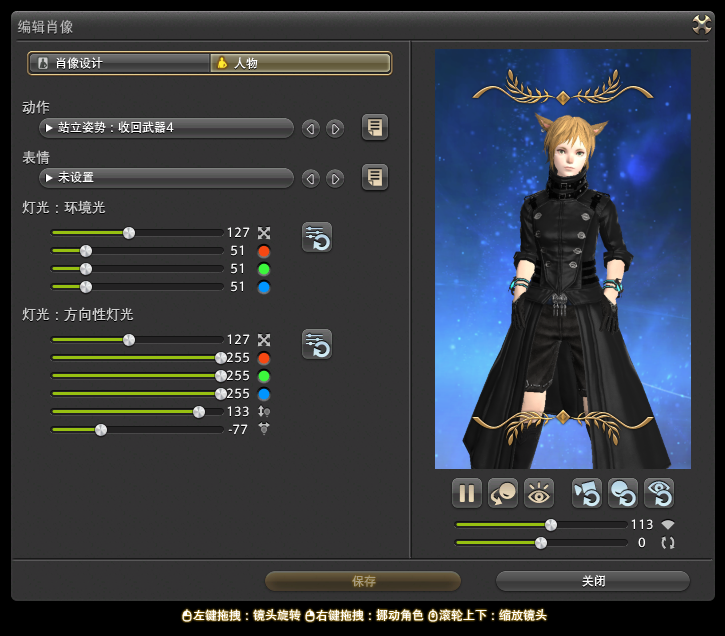

# 冒险者铭牌

菜单 > 角色 > 冒险者铭牌/肖像列表 中可以打开冒险者铭牌和肖像列表。

## 肖像

打开肖像列表后，可以看到自己的套装列表，每个套装对应一张肖像，如果套装装备发生变化，肖像会自动重置。

;;;.guide .cols2
;;;.guide .col

编辑肖像
;;;

;;;.guide .col .grow

选择套装后，点击肖像上方的“编辑”按钮，就可以进入编辑界面。编辑界面分为==肖像设计==和==人物==，和右侧的角色调整3个部分。

* 肖像设计：可以更改前景、边框、背景的图案；完成特定成就或在某些商店中可以购买到特殊的图案。
* 人物：可以修改角色的动作、表情和打光。在某些商店中可以购买到特殊的动作。
* 角色调整：可以通过点击、拖动右侧下方的按钮、滑块调整角色的视线，以及相机的缩放和旋转（在这个窗口中，鼠标滚轮也可以缩放，并且与相机缩放叠加）。

编辑调整好肖像后，需要点击肖像下方==动作暂停==按钮，才可以保存。

;;;
;;;

如果看不清编辑窗口的话，可以右键标题栏 > 缩放窗口，适当放大肖像窗口。

## 冒险者铭牌

冒险者铭牌有专用的铭牌肖像，和铭牌本身。打开冒险者铭牌后，铭牌旁弹出菜单窗口。

* ==编辑铭牌样式==：可以从下拉菜单中更改铭牌的各个部件的样式，完成特定成就或在某些商店中可以购买到特殊的样式图案。
* ==编辑个人信息==：展示在铭牌上的信息，包括职业、称号、游戏风格和游戏时间几个部分，可以随意填写。
* ==编辑个性签名==：展示在铭牌上的签名文本。
* ==设置可见范围==：可以设置是否让其他玩家看到你的铭牌。

编辑好铭牌后，别人可以随时右键你的名字查看你的铭牌（前提是对方满足你的可见范围设置）。

## 解锁更多铭牌、肖像装饰

* 完成各个职业的特定职业任务解锁对应职业简单版背景和装饰。
* 在狼狱停船厂可以使用<item name="战利水晶" />购买肖像教材，解锁对应的肖像装饰和PVP极限技动作。
* 参加[PVP](/topic/pvp.md)系列赛（通行证），到达指定系列赛等级可以获得对应肖像教材。
* 参加PVP[水晶冲突](/topic/crystallineconflict.md)段位赛，段位结算时可以获得对应的肖像背景和装饰。
* 完成[绝境战](/topic/raid.md)挑战可以获得对应肖像背景和装饰。
* 提高[友好部族](/topic/daily.md#友好部族 / 蛮族日常)声望后，在友好部族商店中购买。
* [无人岛](/topic/island.md)代币购买。
* 完成任务<quest name="犹如春夜一梦" type="plus" />（70级系列支线任务“四圣兽奇谭”）
* [希拉狄哈水道](/topic/subterrane.md)
* 学会乐器演奏（习得[诗人](/job/bard.md)职业后完成<quest name="演奏心中的旋律" type="plus" />任务）
<!--* 宠物对应肖像装饰-->