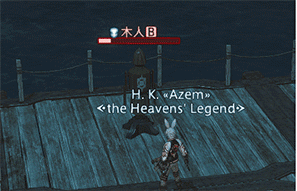
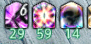
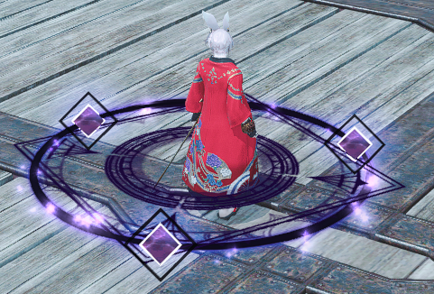

# PVP
<FloatTOC />
FF14中并不存在任何形式的野外PVP（Player vs Player，即玩家之间的对抗），它所有的PVP内容都要在拉诺西亚低地的狼狱停船场开启。

玩家30级之后，就可以在自己的大国防联军接任务<quest name="狱中斗狼" search type="plus" />开启PVP功能，接下来<quest name="法外纷争"  search type="plus" />开启战场，<quest name="双翼激战烈羽争锋" type="plus" />开启烈羽争锋。

在狼狱停船场有专门的PVP木桩和单挑用的训练场，可以用来熟悉PVP技能，了解最基本的PVP操作。

;;;.guide .cols2
;;;.guide .col

;;;

;;;.guide .col .grow

玩家所有的PVP信息，属性设置，技能信息，都要在==角色-对战资料==中编辑查看。

FF14的PVP属性与技能与PVE系统完全独立，就算是相同名字的技能，也有完全不同的效果和威力。

在PVP中，玩家的HP、MP、技能与等级、装备、任务完成情况等没有任何关系，而是根据职能/职业和不同模式进行设定的。

;;;
;;;

> 本页只介绍PVP共通信息，如果想要了解PVP场地的具体介绍，请参看以下文章：
> * [水晶冲突](crystallineconflict.md)：5v5竞技场模式，有排位。
> * [纷争前线](frontline.md)：24v24v24，共计72人的三方混战抢分占点战场。
> * [烈羽争锋](rivalwings.md)：24v24，共计48人的对抗推塔型战场。

## PVP 代币、积分奖励与段位

;;;.guide .cols3
;;;.guide .col .figcap


查看系列赛奖励入口
;;;
;;;.guide .col .figcap


星里路标-系列赛等级清单
;;;
;;;.guide .col .figcap


战利水晶兑换奖励（部分）
;;;
;;;

参与PVP对战活动可以获得专属代币**狼印战绩**和**系列赛经验**（系列赛经验将于6.1版本实装），其中系列赛经验每提升一级系列等级，即可以在星里路标中兑换相应的报酬，报酬获取情况可以通过“对战资料”-“查看系列赛奖励”查看。系列报酬中可以获得特殊代币**战利水晶**用于交换各类道具。

;;;.guide .cols2
;;;.guide .col .figcap


狼印战绩兑换外观
;;;
;;;.guide .col .figcap


PVP成就坐骑
;;;
;;;

狼印战绩可以交换的道具包括幻化装备、坐骑、宠物等，同时，参与水晶冲突并取得段位、排名名次的玩家可以获得每个赛季的对应相框奖励等。另外PVP也有自己的成就奖励。

## PVP战斗系统

在PVP中，有以下战斗系统上的区别：
* 咏唱魔法不会被打断
* 不会进行自动攻击
* 不会发生格挡、招架、暴击、直击
* 异常状态不会产生抗性

另外在战场中可以使用坐骑和返回，但其他pvp场地不可以（狼狱竞技场除外）。

## PVP属性与技能


PVP有自己的技能栏和技能，可以在角色-对战资料-特职技能中找到自己的PVP技能及共通技能：

;;;.guide .cols2
;;;.guide .col

;;;

;;;.guide .col 


部分职业存在如图所示的组合键位，<br>即一套连击循环被整合至同一键位

;;;
;;;

;;;.guide .cols2
;;;.guide .col .figcap
   

   

;;;

;;;.guide .col .grow 

PVP中每个人都有自己独立的极限技槽，6.1版本开始，极限技随时间填充，不同职业拥有不同的填充时间。

每个职业的极限技都有自己独立的效果，可以在战斗资料中进行确认！

带有剑杖图标的即为极限技
;;;
;;;

请确保在进入战场之前，你看过或者了解自己职业的技能，如果你想更好的参与PVP，那么理解对手的技能也是重要的一环，受制于篇幅限制，我们无法详细的介绍每一个职业的技能，在此只对共通技能做出介绍：

想要了解各个职业的PVP技能，也可以访问[官网的职业指南-PVP篇](https://actff1.web.sdo.com/project/20190917jobguid/index.html#/indexpvp)查看。

::: segment blue

##### 防御

;;;.guide .cols2
;;;.guide .col
 

防御buff及其特效
;;;

;;;.guide .col .grow 

**防御**是持续时间5秒的减伤技能，使自身受到的伤害减轻90%，并免疫可被净化解除的控制效果及击退、吸引。
持续时间内再次使用该技能、发动其他技能或持续时间结束后会解除防御状态

防御状态下可以缓慢地移动

Tips：防御是你回避伤害的重要手段，当然有些职业拥有对防御的特殊技能：战士的极限技可以令你无法使用防御、武僧的极限技可以解除防御状态
;;;
;;;

##### 净化

**净化**解除自身的眩晕、加重、止步、沉默、渐渐入睡、睡眠、冻结状态<br>
成功解除异常状态时，付与自身“活性”状态
**活性**：持续时间五秒，免疫可净化的异常状态

Tips：净化是你回避异常状态的重要手段，即使在异常状态之下也可以发动，但是请注意，净化并不能解除<Status :id="227" name="魅惑" />、<Status :id="296" name="恐慌" />等状态。对于某些职业，拥有着净化之外的回避控制技能，依然会在之后进行简要的介绍。

##### 自愈

**自愈**：恢复自身体力，恢复量：15000，消耗：2500MP

Tips：自愈不占用你的GCD且立即恢复，是你维持血量的重要手段，但是请注意自身的MP的变化！

##### 军用圣灵药

**军用圣灵药**：读条5秒使得自身的体力与魔力全部恢复

Tips：小药瓶是你续航的重要技能，长达5秒的读条期间受到伤害或者被控制均会被打断，所以远离敌人的视线进行使用或者技能干扰对手的使用！

##### 冲刺

;;;.guide .cols2
;;;.guide .col
 

PVE的冲刺（左）和<br>PVP的冲刺（右）
;;;

;;;.guide .col .grow 

**冲刺**：永久提高自身移动速度，直到使用其他技能或再次使用冲刺。
**注意PVE的冲刺和PVP的冲刺不同，要重新把PVP的冲刺拖出来用。**

Tips：追逐战与逃跑时都十分好用的技能，请善用冲刺来追击/回避敌人吧！
;;;
;;;

:::

### 异常状态及驱散

PVP中含有着不同的异常状态，了解这些异常状态可以帮助你更好的使用技能！
**注意：在PVP中没有异常状态免疫，如果中了这些异常就会被反复控制哦。**

| 异常状态 | 描述 | 职业及技能 |
| -- | -- | -- |
| 眩晕 | 无法做出任何动作，可以被净化驱散 | <Role name="war" />战士（原初的解放·蛮荒崩裂）、<Role name="gnb" />绝枪战士（终结扳机）、<Role name="whm" />白魔法师（净化之心）、<Role name="mnk" />武僧（六合星导脚）、<Role name="nin" />忍者（月影雷兽牙）、<Role name="mch" />机工士（分析·空气锚） |
| 睡眠 | 陷入沉睡，无法做出任何动作，受到伤害后会苏醒，可以被净化驱散 | <Role name="blm" />黑魔法师（夜翼） |
| 止步 | 无法自由移动，可以被净化驱散 | <Role name="drk" />暗黑骑士（腐秽黑暗）、<Role name="ast" />占星术士（中重力·双重）、<Role name="sam" />武士（冰雪）、<Role name="rpr" />钐镰客（夜游魂钐割）、<Role name="brd" />吟游诗人（后跃射击）、<Role name="mch" />机工士（空气锚）、<Role name="smn" />召唤师（山崩）、<Role name="rdm" />赤魔法师（黑移·决断）、<Role name="blm" />黑魔法师 |
| 加重 | 移动速度降低，可以被净化驱散 | <Role name="war" />战士（锁链投掷）、<Role name="ast" />占星术士（中重力）、<Role name="mch" />机工士（分析·毒菌冲击）、<Role name="smn" />召唤师（山崩）、<Role name="pld" />骑士（圣盾阵）、<Role name="blm" />黑魔法师 |
| 沉默 | 无法发动技能，可以被净化驱散 | <Role name="brd" />吟游诗人（沉默者的夜曲）、<Role name="rdm" />赤魔法师（白移·决断） |
| 变身 | 无法使用一切技能 | <Role name="whm" />白魔法师（自然奇迹） |

* 驱散：净化异常状态，所有职业均拥有的驱散技能：净化
  * 职业特色驱散：<Role name="whm" />白魔法师（水流幕）、<Role name="brd" />吟游诗人（光阴神的礼赞凯歌）
  * 特殊驱散技能：<Role name="drg" />龙骑士：苍穹之跃-解除加重止步缓缓入睡状态、回避跳跃-解除加重和止步
* 免控：免疫净化可解除的控制技能/状态，净化在解除控制后可以附加一个活性
  * 职业特色免控：<Role name="war" />战士（原初的怒号）、<Role name="sam" />武士（明镜止水）
  * 击退：<Role name="mnk" />武僧（万象斗气圈）、<Role name="mch" />机工士（霰弹枪）、<Role name="smn" />召唤师（深红强袭） 
* 崩破：攻击处于<Status :id="1240" name="必杀剑·地天" />状态下的<Role name="sam" />武士会被附加3秒的<Status :id="3202" name="崩破" />，处于崩破状态时受到武士的极限技斩铁剑伤害，该伤害量会变为自身总血量的100%。
* 恐惧：不受控制的远离；来源：<Role name="rpr" />钐镰客（夜游魂祷言） 
* 诱惑：不受控制的靠近；来源：<Role name="dnc" />舞者（行列舞） 

## 辨析敌我方的AOE

敌我方的AOE有着许多不同，最明显的区别是在地方AOE是黄圈/有红色特效

;;;.guide .cols2
;;;.guide .col
 

蓝圈我方AOE
;;;

;;;.guide .col 

 

蓝线我方AOE
;;;
;;;

;;;.guide .cols2
;;;.guide .col
 

黄圈敌方AOE
;;;

;;;.guide .col 

 

红线敌方AOE
;;;
;;;

部分技能同时具有两种特征，如贤者中庸之道，己方看为蓝色；敌方看为黄色，同时有红线提示。

## 职业介绍

在目前的PVP中，所有的职业都具有自己的进攻和回复能力，不再依照职能划分职责，以下仅为方便叙述检索而进行分类。

### 近战物理

;;;.guide .cols2
;;;.guide .col
 

龙骑LB特效
;;;
;;;.guide .col .grow

<IconHeader img="/images/jobs/dragoon.png">龙骑士</IconHeader>

- 战场指数：★★★★★
- 竞技场指数：★★★★
- 上手难度：★★★
- 推荐指数：★★★★★★

龙骑士技能携带高额减伤和吸血，并且可以快速切入、撤出战斗，在战场中-60%的近战受伤补令其具有了极强的团战能力。但是由于其缺乏控制能力，因此一旦被针对则很难进行切入。战斗中可以利用位移快速接近目标，后跳+天龙点睛、武神枪+死者之岸的组合也另其可以轻巧地进行远程攻击。善用后跳及LB拉扯以恢复自身状态。==操作简单，适合新手使用。==

【与龙骑士对战】

当前版本的龙骑士无论是在水晶争夺战还是纷争前线中，对后排具有极强的压制能力，并且其LB期间无法选中，因此对于后排职业玩家一定要多加留意敌方龙骑的切入时机。

在追逐战中，后跳、LB为龙骑提供了回转CD、拉扯距离的机会，因此要格外注意追击中龙骑技能转好进而反杀。

;;;
;;;

<IconHeader img="/images/jobs/monk.png">武僧</IconHeader>

- 战场指数：★★★（其他战场）/★★★★（阵地战）
- 竞技场指数：★★★★★
- 上手难度：★★★★★
- 推荐指数：★★★

集减伤、恢复、控制、输出、开团、点杀、追击于一体的竞技场版本之子。武僧的爆发具有节奏感，且要插入金刚体式等技能，因此需要进行时机的把握及对方减伤CD计算，在没有节奏意识的情况下不仅打不出作用，还容易送掉自己，因此并不适合新手直接使用。

【与武僧对战】

核心在于回避武僧爆发技能：以金刚体势30s为一轮，连击技能双龙脚后进入武僧轮次爆发，可以开启防御以回避控制与高额伤害（梦幻斗舞），同时也请注意武僧的极限技状态哦~

<IconHeader img="/images/jobs/ninja.png">忍者</IconHeader>

- 战场指数：★★★★
- 竞技场指数：★★★★★
- 上手难度：★★★★
- 推荐指数：★★★

战斗骚扰者，虽然自身伤害并不可观，但忍者可以灵活的切入战斗并进行收割，并且可以扰乱敌方恢复、节奏，正面团战及战场容易被集火误伤致死。在尘封秘岩及阵地战中，缩地隐身往往会发挥奇特的效果，并且各种远程技能也方便忍者进行跟火。但是在不熟悉机制、局势、技能的情况下，忍者很容易就会从暗影中的收割者变成边缘OB的透明人，因此并不很适合新手使用。

【与忍者对战】

++小 心 星 遁 天 诛++

<IconHeader img="/images/jobs/samurai.png">武士</IconHeader>

- 战场指数：★★★★
- 竞技场指数：★★★
- 上手难度：★★
- 推荐指数：★★★★
- 对战萌新推荐指数：★★★★★★★★★★★★★★★★★★★★（？）

相对全能的近战职业，集免控、控制、追击、伤害于一体，操作简单好上手，并且拥有地天+斩铁剑的快乐砍人组合。然而随着老油条的增多，回避防范能力上升，因此很难在高分段打出效果（自己没死不亏，斩一个血赚，斩三个快乐一整天）。在战场中被集火时<Action :id="29533" name="必杀剑·地天" />+ <Action :id="29537" name="斩铁剑" />往往能收获一份意想不到的狂喜。绝对的萌新杀手，笔者曾在极度狂喜的情况下一个LB斩获12人。

【与武士对战】

++小 心 落 单 武 士++

<Status :id="1240" name="地天" />警告！被挂上<Status :id="3202" name="崩破" />buff后拉开距离或使用减伤技能进行回避。

<IconHeader img="/images/jobs/reaper.png">钐镰客</IconHeader>

- 战场指数：★★
- 竞技场指数：★（其他地图）/★★（火山之心）
- 上手难度：★★★★
- 推荐指数：★

强控开团职业，但是自身爆发回转太慢、AOE跟进技能少，导致其经过了几轮加强依然没有明显的起色。但是对于能把握战场节奏的人来说，可以作为强力的开团、拆火位而存在。不推荐新手玩，不推荐新手玩，不推荐新手玩。

【与镰刀对战】

~~竞技场和战场几乎绝迹的一个职业~~

### 远程物理

<IconHeader img="/images/jobs/machinist.png">机工士</IconHeader>

;;;.guide .cols2
;;;.guide .col
- 战场~~快乐~~指数：★★★★★★★★★★★★★★★★★★★★★★★★
- 竞技场指数：★★★★
- 上手难度：★★
- 推荐指数：★★★★★

 

机工炮台

;;;
;;;.guide .col .grow

童叟无欺、简单强力又好用，绝赞LB八百里外一枪爆头和欧皇3%抽卡的快乐之源使得机工士在战场中即使不上前泻近战技能依然能收获快乐，实乃杀光呆越点、居家旅行必备职业。在竞技场中，由于没有位移技能，同时又要打毒菌，因此对于切入时间有一定的要求。

【与机工士对战】

++小 心 欧 皇++，由于机工士读条自带减速并且无法打断，因此无论是近身粘上亦或者利用视野绕板都是不错的选择。但是请小心机工士的炮台，在炮台中很难切死机工士甚至有可能会被反杀。

在战场中，除T和近战外的职业都可以被机工士两枪秒杀，看到这个特效在自己身上最好开启防御进行回避

;;;
;;;

<IconHeader img="/images/jobs/bard.png">诗人</IconHeader>

- 战场指数：★★
- 竞技场指数：★★
- 上手难度：★★
- 推荐指数：★

功能性职业，解控、加LB条、单体沉默，数值机制平庸，看队友脸色。只能划水。

【与诗人对战】小心诗人的队友。

<IconHeader img="/images/jobs/dancer.png">舞者</IconHeader>

- 战场指数：★★★★
- 竞技场指数：★★★★
- 上手难度：★★★★
- 推荐指数：★★★

有爆发有位移有减伤的职业，同时拥有效果强力的LB，无论在战场和竞技场都能发挥不错的作用，但是由于舞者没有硬控和自保，因此很容易称为集火率先去世的目标，切入的时机和走位都十分吃经验，需要一定的熟练度

【与舞者对战】卡板走位风筝舞者的同时寻找时机进行控制，大招长达1.5秒的硬直是秒杀舞者的最好时机之一。

### 远程魔法

<IconHeader img="/images/jobs/blackmage.png">黑魔法师</IconHeader>

;;;.guide .cols2
;;;.guide .col

- 战场指数：★★★★
- 竞技场指数：★★★★★
- 上手难度：★★★★
- 推荐指数：★★★★


 

黑魔开启LB后自身特效

;;;
;;;.guide .col .grow


在经历造神加强后一举成为T0职业，拥有极强的压制力、单点能力和优秀的自保能力。冰-加重止步控制；火-火伤输出，在战斗中依靠不同层数配合<Action :id="29661" name="热震荡" />即可打出不同效果，悖论则是黑魔常规状态下为数不多的瞬发技能，可以用来战场K头、收割补残等操作。整体而言黑魔 技能选择和释放时机都很吃熟练度和个人经验，且自带盾姿嘲讽，容易称为集火的目标，因此不推荐新手直接使用。

<Action :id="29660" name="以太步" />是撤出战斗的法宝，鼠标宏参考：
```
/micon "以太步" pvpaction 
/pvpac "以太步" <mo>
```

【与黑魔对战】黑魔在开启LB的情况下具有极强的压制能力，可以依据情况开启减伤或回避。

 黑魔开启LB后的层数buff

【与黑魔做队友】请注意黑魔<Action :id="29659" name="夜翼" />的使用，不要打醒睡着的敌人，~~否则有可能成为黑魔诅咒对象。~~

;;;
;;;

;;;.guide .cols2
;;;.guide .col

 

黑赤

 

白赤

;;;
;;;.guide .col .grow

<IconHeader img="/images/jobs/redmage.png">赤魔法师</IconHeader>

- 战场指数：★★★
- 竞技场指数：★★★★
- 上手难度：★★★★
- 推荐指数：★★★★

与忍者定位相似的法系刺客，经过削弱后对后排的压制力下降，白卡沉默减伤恢复，黑卡止步追击输出，减伤、输出依靠黑白魔元的熟练切换。吃个人走位与熟练度。

【与赤魔对战】

即使经过削弱，赤魔极强的追击能力对后排依然有着不小的压制力，但无论在战场还是竞技场，由于自身自保技能稀缺，因此赤魔一旦被集火便很难生存。但一定要注意拉扯过程中黑卡赤魔的极限技（黑极限技中心部位造成双倍伤害）和其他技能带来的反杀可能性。

;;;
;;;

<IconHeader img="/images/jobs/summoner.png">召唤师</IconHeader>

- 战场指数：★★★★
- 竞技场指数：★★★
- 上手难度：★★
- 推荐指数：★★★★

简单好用易上手，土控制、火突进，同时拥有溃烂爆发作为收割技能，也拥有可以支援队友的减伤技能，缺点是回转较长，平时输出乏力。竞技场十分吃个人走位和补控时机；在削弱和补正调整后，战场召唤单排体验不佳，但仍能在团战中发挥一定作用，组排情况下一起释放LB可以对地方后排造成团灭级的伤害。

【与召唤对战】

竞技场中小心召唤利用其AOE进行团战输出，风图需要小心防御后的真空期。战场中如果对面有组排召唤，除非你是T或近战，那么算好LB就变得十分重要，否则就要适当的拉开距离。

### 治疗职业

<IconHeader img="/images/jobs/whitemage.png">白魔法师</IconHeader>

- 战场指数：★★★★
- 竞技场指数：★★★★
- 上手难度：★★
- 推荐指数：★★★★

最简单好用的职业，LB拥有超远控制效果，同时可以利用变羊应对突脸近战的威胁或拆火，然而除此之外没有任何自保技能，十分容易被集火率先去世，因此在竞技场没有什么翻盘能力；在战场利用LB可以进行开团拆火，然而十分吃个人走位、释放选择和时机。削弱后伤害远不如前，当然，由于其技能简单，依然十分适合新手。

【与白魔对战】算好变羊CD，团战时注意白魔LB情况。

<IconHeader img="/images/jobs/astrologian.png">占星术士</IconHeader>

- 战场指数：★★★★★
- 竞技场指数：★★★★★
- 上手难度：★★★
- 推荐指数：★★★★

版本最强治疗，战场竞技场的神。建筑神带有回LB条效果且易用性远高于诗人，成为了极具功能性的职业。LB减伤+占卜，大宇宙高伤害+恢复，由于<Action :id="29245" name="双重咏唱" />的存在，占星不仅同时拥有<Action :id="29248" name="中重力" />+<Action :id="29245" name="双重咏唱" />的输出组合，在对后排也具有很强的压制能力的同时，也可以利用<Action :id="29243" name="吉星相位" />+<Action :id="29245" name="双重咏唱" />保护队友，配合LB和大宇宙能成为很好地接团能力。其功能性决定了占星十分依靠队友，但占星依然是无论散排还是单排、竞技场还是战场都最乐于看到的职业之一。

<IconHeader img="/images/jobs/sage.png">贤者</IconHeader>

- 战场指数：★★★
- 竞技场指数：★★★
- 上手难度：★★★★
- 推荐指数：★★★

顺风局战神，能提供一定伤害的同时，LB极具功能性（圈外外伤害免疫），开好LB的贤者拥有极强的保护及翻盘能力。但是请注意，LB仅免疫伤害并不免疫控制，因此抬手期间被控会导致LB直接被黑，同时，自身死亡后立刻消失，又因为自身没有自保且十分脆弱，所以十分考验对战局的把握。

【与贤者对战】敌方贤者拥有黄色的中庸之道圈，圈内免伤不免控，请不要把自己的爆发都变成0哦~

<IconHeader img="/images/jobs/scholar.png">学者</IconHeader>

- 战场指数：★★★
- 竞技场指数：★
- 上手难度：★
- 推荐指数：★★

逆风查无此人，顺风全靠队友，混中混之还能更混。治疗恢复护盾技能作用一般（不如龙骑一口樱花怒放），减疗效果也十分一般，作为pve神技的疾风怒涛在pvp的表现也十分的一般。主要输出技能依靠<Action :id="29233" name="蛊毒法" />+<Action :id="29234" name="展开战术" />，扩到更多人就是胜利。

【与学者对战】小心学者的队友

### 防护职业

<IconHeader img="/images/jobs/warrior.png">战士</IconHeader>

- 战场指数：★★★★
- 竞技场指数：★★★
- 上手难度：★★
- 推荐指数：★★★

削弱之后大不如前，但是依然拥有强开团和拉人单点的能力，缺点是太脆，经常有来无回，但仍然是可以选择一玩的快乐职业。

【与战士对战】小心战士的拉拽与LB，其LB期间不仅有强开团的能力，同时具有不俗的输出。在战场（碎冰、阵地）需要小心与其拉扯，注意坠落高度，不要做钓鱼人斧下亡魂。

<IconHeader img="/images/jobs/gunbreaker.png">绝枪战士</IconHeader>

- 战场指数：★
- 竞技场指数：★/★★（火山之心）
- 上手难度：★★★
- 推荐指数：★
理论上其小爆发配合LB的伤害与控制可以打出不错的效果，实际上极难找到切入机会。战场竞技场基本查无此人。但毕竟是个伤害十分优秀的数值怪，极少数会玩的枪刃可以打出一定的作用，新手建议不要考虑

【与枪刃对战】远离他然后疯狂集火，一点就死，脆脆鲨

<IconHeader img="/images/jobs/paladin.png">骑士</IconHeader>

- 战场指数：★★★（？）
- 竞技场指数：★★★（？）
- 上手难度：★★★★★
- 推荐指数：★★★

保护型角色，<Action :id="29066" name="卫护" />队友可以另其不受任何伤害和控制，在竞技场中可以打药，在战场可以开旗，无论是哪种都是一种十分依赖队友与自身水平、开得好神来之笔开不好直接送掉的定位，会玩的骑士十分强悍，不会玩的骑士行走的送分童子，十分不建议新手直接上手。

<IconHeader img="/images/jobs/darkknight.png">暗黑骑士</IconHeader>

- 战场指数：★★★★
- 竞技场指数：★★★★
- 上手难度：★★★
- 推荐指数：★★★★

团战站桩输出人，在竞技场守车和战场守点都拥有很好的表现。<Action :id="29094" name="腐秽大地" />提供固定的减伤区域，<Action :id="29091" name="暗影使者" />+<Action :id="29097" name="夜昏" />+<Action :id="29088" name="血溅" />+<Action :id="29091" name="暗影使者" />的组合提供了很强的输出能力，虽然操作上相较于其他职业缺少灵活，并且开完技能很容易献祭掉自己，但本身伤害足、功能性强，可以说是十分team的职业。

【与暗黑骑士对战】小心暗黑骑士跳脸开大站场输出即可。


> 想要继续了解PVP内容，可以阅读以下文章：
> * [水晶冲突](crystallineconflict.md)：5v5竞技场模式，有排位。
> * [纷争前线](frontline.md)：24v24v24，共计72人的三方混战抢分占点战场。
> * [烈羽争锋](rivalwings.md)：24v24，共计48人的对抗推塔型战场。