# PVP
<FloatTOC />
FF14中并不存在任何形式的野外PVP（Player vs Player，即玩家之间的对抗），它所有的PVP内容都要在拉诺西亚低地的狼狱停船场开启。

玩家30级之后，就可以在自己的大国防联军接任务<quest name="狱中斗狼" search type="plus" />开启PVP功能，接下来<quest name="法外纷争"  search type="plus" />开启战场，<quest name="双翼激战烈羽争锋" type="plus" />开启烈羽争锋。

在狼狱停船场有专门的PVP木桩和单挑用的训练场，可以用来熟悉PVP技能，了解最基本的PVP操作。

;;;.guide .cols2
;;;.guide .col

;;;

;;;.guide .col .grow

玩家所有的PVP信息，属性设置，技能信息，都要在==角色-对战资料==中编辑查看。

FF14的PVP属性与技能与PVE系统完全独立，就算是相同名字的技能，也有完全不同的效果和威力。

在PVP中，玩家的HP、MP、技能与等级、装备、任务完成情况等没有任何关系，而是根据职能/职业和不同模式进行设定的。

;;;
;;;

> 本页只介绍PVP共通信息，如果想要了解PVP场地的具体介绍，请参看以下文章：
> * [水晶争夺战](crystallineconflict.md)：5v5竞技场模式，有排位。
> * [纷争前线](frontline.md)：24v24v24，共计72人的三方混战抢分占点战场。
> * [烈羽争锋](rivalwings.md)：24v24，共计48人的对抗推塔型战场。

## PVP 代币、积分奖励与段位

;;;.guide .cols3
;;;.guide .col .figcap
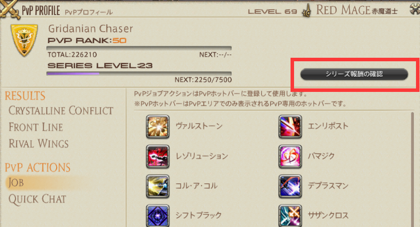

系列奖励查看入口
;;;
;;;.guide .col .figcap
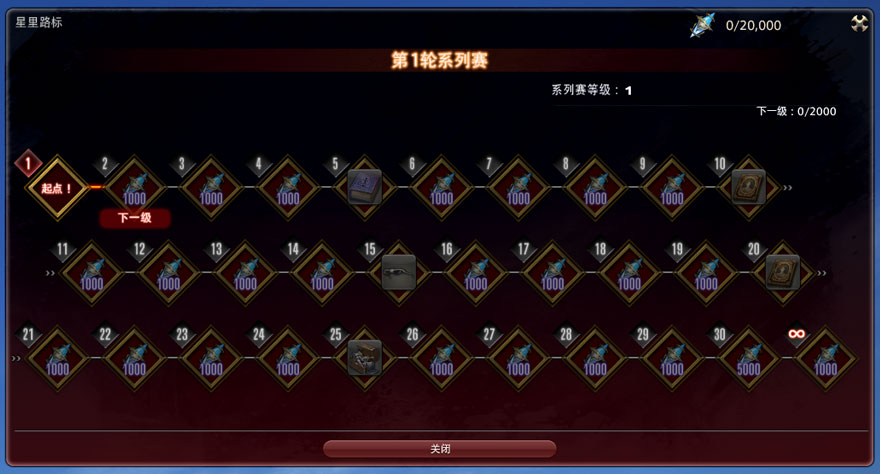

系列奖励清单
;;;
;;;.guide .col .figcap
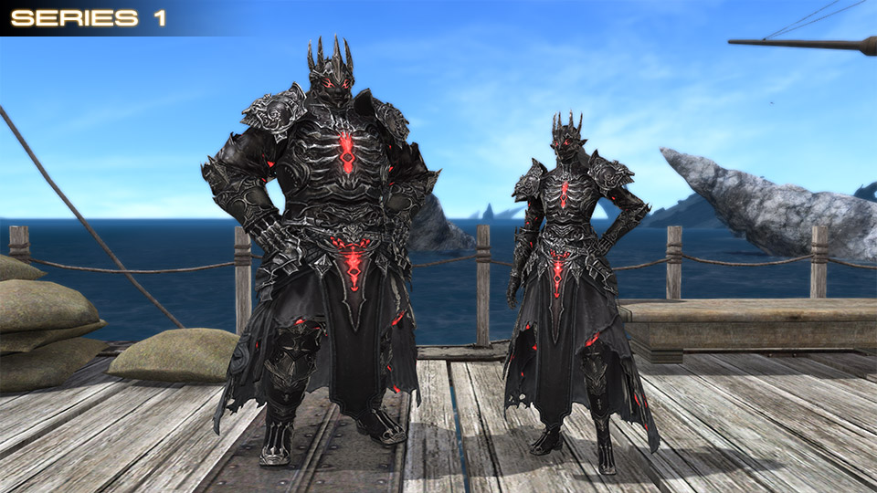

系列奖励（部分）
;;;
;;;

参与PVP对战活动可以获得专属代币**狼印战绩**和**系列经验值**（系列经验值将于6.1版本实装），其中系列经验值每提升一级系列等级，即可以在系列奖励（シリーズマルムストーン）中兑换相应的报酬，报酬获取情况可以通过“对战资料”-“查看系列报酬”查看。系列报酬中可以获得特殊代币**奖杯水晶**用于交换各类道具。

;;;.guide .cols2
;;;.guide .col .figcap

狼印战绩兑换外观
;;;
;;;.guide .col .figcap

PVP成就坐骑
;;;
;;;

狼印战绩可以交换的道具包括幻化装备、坐骑、宠物等，同时，参与水晶争夺战并取得段位、排名名次的玩家可以获得每个赛季的对应相框奖励等。另外PVP也有自己的成就奖励。

## PVP战斗系统

在PVP中，有以下战斗系统上的区别：
* 咏唱魔法不会被打断
* 不会进行自动攻击
* 不会发生格挡、招架、暴击、直击
* 异常状态不会产生抗性

另外在战场中可以使用坐骑和返回，但其他pvp场地不可以（狼狱竞技场除外）。

## PVP属性与技能

PVP有自己的技能栏和技能，可以在角色-对战资料-特职技能中找到自己的PVP技能及共通技能：

;;;.guide .cols2
;;;.guide .col
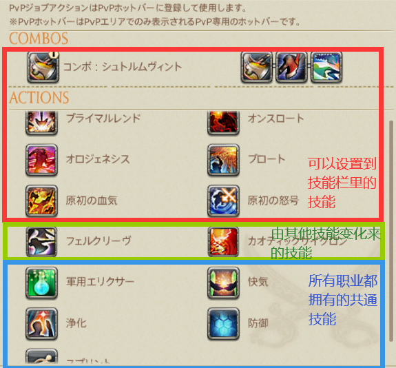
;;;

;;;.guide .col 

部分职业存在如图所示的组合键位， 即一套连击循环被整合至同一键位

;;;
;;;

;;;.guide .cols2
;;;.guide .col .figcap
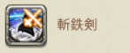 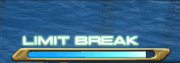  

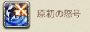 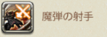  

;;;

;;;.guide .col .grow 

PVP中每个人都有自己独立的极限技槽，6.1版本开始，极限技随时间填充，不同职业拥有不同的填充时间。

每个职业的极限技都有自己独立的效果，可以在战斗资料中进行确认！

带有剑杖图标的即为极限技
;;;
;;;

请确保在进入战场之前，你看过或者了解自己职业的技能，如果你想更好的参与PVP，那么理解对手的技能也是重要的一环，受制于篇幅限制，我们无法详细的介绍每一个职业的技能，在此只对共通技能做出介绍：

想要了解各个职业的PVP技能，也可以访问[官网的职业指南-PVP篇](https://actff1.web.sdo.com/project/20190917jobguid/index.html#/indexpvp)查看。

::: segment blue

##### 防御

;;;.guide .cols2
;;;.guide .col
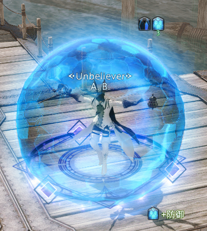 

防御buff及其特效
;;;

;;;.guide .col .grow 

**防御**是持续时间5秒的减伤技能，使自身受到的伤害减轻90%，并免疫可被净化解除的控制效果及击退、吸引。
持续时间内再次使用该技能、发动其他技能或持续时间结束后会解除防御状态

防御状态下可以缓慢地移动

Tips：防御是你回避伤害的重要手段，当然有些职业拥有对防御的特殊技能：战士的极限技可以令你无法使用防御、武僧的极限技可以解除防御状态
;;;
;;;

##### 净化

**净化**解除自身的眩晕、加重、止步、沉默、逐渐入睡、睡眠、冰冻状态 
成功解除异常状态时，付与自身“活性”状态
**活性**：持续时间五秒，免疫可净化的异常状态

Tips：净化是你回避异常状态的重要手段，即使在异常状态之下也可以发动，但是请注意，净化并不能解除<Status :id="227" name="魅惑" />、<Status :id="296" name="恐慌" />等状态。对于某些职业，拥有着净化之外的回避控制技能，依然会在之后进行简要的介绍。

##### 血气

**血气**：恢复自身体力，恢复量：15000，消耗：2500MP

Tips：血气不占用你的GCD且立即恢复，是你维持血量的重要手段，但是请注意自身的MP的变化！

##### 军用圣灵药

**军用圣灵药**：读条5秒使得自身的体力与魔力全部恢复

Tips：小药瓶是你续航的重要技能，长达5秒的读条期间受到伤害或者被控制均会被打断，所以远离敌人的视线进行使用或者技能干扰对手的使用！

##### 冲刺

;;;.guide .cols2
;;;.guide .col
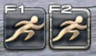 

PVE的冲刺（左）和 PVP的冲刺（右）
;;;

;;;.guide .col .grow 

**冲刺**：永久提高自身移动速度，直到使用其他技能或再次使用冲刺。
**注意PVE的冲刺和PVP的冲刺不同，要重新把PVP的冲刺拖出来用。**

Tips：追逐战与逃跑时都十分好用的技能，请善用冲刺来追击/回避敌人吧！
;;;
;;;

:::

### 异常状态及驱散

PVP中含有着不同的异常状态，了解这些异常状态可以帮助你更好的使用技能！
**注意：在PVP中没有异常状态免疫，如果中了这些异常就会被反复控制哦。**

| 异常状态 | 描述 | 职业及技能 |
| -- | -- | -- |
| 眩晕 | 无法做出任何动作，可以被净化驱散 | <Role name="war" />战士（原初的解放·蛮荒崩裂）、<Role name="gnb" />绝枪战士（终结扳机）、<Role name="whm" />白魔法师（净化之心）、<Role name="mnk" />武僧（六合星导脚）、<Role name="nin" />忍者（月影雷兽牙）、<Role name="mch" />机工士（分析·空气锚） |
| 睡眠 | 陷入沉睡，无法做出任何动作，受到伤害后会苏醒，可以被净化驱散 | <Role name="blm" />黑魔法师（夜翼） |
| 止步 | 无法自由移动，可以被净化驱散 | <Role name="drk" />暗黑骑士（腐秽黑暗）、<Role name="ast" />占星术士（中重力·双重）、<Role name="sam" />武士（冰雪）、<Role name="rpr" />钐镰客（夜游魂钐割）、<Role name="brd" />吟游诗人（后跃| 射击）、<Role name="mch" />机工士（空气锚）、<Role name="smn" />召唤师（山崩）、<Role name="rdm" />赤魔法师（黑移·决断） |
| 加重 | 移动速度降低，可以被净化驱散 | <Role name="war" />战士（锁链投掷）、<Role name="ast" />占星术士（中重力）、<Role name="mch" />机工士（分析·毒菌冲击）、<Role name="smn" />召唤师（山崩）、<Role name="pld" />骑士（圣盾阵） |
| 沉默 | 无法发动技能，可以被净化驱散 | <Role name="brd" />吟游诗人（沉默者的夜曲）、<Role name="rdm" />赤魔法师（白移·决断） |
| 变身 | 无法使用一切技能 | <Role name="whm" />白魔法师（自然奇迹） |

* 驱散：净化异常状态，所有职业均拥有的驱散技能：净化
  * 职业特色驱散：<Role name="whm" />白魔法师（水流幕）、<Role name="brd" />吟游诗人（光阴神的礼赞凯歌）
  * 特殊驱散技能：<Role name="drg" />龙骑士：苍穹之跃-解除加重止步缓缓入睡状态、回避跳跃-解除加重和止步
* 免控：免疫净化可解除的控制技能/状态，净化在解除控制后可以附加一个活性
  * 职业特色免控：<Role name="war" />战士（原初的怒号）、<Role name="sam" />武士（明镜止水）
  * 击退：<Role name="mnk" />武僧（万象斗气圈）、<Role name="mch" />机工士（霰弹枪）、<Role name="smn" />召唤师（深红强袭） 
* 崩溃：攻击处于<Status :id="1240" name="必杀剑·地天" />状态下的<Role name="sam" />武士会被附加3秒的崩溃，在崩溃状态下的玩家会受到来自武士极限技斩铁剑100%血量的伤害
* 恐惧：不受控制的远离；来源：<Role name="rpr" />钐镰客（夜游魂祷言） 
* 诱惑：不受控制的靠近；来源：<Role name="dnc" />舞者（行列舞） 

## 辨析敌我方的AOE

敌我方的AOE有着许多不同，最明显的区别是在地方AOE是黄圈/有红色特效

;;;.guide .cols2
;;;.guide .col
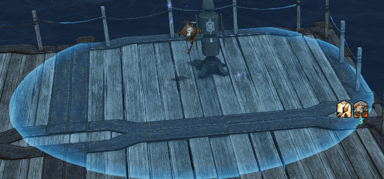 

蓝圈我方AOE
;;;

;;;.guide .col 

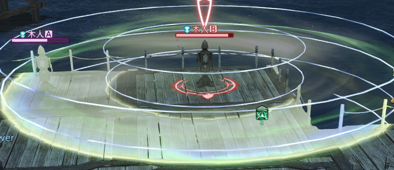 

蓝线我方AOE
;;;
;;;

;;;.guide .cols2
;;;.guide .col
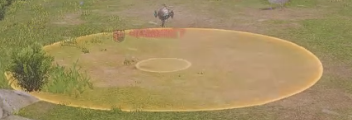 

黄圈敌方AOE
;;;

;;;.guide .col 

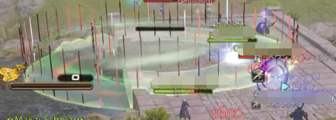 

红线敌方AOE
;;;
;;;

部分技能同时具有两种特征，如贤者中庸之道，己方看为蓝色；敌方看为黄色，同时有红线提示。

> 想要继续了解PVP内容，可以阅读以下文章：
> * [水晶争夺战](crystallineconflict.md)：5v5竞技场模式，有排位。
> * [纷争前线](frontline.md)：24v24v24，共计72人的三方混战抢分占点战场。
> * [烈羽争锋](rivalwings.md)：24v24，共计48人的对抗推塔型战场。