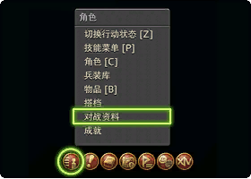
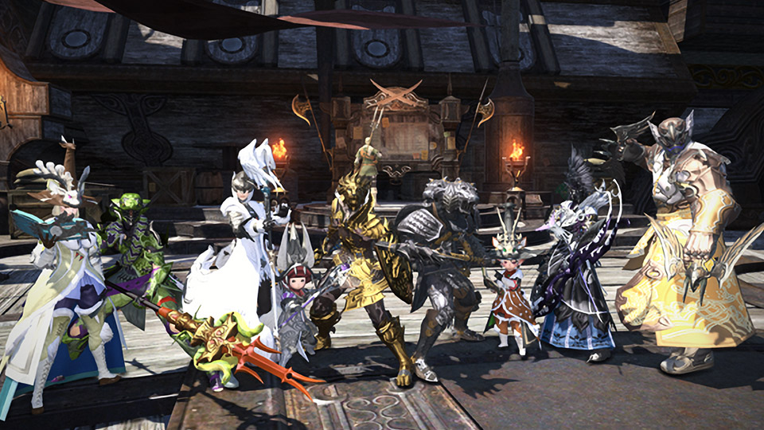
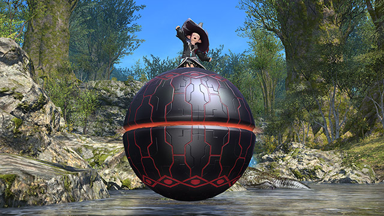
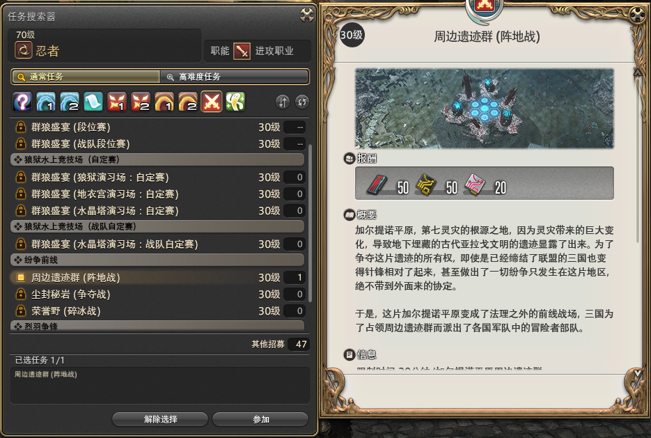
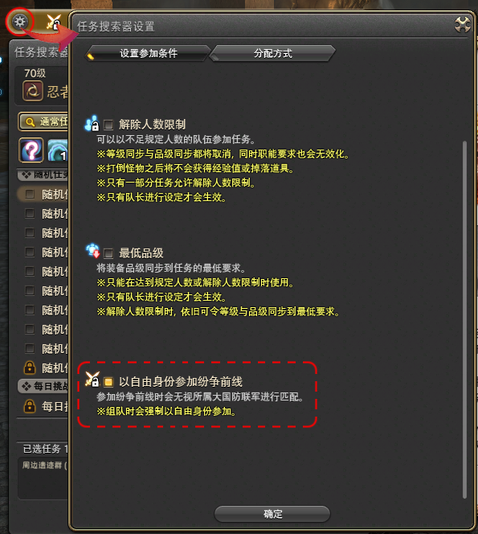
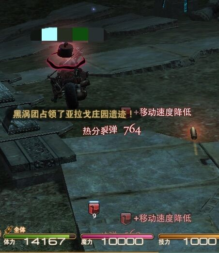

# PVP

FF14中并不存在任何形式的野外PVP（Player vs Player，即玩家之间的对抗），它所有的PVP内容都要在拉诺西亚低地的狼狱停船场开启。

玩家30级之后，就可以在自己的大国防联军接任务<quest name="狱中斗狼" type="plus" />开启PVP功能，接下来<quest name="法外纷争" type="plus" />开启战场，<quest name="双翼激战烈羽争锋" type="plus" />开启烈羽争锋。

PVP主要分成竞技场和战场两大类，在狼狱停船场有专门的PVP木桩和单挑用的训练场。

## PVP属性与技能

FF14的PVP属性与技能与PVE系统完全独立，就算是相同名字的技能，也有完全不同的效果和威力。

每名玩家的血量和魔力，根据职业固定，而与玩家自身的等级、身上的装备没有任何关系（所以你可以穿着时装去打PVP，但是不能穿着时装去打副本）。技能的威力就是它对其他玩家能造成的伤害。另外获得过异常状态（眩晕、加重、止步等等）的玩家，10s内不会再获得相同的异常状态。

;;;.guide .cols2
;;;.guide .col

;;;

;;;.guide .col .grow

玩家需要在==角色-对战资料-特职技能==中找到自己的PVP技能，另外每名玩家可以携带2个额外技能，根据自己的职业、职能，以及参与的PVP类型不同，需要随时调整自己的额外技能。

::: collapse 额外技能一览及选择建议

* 自愈——恢复自身最大体力的25%。
* 坚守——10s内，将自身所受的伤害减轻25%。
* 集中——为自身张开持续10s防护罩,该防护罩能够抵消一次眩晕、睡眠、止步、加重、减速、沉默、击退状态。
* 净化——解除自身受到的眩晕、睡眠、止步、加重、减速、沉默状态，即使自身处于异常状态下也可以发动该技能。
* 奋起——恢复自身最大技力的50%。
* 魔气——恢复自身最大魔力的25%。
* 疾跑——提高自身的移动速度，持续10s。

就现阶段来说，疾跑基本为战场必备技能（平时的冲刺无法使用），另一个技能奶妈可以选择净化，T和近战可以选择坚守，机工喷火必带集中，法系可以选择净化。以上选择并不唯一，可以根据实际情况选择，比如打野可以带自愈。

:::

另外每人还可以选择3个特性，同样需要配合自己的职业进行选择。

;;;
;;;

最后，每名玩家会有名为**奋战技**的技能，它的蓄积条看起来和LB一样，但它是每个人单独计算的，也是由个人施放，并非小队共享技能。

## PVP奖励

;;;.guide .cols2
;;;.guide .col .figcap


狼印战绩兑换外观
;;;
;;;.guide .col .figcap


PVP成就坐骑
;;;
;;;

参加PVP对战活动可以获得专属代币**狼印战绩**，持有狼印战绩可以在狼狱停船场交换各式装备、坐骑、宠物等等。由于现行PvP属性与装备无关，因此PVP装备大都以外观为主。

另外参加群狼盛宴（竞技场）排位赛并取得排位的玩家，还可以获得赛季排名奖励，每个赛季的奖励都不尽相同，主要以坐骑、奖杯、特殊装备为主。

获得一定数量的胜场或达成特殊条件的玩家，可以获得成就，部分PVP成就会奖励外观、坐骑。

## 参与群狼盛宴（狼狱水上竞技场）

群狼盛宴为4v4的竞技场对战，双方分为尖牙队与利爪队进行对抗。需要通过任务搜索器（默认快捷键`U`）参加匹配。

所有参加者在对战开始时，都持有一定的战章。打倒对方成员后，会掉落一半战章，接触后会把这些战章加算到自己的战章数量上。

如果战章掉落后，一定时间内无人拾取的话会自动消失，战章数量归还至掉落者。

当小队所持的战章总数达到规定值， 或者到达限制时间后，持有战章数量多的一队获胜。当到达限制时间，双方所持的战章数量相同时，将进入“骤死赛”。进入“骤死赛”后，首先获得战章的小队获胜。

群狼盛宴之中又可分为段位赛和练习赛，段位赛胜场可以为玩家积累积分，通过升格战升级段位，与同段位的玩家匹配竞争。

[官方群狼盛宴介绍](http://act.ff.sdo.com/project/160810event/page3_1.html)。

## 参与法外战区（纷争前线）

法外战区为24 vs 24 vs 24，共计72人的三方混战战场（根据参与人数也有可能产生8v8v8的24人战场）。场地内会有各种阵营旗帜，以及用于争夺的点位，通过占领点位和击杀敌军获得积分，先获得指定分数的一方获胜。各个战场的具体规则和玩法参见后文攻略。

;;;.guide .cols2
;;;.guide .col

;;;

;;;.guide .col .grow

战场一共有==周边遗迹群（阵地战）==（俗称飞机）；==尘封秘岩（争夺战）==（俗称CF）；==荣誉野（碎冰战）==（俗称碎冰）三种场地，每天按顺序轮流开放。

可以通过任务搜索器参加，单人模式下可以直接参加每日随机里的随机战场，组队状态下则只能在对战一栏里找到战场参加。

;;;
;;;
;;;.guide .cols2
;;;.guide .col

;;;

;;;.guide .col .grow

单人申请参加战场时，可以在设置中将自己调整为自由阵营，这样就会随机进入任意阵营（否则只能进入与自己大国防联军相同的阵营）。

组队状态下申请参加战场，则默认为自由阵营。

;;;
;;;

::: collapse 法外战区新手入门指南

**集火能力**是考验战斗力的重要指标，刚刚接触战场的新人，请打开用户宏，将基础宏的第六个拖到技能栏中，用于选中被标1的敌人，它将有助于你跟随大部队集火目标。

```
/target <attact1>
/facetarget
/action 自动攻击 <t>
```
 
FF14的进攻节奏受技能GCD限制，因此在战场里没有集火是很难杀死人的，双方相遇发生交锋时，**切记跟集火！跟集火！跟集火！不要乱打！**

进入战场之后需要先打开地图，缩放到到合适的大小并固定在屏幕某一位置，时刻关注，因为队友和进入战斗状态的敌方玩家的位置会实时显示在地图上，时刻关注地图有利于了解敌方和队友的走向，进而决定自己的行动。

;;;
;;;
;;;.guide .cols2
;;;.guide .col

;;;

;;;.guide .col .grow

战场可以骑乘坐骑（任何坐骑都不能飞行），但骑乘坐骑时不能使用任何技能，被攻击时会被附加一个减速的debuff，且再次受到攻击时会刷新这个debuff的持续时间。

所以，如果被攻击了第一时间下坐骑，开启疾跑到安全位置再上坐骑。

打野时请骑乘体积小无光效的坐骑，隐秘行事你懂的。（骑着个凤凰打野仿佛在求对方来打你）

;;;
;;;
 
在战场中请时刻关注聊天栏，在有玩家指挥的情况下（即某个人头上有一个大大的圆圆的饼，这个人便是指挥），指挥会通过聊天频道发宏的形式下达一些指令，新人如果不知道该做什么，遵从指挥的指示不失为一种很好的选择。无法自己判断形势且不会打野的玩家请跟紧指挥，该打的打，该撤的撤，切勿贪功（人头）冒进。另外请注意撤退不是溃散，请不要敌人一冲就一溜烟地跑，有时候撤退是为了退到有利地形进行反打。

:::

::: segment orange
### 战场豆知识

* Tip1：PVP系统内数值平衡，装备并不会影响人物的属性。
* Tip2：战场内可以更换职业，但必须在复活点内，脱战状态下可以使用返回回到复活点。
* Tip3：对敌方使用情感动作可以得知敌方ID，熟悉战场之后可以用来判断对手的战斗力。（毕竟PVP小众）
* Tip4：比较薄的墙，紧贴在后面部分体型较大的坐骑可能会穿模，另外有些光效也会穿过去（比如战士的兽魂）。
* Tip5:优先击杀敌方走位过于激进或落后在大部队后方的S怪、A怪、奶妈。
* Tip6：眩晕、止步、沉默、睡眠、减速、加重等状态都有10s的抗性。
* Tip7：战场死亡复活时间随死亡次数递增，复活时间=死亡次数*5s。
* Tip8：刚复活的玩家会获得短时间的无敌，此时任何技能对其无效。

**战场一切为了赢！请杜绝挂机、强退等消极行为！**如果遇到消极对战的玩家，可以通过[这里](https://bbs.nga.cn/read.php?tid=17758819)介绍的方式进行举报。

[战场常见黑话参见这里](/advanced/glossary.md#PVP用语)
:::

[官方战场介绍](http://act.ff.sdo.com/project/160810event/page4.html)。

## 参与烈羽争锋（隐塞）

烈羽争锋和隐塞是各方6个4人小队的24vs24，共计48人参与的战场。参战双方被分为猎隼和渡鸦队（分别是红方和蓝方），各自出生点为己方的核心所在，场地内会有青燐水罐，获得足够青燐水之后就可以开启~~高达~~机动兵器。

破坏所有地方防御塔之后就可以进攻敌方核心，率先破坏对方的核心即为胜利。时限内未决出胜负的，根据剩余防御塔的数量、剩余血量、核心的剩余血量，多的一方获胜。

[官方烈羽争锋介绍](http://act.ff.sdo.com/project/160810event/page5.html)。
