# 高难度挑战副本一览
<FloatTOC />
## 晓月终途（6.0）挑战副本

以下副本对应80级的挑战副本，极蛮神掉落猞猁坐骑。

零式Raid是万魔殿系列。

### 极蛮神

在主线任务中讨伐了未曾设想过的敌人之后，他们也在异国的诗人口中化成了更强大的形态。

经过6.0主线<quest name="晓月之终途" type="main" />并讨伐过对应蛮神之后，就可以接任务<quest name="知识之都的咏诗之人" type="plus" />，对话逐一开启极神。

::: collapse 6.0 极蛮神列表（※注意※ 有剧透）
| 简称 | 对应副本 | 
| -- | -- | 
| 极黑、极爹 | 佐迪亚克暝暗歼灭战 | 
| 极白、极妈 | 海德林晖光歼灭战 | 
| 极小鸟 | 终极之战 | 
| 风天王、风王|巴尔巴莉希娅歼殛战|
| 火天王 | 卢比坎特歼殛战 |
:::

### 零式Raid：万魔殿

;;;.guide .cols2
;;;.guide .col
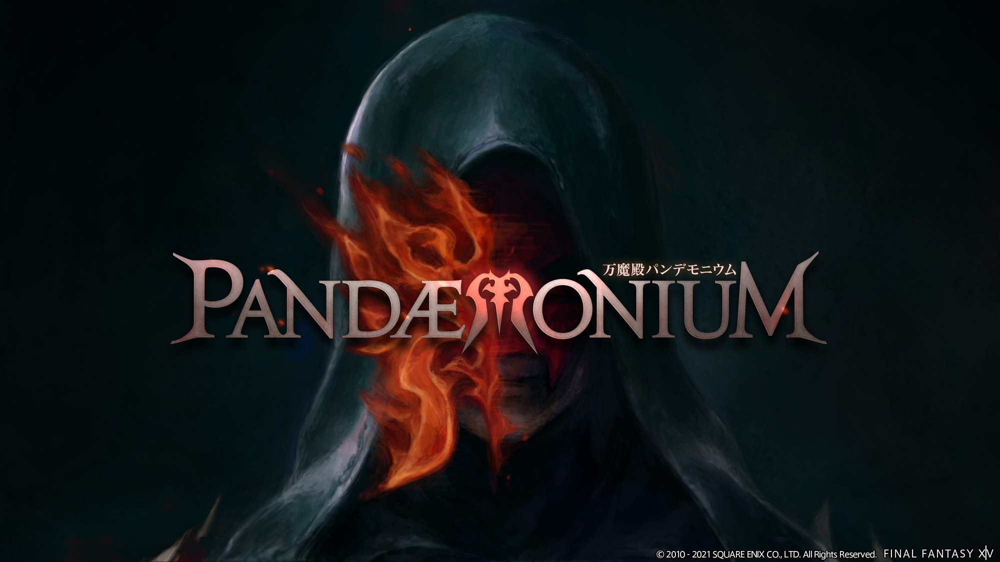

万魔殿官方标题图
;;;

;;;.guide .col .grow

在萨雷安接任务<quest name="水晶中的警告" type="plus" />，那里的贤人意外获得了一块水晶，从水晶中我们得知，关押传说中创造生物的万魔殿突发情况，于是我们踏上了万魔殿，展开新的拯救世界的旅途。

零式万魔殿在完成普通万魔殿剧情任务之后，于尼姆吉吉<Pos name="迷津" :x="8.4" :y="27.4" />对话开放。

万魔殿目前有边境之狱、炼净之狱，零式边狱（P1s~P4s）掉落600装备、零式炼狱（P4s~P8s）掉落630装备。

万魔殿英雄榜（以当时的服务器和名字为记录）：[边境之狱](https://actff1.web.sdo.com/20180525HeroList/index220401.html)，[炼净之狱](https://actff1.web.sdo.com/20180525HeroList/index221229.html)。

[万魔殿攻略](/duty/)。

;;;
;;;

### 24人副本：艾欧泽亚神话

;;;.guide .cols2
;;;.guide .col
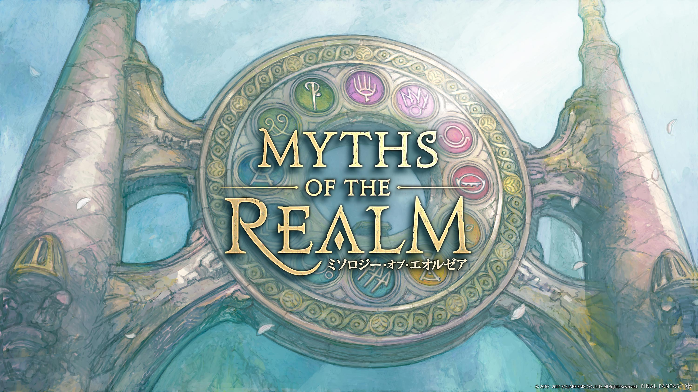

艾欧泽亚神话官方标题图
;;;

;;;.guide .col .grow

随着新的冒险展开，巴尔德西昂委员会收到一份神奇的委托：在魔杜纳的上空，居然存在着一个从不为人所知的幻域。而这片幻域背后，竟然隐藏着艾欧泽亚最大的秘密之一——十二神究竟是什么？

完成6.1主线<quest name="姐与弟" type="main" />之后，就可以在旧萨雷安接到任务<quest name="委员会接到的某件委托" type="plus" />。系列副本的第一章为灿烂神域阿格莱亚，第二章为喜悦神域欧芙洛绪涅。

[艾欧泽亚神话攻略](/duty/)。

;;;
;;;

### 绝境战：绝龙诗

;;;.guide .cols2
;;;.guide .col
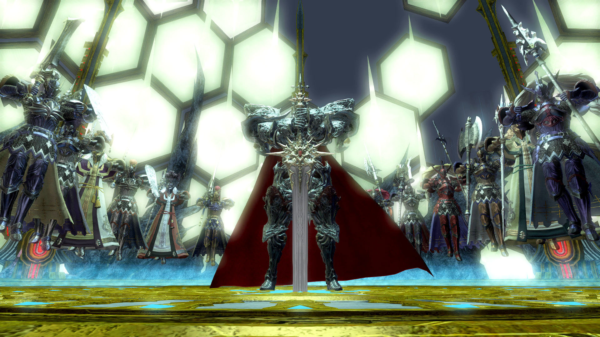

;;;

;;;.guide .col .grow

6.0 的绝境战是幻想龙诗绝境战（俗称绝龙诗），需要通关 P4s（零式万魔殿 边狱之境 4）之后才能在旧萨雷安异国的诗人处开启，装等限制605。

如果当年作为光之战士的我们救下了奥尔什方，龙诗战争将会如何发展，我们又将如何面对那之后发生的一切？

[绝龙诗攻略](/duty/)。

;;;
;;;

## 暗影逆焰（5.0）挑战副本

以下副本对应80级的挑战副本，极蛮神掉落各种小龙坐骑，集齐所有小龙之后可以交换到超快的机械飞龙坐骑。

零式Raid是伊甸系列，其中3个副本掉落3种坐骑，分别是2个BOSS和一个剧情中使用的4人坐骑。

24人副本是与尼尔联动的副本，剧本由横尾太郎合作撰写，会掉落尼尔系列的各种宠物。

::: collapse 5.0 极蛮神
### 极蛮神与帝国神兵

;;;.guide .cols2
;;;.guide .col
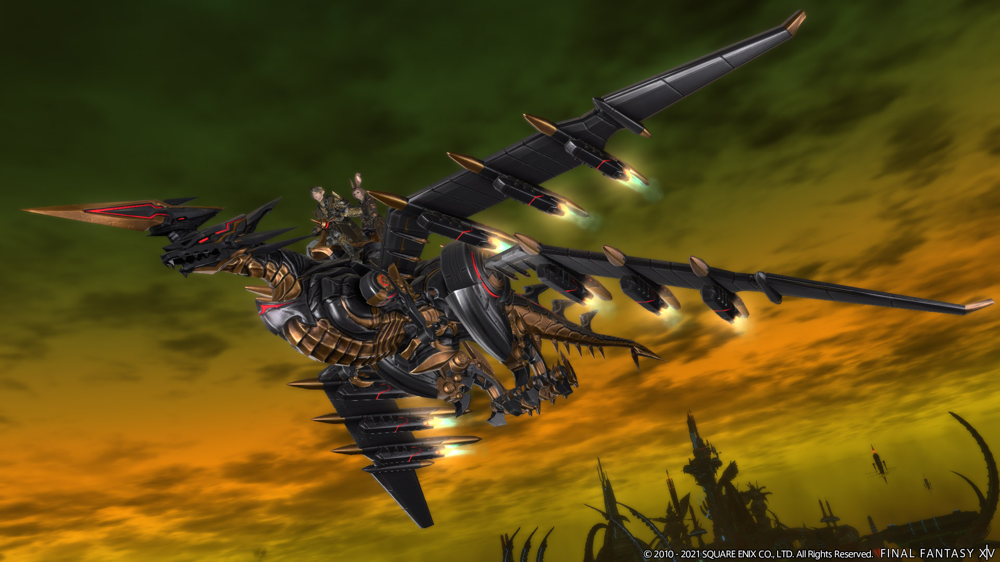

黑钢机龙连达巴非
;;;

;;;.guide .col .grow

5.0 的极神有主线时经历过的蛮神，经过异国的诗人（怎么又是你）重新编写而成的新的强大对手。另外还有一部分极神，是与帝国的特殊神兵部队对抗的故事。

完成主线<quest name="新的威胁" type="main" />之后，可以在<pos name="基拉巴尼亚湖区" :x="36.4" :y="31.8" />开放新讨伐编年史任务<quest name="神兵来袭" type="plus" />。系列支线讲述了帝国与其开发的神兵系列武器的后续故事。完成讨伐之后，与任务营地旁边的加隆德炼铁厂模型师<pos name="基拉巴尼亚湖区" :x="11.5" :y="22.5" />对话，就可以开放对应的极神。

经过5.0主线<quest name="暗影之逆焰" type="main" />并讨伐过对应蛮神之后，就可以接任务<quest name="在第一世界谱写诗歌之人" type="plus" />，对话逐一开启极神。主线极神都是主线中曾经遭遇的讨伐战的升级版。

集齐所有极神掉落的龙坐骑之后，可以兑换机龙坐骑，与《圣龙传说》中帝国飞龙队队长的坐骑同名，而且坐骑描述中也明显[暗指该游戏](https://www.zhihu.com/question/21100166/answer/17307246)。

;;;
;;;

| 简称 | 对应副本 | 备注 |
| -- | -- | -- |
| 妖精王/妖灵王/10w | 缇坦妮雅歼殛战 | |
| 肥宅 | 无瑕灵君歼殛战 | |
| 哈迪斯 | 哈迪斯孤念歼灭战 | |
| 红宝石 | 红宝石神兵狂想作战 | 通过<quest name="神兵来袭" type="plus" />系列支线开启 |
| 老屁股 | 博兹雅堡垒追忆战 | 通过<quest name="失传的圣遗物" type="plus" />系列支线开启 无坐骑，掉落80级可染色校服及兑换低保 |
| 极光战/极光呆 | 光之战士幻耀歼灭战 | |
| 绿宝石 | 绿宝石神兵狂想作战 | 通过<quest name="神兵来袭" type="plus" />系列支线开启 |
| 钻石 | 钻石神兵狂想作战 | 通过<quest name="神兵来袭" type="plus" />系列支线开启 |
:::

::: collapse 5.0 零式Raid
### 零式Raid：伊甸

;;;.guide .cols2
;;;.guide .col

伊甸官方概念图
;;;

;;;.guide .col .grow

伊甸被怀疑是令第一世界发生光之泛滥的罪魁祸首，为了让光之泛滥的大地恢复生机，在水晶都接任务<quest name="起始的“乐园”" type="plus" />，让琳带着我们一同前往虚无大地，探寻真相。

零式伊甸在完成普通伊甸剧情任务之后，于卢利<Pos name="安穆·艾兰" :x="26.8" :y="16.4" />对话开放。

伊甸目前分为觉醒之章、共鸣之章和再生之章，零式觉醒（E1s~E4s）掉落470装备，零式共鸣（E5s~E8s）掉落500装备，零式再生（E9s~E12s）掉落530装备。

伊甸英雄榜（以当时的服务器和名字为记录）：[觉醒篇](https://actff1.web.sdo.com/20180525HeroList/index200305.html)，[共鸣篇](https://actff1.web.sdo.com/20180525HeroList/index200729.html)，[再生篇](https://actff1.web.sdo.com/20180525HeroList/index210406.html)

[伊甸攻略](/duty/)。

;;;
;;;
:::

::: collapse 5.0 24人副本
### 24人副本：尼尔——寄叶异闻 暗黑天启

;;;.guide .cols2
;;;.guide .col
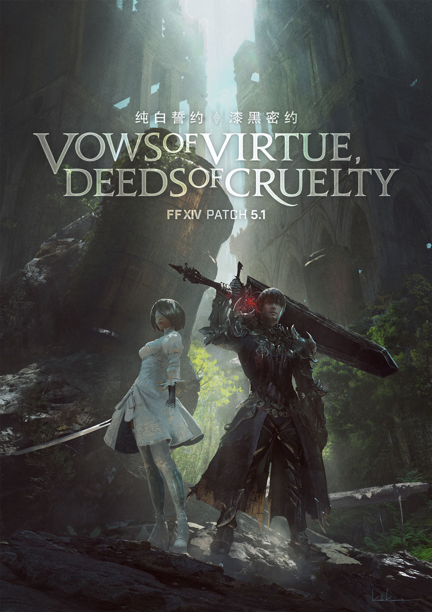

5.1版本标题图
;;;

;;;.guide .col .grow
与尼尔联动的作品，剧本由尼尔的监督横尾太郎参与合作，双方开发组合作制作出极具特色的副本。[官网特设站](http://act.ff.sdo.com/project/190920shadowbringers/yorha/index.html)查看更多资料。

完成5.0主线<quest name="暗影之逆焰" type="main" />后，同时完成珂露西亚岛古姆拉村的<quest name="古姆拉村的传闻" type="plus" />系列任务，就会开放尼尔联动系列任务<quest name="古姆拉村的事件" type="plus" />。

系列副本分别是复制工厂废墟、人偶军事基地和希望之炮台：“塔”，各种机械生物齐齐登场，副本会掉落2B同款外观<item name="物资货箱：二号B型防具" />、发型等等，另外还有各种宠物，每个副本掉落的装备都有浓郁的尼尔风格，有一些服装甚至是尼尔原作中角色所穿着的服装。

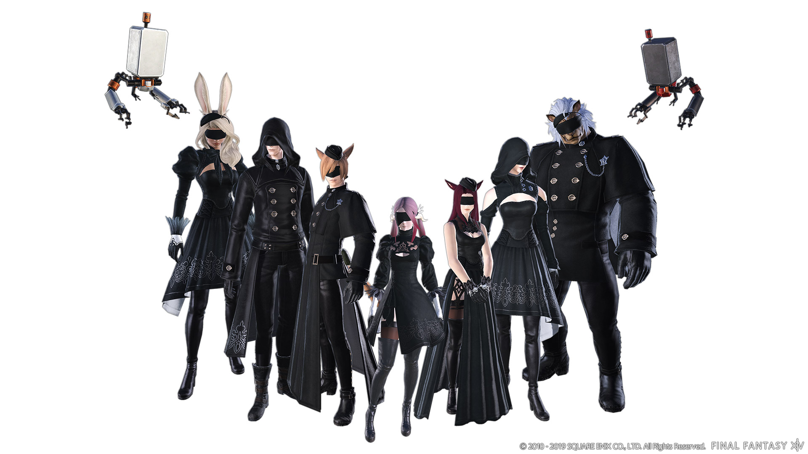

[尼尔攻略](/duty/)。
;;;
;;;
:::

::: collapse 5.0 绝境战
### 绝境战：绝亚历山大

;;;.guide .cols2
;;;.guide .col
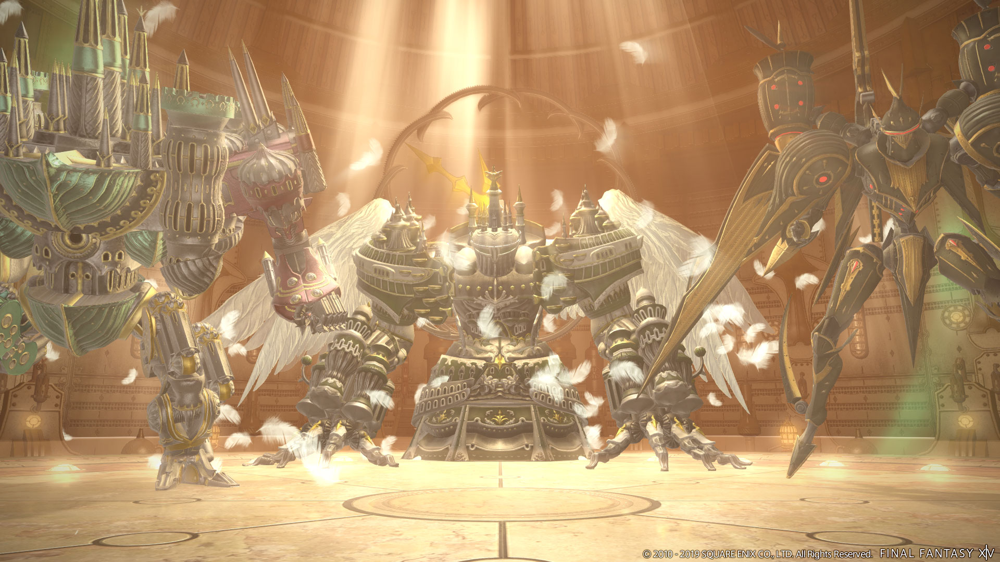
;;;

;;;.guide .col .grow
从4.0开始延续的绝境战副本也走进了5.0。

5.0的绝境战是**亚历山大绝境战**（俗称绝亚），需要通关E4s（零式伊甸 觉醒篇4）之后才能在黄金港异国的诗人处开启，装等限制475。亚历山大系列副本中最著名的几个机器人纷纷登场，有着非常机械风浪漫的特效。同时完美地融合了亚历山大故事剧情，又让首杀开荒团队吃尽了苦头。因为实际挑战难度并没有那么高不可攀了，推荐有机械情结和想要炫酷武器的玩家都去体验尝试一下。

[绝亚攻略](/duty/)。
;;;
;;;
:::

## 红莲狂潮（4.0）挑战副本

以下副本对应的是70级的挑战副本，极蛮神副本掉落各种狗坐骑，集齐7种蛮神狗之后就可以交换到坐骑——九尾。

零式Raid是时空狭缝欧米茄，其中3个副本掉落3种坐骑。

24人副本是继承FF12及FFT狮子战争的故事做成，其中乐欲之所会掉落FF12主角团外观。

::: collapse 4.0 极蛮神
### 极蛮神与东方圣兽

;;;.guide .cols2
;;;.guide .col
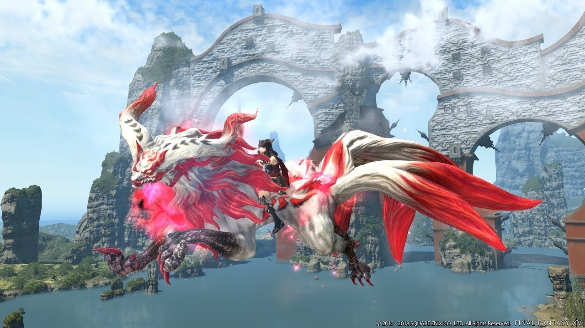

九尾
;;;

;;;.guide .col .grow

4.0的极蛮神包涵了主线故事中遇到的4位蛮神，以及另外一条支线任务<quest name="四圣兽传说" type="plus" />。

完成对应主线、支线任务，并讨伐过蛮神之后，就可以在黄金港和异国的~~吉田~~诗人对话，让他为你咏唱新的诗歌<quest name="诗在东方" />。听过他的诗歌之后，你就可以挑战全新的蛮神了。

集齐所有极蛮神掉落的坐骑狗之后，可以在黄金港接任务<quest name="九尾降临于世" />，并获得稀有Fate玉藻前同模坐骑九尾一条。

[蛮神攻略](/duty/)。

;;;
;;;
| 简称 | 对应副本 | 备注 |
| -- | -- | -- |
| 豪神 | 须佐之男歼殛战 | |
| 美神 | 吉祥天女歼殛战 | |
| 神龙 | 神龙梦幻歼灭战 | |
| 白虎 | 白虎诗魂战 | 通过<quest name="四圣兽传说" type="plus" />系列支线开启 |
| 月读 | 月读幽夜歼灭战 | |
| 极火龙 | 火龙上位狩猎战 | 通过<quest name="王在顶点沉睡" type="plus" />系列支线开启 怪猎联动特殊副本，非常规。掉落火龙坐骑**不计入**极蛮神坐骑收集范畴。 |
| 朱雀 | 朱雀诗魂战 | 通过<quest name="四圣兽传说" type="plus" />系列支线开启 |
| 青龙 | 青龙诗魂战 | 通过<quest name="四圣兽传说" type="plus" />系列支线开启 |
:::
::: collapse 4.0 零式Raid
### 时空狭缝欧米茄

;;;.guide .cols2
;;;.guide .col
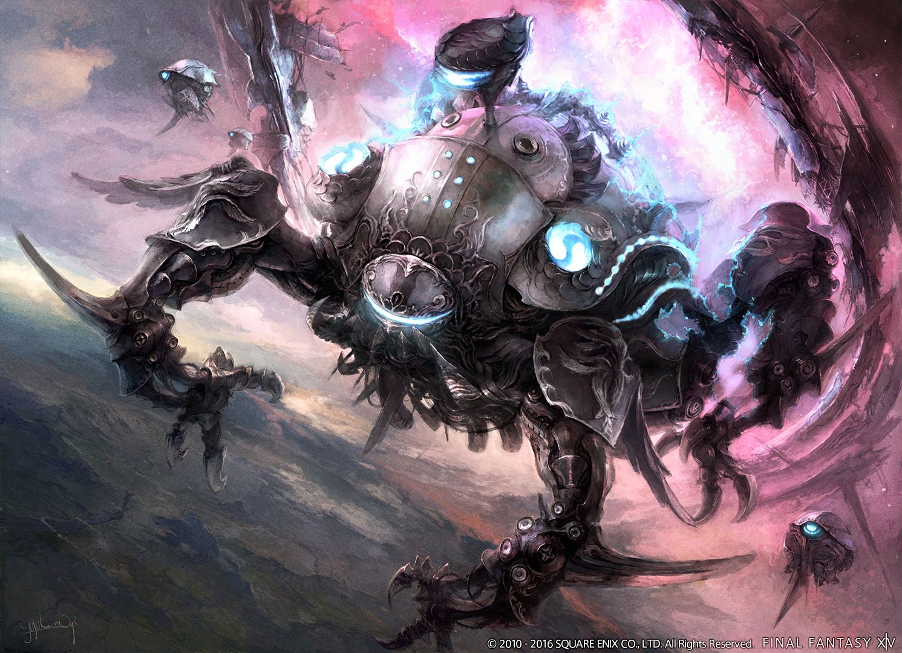
;;;

;;;.guide .col .grow

欧米茄最早在2.3主线中就被提及，它是亚拉戈帝国创造的用来制御巴哈姆特的武器，而在3.57主线故事中为了抵抗神龙而被释放。

从神拳痕接任务<quest name="欧米茄的消息" type="plus" />，在各个空间中战斗。完成每个阶段欧米茄的4个副本之后，就可以在神拳痕的魔导终端开放零式欧米茄副本。

欧米茄分为德尔塔、西格玛和阿尔法三个章节，零式德尔塔(O1s~O4s)掉落340装备/345武器，零式西格玛(O5s~O8s)掉落370装等装备/375武器，零式阿尔法(O9s~O12s)掉落400装等装备/405武器，是4.x版本的最高装等。

欧米茄英雄榜（以当时的服务器和名字为记录）： [德尔塔](http://act.ff.sdo.com/20171213HeroList/index.html) [西格玛](http://act.ff.sdo.com/20180525HeroList/index.html) [阿尔法](http://act.ff.sdo.com/20180525HeroList/index190128.html)

[欧米茄攻略](/duty/)。

;;;
;;;

:::
::: collapse 4.0 24人副本
### 24人副本：重返伊瓦利斯

;;;.guide .cols2
;;;.guide .col
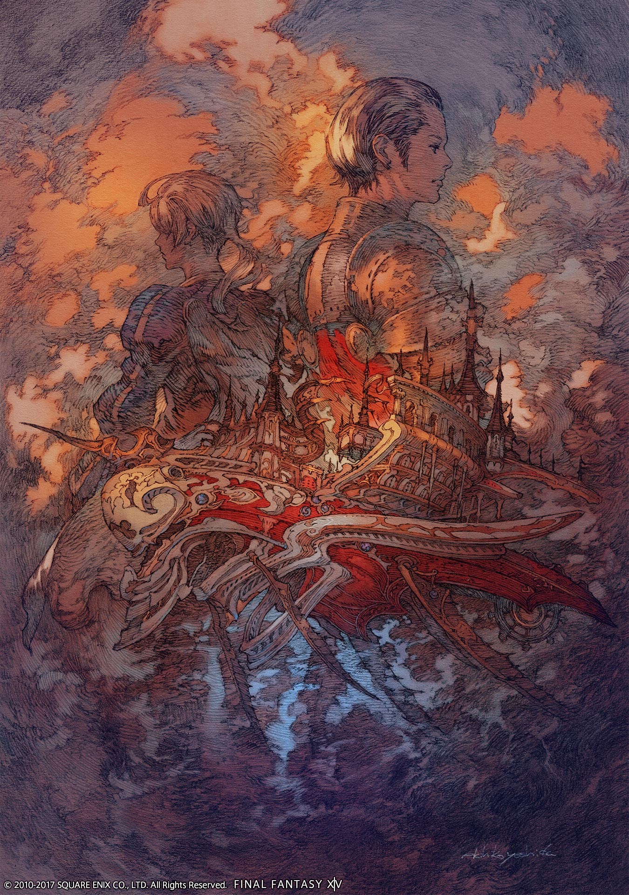
;;;

;;;.guide .col .grow

伊瓦利斯是FF12及之后FFT一系列游戏中的世界，作为4.X系列的24人大型副本，重返伊瓦利斯的剧本也是由伊瓦利斯的创造者——松野泰己负责的，另外部分画面设计则是由雨宮慶太负责。如果是有玩过FF12或FFT的玩家，应该会对这一系列副本的剧情、场景乃至人物、服装都产生相当熟悉的感觉。就算你没有接触过前面说的这两部作品，这次的24人副本也会为你带来全新的体验，无论是场景、技能特效还是副本机制都会为你带来全新的感觉。

完成4.0主线<quest name="红莲之狂潮" type="main" />后，在黄金港接任务<quest name="被通缉的剧团" type="plus" />，就能够开始重返伊瓦利斯的故事，为FFT未写完的黄道勇士的传说，以另一种方式划上句号。

[重返伊瓦利斯攻略](/duty/)。

;;;
;;;

;;;.guide .cols2
;;;.guide .col .figcap
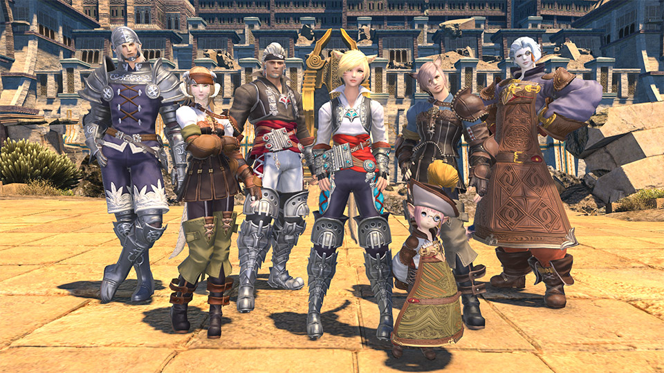

封闭圣塔黎铎拉纳大灯塔掉落装备
;;;
;;;.guide .col .figcap
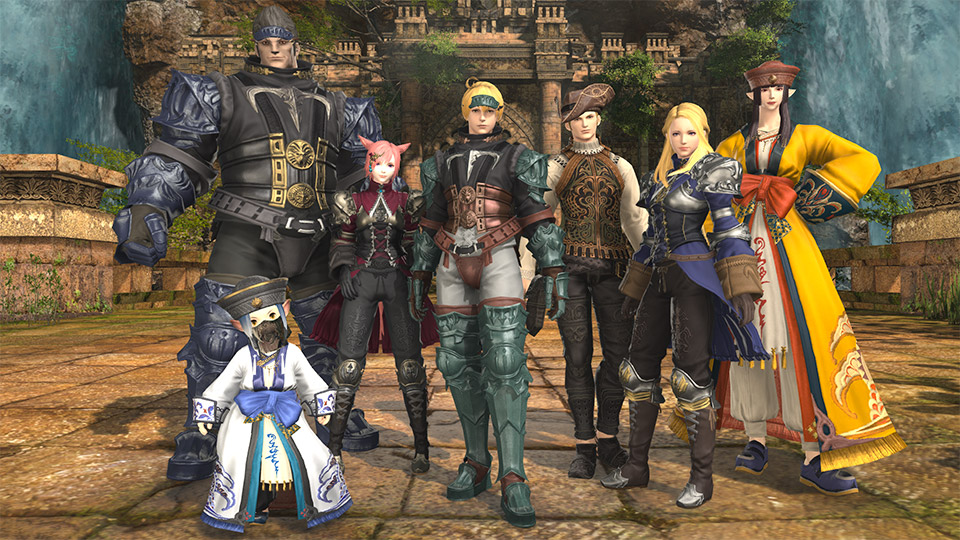

乐欲之所瓯博讷修道院掉落装备
;;;
;;;

:::
::: collapse 4.0 绝境战
### 绝境战：绝巴哈 & 绝神兵

;;;.guide .cols2
;;;.guide .col .figcap
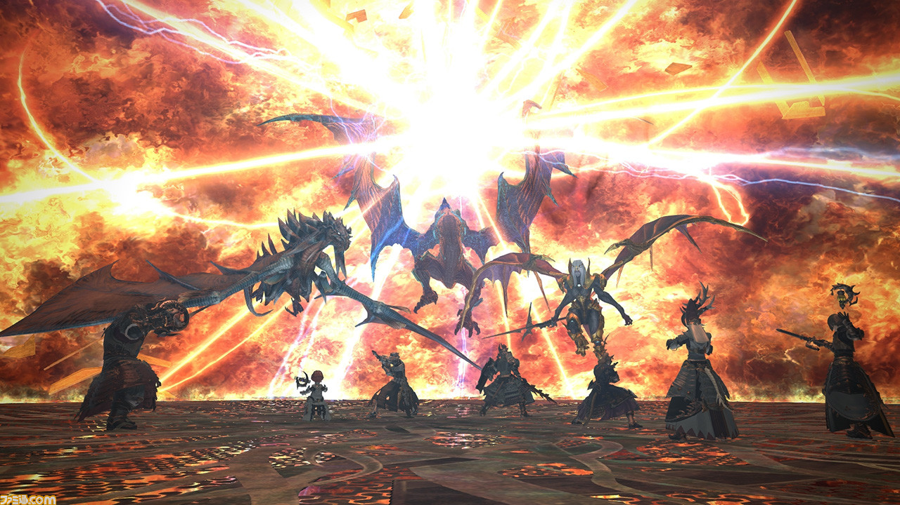

巴哈姆特绝境战
;;;
;;;.guide .col .figcap
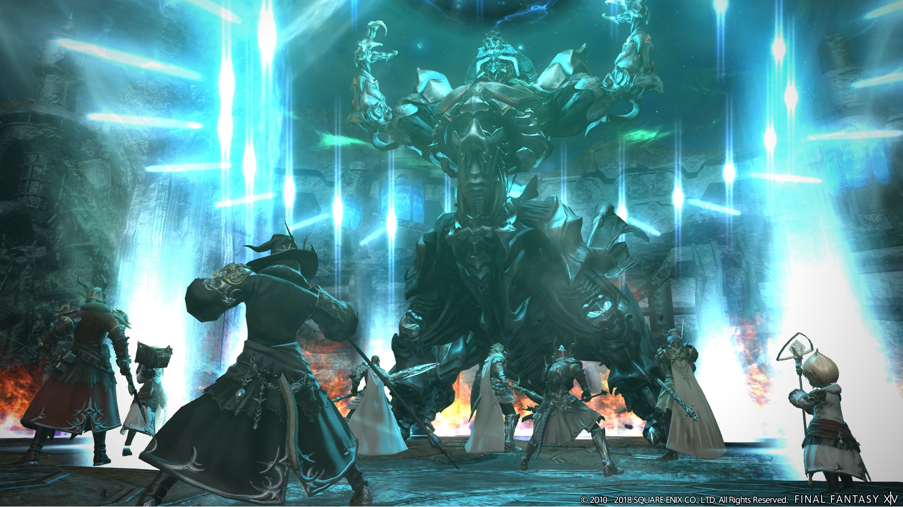

究极神兵绝境战
;;;
;;;

作为游戏副本难度的新巅峰，游戏把最高难度的战斗内容彻底单独制作，成为了现在的绝境战（俗称绝本）。绝境战有着超高的门槛，同时制作人也明确表示，不会随新版本而降低绝本的挑战难度，不会提供解除等级同步挑战的功能。

4.0的第一个绝境战是**巴哈姆特绝境战**（俗称绝巴哈），需要通关O4s（零式欧米茄 德尔塔4）之后才能在黄金港异国的诗人处开启，装等限制345。绝巴哈是2.0 Raid巴哈姆特大迷宫的集大成，有着接近20分钟的超长战斗时间，和非常华丽的演出特效（如果打过2.0巴哈姆特大迷宫的剧情的话，会对这个副本的演出有更多感触）。

4.0第二个绝境战是**究极神兵绝境战**（俗称绝神兵），需要通过O8s（零式欧米茄 西格玛4）之后，在黄金港异国的诗人处开启，装等限制375。绝神兵是2.0风火土三蛮神与究极神兵的集合，实际难度相较于绝巴哈略有降低，但因为其独特的机制设计，让首批开荒团队吃尽了苦头（在打掉三个蛮神之后，发现有尚未发现的神秘机制，导致集体回到开头重新开荒），同时也获得了很高的好评。

:::
## 苍穹禁城（3.0）挑战副本

挑战3.0版本的极蛮神需要完成60级主线任务。其中蛮神本掉落蛮神鸟和武器，集齐7种蛮神鸟可以交换到七彩凤凰。

零式Raid是亚历山大机神城，其中掉落2种坐骑和1个宠物。制作[魂武](/topic/anima.md)的玩家一般会选择A9s用来刷光。

24人副本是FF14原创故事玛哈之影，深刻揭露了艾欧泽亚第五星历时期的历史。

对难度副本感兴趣的玩家推荐最低装等同步并点掉超越的A8S。

::: collapse 3.0 极蛮神
### 极蛮神与上古蛮神

;;;.guide .cols2
;;;.guide .col
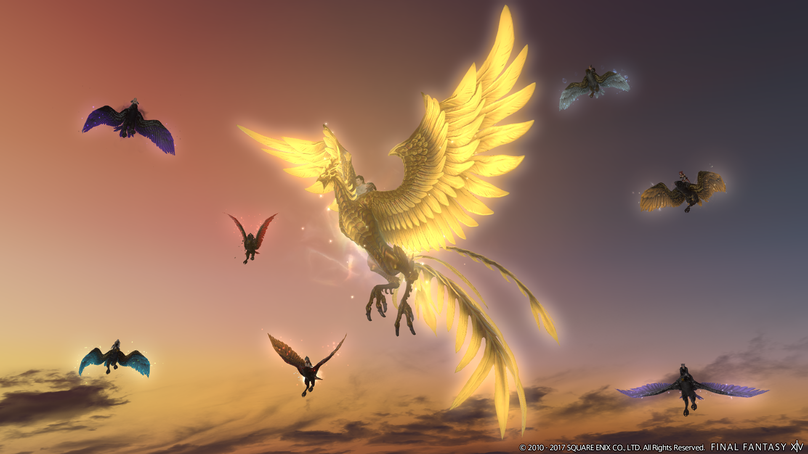

凤凰（背景为7只蛮神鸟）
;;;

;;;.guide .col .grow

3.0的极蛮神包涵了主线故事中遇到的4位蛮神，以及另外3位上古蛮神。

在完成60级主线之后，我们会在伊修加德接到名为<quest name="上古之神" />的任务，这里的上古之神其实指的是被亚拉戈帝国封印的古代蛮神。

上古之神任务讲述魔大陆的三斗神的故事，并引导开启<quest name="登峰造极的云神俾斯麦" type="plus" />、<quest name="登峰造极的武神罗波那" type="plus" />、<quest name="登峰造极的魔神萨菲洛特" type="plus" />、<quest name="登峰造极的女神索菲娅" type="plus" />、<quest name="登峰造极的鬼神祖尔宛" type="plus" />五个极神任务，另外在摩杜纳还能接到任务<quest name="英雄叙事诗：苍穹之章" type="plus" />和<quest name="英雄叙事诗：云廊之章" type="plus" />，开启剩下的2个极神。

集齐所有极蛮神掉落的坐骑鸟之后，可以在田园郡接任务<quest name="凤鸣朝阳" />，并获得巨大发光凤凰一条。

[蛮神攻略](/duty/)。

;;;
;;;

| 简称 | 对应副本 | 备注 |
| -- | -- | -- |
| 云神 | 俾斯麦歼殛战 | 通过<quest name="登峰造极的云神俾斯麦" type="plus" />开启 |
| 武神 | 罗波那歼殛战 | 通过<quest name="登峰造极的武神罗波那" type="plus" />开启 |
| 骑神 | 圆桌骑士幻想歼灭战 | 通过<quest name="英雄叙事诗：苍穹之章" type="plus" />开启 |
| 邪龙 | 尼德霍格传奇征龙战 | 通过<quest name="英雄叙事诗：云廊之章" type="plus" />开启 |
| 魔神 | 萨菲洛特歼殛战 | 通过<quest name="上古之神" /> → <quest name="登峰造极的魔神萨菲洛特" type="plus" />开启 |
| 女神 | 索菲娅歼殛战 | 通过<quest name="上古之神" /> → <quest name="登峰造极的女神索菲娅" type="plus" />开启 |
| 鬼神 | 祖尔宛歼殛战 | 通过<quest name="上古之神" /> → <quest name="登峰造极的鬼神祖尔宛" type="plus" />开启 |

:::
::: collapse 3.0 零式Raid
### 零式Raid：亚历山大机神城

;;;.guide .cols2
;;;.guide .col

;;;

;;;.guide .col .grow

完成60级主线之后，可以在田园郡接任务<quest name="迈向毁灭" type="plus" />，这个系列故事以龙堡内陆低地的巨大机器人为主要背景，对手则是拥有超高科技力量的哥布林族群——青蓝之手。

亚历山大分为启动之章（A1~4）、律动之章（A5~8）和天动之章（A9~12）三个章节，完成各个章节的故事之后，需要前往摩杜纳接任务<quest name="英雄叙事诗：机神城之章" type="plus" />（如果没有这个任务的话，则需要先完成<quest name="英雄叙事诗：幻想之章" type="plus" />才行）、<quest name="英雄梦想诗：机神城之章" type="plus" />和<quest name="英雄幻想诗：机神城之章" type="plus" />分别开启零式启动、律动及天动。

零式亚历山大机神城律动之章第四层（A8s）被认为是绝系列登场之前，当之无愧的最难副本（启动之章第4层（A4s）则在它之上，但是随着邪教打法的开发，难度大幅降低）。当时A4s的开荒时间是34天，而A8s是17天，与之相对的最难的绝巴哈开荒时间也不过11天。

因为过高的挑战难度导致玩家游戏热情降低，之后天动难度大幅下降，并且在后来单独开发超高难度副本绝境战。

亚历山大英雄榜(以当时的服务器和名字记录) [启动](http://act.ff.sdo.com/HeroList/index.html) [律动](http://act.ff.sdo.com/HeroList/index0711.html) [天动](http://act.ff.sdo.com/HeroList/index0224.html)

[亚历山大攻略](/duty/)

;;;
;;;

:::
::: collapse 3.0 24人副本
### 24人副本：玛哈之影

;;;.guide .cols3
;;;.guide .col .figcap
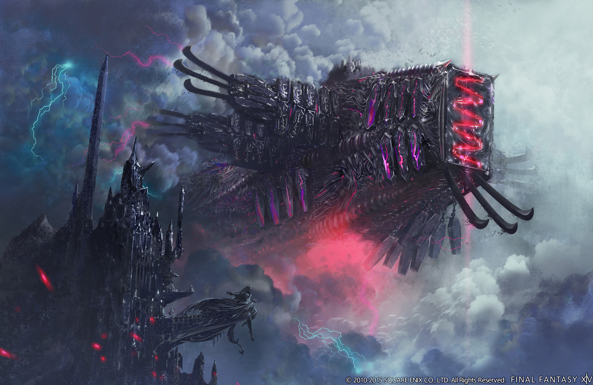

魔航船虚无方舟
;;;
;;;.guide .col .figcap
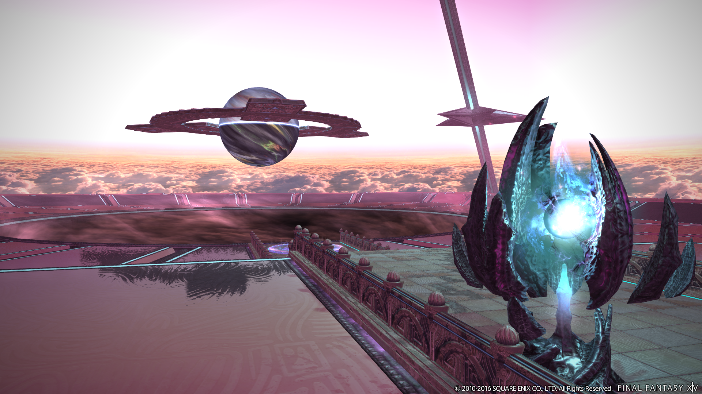

禁忌城邦玛哈
;;;
;;;.guide .col .figcap
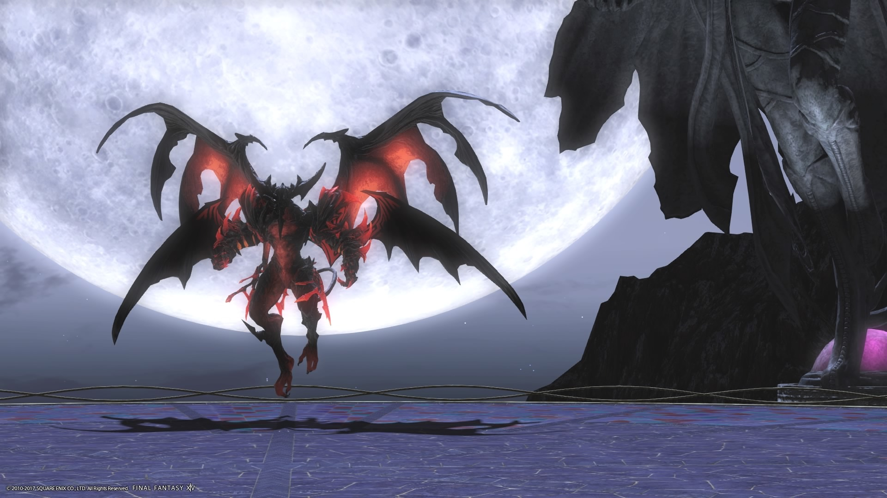

影之国(来自[SS日記（そして、最近の出来事）](https://na.finalfantasyxiv.com/lodestone/character/4371340/blog/3261369/))
;;;
;;;

完成60级主线之后，可以在伊修加德接任务<quest name="空贼登场" type="plus" />，这个故事中，我们跟随空贼一起探访漂浮在空中的虚无方舟，继而了解第五星历中玛哈之所以覆灭的历史。

[玛哈之影攻略](/duty/)。
:::
## 新生（2.0）挑战副本

这些副本只需要完成50级主线任务就可以打开，现在已经不属于高难度的副本，如果你需要蛮神马可以继续去挑战(但是难易度降低了很多)

另外制作魂武的玩家可能需要打对应的24人副本周常，而RAID本几乎只有为了幻化外观和乐谱的玩家会去逛一圈。

24人本水晶塔目前是主线必须完成的副本内容。

另外想要体验难度的玩家，推荐最低装等同步并且点掉超越之力的JTT、T9和零式巴哈系列。
::: collapse 2.0 极蛮神
### 蛮神真正的力量
在沙之家于里昂热那里接到任务<quest name="蛮神的真正力量" type="plus" />，可以打开蛮神讨伐的任务串。

首先接到的火风土神的讨伐战，这一系列被称为：真火、真风、真泰坦(ZTT)；以便以和之后的歼殛战区分。

打完土神泰坦之后，会出现<quest name="蛮神的极限力量" type="plus" />任务，然后按顺序挑战极风神、极泰坦(JTT、蒋婷婷)、极火神。完成对应版本的主线蛮神讨伐之后，同样在于里昂热那里接任务，<quest name="登峰造极的贤王莫古尔·莫古十二世" type="plus" />、<quest name="登峰造极的水神利维亚桑" type="plus" />、<quest name="登峰造极的雷神拉姆" type="plus" />、<quest name="登峰造极的冰神希瓦" type="plus" />开启对应的极蛮神。

元素蛮神都会有一定概率掉落蛮神马，集齐6匹蛮神马可以接到任务<quest name="天降祥瑞" />获得麒麟一匹。

另外极火、极风和极泰坦还有较低概率会掉落<item name="梦魇笛" />（不计入麒麟计数）。

| 简称 | 对应副本 | 备注 |
| -- | -- | -- |
| 极神兵 | 究极神兵假想作战 | 通过<quest name="英雄叙事诗：幻想之章" type="plus" />开启 不掉落坐骑 |
| 极风 | 迦楼罗歼殛战 | 完成<quest name="蛮神的真正力量" type="plus" />后，接<quest name="蛮神的极限力量" type="plus" />开启 低概率掉落<item name="梦魇笛" />，该坐骑不计入麒麟计数。 |
| 极土 | 泰坦歼殛战 | 完成极风之后开启 低概率掉落<item name="梦魇笛" />，该坐骑不计入麒麟计数。 |
| 极火 | 伊弗利特歼殛战 | 完成极火之后开启 低概率掉落<item name="梦魇笛" />，该坐骑不计入麒麟计数。 |
| 极贤王 | 莫古力贤王歼殛战 | 通过<quest name="登峰造极的贤王莫古尔·莫古十二世" type="plus" />开启 不掉落坐骑 |
| 极水 | 利维亚桑歼殛战 | 通过<quest name="登峰造极的水神利维亚桑" type="plus" />开启 掉落<item name="水神魔镜" />（需要roll点）可用于兑换发光水神武器。 |
| 极雷 | 拉姆歼殛战 | 通过<quest name="登峰造极的雷神拉姆" type="plus" />开启 |
| 极冰 | 希瓦歼殛战 | 通过<quest name="登峰造极的冰神希瓦" type="plus" />开启 掉落<item name="钻石尘晶" />（固定掉落）可用于兑换发光冰神武器。 |

:::
::: collapse 2.0 Raid副本及零式
### Raid副本：巴哈姆特
完成真泰坦的讨伐之后，沙之家会出现<quest name="蛮神苏醒" />的任务。这就是50级8人RAID副本——巴哈姆特的开启任务。

如果你有看过2.0的开篇动画，可能对那头从红色卫月中出现的巨大肥龙印象深刻，2.0的RAID副本就是探索掉落卫月，并最终找到巴哈姆特的故事。同时它在故事情节设计上也是承上启下的副本，壮大的战斗场景和绝美的战斗BGM让很多玩家赞不绝口。

巴哈姆特大迷宫分为3个阶段，分别是邂逅之章（T1~T5）、入侵之章（T6~T9）和真源之章（T10~T13）。完成每个章节的战斗后，都需要从副本退出点退出，并继续剧情，在最后一章真源之章4(T13)中，我们会面对巴哈姆特的“本尊”，并彻底击败它。

另外完成巴哈姆特大迷宫任务线之后，可以在摩杜纳接到<quest name="英雄叙事诗：大迷宫之章" type="plus" />的任务，就可以开启零式巴哈。

2.0时期的Raid副本并没有现在我们习惯的零式难度，这里的零式巴哈是2.5版本末期最后一系列挑战副本，是入侵之章（T6~T9）的加强加难版，当年能通关的队伍屈指可数，而现在就算是解除同步也不是那么容易通关的。零式巴哈通关后会获得成就称号，由于现在解除同步之后难度已经非常简单，就算是新人也可以在满级后，[解除同步挑战](/basic/battle.htm#副本解除限制)成就称号。

巴哈姆特英雄榜(以当时的服务器和名字为记录，现在已无法打开) [邂逅](http://act.ff.sdo.com/project/20140926bhmt/index.asp) [入侵](http://act.ff.sdo.com/project/20141113bhmt/) [真源](http://act.ff.sdo.com/project/20150402bhmt/)
:::
::: collapse 2.0 24人副本
### 24人副本：水晶塔
在摩杜纳接到任务<quest name="古代亚拉戈文明的遗产" type="plus"/>，并完成一系列任务串之后，就能开启24人副本——水晶塔。

这条故事线介绍了亚拉戈帝国的历史和他们的科技力量，以及关于第七灵灾背后的一些故事。这段故事与5.0的在主线剧情有非常紧密的联系，目前是主线的强制前置任务，因此早做不吃亏哦~

依次挑战完这三个副本之后，可以在摩杜纳开启水晶塔重复任务<quest name="大魔法师的祝福" type="plus" />，完成任务之后，可以获得制作魂武所需的<item name="亚拉戈绝灵油" />。

:::