# 烈羽争锋

目前，烈羽争锋仅开放了隐塞的地图。

## 界面介绍

;;;.guide .cols4 .base
;;;.guide .col
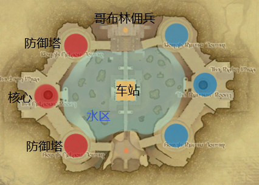 

隐塞地图
;;;

;;;.guide .col 
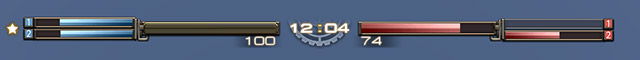 

核心塔和防御塔的血量。

;;;
;;;.guide .col

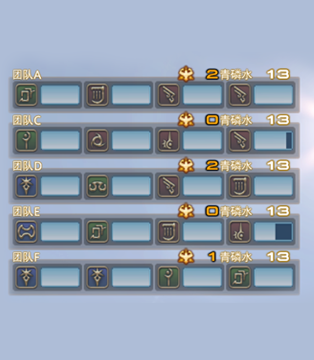 

团队列表，标有战意及青磷水持有量

;;;
;;;.guide .col

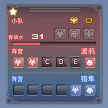 

任务面板，可以看到小队战意及青鳞水状况、 同时包含了每个阵营剩余的防御塔数量及机甲出库情况

;;;
;;;

## 机制介绍

### 胜利条件

破坏掉敌方据点中的“核心”。

若在限制时间内双方的核心都没有被破坏，则依次依据对核心伤害量、残存防御塔数量、对防御塔伤害量进行胜利方的判定。

在这些条件都相同时，会计算平局，但是与战场不同的是，隐塞的不分胜负不会计入胜场。

;;;.guide .cols2 
;;;.guide .col
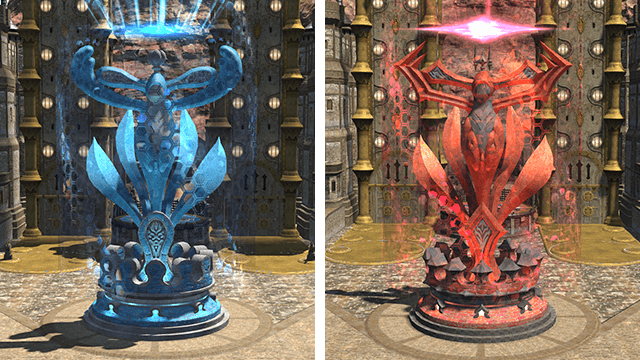 

核心

;;;

;;;.guide .col .grow

核心设置在各阵营据点中的破坏目标，防御塔未破坏前，无法对核心造成伤害。

;;;
;;;

;;;.guide .cols2 
;;;.guide .col
 

防御塔

;;;

;;;.guide .col .grow

每个阵营各配置有两座防御塔。防御塔拥有塔结界（圆形区域），可以提供体力恢复和减伤。破坏掉敌方防御塔可以提高我方团队的战意。

;;;
;;;

### 机动兵器

机甲是由玩家所搭乘强大兵器。共有3种性能不同的机体：

;;;.guide .cols3 
;;;.guide .col
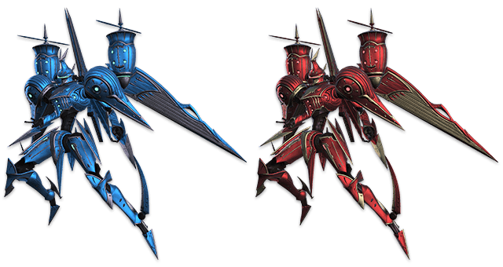 

巡航驱逐者（1号机）
;;;

;;;.guide .col 
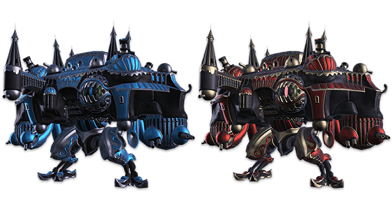 

压迫者（2号机）

;;;
;;;.guide .col .grow
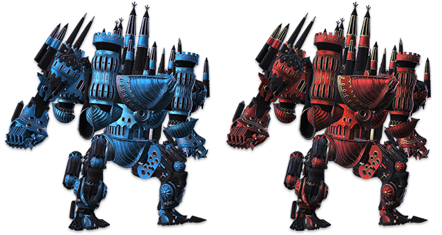

残暴正义号（3号机）

;;;
;;;

* 巡航驱逐者，一般被称为一号机：1技能对机甲造成大量伤害，2技能对玩家目标造成大量伤害，3技能为远程技能，对玩家和机甲伤害一般
* 压迫者，一般称为二号机，可以对防御塔和核心造成巨大伤害
* 残暴正义号，一般称为三号机：1技能对玩家、小兵、机甲、建筑均可造成大量伤害，3技能是超远距离的大伤害直线技能

机甲在烈羽争锋的战斗中十分重要，因此也包含有诸多的限制：
1. 每个小队同时只能有1名玩家搭乘1台机甲。
2. 启动机甲需要50点青磷水。
3. 机甲不能接受任何治疗。
4. 整个团队只能同时启动2台压迫者。
5. 仅仅在防御塔被破坏后，团队才会获得1次残暴正义号的驾驶机会，因此，不熟练的萌新请慎重驾驶以免造成队友的血压上升！

### 青鳞水
由于机甲需要青磷水能量才能启动，因此青鳞水是也是烈羽争锋中重要的一环！在破坏了敌人的自走人偶后，每个小队最多可以收集100点青鳞水，请善加利用吧~

青鳞水的获得条件：
* 在水区采集青鳞水罐：10
* 破坏自走人偶（根据伤害量分配）：最大20
* 破坏哥布林坦克（根据伤害量分配）：最大20
* 大容量青磷水罐：50
* 哥布式大份套餐：50

### 非玩家单位

;;;.guide .cols2 
;;;.guide .col
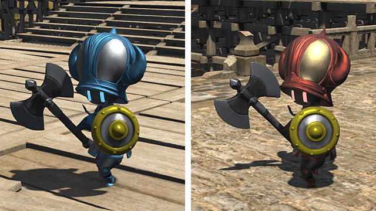 

自走维京人偶
;;;

;;;.guide .col 
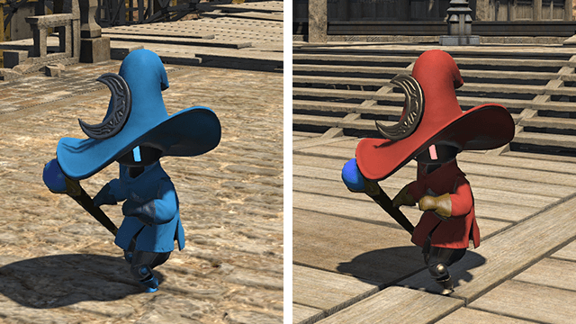 

自走法师人偶

;;;
;;;

自走人偶，一般被称为小兵、兵线。

自走人偶虽然不会攻击玩家，但一旦到达防御塔或核心，会自爆造成大量伤害，请务必注意敌方与我方的兵线位置！

;;;.guide .cols2 
;;;.guide .col
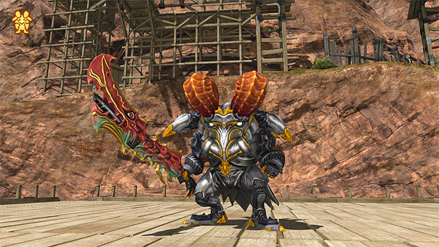 

哥布林佣兵
;;;

;;;.guide .col .grow
随着烈羽争锋的进行，场地会在南北随机刷新一名哥布林佣兵，通过两阵营对其造成的伤害进行判定，进而与一方结下契约。哥布林佣兵会提供巨大的帮助。

;;;
;;;

;;;.guide .cols2 
;;;.guide .col
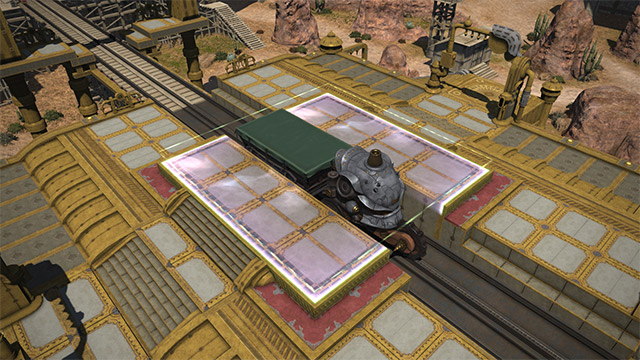 

青磷引擎车（俗称火车）
;;;

;;;.guide .col .grow

火车会在滴滴滴的预告后以超高速行驶出现在战场！随后停靠在车站，占领后即可获取火车携带的物资！

但是请注意，高速行驶的火车会秒杀途径的所有单位，请一定注意交通安全！不要卧轨或者被火车撞飞哦~ 

;;;
;;;

青磷引擎车会携带多种物资，物资不仅会带来帮助，还会为团队全体提升1点战意，请善用这些物资为自己取得胜利吧！
* 大容量青磷水罐：阵营所有小队各增加50青鳞水。
* 哥布式兴奋剂：阵营所有玩家的奋战槽（6.1前设定，6.1后由于pvp改版，暂时未知）提高到最大。
* 哥布林坦克认证钥匙：获得两路出击的强力帮手哥布林坦克
* 哥布式大份套餐：同时获得以上所有效果，仅会在战斗的后期出现哦

### 战意

打倒敌方、摧毁防御塔后会赋予全小队的<Status :id="1465" name="气势" />，给予不同程度的伤害量、恢复魔法、恢复能力的恢复量提高的效果。当档数达到20时，气势会变为<Status :id="1730" name="气势高昂" />。 

在搭乘机甲时气势是没有效果的哦~
| 获取气势的方式 | 获取对象及气势数值 |
| -- | -- |
| 打倒气势0-9的敌方 | 小队1 |
| 打倒气势10-19的敌方 | 小队2 |
| 打倒满气势敌方 | 小队3 |
| 破坏敌方防御塔 | 团队1 |
| 哥布林坦克认证密钥 | 团队1 |
| 大容量青磷水罐 | 团队1 |
| 哥布式兴奋剂 | 团队1 |
| 哥布式大份套餐 | 团队3 |

与纷争前线不同，在烈羽争锋中死亡不会损失气势。

### 新人小贴士

1. 原则上机甲能出就出，一号机主要处理敌方机甲，同时配合步兵处理兵线；二号机不要打人，不要打人，不要打人；三号机是烈羽争锋中最为重要的机甲之一且作用复杂，需要拥有对战斗局势的理解与判断，请各位萌新再更多了解之后再尝试三号机吧~
2. 在己方防御塔内拥有高额减伤，如果面对敌人是劣势状态，可以试着回到塔的防御范围内进行战斗
3. 烈羽争锋不要轻言放弃，随时都有翻盘的可能，挂机和家里打字键盘喷人都是被唾弃的行为哦！
4. 如果你选择了做一名水工，请注意青鳞水有上限，不要满100点后依然在做无意义的工作。同时，在满足己方出机甲的情况下，水工也需要经常支援步兵哦！
5. 你在纷争前线中学会的集火与单点技巧，均可以使用到烈羽争锋的战斗中来。
6. 隐塞本质是推塔游戏，一味地杀爽了并不一定能为你带来胜利，请多与队友交流配合，感受属于烈羽争锋的快乐吧！
