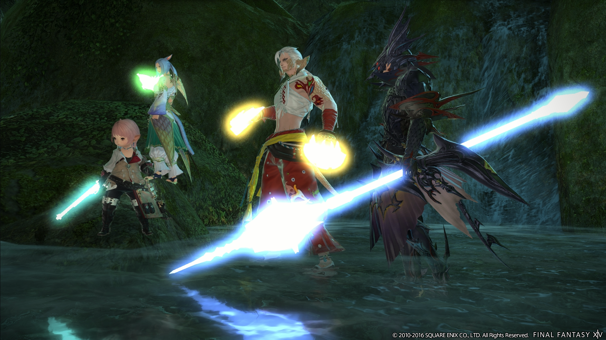
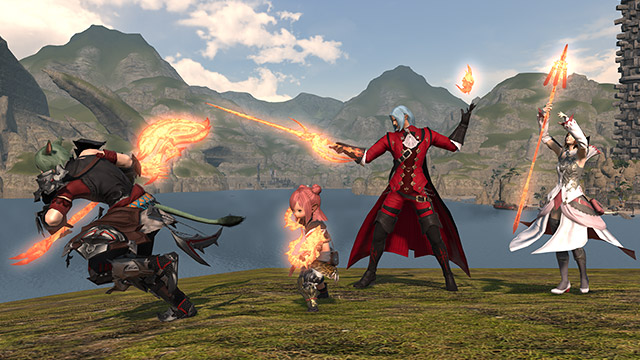

# 发光武器

在游戏中，有着多种多样的能发光的武器，大部分玩家都对这类武器满心向往，以下会列举游戏中所有的发光武器及获取方式。

## 深层迷宫武器

;;;.guide .cols2
;;;.guide .col .figcap

死宫武器
;;;
;;;.guide .col .figcap

天宫武器
;;;
;;;

深层迷宫是FF14中的一种特殊战斗玩法，里面的等级和装备信息是完全独立的（你裸着进去都不会有影响）。在深层迷宫中通过开启宝箱可以强化迷宫内的武器·防具等级，当积累了足够多强化等级，就可以消耗等级把武器“拿出来”。由于深层迷宫的武器发光方式比较特殊，在试穿界面也无法看到它真正的光效，最简单的还是用自己的职业进去跑一把。

关于深层迷宫的具体玩法和详细介绍可以看[这里](/topic/dd.md)。

## 蛮神武器

以往版本的蛮神，会随着版本更新而追加“制作武器”，通常是以极蛮神掉落的稀有材料作为基本素材，然后由工匠制作而成。

只有水神和冰神武器除外：水神发光武器需要先获得原来版本的武器，然后获得极水神掉落的<item name="水神魔镜" />，以1把武器+1个魔镜的方式兑换升级；冰神武器同样需要先获得原来版本的武器，然后每次通关极冰神获得<item name="钻石尘晶" />，用旧武器+5个尘晶兑换升级。兑换NPC均为艾里娜<Pos name="摩杜纳" :x="22.7" :y="6.7" />

另外部分蛮神发光武器也可以由深层迷宫宝藏开出，或雇员带回，也可以在交易板上交易，是新人较容易获得的发光武器。

::: collapse 蛮神发光武器检索索引
* 2.0蛮神：[风神](https://ff14.huijiwiki.com/wiki/ItemSearch?name=%E6%97%8B%E9%A3%8E&kind=1)、[火神](https://ff14.huijiwiki.com/wiki/ItemSearch?name=%E7%8B%B1%E7%81%AB&kind=1&rarity=3)、[土神](https://ff14.huijiwiki.com/wiki/ItemSearch?name=%E5%8E%9A%E5%9C%9F&kind=1)、[水神](https://ff14.huijiwiki.com/wiki/ItemSearch?name=%E6%B8%8A%E6%B0%B4&kind=1)、[冰神](https://ff14.huijiwiki.com/wiki/ItemSearch?name=%E5%86%B0%E7%A5%9E%E9%92%BB%E7%9F%B3)、[雷神](https://ff14.huijiwiki.com/wiki/ItemSearch?name=%E6%83%8A%E9%9B%B7)、[莫古](https://ff14.huijiwiki.com/wiki/ItemSearch?name=%E8%B4%A4%E7%8E%8B%E8%8E%AB%E5%8F%A4&kind=1)
* 3.0蛮神：[武神](https://ff14.huijiwiki.com/wiki/ItemSearch?name=%E5%81%83%E6%AD%A6&kind=1)、[云神](https://ff14.huijiwiki.com/wiki/ItemSearch?name=%E6%97%A0%E5%B0%BD%E4%BA%91%E7%A5%9E)、[骑神](https://ff14.huijiwiki.com/wiki/ItemSearch?name=%E5%9C%86%E6%A1%8C&kind=1)、[邪龙](https://ff14.huijiwiki.com/wiki/ItemSearch?name=%E9%82%AA%E9%BE%99%E6%80%A8%E5%BD%B1)、[魔神](https://ff14.huijiwiki.com/wiki/ItemSearch?name=%E7%94%9F%E5%91%BD)、[女神](https://ff14.huijiwiki.com/wiki/ItemSearch?name=%E7%A5%9E%E5%9C%A3%E5%A5%B3%E7%A5%9E)、[鬼神](https://ff14.huijiwiki.com/wiki/ItemSearch?name=%E6%97%A0%E9%99%90%E9%AC%BC%E7%A5%9E)。
* 4.0蛮神：[神龙](https://ff14.huijiwiki.com/wiki/ItemSearch?name=%E7%A5%9E%E9%BE%99%E6%A2%A6%E5%B9%BB)、[月读](https://ff14.huijiwiki.com/wiki/ItemSearch?name=%E6%9C%88%E8%AF%BB%E5%91%BD%E5%B9%BD%E5%A4%9C)、[白虎](https://ff14.huijiwiki.com/wiki/ItemSearch?name=%E7%99%BD%E5%B8%9D&kind=1)、[朱雀](https://ff14.huijiwiki.com/wiki/ItemSearch?name=%E6%9C%B1%E7%84%B0)、[青龙](https://ff14.huijiwiki.com/wiki/ItemSearch?name=%E9%9D%92%E5%90%9B&kind=1)
* 5.0蛮神：[哈迪斯](https://ff14.huijiwiki.com/wiki/ItemSearch?name=%E5%86%8D&kind=1)
:::

## 古武&魂武&优武

古武、魂武或优武都是对应版本的成长型武器，需要完成一定的任务目标才能够升级，武器在每个等级都会拥有不同的模型或光效，由于这属于消耗极长时间才能完成的内容，所以请放平心态，修身养肝。

> * [古武](./relic.md)，正式名称为上古武器/黄道武器（Relic weapon/Zodiac Weapons、古の武器/ゾディアックウェポン）。对应的是2.X版本，为50级的毕业武器，装等从80~135。
> * [魂武](./anima.md)，正式名称为元灵武器（Anima Weapons、アニマウェポン）。对应3.X版本，是60级的毕业武器，装等从170~275。
> * [优雷卡武器](./eureka-weapon.md)，禁地兵装（Eureka weapon、エウレカウェポン）对应4.X版本，是70级毕业武器，装等从290~405。需要在[优雷卡](./eureka.md)内完成。
> * [义军武器](./resistance.md)（Resistance Weapons、レジスタンス・ウェポン），对应5.x版本，装等为485~535。需要参与[南方博兹雅战线](./bozjan.md)的攻略。

不管你是否已经满级，都不推荐你立刻去做这些武器，因为制作它极其耗时，并且没有任何收益（除了帅）（虽然帅是一辈子的事），所以等你觉得无所事事的时候再去做吧。

这里有个视频，里面有所有职业的所有古武及魂武的360度全景展示，你们可以看到这些武器究竟有多闪——[视频点我跳转](https://www.bilibili.com/video/av11286019/)，[优雷卡武器预览](https://www.bilibili.com/video/BV1nt411J7mQ)
