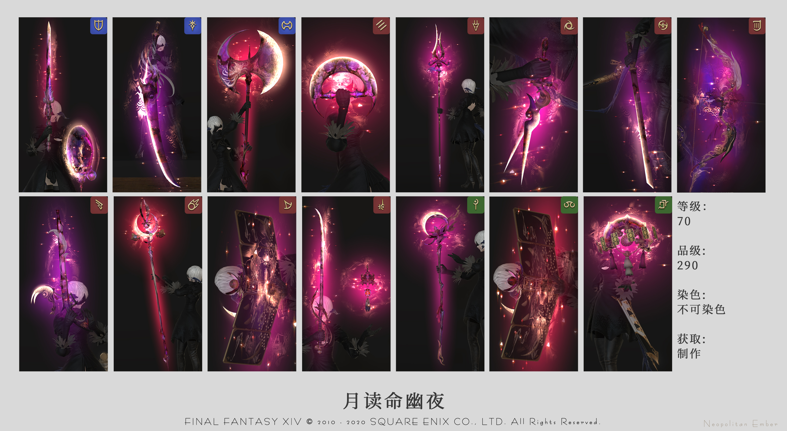
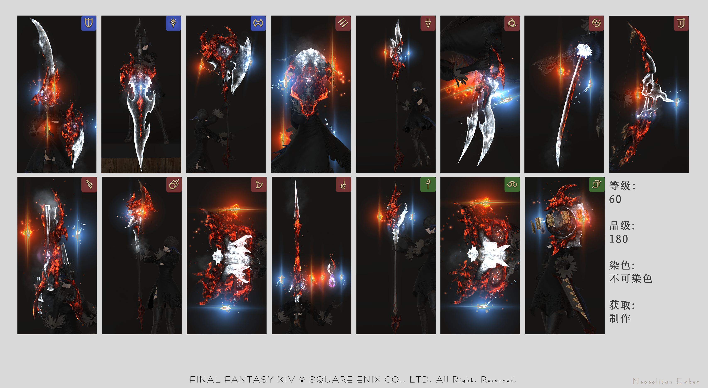
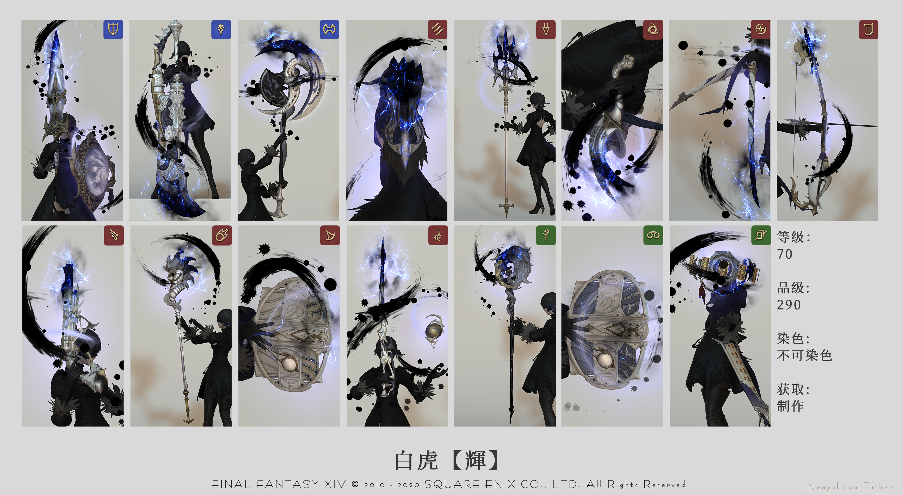
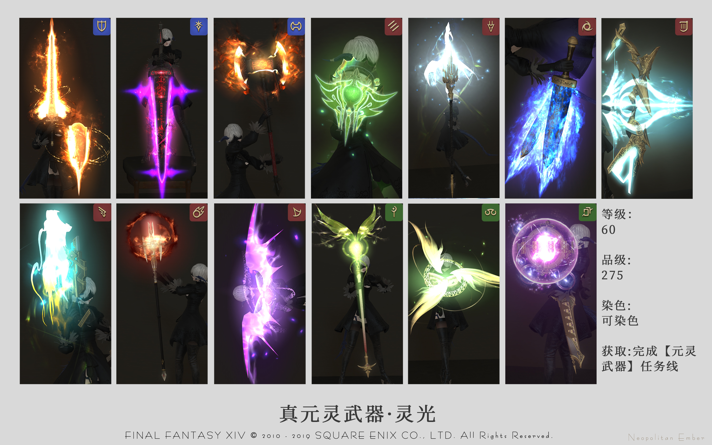
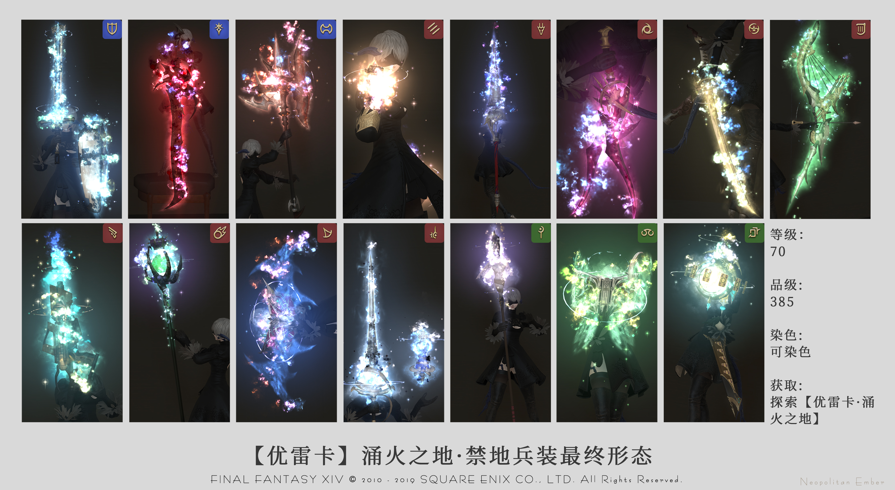
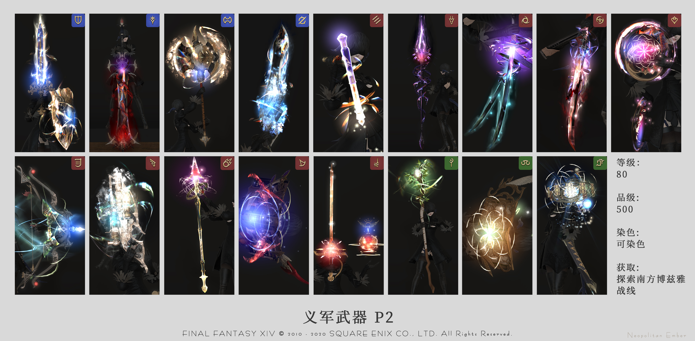
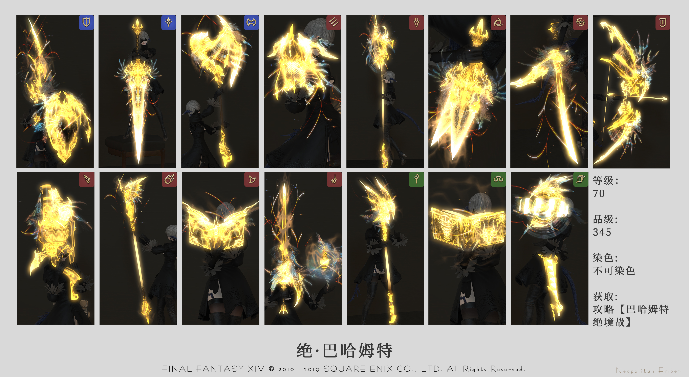
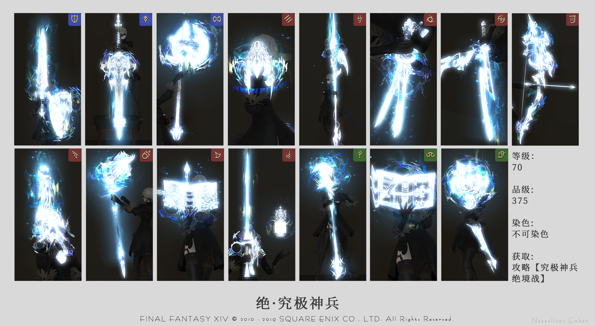
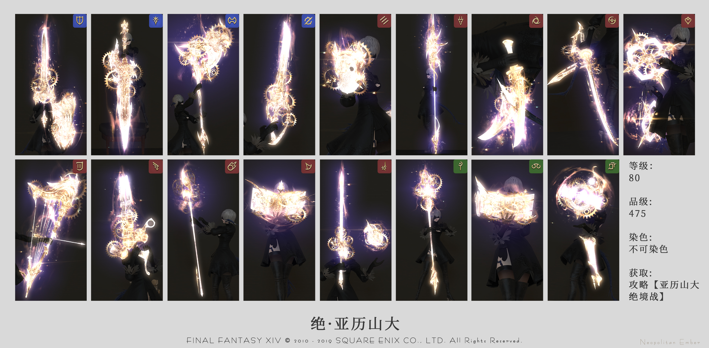

# 发光武器

在游戏中，有着多种多样的能发光的武器，大部分玩家都对这类武器满心向往，以下会列举游戏中所有的发光武器及获取方式。

## 深层迷宫武器

;;;.guide .cols2
;;;.guide .col .figcap

死宫武器
;;;
;;;.guide .col .figcap

天宫武器
;;;
;;;

深层迷宫是FF14中的一种特殊战斗玩法，里面的等级和装备信息是完全独立的（你裸着进去都不会有影响）。在深层迷宫中通过开启宝箱可以强化迷宫内的武器·防具等级，当积累了足够多强化等级，就可以消耗等级把武器“拿出来”。由于深层迷宫的武器发光方式比较特殊，在试穿界面也无法看到它真正的光效，最简单的还是用自己的职业进去跑一把。

关于深层迷宫的具体玩法和详细介绍可以看[这里](/topic/dd.md)。

## 蛮神武器

;;;.guide .cols3
;;;.guide .col .figcap

月读命幽夜武器¹
;;;
;;;.guide .col .figcap

无限鬼神武器¹
;;;
;;;.guide .col .figcap

白虎武器¹
;;;
;;;

以往版本的蛮神，会随着版本更新而追加“制作武器”，通常是以极蛮神掉落的稀有材料作为基本素材，然后由工匠制作而成。

只有水神和冰神武器除外：水神发光武器需要先获得原来版本的武器，然后获得极水神掉落的<item name="水神魔镜" />，以1把武器+1个魔镜的方式兑换升级；冰神武器同样需要先获得原来版本的武器，然后每次通关极冰神获得<item name="钻石尘晶" />，用旧武器+5个尘晶兑换升级。兑换NPC均为艾里娜<Pos name="摩杜纳" :x="22.7" :y="6.7" />

另外部分蛮神发光武器也可以由深层迷宫宝藏开出，或雇员带回，也可以在交易板上交易，是新人较容易获得的发光武器。

> [发光武器外观一览](https://bbs.nga.cn/read.php?tid=20459393&pid=398487531)

::: collapse 蛮神发光武器检索索引
* 2.0蛮神：[风神](https://garlandtools.cn/db/#list/fLtdy35Jah)、[火神](https://garlandtools.cn/db/#list/Dr4DHNl6KJ)、[土神](https://garlandtools.cn/db/#list/66MrWJ4JrD)、[水神](https://garlandtools.cn/db/#list/men5SWrwjD)、[冰神](https://garlandtools.cn/db/#list/Nzh8ozDsyd)、[雷神](https://garlandtools.cn/db/#list/8uPOAK919A)、[莫古](https://garlandtools.cn/db/#list/Xn2RlpZmmk)
* 3.0蛮神：[武神](https://garlandtools.cn/db/#list/Q2UJX2nP8H)、[云神](https://garlandtools.cn/db/#list/0DJ3V0jQP9)、[骑神](https://garlandtools.cn/db/#list/V1EFOzOOdM)、[邪龙](https://garlandtools.cn/db/#list/999l2G6nZ9)、[魔神](https://garlandtools.cn/db/#list/TgNTQhi1HT)、[女神](https://garlandtools.cn/db/#list/BGqb9dW8cZ)、[鬼神](https://garlandtools.cn/db/#list/ui6cJnyoz6)。
* 4.0蛮神：[神龙](https://garlandtools.cn/db/#list/IxEeV9qkgv)、[月读](https://garlandtools.cn/db/#list/Flzgf6psK1)、[白虎](https://garlandtools.cn/db/#list/6x42ctdNnf)、[朱雀](https://garlandtools.cn/db/#list/L8uplhC78i)、[青龙](https://garlandtools.cn/db/#list/78UxTHJ6eI)
* 5.0蛮神：[哈迪斯](https://garlandtools.cn/db/#list/g6FjZIgiKU)
:::

## 古武&魂武&优武&义武

;;;.guide .cols3
;;;.guide .col .figcap

60级发光武器，真元灵武器·灵光¹
;;;
;;;.guide .col .figcap

70级禁地兵装，优雷卡武器·涌火¹
;;;
;;;.guide .col .figcap

80级义军武器·回忆¹
;;;
;;;

古武、魂武或优武都是对应版本的成长型武器，需要完成一定的任务目标才能够升级，武器在每个等级都会拥有不同的模型或光效。这些武器的制作属于消耗极长时间才能完成的内容，所以请放平心态，修身养肝。

> * [古武](./relic.md)，正式名称为上古武器/黄道武器（Relic weapon/Zodiac Weapons、古の武器/ゾディアックウェポン）。对应的是2.X版本，为50级的毕业武器，装等从80~135。
> * [魂武](./anima.md)，正式名称为元灵武器（Anima Weapons、アニマウェポン）。对应3.X版本，是60级的毕业武器，装等从170~275。
> * [优雷卡武器](./eureka-weapon.md)，禁地兵装（Eureka weapon、エウレカウェポン）对应4.X版本，是70级毕业武器，装等从290~405。需要在[优雷卡](./eureka.md)内完成。
> * [义军武器](./resistance.md)（Resistance Weapons、レジスタンス・ウェポン），对应5.x版本，装等为485~535。需要参与[南方博兹雅战线](./bozjan.md)的攻略。

不管你是否已经满级，都不推荐你立刻去做这些武器，因为制作它极其耗时，并且没有任何收益（除了帅）（虽然帅是一辈子的事），所以等你觉得无所事事的时候再去做吧。

这里有个视频，里面有所有职业的所有古武及魂武的360度全景展示，你们可以看到这些武器究竟有多闪——[视频点我跳转](https://www.bilibili.com/video/av11286019/)，[优雷卡武器预览](https://www.bilibili.com/video/BV1nt411J7mQ)

## 绝本武器

;;;.guide .cols3
;;;.guide .col .figcap

绝巴哈武器¹
;;;
;;;.guide .col .figcap

绝神兵武器¹
;;;
;;;.guide .col .figcap

绝亚历山大武器¹
;;;
;;;

绝境战是游戏中最高难度的战斗内容，一场战斗持续15~20分钟，几乎没有喘息的空间，同时高密度的机制让人头皮发麻，无数的队伍在征战的途中分崩离析甚至反目成仇。

随着版本的更新和数值的膨胀，绝境战的输出压力已经越来越小，但是复杂的机制和长时间的战斗仍然是其难度的证明。想要获得它，无不需要认真的准备，充足的时间，值得信赖的同伴和不懈的努力。

对于拥有这些武器的玩家来说，这些武器不仅仅是一把发光的武器，同时也代表着玩家在超高难度战斗中拥有着不俗的实力，以及它背后所蕴含的一段段或美好或苦涩的回忆。其他玩家看到这些武器，经常也会对它们的持有者有更高的要求和期待。

如果你想要接受挑战，尝试获得这把武器的话，可以[点击这里](/topic/raid.md)查看参与挑战副本的方法和顺序。

:::segment grey

[1].图片内容来自NGA 冰色之舞，原文链接：[人偶兵装](https://bbs.nga.cn/read.php?tid=20459393&pid=398487531)。

:::