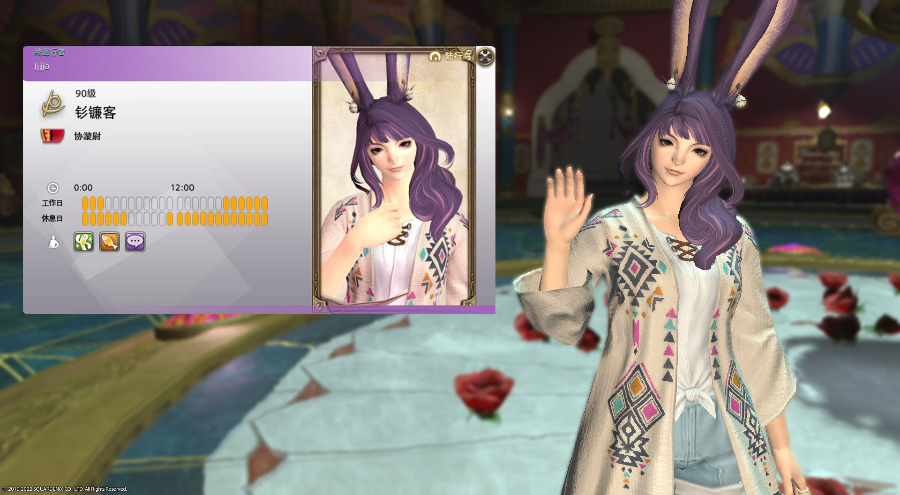

# 社群与社交

FF14作为网游，也具有相当的社交功能，通过这些功能来寻找与自己志同道合的小伙伴吧！

## 个人信息

打开小队窗口（菜单 > 小队 > 小队队员，默认快捷键`O`），右键自己的名字可以==编辑信息==：
- 名字下方的下拉菜单可以修改自己的在线状态，如果不想显示任何图标，可以选择==在线==。
  - 若状态为==忙碌中==，则会自动拒绝所有交易申请。
  - 若状态为==希望组队==，则下方的职业按钮会亮起；被选中的职业均会在玩家搜索的结果中展示。（比如我同时点亮了战士和白魔，与此同时我目前的职业是召唤，那么无论搜索战士，还是白魔或召唤，都可以在搜索结果中找到我）
  - 完整的状态列表可以参见[wiki上的相关介绍](https://ff14.huijiwiki.com/wiki/%E5%9C%A8%E7%BA%BF%E7%8A%B6%E6%80%81)
- 最下方的个人签名会显示在玩家的个人信息中（右键玩家==调查==，鼠标放在ID名字前面的气泡符号上可以查看）。

## 冒险者铭牌

;;;.guide .cols2
;;;.guide .col

冒险者铭牌
;;;

;;;.guide .col .grow

冒险者铭牌是一套可以展示角色和玩家信息的角色卡系统，分为冒险者名牌和肖像列表两部分。在==菜单 > 角色 > 冒险者铭牌==中，可以打开冒险者铭牌及其相关设置。

目前的冒险者铭牌为测试版，肖像列表对职业、装备要求限制较多，建议不要急于编辑保存过多肖像，待正式版上线之后再制作更多肖像。

将肖像设置为对战肖像之后，可以在[水晶冲突](/topic/pvp.md)开场时进行展示。

将冒险者铭牌设为所有人可见之后，所有人都可以右键你的名字 > 查看冒险者铭牌。

;;;
;;;

## 玩家部队

部队是由玩家自行组成的工会系统，部队成员的一切游戏内活动都可以为部队带来战绩，部队战绩则可以用于兑换部队使用的buff、飞空艇/潜水艇燃料、家具等等。

新玩家只能被他人邀请加入部队。进入部队后，除了能获得部队buff的加成，也可以使用部队频道（`/fc`）随时随地与部队成员交流，更轻松方便地进行游戏。有的部队会定期组织各种小活动，有的部队还会在部队储物柜中存放一些赠送新人的小礼物等等。

**注意：部队储物柜储存的物品/资金为全部队共有，部队长可以设置成员组使用权限，切勿当做个人仓库使用。另外从部队储物柜中拿东西的时候，也请尽量告知其他部队成员，以免造成误会。**

如果你加入的部队有自己的部队房屋，你还可以以较低的价格，在部队房屋中购买宿舍，宿舍和其他个人房屋一样，可以进行装修等玩法。同时部队房屋还会拥有部队工房，在工房内可以合建飞空艇、潜水艇，派遣探索会有概率获得稀有道具。

如果你觉得自己所在的部队不舒服、不喜欢，也可以随时退出（有部队宿舍的玩家需要先退宿舍）。怀着友好的心情去寻找属于你的那份友谊吧！

关于建立部队、部队buff、工房等相关内容的详细信息，请参看[wiki上的介绍页面](https://ff14.huijiwiki.com/wiki/%E9%83%A8%E9%98%9F)。

## 住宅区与房屋

;;;.guide .col

初始三城房区概念图
;;;

在利姆萨‧罗敏萨、格里达尼亚、乌尔达哈、黄金港和伊修加德，有各城邦国家为冒险者准备的住宅小区。玩家可以通过完成住宅区任务或从野外入口（黄金港住宅区没有野外入口）直接进入。

每个住宅区有24个小区，每个小区分为初始区（房号1~30）和扩展区（房号31~60），另外每个区还单独配有一栋公寓楼。初始区和扩展区的房屋/景色分布一致，但朝向不同。

### 房屋

住宅区内的地块分为大中小3种尺寸，每种尺寸又分为1~5等，这些分类会影响地块的售价，以及可建造房屋的大小。大尺寸地块只能建大型房屋，小尺寸地块只能建小型房屋。

玩家可以通过点击未出售地块门前的门牌进行购买（目前为抽选制，即需要在门牌支付全款登记购买意向，等抽选结束后获得土地所有权，或收回抽选资金），地块可以购买为个人房屋或部队房屋（目前为小区指定，个人房小区不可购买部队房、部队房小区不可购买个人房），每名玩家只能拥有至多1个个人房和1个部队房（部队房为全部队成员共享）。 **如果同一账号下角色拥有房屋数量超过该限制，将会被系统判定为违规账号并进行处罚。** 当房屋超过45天无人进入时，会被系统自动回收（个人房必须房主进入，部队房只要有部队成员进入即可）。

房屋庭院可以放置园圃进行杂交种植，还可以放置鸟棚，喂养、训练搭档陆行鸟。

部队房可以设置部队工房，进行飞空艇、潜水艇以及其他大型建设项目的合建。部队成员可以在部队房内购买宿舍间，宿舍是玩家可以购买到的最便宜的房间。

> * [艾欧泽亚售楼中心](https://house.ffxiv.cyou/#/)：查看目前正在出售的房屋信息
> * 关于房屋购买、权限、搬家等更多更详细的信息，可以查看[wiki介绍页面](https://ff14.huijiwiki.com/wiki/%E6%88%BF%E5%B1%8B)。

### 公寓

每个小区都配有一栋公寓楼，每栋公寓有512个房间，理论上说可以人手一间公寓还有富余。

公寓的房间面积/容量和部队宿舍一样，公寓楼门口有公共的鸟棚可以用来练鸟。

### 房屋玩法

所有的房屋、房间都可以进行装修，很多玩家会将装修好的房屋作为“店铺”开放，这些店铺经常会在招募板上进行宣传，有兴趣的玩家可以关注招募板上的信息。

除了店铺之外，也有讲座、剧场、其他游戏捏他、迷宫等等多种类型的社交玩法，甚至有联合一整个小区的房屋做出“花街”商业区似的做法。这些信息都可以在[@艾欧泽亚RP情报站](https://weibo.com/n/%E8%89%BE%E6%AC%A7%E6%B3%BD%E4%BA%9ARP%E6%83%85%E6%8A%A5%E7%AB%99)上找到。

装修本身也是玩家们中意的玩法，无论是古典、乡村、现代、蒸汽朋克、未来科技乃至实验艺术风格，都有玩家涉猎，是充满设计和动手操作乐趣的玩法。

> 有以下一些网站可以查看装修相关的信息：
> - [@艾欧泽亚装修办](https://weibo.com/u/6255557911)：国内装修玩家投稿网站
> - [FF14ハウジング](https://ff14housing.com/)：FF14家具预览网站，虽然有中文版，但是更新速度较慢，建议使用英语/日语版，查到家具名称后前往wiki搜索。
> - [FF14ハウジングSS](https://housingsnap.com/)：日服装修投稿网站
> - 在社交媒体上搜索#FF14housing #FFXIVhousing #FF14ハウジング #FF14装修 之类的话题，B站也有大量装修视频教程。

## 通讯贝

通讯贝是类似于QQ群的游戏内通信群，每名玩家可以加入8个本服通讯贝（`/l1~/l8`），以及8个跨服通讯贝（`/cwl1~/cwl8`）。

如果你有好友需要交流，但不方便变更部队，就可以加入通讯贝来沟通。

另外通讯贝也经常用于亲友闲聊、RP活动、播报狩猎信息、特殊fate信息，或者组队攻略游戏内容等等，可随意使用。

在三主城都有**通讯贝发行人**，找他们对话就可以建立通讯贝。创立者和设定的“队长”可以邀请他人进入通讯贝，被邀请的玩家需要在通讯贝界面进行确认。

游戏中其他交流方式可以参看[本页](/basic/communication.md)了解。

## 同好会

同好会是类似论坛的社群形式，玩家可以通过菜单 > 社交 > 同好会搜索并加入同好会。会长可以通过同好会吸收有相同志向、乐趣的玩家，也可以发布活动公告，在同好会的成员可以参与投票、发表留言（最多记录最近100件）。