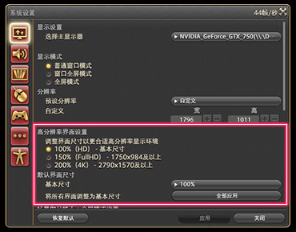
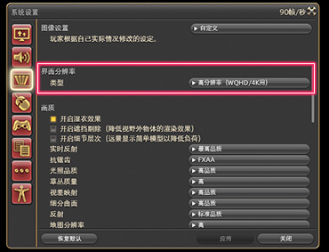
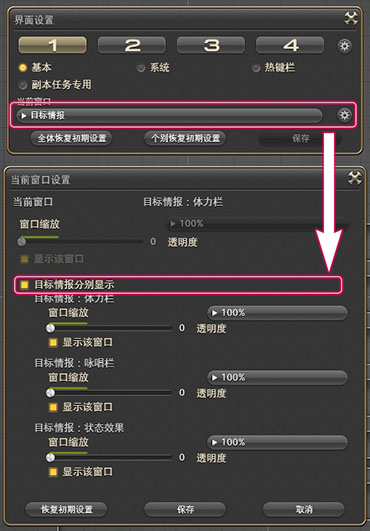
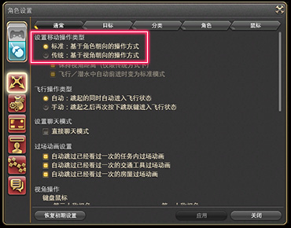

# 让战斗更方便的设置

调整界面到自己最舒服的状态，就是改善游戏体验的最佳方法，如果你还没调整过游戏界面的话，先去[调整一下界面](/ui/how.md#改变界面部件的布局)吧！

## 显示

;;;.guide .cols2
;;;.guide .col

;;;

;;;.guide .col .grow
如果你是高分辨率屏幕，刚进游戏的时候，游戏界面的UI尺寸都会特~别~小。在快捷指令 > 系统 > 系统设置 > 显示设置中，可以针对高分辨率屏幕进行整体的UI界面放大。

::: collapse 放大了，但是文字特别糊

放大后如果发现文字边缘模糊，那么需要检查你的系统缩放（在Windows设置中，找到显示设置 > 缩放与布局），若系统缩放不为100%，则需要找到你游戏文件夹中的`ffxiv_dx11.exe`，右键 > 属性 > 兼容性 > 更改高DPI设置 > 高DPI缩放替代，勾选“替代高DPI缩放行为”，同时下拉框改成“应用程序”，再在游戏中进行缩放调整。

:::

另外在界面设置中，也可以单独针对每一个窗口组件进行缩放（快捷键`Ctrl`+`HOME`）

※聊天窗口的文字大小需要单独设置，参见[这里](/basic/communication.md#聊天窗口的设置)。

;;;
;;;

;;;.guide .cols2
;;;.guide .col

;;;

;;;.guide .col .grow

游戏内置了高清的图片和文字资源，但是默认情况下是关闭的，只要你的电脑没有极其严重的性能问题，无论你屏幕分辨率是多少，都推荐使用高清资源：

在快捷指令 > 系统 > 系统设置 > 图像设置 > 界面分辨率中，类型的下拉菜单中选择“高分辨率（WQHD/4K 用）”。

;;;
;;;

## 目标

### 显示目标所剩的HP

;;;.guide .cols2
;;;.guide .col

;;;

;;;.guide .col .grow
迷宫副本中，BOSS会根据剩余血量切换阶段，或者使用特定的攻击，因此关注到BOSS血量的玩家也开始变多了。

为了方便观察，可以启用“显示所选目标的体力百分比”的功能。

在快捷指令 > 系统 > 角色设置 > 界面设置 > 界面中，勾选“显示所选目标的体力百分比”。

※开启之后，目标信息和焦点目标信息都会有所显示。

Tips:
战斗中有多个敌人的时候，将BOSS设为焦点，这样在与其他敌人战斗的时候，也可以查看到BOSS的剩余血量，非常方便。
;;;
;;;

### 放大目标的咏唱栏

;;;.guide .cols2
;;;.guide .col

;;;

;;;.guide .col .grow

在很多战斗中，经常需要通过观察BOSS的咏唱栏来进行移动，将目标信息拆分后，就可以单独把目标的咏唱栏拖出来并放大了。

在快捷指令 > 系统 > 界面设置中，找到“目标情报”窗口，并点击它右侧的齿轮按钮。在弹出的窗口中选中“目标情报分别显示”。

这样就可以分别设置目标的体力栏，咏唱栏和状态效果的尺寸和位置了。把它们放到显眼的地方吧！

;;;
;;;

## 视角

### 操作模式与视角

;;;.guide .cols2
;;;.guide .col

;;;

;;;.guide .col .grow
如果你有其他游戏的经验，并且觉得FF14的操作方式让你觉得不习惯，可以尝试修改移动操作的类型。如果你是第一次玩这种游戏，可以两种模式都体验一下，然后选择一种最舒服的操作模式。

标准操作模式的特点是相机视角与角色视角分辨控制，而传统模式是根据相机视角控制角色视角。两种模式各有特点，具体的区别和调整方式可以参见[游戏设置详解](/basic/config.md#角色设置)。
;;;
;;;

### 想让视角的移动速度更快一点

;;;.guide .cols2
;;;.guide .col

;;;

;;;.guide .col .grow
视角的移动速度，可以在 快捷指令 > 系统 > 角色设置 > 操作设置中的全体选项卡中，调整控制视角下的“使用摇杆时的视角回转速度”或“使用键盘时的视角回转速度”以及“角色转身速度”。

视角移动速度只要稍作调整，就会有很大变化，推荐调整到自己觉得舒服的数值。

推荐数值：视角回转速度推荐调整到50~80；角色转身速度推荐调整80~100；数值越高，速度越快。
;;;
;;;

### 视角太低了，看不清机制

视角可以在快捷指令 > 系统 > 角色设置 > 操作设置中的全体选项卡中，控制视角下的“第三人称视角俯视角度”调整。调整过俯视视角之后，就可能能更容易看清画面，也更容易躲开敌人的攻击了，如果觉得看着不舒服的话，就调整一下视角吧。

;;;.guide .cols2
;;;.guide .col .figcap

第三人称视角俯视角度：20
;;;
;;;.guide .col .figcap

第三人称视角俯视角度：80
;;;
;;;

> [想了解更多关于游戏设置的内容](/basic/config.md)：完整介绍了游戏设置中所有的设置选项。