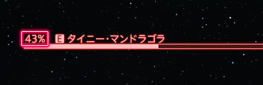
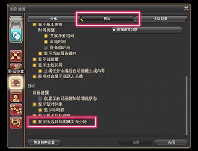
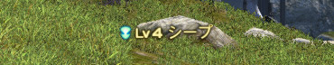
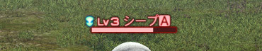
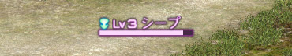
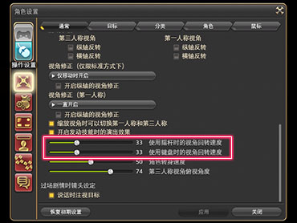
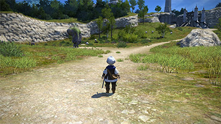
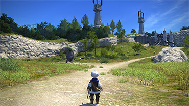

# バトル

## ターゲット

### Q: ターゲットの残りHPをパーセントで表示したい

;;;.guide .cols2
;;;.guide .col

;;;

;;;.guide .col .grow
序盤以降のコンテンツでは、ボスの残りHPによりフェーズの切替や特定の攻撃が行われる事があり、よりHPを意識してプレイしていくことが多くなります。

そんな時に便利なのが、ターゲットの残りHPをパーセント表示できる「HP比率の表示設定」です。有効にすると、より細かくHPの状況が確認できます。

設定は、メインコマンド＞システムメニュー＞キャラクターコンフィグ＞ユーザーインターフェース設定＞HUDタブにある「選択対象のHP比率を表示する」チェックボックスで行えます。

※有効にした設定は、ターゲット情報およびフォーカスターゲット情報に反映されます。

Tips:
ボス戦で複数の敵と戦う場合、ボスにフォーカスターゲットして他の敵と戦えば、他の敵にターゲットしていてもボスのHPを確認できて便利です。
;;;
;;;

## ネームプレート

### Q: 敵ネームプレートの色の違いってなに？

敵のネームプレートは、対象との交戦状態やターゲット状態により色が変わります。

;;;.guide .cols2
;;;.guide .col

;;;
;;;.guide .col .grow
誰とも戦っていない、非戦闘状態の敵
;;;
;;;

;;;.guide .cols2
;;;.guide .col

;;;
;;;.guide .col .grow
自PCもしくはパーティメンバーが最初に攻撃した、交戦中の敵
;;;
;;;

;;;.guide .cols2
;;;.guide .col

;;;
;;;.guide .col .grow
好戦的な敵が攻撃している状態、またはリンク中の敵
;;;
;;;

;;;.guide .cols2
;;;.guide .col

;;;
;;;.guide .col .grow
自PCもしくはパーティメンバー以外が最初に攻撃した、交戦中の敵
;;;
;;;

### Q: 敵に表示されるアイコンの違いってなに？

;;;.guide .cols2
;;;.guide .col

;;;

;;;.guide .col .grow
敵ネームプレートの左にあるアイコンは、対象が好戦的な敵かどうかを表しています。アイコンの形状は、対象の種別や強さによって変わります。

**①青いアイコン**
近づいても襲われない、非好戦的な敵です。

**②赤いアイコン**
近づくと襲ってくる、好戦的な敵です。注意しましょう。
※自身のレベルがあがると、襲われにくくなります。

そのほか、敵のネームプレートには、F.A.T.E.など、特定のコンテンツ対象になっている場合にも専用のアイコンが表示されます。詳細は[こちら](https://jp.finalfantasyxiv.com/lodestone/playguide/win/view/#g_bnpc)。
;;;
;;;

関連：
[Q: クエストアイコンの違いってなに？](https://jp.finalfantasyxiv.com/uiguide/faq/#entry-interface_npc_icon)

## カメラ

### Q: カメラの回転速度を早くしたい

;;;.guide .cols2
;;;.guide .col

;;;

;;;.guide .col .grow
カメラの回転速度は、メインコマンド＞システムメニュー＞キャラクターコンフィグ＞操作設定＞全般タブ、カメラ操作設定にある「スティックでのカメラ回転速度」または「キーボードでのカメラ回転速度」のスライダーで調整できます。

※数字を増やすと、回転速度が速くなります。

カメラの回転速度は、少し調整するだけでも周囲を見渡す時間が短縮できるので、快適な速さに調整しておくのがオススメです。
;;;
;;;

### Q: カメラの角度が低すぎて、ギミックが見えにくい

カメラの角度は、メインコマンド＞システムメニュー＞キャラクターコンフィグ＞操作設定＞全般タブ、カメラ操作設定にある「カメラの注視角度設定（チルトカメラ）」のスライダーで調整できます。カメラの角度次第で、画面がより見やすくなり敵の攻撃をよけやすくなることもあるので、少しでも見えにくいと感じたらこまめに調整していきましょう。

;;;.guide .cols2
;;;.guide .col .figcap

カメラの注視角度：20
;;;
;;;.guide .col .figcap

カメラの注視角度：80
;;;
;;;
