# 社交系统

## 名牌

### Q: 分不清NPC和玩家

;;;.guide .cols2
;;;.guide .col
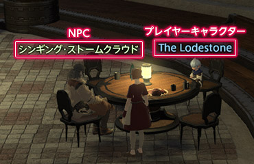
;;;

;;;.guide .col .grow
区分目标角色是玩家还是NPC的方法，就是查看角色头顶名牌的沿着。

在默认情况下，浅绿色的是NPC，而蓝色的则是其他玩家操作的角色。
;;;
;;;

### Q: 为什么其他玩家角色的名牌颜色还都不一样？

;;;.guide .cols2
;;;.guide .col
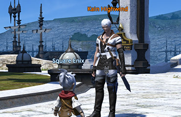
;;;

;;;.guide .col .grow
自己看到他人名牌的颜色，会根据自己与对方的关系不同而发生变化。

默认情况下，对方如果是好友的话，名牌就是橙色，如果是小队成员的话，则是浅蓝色。
;;;
;;;

### Q: 想要改变角色名牌的颜色

;;;.guide .cols2
;;;.guide .col

;;;

;;;.guide .col .grow
角色名牌的颜色可以通过快捷指令 > 系统 > 角色设置 > 名牌设置中的各个标签进行改变。

选择想要改变颜色的对象，点击后就会打开调色板，选一个你中意的颜色吧。

Tips：
每项下面的下拉菜单可以改变名牌显示的规则。如果看不清画面的话，可以在这里将部分名牌设置为不显示。
;;;
;;;

## 聊天

在最终幻想14里，可以通过聊天窗口轻松地与其他冒险者进行聊天。
和其他玩家交流是MMO游戏的精髓，放心大胆地发言吧！

### Q: 请告诉我游戏里的聊天类型

游戏内的聊天，根据聊天对象的距离、所属分组而区分了很多对话频道。
因此，需要选择恰当的对话频道与交流对象进行交谈。
使用文本指令的话，不切换频道也可以快速在指定频道发言。

| 交流频道           | 目标对象                                   | 可见范围       | 文本指令                                             |
| -------------------- | -------------------------------------- | ------------------------ | ------------------------------------------------------------ |
| 说话                  | 自身周边小范围的人     | 仅限自己周围小范围 | /say 你好！ /s 你好！                       |
| 呼喊                 | 自身周边大范围的人     | 仅限自己周边大范围 | /yell 你好！ /y 你好！                      |
| 喊话                | 同一地图的所有角色     | 自己所在的地区     | /shout 你好！ /sh 你好！                    |
| 悄悄话                 | 指定的1名角色         | 无论对方在哪都可以看到   | /tell   角色名@服务器名 你好！ /t 角色名@服务器名   你好！ |
| 小队                | 小队成员              | 无论对方在哪都可以看到   | /party 你好！ /p 你好！                     |
| 团队             | 团队成员              | 无论对方在哪都可以看到   | /alliance   你好！ /a 你好！                |
| 部队          | 所属部队成员           | 无论对方在哪都可以看到   | /freecompany   你好！ /fc 你好！            |
| 通讯贝            | 所属通讯贝成员         | 无论对方在哪都可以看到   | /linkshell编号   你好！ /l编号 你好！       |
| 跨服通讯贝 | 所属跨服通讯贝成员     | 无论对方在哪都可以看到   | /cwlinkshell   你好！ /cwl 你好！           |
| 新人频道             | 新人频道成员          | 无论对方在哪都可以看到   | /beginner   你好！ /b 你好！                |

### Q: 不知道要怎么聊天

不管向哪个频道说话，都要使用聊天窗口。

##### 来试试聊天吧！

##### ① 从左边的小气泡按钮中选择想要发言的交流频道！

;;;.guide .cols2
;;;.guide .col

;;;

;;;.guide .col .grow
点击聊天窗口左下角的小气泡按钮，会弹出子命令菜单，从中选择想要使用的交流频道。

※如果你没有加入对应组别，有部分频道可能不会显示。
※选择频道之后，输入框上方会显示频道名。
;;;
;;;

##### ② 按【回车】键，或者单机输入框就可以输入了！

;;;.guide .cols2
;;;.guide .col
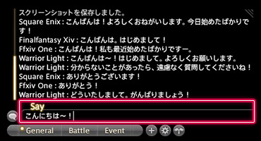
;;;

;;;.guide .col .grow
向各个频道发言的方法，根据你是否开启了直接聊天模式而有所区别。

**未开启直接聊天模式**
先按下【回车】键或单击输入框，然后输入想说的话。

**开启直接聊天模式**
直接输入想说的话。

相关阅读：
[Q: 直接聊天模式是什么？](https://jp.finalfantasyxiv.com/uiguide/communication/#entry-chat_directmode)
;;;
;;;

##### ③ 再次按下【回车】键，就可以发送聊天内容了！

;;;.guide .cols2
;;;.guide .col

;;;

;;;.guide .col .grow
输入完内容之后，再次按【回车】键，就可以向指定频道发送内容了！

※聊天窗口中也会出现自己的发言。
;;;
;;;

### Q: 直接聊天模式是什么？

;;;.guide .cols2
;;;.guide .col
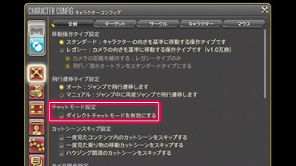
;;;

;;;.guide .col .grow
“直接聊天模式”就是在说话之前，不用按回车键，直接用键盘输入内容就可以的非常方便的功能。

但是，如果打开直接聊天模式的话，就无法使用键盘快捷键了，因此不需要直接聊天模式的话，记得把它关掉。

※开关直接聊天模式在角色设置 > 操作设置中的设置聊天模式下，选择“开启直接聊天模式”。
;;;
;;;

### Q: 想不分对象，向所有人聊天

;;;.guide .cols2
;;;.guide .col

;;;

;;;.guide .col .grow
不选择特定的对象，想跟周围的人聊天时，可以使用【说话】【呼喊】【喊话】频道！

不同频道可传播的距离是不一样的。

【说话】频道只能传播到周围很小范围的人群，而【呼喊】的传播范围要比【说话】大得多，而【喊话】频道的发言可以传播到当前地图的每一个角落。

相关阅读：
[Q: 请告诉我游戏里的聊天类型](https://jp.finalfantasyxiv.com/uiguide/communication/#entry-chat_type)
;;;
;;;

### Q: 想跟某一个人说悄悄话

;;;.guide .cols2
;;;.guide .col

;;;
;;;.guide .col
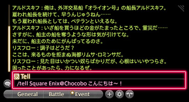
;;;
;;;

只想两个人说悄悄话的时候，就使用【悄悄话】频道吧！

只要对方在线，无论他在哪里，都能收到【悄悄话】频道的聊天信息（在副本战斗、剧情动画中，会提示无法使用悄悄话功能）。

**开始聊天的方法**
① 右键聊天对象的角色名，选【择发送悄悄话】！
② 输入文字！
③ 按【回车】键发送！

相关阅读：
[Q: 请告诉我游戏里的聊天类型](https://jp.finalfantasyxiv.com/uiguide/communication/#entry-chat_type)

### Q: 想和小队成员说话

;;;.guide .cols2
;;;.guide .col
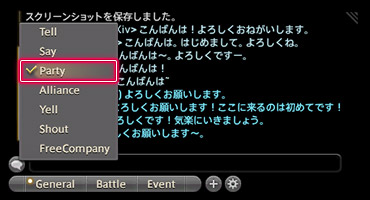
;;;
;;;.guide .col
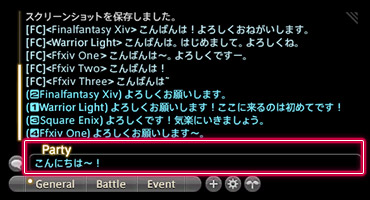
;;;
;;;

想对小队成员说话的话，就选择【小队】频道吧！

使用【小队】频道的话，无论队友在多遥远的地方，都能收到聊天信息。

**开始聊天的方法**
从聊天窗口选择【小队】，然后输入想说的话。

相关阅读：
[Q: 请告诉我游戏里的聊天类型](https://jp.finalfantasyxiv.com/uiguide/communication/#entry-chat_type)

### Q: 想跟部队成员说话

;;;.guide .cols2
;;;.guide .col
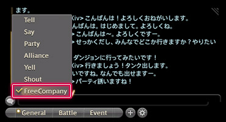
;;;
;;;.guide .col
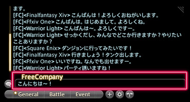
;;;
;;;

想跟自己部队的成员说话的时候，就选择【部队】频道吧！

使用【部队】频道的话，无论部队成员在多遥远的地方，都能收到聊天信息。

**开始聊天的方法**
从聊天窗口选择【部队】，然后输入想说的话。

相关阅读：
[Q: 请告诉我游戏里的聊天类型](https://jp.finalfantasyxiv.com/uiguide/communication/#entry-chat_type)

### Q: 想跟通讯贝成员说话

;;;.guide .cols2
;;;.guide .col
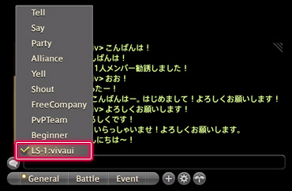
;;;
;;;.guide .col
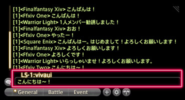
;;;
;;;

想跟加入的通讯贝成员说话的话，就选择【通讯贝】频道吧！

使用【通讯贝】频道的话，无论通讯贝成员在多遥远的地方，都能收到聊天信息。

**开始聊天的方法**
从聊天窗口选择【通讯贝】，然后输入想说的话。

※在子命令菜单中，会显示所加入的通讯贝列表。

相关阅读：
[Q: 请告诉我游戏里的聊天类型](https://jp.finalfantasyxiv.com/uiguide/communication/#entry-chat_type)

### Q: 想跟团队成员说话

;;;.guide .cols2
;;;.guide .col
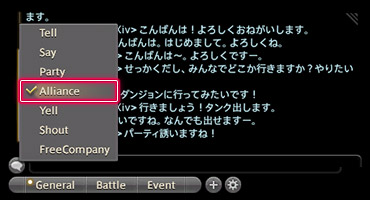
;;;
;;;.guide .col
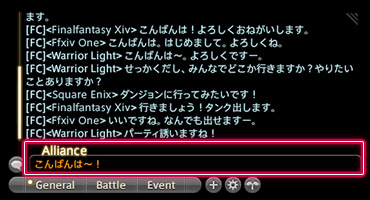
;;;
;;;

想跟团队成员说话的话，就选择【团队】频道吧！

使用【通讯贝】频道的话，无论通讯贝成员在多遥远的地方，都能收到聊天信息。

**开始聊天的方法**
从聊天窗口选择【团队】，然后输入想说的话。

相关阅读：
[Q: 请告诉我游戏里的聊天类型](https://jp.finalfantasyxiv.com/uiguide/communication/#entry-chat_type)

### Q: 聊天文字太小了看不清，想放大一点

消息窗口的文字尺寸，可以在快捷指令 > 系统 > 角色设置 > 消息窗口设置中的字体大小中设置。

;;;.guide .cols2
;;;.guide .col
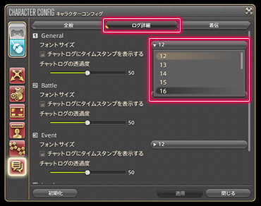
;;;
;;;.guide .col
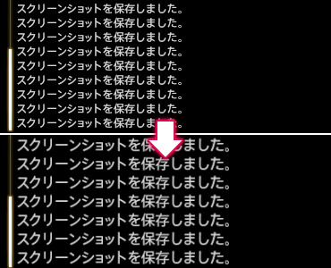
;;;
;;;

Tips：
同一个地方还有消息窗口透明度的设置，如果背景太亮看不清字，可以适当调低。

### Q: 分不清各个通讯贝的聊天内容，想看得更清楚一点

デフォルト時リンクシェルのログカラーは同一カラーに設定されています。そのため、複数のリンクシェルに加入した場合は、個別にログカラーを設定することで、どのリンクシェルのチャットなのかが判別しやすくなります。
さっそくやってみましょう！

##### 改变信息颜色

##### ① キャラクターコンフィグ＞チャットログ設定＞「全般」タブから「ログカラー設定」を選択！

;;;.guide .cols2
;;;.guide .col
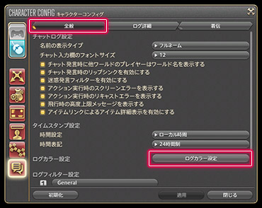
;;;

;;;.guide .col .grow
メインコマンド＞システムメニュー＞キャラクターコンフィグ＞「チャットログ設定」にある「全般」タブ内の「ログカラー設定」を選択します。
;;;
;;;

##### ② 「ログカラー設定」から変更したい場所を選び、「カラー選択」でログカラーを決定！

;;;.guide .cols2
;;;.guide .col

;;;

;;;.guide .col .grow
「ログカラー設定」から、変更したい場所を選んで、「カラー選択」ウインドウからカラーを選択します。

※ログカラー選択すると、該当場所のカラーアイコンに色が反映されます。
;;;
;;;

##### ③ 「ログカラー設定」の【適用】ボタンを押して完了！

;;;.guide .cols2
;;;.guide .col
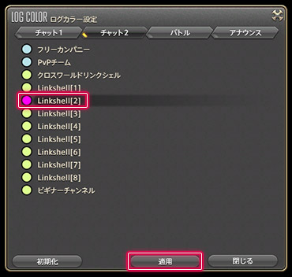
;;;

;;;.guide .col .grow
ログカラーの変更を確認したら、「適用」ボタンを押して変更完了です。
;;;
;;;

## 新人频道

### Q: ビギナーチャンネルってなに？

;;;.guide .cols2
;;;.guide .col
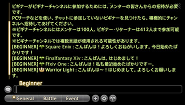
;;;

;;;.guide .col .grow
ビギナーチャンネルは、冒険を始めたばかりの初心者をサポートする専用のチャットチャンネルです。

チャンネルには、ベテラン冒険者である「メンター」が参加しているので、分からないことがあったら遠慮せず気軽に質問してみましょう！

また、ビギナー同士でチャットを楽しんだり、冒険にでかけたりして、ぜひ交流を深めてください。
;;;
;;;

### Q: ビギナーチャンネルにはどうやったら入れるの？

;;;.guide .cols2
;;;.guide .col

;;;

;;;.guide .col .grow
ビギナーチャンネルには、ベテラン冒険者である「メンター」に招待してもらうことで参加できます。

招待されると、専用のウインドウが表示されるので、「ビギナーチャンネルに参加」を選択しましょう。
;;;
;;;
