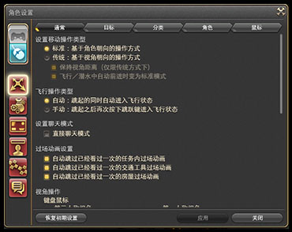
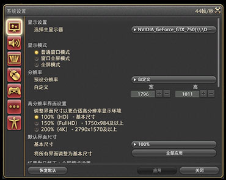
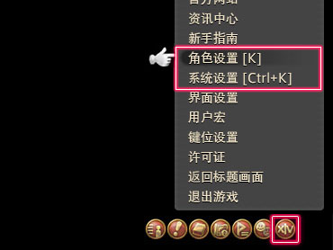

# 开始游戏设置

;;;.guide .cols2
;;;.guide .col

;;;

;;;.guide .col .grow
点击登录器右上角齿轮设置，可开启DX11支持，**务必打开**。原则上现在FF14已经不支持DX9了，如果继续使用DX9的话很容导致报错及游戏崩溃。

游戏更新时有可能会重置DX设置，每次版本更新后如果发现游戏卡顿，可先检查一下DX设置是否被重置。
;;;
;;;

### 从哪开始进行游戏设置？

可以从快捷指令的系统菜单中打开游戏中的设置。

;;;.guide .cols2
;;;.guide .col .figcap

键盘鼠标模式
;;;
;;;.guide .col .figcap

手柄操作模式模式
;;;
;;;

## 设置菜单

### 游戏中的各种设置

最终幻想14中可以对游戏系统、画面、操作等各个方面进行各种设置。和角色有关的设置在“角色设置”中，和系统相关的设定则是在“角色设置”里。这些设置可以随时更改，所以放轻松，大胆去尝试吧。

;;;.guide .cols2

;;;.guide .col

;;;

;;;.guide .col

;;;

;;;

### 设置菜单

;;;.guide .cols2

;;;.guide .col

;;;

;;;.guide .col .grow

角色设置和系统设置都在快捷菜单的系统菜单里。

点击系统菜单，就能找到这两个设置了。

当然你也可以直接使用快捷键打开这两个菜单：

* 角色设置：`K`
* 系统设置：`Ctrl+K`

;;;

;;;

> * [让战斗更方便的设置](/ui/config.md)——简单设置一下就可以快速开始游戏了！
> * [设置菜单详解](/basic/config.md)——仔细设置游戏，玩得更开心！