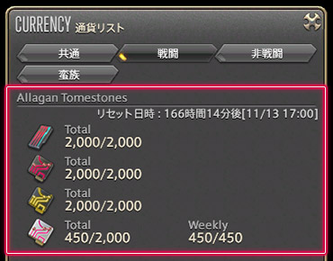
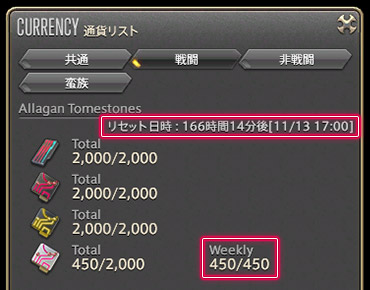

# アラガントームストーン

## アラガントームストーン

### Q: アラガントームストーンってなに？

;;;.guide .cols2
;;;.guide .col

;;;

;;;.guide .col .grow
アラガントームストーンは、レベルが50以上のコンテンツやクエストをクリアすることで入手できる通貨のようなアイテムです。

一定量集めることで、NPCから貴重なアイテムを交換することができます。特に、交換品の武器や防具はアイテムレベルが非常に高く、性能の良いものが多いので、積極的に集めて交換していきましょう！

関連：
[Q: 今持っているアラガントームストーンの数が知りたい](https://jp.finalfantasyxiv.com/uiguide/currency/#entry-ats_number)
;;;
;;;

### Q: アラガントームストーンはどこで交換できるの？

アラガントームストーンは、装備レベルやアラガントームストーンの種類によって交換場所が異なります。
欲しいレベルの場所へ足を運びましょう。

;;;.guide .cols3 .top-align
;;;.col .grow
**レベル50の装備を交換！**

**オーリアナ**
モードゥナ
X:22.7 Y:6.6
**必要なアイテム**
アラガントームストーン:詩学
;;;
;;;.col .grow
**レベル60の装備を交換！**

**ヒスメナ**
イディルシャイア 
X:5.7 Y:5.2
**必要なアイテム**
アラガントームストーン:詩学
;;;
;;;.col .grow
**レベル70の装備を交換！**

**エンナ**
ラールガーズリーチ
X:13.9 Y:11.6
**必要なアイテム（いずれか）**
アラガントームストーン:万物
アラガントームストーン:虚構
アラガントームストーン:創世
;;;
;;;

### Q: 今持っているアラガントームストーンの数が知りたい

;;;.guide .cols2
;;;.guide .col

;;;

;;;.guide .col .grow
アラガントームストーンの情報は、メインコマンド＞マイキャラクター＞通貨リストにある「戦闘」タブで確認できます。週制限のリセット日時もここで確認できます。

所持上限を超える前に、欲しいアイテムに交換しておきましょう！

※リストには、入手履歴のあるもののみ表示されます。
※Lodestoneにログインすれば、マイキャラクターページの「通貨/評判」からも確認できます。
;;;
;;;

### Q: 週制限ってなに？

;;;.guide .cols2
;;;.guide .col

;;;

;;;.guide .col .grow
週制限は、一部のアラガントームストーンに設けられている、1週間に取得できる取得上限のことをさします。

また、アラガントームストーンには、一度に持てる所持数にも上限があり、いずれも上限以上はカウントされないので、所持数はこまめにチェックし、一杯になる前にアイテムと交換しておくのがオススメです。
;;;
;;;

関連：
[Q: 今持っているアラガントームストーンの数が知りたい](https://jp.finalfantasyxiv.com/uiguide/currency/#entry-ats_number)
