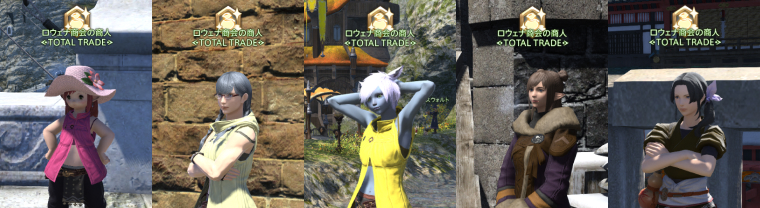

# 亚拉戈神典石

## 亚拉戈神典石

### Q: 亚拉戈神典石是什么？

;;;.guide .cols2
;;;.guide .col

;;;

;;;.guide .col .grow
亚拉戈神典石是50级之后，参加副本迷宫或完成特定任务可以获得的，类似于货币一样的道具。

收集一定数量之后，就可以从NPC那里换到珍惜的物品。另外就是这些交换品当中，大都是装备品级很高，性能很好的武器、防具，所以努力收集神典石来换好东西吧！

関連：
[Q: 想知道现在持有多少亚拉戈神典石](https://jp.finalfantasyxiv.com/uiguide/currency/#entry-ats_number)
;;;
;;;

### Q: 亚拉戈神典石能在哪里交换呢？

根据你需要的装备等级和亚拉戈神典石的种类不同，交换亚拉戈神典石的地方也有所不同。
根据你想要的等级，前往正确的地方吧。

;;;.guide .cols2 .top-align
;;;.col .grow
**交换50级的装备！**

**奥里亚娜**
摩杜纳
X:22.7 Y:6.6
**所需道具**
亚拉戈神典石:诗学
;;;
;;;.col .grow
**交换60级的装备！**

**希丝梅娜**
田园郡 
X:5.7 Y:5.2
**所需道具**
亚拉戈神典石:诗学
;;;
;;;

;;;.guide .cols2 .top-align
;;;.col .grow
**交换70级的装备！**

**艾恩娜**
神拳痕
X:13.9 Y:11.6
**所需道具**
亚拉戈神典石:诗学
;;;
;;;.col .grow
**交换80级的装备！**

**艾马克**
游末邦
X:10.2 Y:11.8
**所需道具**
亚拉戈神典石:幻想
亚拉戈神典石:奇谭
;;;
;;;

#### 在综合贸易店兑换
另外，也可以在罗薇娜商会的综合贸易店交换道具。综合贸易店的商人“罗薇娜商会的商人”头顶会有很明显的口袋标记，一定要记得活用！
※综合贸易店的商人需要完成对应的主线任务才会开放。

#### 各个城市的综合贸易店

|  |  地点  |  开放条件  |
|--|--------|-----------|
|| <Pos name="利姆萨·罗敏萨下层甲板" :x="9.0" :y="11.1" /> | 完成主线任务<quest name="超越幻想，究极神兵" type="main" /> |
|| <Pos name="乌尔达哈现世回廊" :x="9.1" :y="8.3" /> | 完成主线任务<quest name="超越幻想，究极神兵" type="main" /> |
|| <Pos name="格里达尼亚新街" :x="11.9" :y="12.3" /> | 完成主线任务<quest name="超越幻想，究极神兵" type="main" /> |
|| <Pos name="伊修加德基础层" :x="10.5" :y="11.8" /> | 完成主线任务<quest name="苍穹之禁城" type="main" /> |
|| <Pos name="黄金港" :x="12.2" :y="0.8" /> | 完成主线任务<quest name="红莲之狂潮" type="main" /> |

**※如果找不到NPC的话，应该就是没有完成对应任务。打开任务日志确认吧！**

### Q: 想知道现在持有多少亚拉戈神典石

;;;.guide .cols2
;;;.guide .col

;;;

;;;.guide .col .grow
亚拉戈神典石的相关信息，可以通过快捷指令 > 角色 > 货币一览下的战斗选项卡查看。周获取限制的重置时间也可以在这里查看。

在超过持有上限之前，去交换想要的物品吧！

※列表中只会显示曾经获得过的货币。
<!-- ※Lodestoneにログインすれば、マイキャラクターページの「通貨/評判」からも確認できます。 -->
;;;
;;;

### Q: 周获取限制是什么？

;;;.guide .cols2
;;;.guide .col

;;;

;;;.guide .col .grow
周获取限制是指某些亚拉戈神典石，在当周所能获得的总量上限。

另外，亚拉戈神典石还有持有上限，超过持有上限便无法再获得对应神典石了，推荐在超过上限之前，就去交换物品。
;;;
;;;

関連：
[Q: 想知道现在持有多少亚拉戈神典石](https://jp.finalfantasyxiv.com/uiguide/currency/#entry-ats_number)
