# 装备/背包

## 角色

### Q: 想要隐藏头部装备和武器

装备中的头部装备和收起来的武器（主副手），都可以通过快捷指令 > 角色下方的按钮切换隐藏和显示。

;;;.guide .cols2
;;;.guide .col .figcap
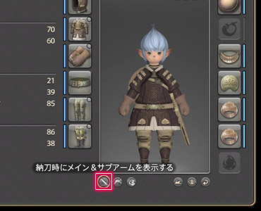

显示主手与副手装备：开
;;;
;;;.guide .col .figcap
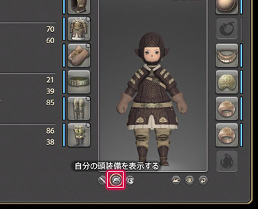

显示头部装备：开
;;;
;;;

## 兵装库

### Q: 背包里找不到装备…

;;;.guide .cols2
;;;.guide .col
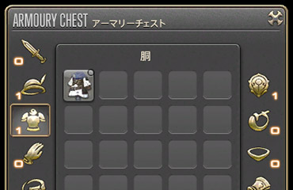
;;;

;;;.guide .col .grow
在最终幻想14中，武器、获得防具这些装备的时候，会放进专门收纳它们的格子里。要在兵装库中找到它们。

※兵装库满了的话，就会放到背包里。

Tips：
可以在角色设置 > 物品设置中改变收纳的优先级。
;;;
;;;

### Q: 从哪打开兵装库呢？

;;;.guide .cols2
;;;.guide .col
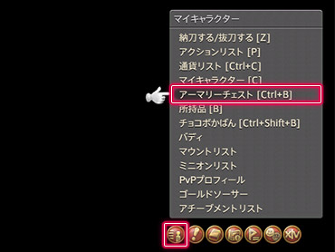
;;;

;;;.guide .col .grow
兵装库可以从 快捷指令 > 角色 > 兵装库中打开。

Tips:
使用快捷键的话可以直接打开兵装库。
兵装库：Ctrl+B
;;;
;;;

### Q: 要怎么装备武器、防具呢？

;;;.guide .cols2
;;;.guide .col
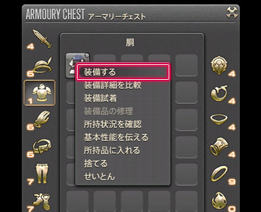
;;;

;;;.guide .col .grow
打开兵装库，右键点击想要装备的物品，在弹出的子命令中选择“装备”就可以了。

获得了新装备的话，立刻换上吧。

※背包中的装备也可以使用相同的操作进行装备。
;;;
;;;

## 最强装备

### Q: 能不能告诉我现在所拥有的装备里，最推荐的是哪个呢？

最终幻想14里有装备的“最强”功能，它可以根据你现在的职能，选择兵装库中对应属性最高的装备，一键自动换上最强的装备。
如果你有很多装备，不知道选哪个好的时候，就多使用这个功能吧。

##### 使用“最强”功能吧！

##### ① 从快捷指令打开角色，选择“最强”按钮！

;;;.guide .cols2
;;;.guide .col
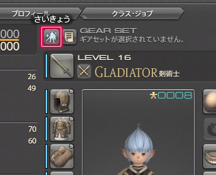
;;;

;;;.guide .col .grow
打开角色窗口，点击上方的“最强”按钮。
;;;
;;;

##### ② 确认弹出的装备列表，按下“应用”按钮！

;;;.guide .cols2
;;;.guide .col
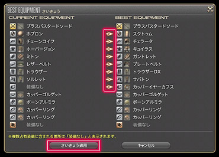
;;;

;;;.guide .col .grow
确认切换的装备列表，没问题的话就点“应用”按钮。

※发生变化的装备会有“→”符号。
※如果有占用多个装备部位的装备的话，会显示“无装备”。
;;;
;;;

##### ③ 完成最强装备一键换装！

;;;.guide .cols2
;;;.guide .col
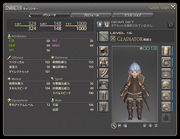
;;;

;;;.guide .col .grow
按照选择列表中的显示，换装结束。

※变更装备之后，登记到套装中吧。
登记之后，就可以一键切换套装了。

相关阅读：
[Q: 想要保存现有的装备，一键切换](https://jp.finalfantasyxiv.com/uiguide/equipment/#entry-equipment_set)
;;;
;;;

## 套装

### Q: 想要保存现有的装备，一键切换

在最终幻想14种，可以把所有部位的装备情况保存在“套装”中，这样就不用一件件更换，可以一瞬间切换所有的装备。把经常使用的装备保存成套装吧。

※开放第二个职业之后才会开放套装功能，之后会随着解锁职业的增加而追加可以保存的套装数量。

##### 试着保存套装吧！

##### ① 从快捷指令中选择角色，按“套装列表”按钮！

;;;.guide .cols2
;;;.guide .col
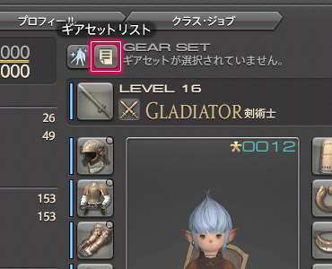
;;;

;;;.guide .col .grow
打开角色窗口，选择上方的套装列表按钮。

※不能保存套装列表的时候，按钮不显示。
;;;
;;;

##### ② 点击“+”按钮，保存套装！

;;;.guide .cols2
;;;.guide .col

;;;

;;;.guide .col .grow
窗口上方有“保存新加的套装。”按钮，把套装信息保存在列表上。

※会显示在套装列表中。
※现在装备着的套装前会显示[E]图标。
※右键套装名称可以确认套装的内容，修改名称、顺序等等。

Tips:
把保存好的套装设置到热键栏上的话，就可以用快捷键一键换装了，更方便。
;;;
;;;

##### 试着换装吧！

##### ① 选中想要更换的装备，按“更改装备”按钮换装！

;;;.guide .cols2
;;;.guide .col
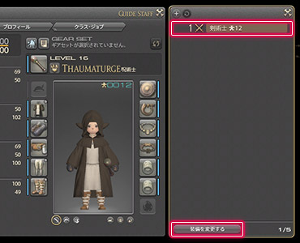
;;;

;;;.guide .col .grow
从套装列表中选中要想更换的套装，点击下方的“更改装备”就可以了。
;;;
;;;

## 比较装备强弱

### Q: 想要对比装备的强弱

在最终幻想14里，右键装备名，并从弹出的子命令中选择“装备属性对比”，就可以在所选装备和自身所装备的装备之间对比。
在商店或市场上购买新的装备时，和自己所持有的装备比较一下，选择更好的装备吧！

;;;.guide .cols2
;;;.guide .col
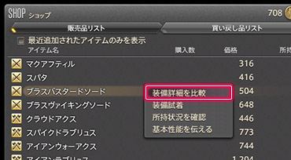
;;;

;;;.guide .col
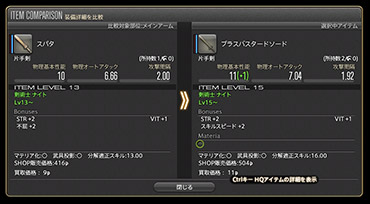
;;;
;;;

## 试穿装备

### Q: 可以试穿装备吗？

装备物品无论等级，只要性别/种族满足要求，就可以进行试穿。
有在意的装备的话，就右键选择“试穿”就可以了。

;;;.guide .cols2
;;;.guide .col
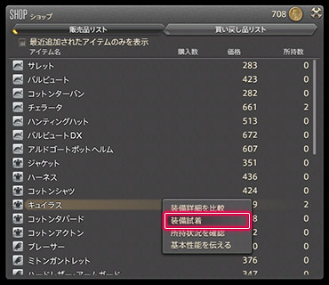
;;;

;;;.guide .col
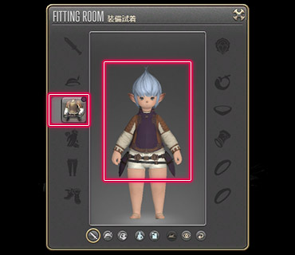
;;;
;;;

## 物品品级（IL）

### Q: 物品品级（IL）是什么？

;;;.guide .center

;;;

物品品级（IL）是武器、防具一定带有的一目了然的“强度”数值。

数值越高的物品，性能越好，对角色的强化程度也越高。

如果获得了比现在装备着的物品品级更高的装备，使用“最强”功能就可以立刻切换过来。今着ている装備よりもアイテムレベルの高いアイテムを入手したら、「さいきょう」機能などを使って、すぐに着替えておくようにしましょう。

相关阅读：
[Q: 能不能告诉我现在所拥有的装备里，最推荐的是哪个呢？](https://jp.finalfantasyxiv.com/uiguide/equipment/#entry-equipment_best)

### Q: 平均装备品级是什么？

;;;.guide .center
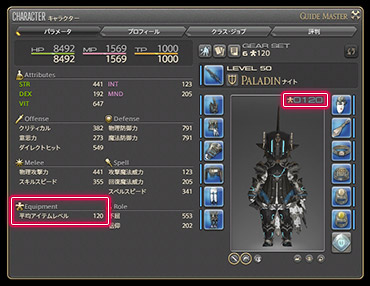
;;;

平均装备品级是角色所装备的武器、防具的物品品级的品均数。

50级以上的副本内容都会设定有“平均装备品级”的限制参加条件，如果平均装备品级不够，就不能够参加相应的内容。

平均装备品级的数值可以从快捷指令 > 角色的左下，或者全身图的右上角查看。

### Q: 要如何提高平均装备品级呢？

;;;.guide .center

;;;

在50级之前，使用“最强”功能自动穿着从迷宫、任务中获得的装备，就能无脑提升装备平均品级。

50级之后，因为参加副本内容需要一定的平均装备品级，在市场上购买更好的装备吧！

另外，完成50级以上的副本内容可以获得亚拉戈神典石，收集神典石也可以交换装备。

虽然需要一点时间才能存够数量的神典石，但是交换来的武器、防具的性能更加优异，大多数都能使用很长一段时间，一定要尽可能换出来。

関連：
[亚拉戈神典石是什么？](https://jp.finalfantasyxiv.com/uiguide/currency/#entry-ats_how)

## 装备的染色

### Q: 想要改变装备的颜色

;;;.guide .cols2
;;;.guide .col
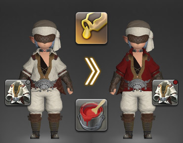
;;;
;;;.guide .col

;;;
;;;

装备的颜色可以通过染色技能改变。染色需要使用“[染剂](https://ff14.huijiwiki.com/wiki/ItemSearch?name=%E6%9F%93%E5%89%82)”。

完成支线任务“[色彩斑斓的世界](https://ff14.huijiwiki.com/wiki/%E4%BB%BB%E5%8A%A1:%E8%89%B2%E5%BD%A9%E6%96%91%E6%96%93%E7%9A%84%E4%B8%96%E7%95%8C)”后，就会获得染色技能。15级就可以接取这个任务了，快点去完成吧！

**可以/不能染色的物品**
一件物品是否可以染色，可以从物品图标的右上角来确认，如果有标记的话就是可以染色的。

※使用“新生冒险录”之类的主线直升包的话，会自动获得染色技能。

相关阅读：
[Q: 想要改变装备的外观](https://jp.finalfantasyxiv.com/uiguide/equipment/#entry-glamours_about)

### Q: 染剂是什么？

;;;.guide .cols2
;;;.guide .col
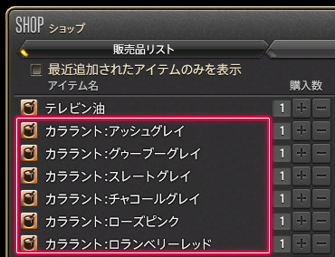
;;;

;;;.guide .col .grow
“染剂”是染色所必须的万能染料的总称。

1个染剂可以为1件物品染色。要染色的时候，要提前准备好足够数量的染剂哦。

除了从市场或者NPC商店中购买染剂，能工巧匠在30级之后也可以自行制作染剂。
;;;
;;;

### Q: 不知道怎么给装备染色

装备的染色，首先要从技能列表中使用“染色”技能。
另外，直接在想要染色的物品上点击右键，在子命令中选择染色也可以。

##### 来给装备染色吧！

##### ① 打开技能列表，选择“染色”技能！

;;;.guide .cols2
;;;.guide .col
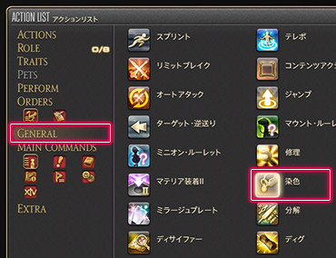
;;;

;;;.guide .col .grow
从快捷指令 > 角色 > 技能列表里的共通技能中选择“染色”技能。

Tips:
经常染色的话，也可以把这个技能放在热键栏上，就可以立刻打开染色窗口。
;;;
;;;

##### ② 选择想要染色的装备！

;;;.guide .cols2
;;;.guide .col
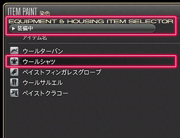
;;;

;;;.guide .col .grow
从染色窗口的列表中，选择想要染色的装备。

**想给装备以外的物品染色**
从下拉菜单中选择其他筛选方式查看
;;;
;;;

##### ③ 确认想要染色的物品，选择染剂！

;;;.guide .cols2
;;;.guide .col

;;;

;;;.guide .col .grow
确认想要染色的物品，从染剂列表中选择色系和具体颜色，然后点击“开始染色”。

**圆形的图标：**切换色系
**方形的图标：**选择染剂

※方形图标上打叉的话，表示你没有这个颜色的染剂，因此无法进行染色。
;;;
;;;

##### ④ 染好了

;;;.guide .cols2
;;;.guide .col
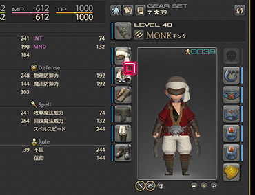
;;;

;;;.guide .col .grow
装备染色完成了。
快看看吧！

※染过色的物品图标右上角，会有染剂色系的标记。
※具体染剂的名称，可以从装备信息中查看。
;;;
;;;

##### 从图标的子命令染色

;;;.guide .cols2
;;;.guide .col
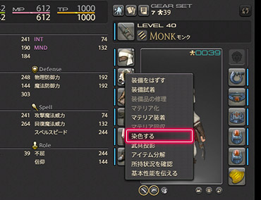
;;;

;;;.guide .col .grow
打开角色或者兵装库，右键想要染色的装备，然后选择“染色”，也可以进行染色。

※背包中的物品也可以使用同样的方法染色。
;;;
;;;

### Q: 想把染过色的装备恢复成原来的颜色

;;;.guide .cols2
;;;.guide .col

;;;

;;;.guide .col .grow
想把装备恢复成原色，就需要使用松节油了。1瓶搜解忧可以去除1件物品上的染色。

松节油可以从市场布告板或者NPC商店中购买。
;;;
;;;

## 武具投影

### Q: 想要改变装备的外观

;;;.guide .cols2
;;;.guide .col

;;;
;;;.guide .col
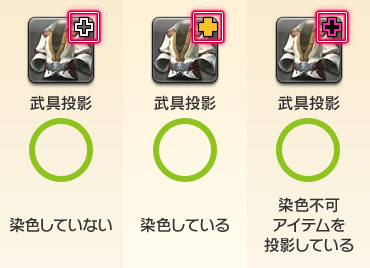
;;;
;;;

学会武具投影技能之后，就可以改变装备的外观了。武具投影需要使用被称作“[幻象棱晶](https://ff14.huijiwiki.com/wiki/%E7%89%A9%E5%93%81:%E5%B9%BB%E8%B1%A1%E6%A3%B1%E6%99%B6)”的触媒来进行。

完成支线任务“[华丽的投影世界](https://ff14.huijiwiki.com/wiki/%E4%BB%BB%E5%8A%A1:%E5%8D%8E%E4%B8%BD%E7%9A%84%E6%8A%95%E5%BD%B1%E4%B8%96%E7%95%8C)”就可以获得武具投影技能。15级就可以接取这个任务了，快点去完成吧！

武具投影可以通过技能列表，子命令，旅馆的投影台进行。

**武具投影的状态**
武具投影的状态和染色状态一起，显示在物品图标的右上角。

※性别、种族、职业等等因素导致装备角色无法装备投影物品时，投影效果不会显示。

相关阅读：
[Q: 想要改变装备的颜色](https://jp.finalfantasyxiv.com/uiguide/equipment/#entry-dye_about)
[Q: 可以试穿装备吗？](https://jp.finalfantasyxiv.com/uiguide/equipment/#entry-equipment_test)

### Q: 幻象棱晶是什么？

;;;.guide .cols2
;;;.guide .col
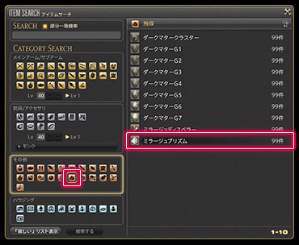
;;;

;;;.guide .col .grow

幻象棱晶是武具投影所必须的触媒物品。

每进行1次武具投影，就要使用1枚幻象棱晶。提前准备好需要投影的棱晶数量吧。

幻象棱晶除了可以从市场布告板、大国防联军的补给负责人那里弄到，也可以学习秘籍之后，通过能工巧匠职业制作。

完成支线任务“[美与幻影的秘籍](https://ff14.huijiwiki.com/wiki/%E4%BB%BB%E5%8A%A1:%E7%BE%8E%E4%B8%8E%E5%B9%BB%E5%BD%B1%E7%9A%84%E7%A7%98%E7%B1%8D)”之后，就可以从格贝林（西萨纳兰 X:12.2 , Y:15.1）、塔塔罗伽（摩杜纳 X:22.2 , Y:6.8）那里购买到相关秘籍。
;;;
;;;

### Q: 不清楚如何进行武具投影

武具投影，首先要从技能列表中使用“武具投影”技能。
另外，直接在想要投影的物品上点击右键，或者从旅馆的投影台中也可以进行相同的操作。

##### 来改变装备的外观吧！

##### ① 打开技能列表，选择武具投影技能！

;;;.guide .cols2
;;;.guide .col
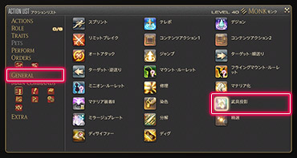
;;;

;;;.guide .col .grow
从快捷指令 > 角色 > 技能列表里的共通技能中选择“武具投影”技能。

Tips:
经常投影的话，也可以把这个技能放在热键栏上，就可以立刻打开武具投影窗口。
;;;
;;;

##### ② 从武具投影的窗口中，选择作为基础的投影道具！

;;;.guide .cols2
;;;.guide .col
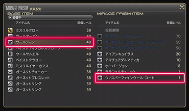
;;;

;;;.guide .col .grow
从武具投影窗口的列表中，选择想要改变外观的装备（基础物品），以及想要显示的外观装备（投影物品）。

基础物品选择之后，右侧就会显示出可以投影的物品了。

**想要对装备物品以外的物品进行投影**
从下拉菜单中选择其他筛选方式查看
;;;
;;;

##### ③ 从武具投影的窗口中，选择“武具投影”！

;;;.guide .cols2
;;;.guide .col

;;;

;;;.guide .col .grow
在窗口中确认要进行的投影内容，按武具投影按钮。

※进行武具投影时会消耗1枚幻象棱晶。
※进行武具投影后，投影物品会附加绑定属性。
;;;
;;;

##### ④ 完成了！

;;;.guide .cols2
;;;.guide .col
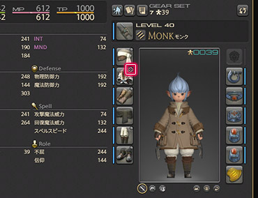
;;;

;;;.guide .col .grow
武具投影完成了。
快看看吧！

※投影过的物品图标右上角，会显示表示武具投影状态的十字标记。
※另外，对投影过的装备又染了色的情况，十字标记的中央会显示染剂的色系。
;;;
;;;

##### 从图标的子命令进行武具投影

;;;.guide .cols2
;;;.guide .col

;;;

;;;.guide .col .grow
打开角色或者兵装库，右键想要投影的装备，然后选择“武具投影”，也可以进行武具投影。

※背包中的物品也可以使用同样的方法投影。
;;;
;;;

### Q: 想要解除武具投影

;;;.guide .cols2
;;;.guide .col

;;;

;;;.guide .col .grow
想要把投影过的装备变回原来样子，就需要使用“[驱幻晶](https://ff14.huijiwiki.com/wiki/%E7%89%A9%E5%93%81:%E9%A9%B1%E5%B9%BB%E6%99%B6)”。

每使用1枚驱幻晶，可以解除1件物品上的投影。

驱幻晶可以通过市场布告板或NPC商店获得。
;;;
;;;

### Q: 想染装备变透明

;;;.guide .cols2
;;;.guide .col
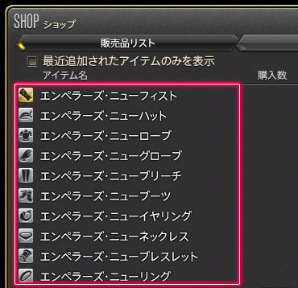
;;;

;;;.guide .col .grow
使用“[皇帝的新衣系列](https://ff14.huijiwiki.com/wiki/ItemSearch?name=%E7%9A%87%E5%B8%9D%E7%9A%84%E6%96%B0)”装备进行武具投影，就可以让装备变成透明的。

根据所要投影的物品部位不同，不仅能让防具、饰品透明，甚至可以让拳套变透明。

完成支线任务“[美与幻影的秘籍](https://ff14.huijiwiki.com/wiki/%E4%BB%BB%E5%8A%A1:%E7%BE%8E%E4%B8%8E%E5%B9%BB%E5%BD%B1%E7%9A%84%E7%A7%98%E7%B1%8D)”之后，就可以从格贝林（西萨纳兰 X:12.2 , Y:15.1）、塔塔罗伽（摩杜纳 X:22.2 , Y:6.8）那里购买到这些装备了。

※这些商店根据玩家条件不同，会出售的物品也会有所区别。
;;;
;;;
