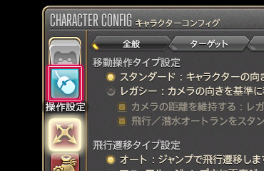
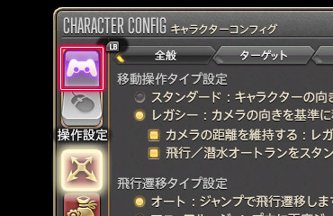
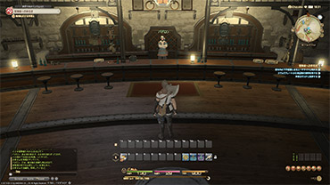
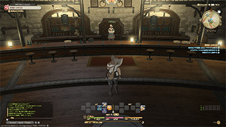
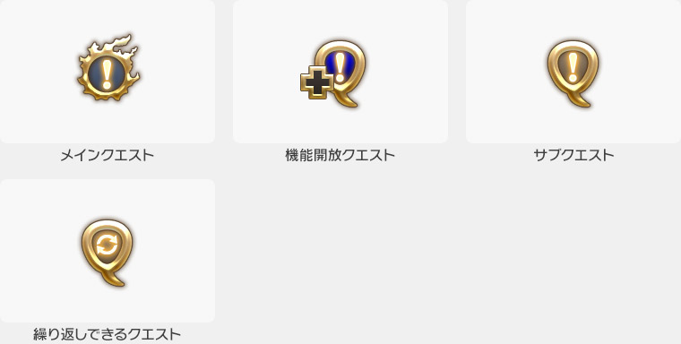
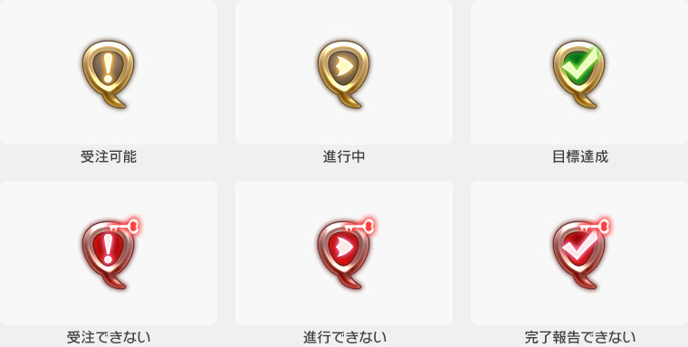
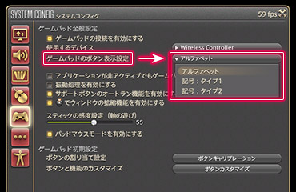
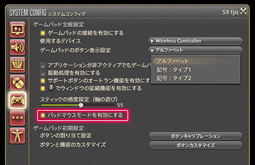
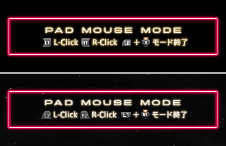

# 常见问题

## 切换操作模式

### Q: 想使用键盘鼠标操作

;;;.guide .cols2
;;;.guide .col

;;;

;;;.guide .col .grow
切换操作模式，可以使用角色设置左上角的切换按钮进行。

快捷指令中打开角色设置，把切换按钮切到“键盘鼠标模式”就可以了。
;;;
;;;

### Q: 想用手柄操作

;;;.guide .cols2
;;;.guide .col

;;;

;;;.guide .col .grow
想用控制器或者手柄操作的话，从快捷指令中打开角色设置，把切换按钮切到手柄模式就可以了。

<!-- ※PlayStation®4では、コントローラー操作モードがデフォルト設定になっています。 -->
;;;
;;;

## 界面的查看方法

### Q: 不知道怎么看游戏界面

最终幻想14根据你使用的操作方法不同，游戏界面中所展示的界面部件和布局都会有所区别。所有部件的名字和详细说明请查看[这里](/uiguide/know/#category-know-hud)。

;;;.guide .cols2
;;;.guide .col .figcap

键盘鼠标模式
;;;
;;;.guide .col .figcap

手柄操作模式
;;;
;;;

### Q: 为什么任务图标不一样？

最终幻想14里，可以接到任务的角色头顶会出现任务图标。
重要的任务（主线任务）的图标和普通的图标不一样，形状也很特殊。

;;;.guide .center

;;;

完成任务可以获得大量经验，还有丰厚报酬<!-- 鬼信哦 -->，很适合用来升级。
如果不知道先做哪个任务号，推荐先推进主线任务。另外也推荐“开放功能任务”，完成后可以获得专属陆行鸟、开放新的迷宫等等，会开放各种各样的新功能，不要忘记做这些任务哦。

##### 图标的变化

任务图标会根据任务进行的状况而发生变化。
图标是红色的时候，是有某种原因而无法接受或进行。具体信息的话可以在日志中确认。
日志在快捷指令 > 任务情报中查看。

;;;.guide .center

;;;

另外，还有各种各样的相关图标。具体可以查看[这里](https://jp.finalfantasyxiv.com/lodestone/playguide/win/view/#g_npc)。

## 周辺機器
<!-- 
### Q: PlayStation®4で、マウスやキーボードは使えるの？

はい。PlayStation®4に対応しているUSBまたはBluetooth マウス、キーボードでの利用が可能です。 -->

### Q: 手柄按键的显示设置选哪个好？

;;;.guide .cols2
;;;.guide .col

;;;

;;;.guide .col .grow
PC版中，手柄按键的设置可以自由变更，选择用起来更顺手的那个吧。

**ABXY**
按XInput的标准显示按键字母
**×○□△**
按PlayStation®3的标准显示按键记号
**×○□△ + 触摸板**
按PlayStation®4的标准显示按键记号

※手柄设置在系统中的手柄设置中进行。
※变更按键类型需要重新启动游戏。
;;;
;;;

### Q: 想用手柄进行鼠标操作

;;;.guide .cols2
;;;.guide .col

;;;
;;;.guide .col

;;;
;;;

在最终幻想14中，打开虚拟鼠标功能，就可以把手柄当做鼠标来使用。

虚拟鼠标的话，从快捷指令 > 系统设置中的手柄设置里进行修改，勾选“启用虚拟鼠标”即可。

<!-- ※PlayStation®4版では、タッチパッドからでもマウス操作が行えます。 -->

**打开/关闭虚拟鼠标模式**
Windows版：L键（LB）+ 右摇杆按键  
<!-- PlayStation®4版：L1ボタン+R3ボタン -->

**移动光标**
Windows版：右摇杆  
<!-- PlayStation®4版：右スティック -->

**左键单击/右键单击**
Windows版：LT键/RT键  
<!-- PlayStation®4版：L2ボタン/R2ボタン -->

相关阅读：
[Q: 只有手柄的话，可以设置热键栏吗？](/uiguide/know/#entry-hotbar_pad_registration)
