# 技能与热键栏
<FloatTOC/>
在FF14里，咏唱魔法、使用道具等等行动，都可以称为“技能”。可以在“技能菜单”中查看技能的信息。

把技能放到热键栏里，就可以快速地使用技能了。
 
使用手柄的十字热键栏的话，可以设置扩展十字热键栏。

#### 试着向热键栏里放置技能吧！

#### ① 打开技能菜单，选中想要放置的技能

;;;.guide .cols2
;;;.guide .col
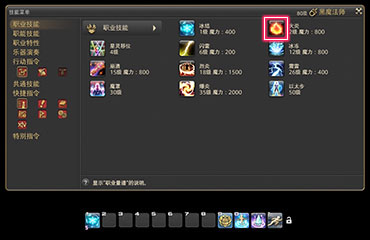
;;;

;;;.guide .col .grow
快捷指令 > 角色 > 技能菜单中选择想要放置的技能。

Tips：  
热键栏的栏位除了可以放置技能，还可以放置菜单命令、坐骑、宠物、情感动作道具等等等等。可以把经常使用的功能全都放在热键栏里。 很多玩家也会用热键栏和宏功能制作属于自己的菜单，等你对这个游戏有更多了解之后，可以尝试自己做一个菜单宏。
;;;
;;; 

#### ② 把选中的技能拖放到热键栏里，就成了！

;;;.guide .cols2
;;;.guide .col
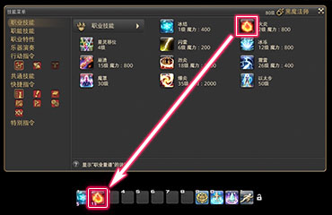
;;;

;;;.guide .col .grow
把选中的技能拖到热键栏里，就完成了设置。
;;;
;;;

::: collapse 用手柄怎么把技能放到热键栏里？

#### 用光标选中技能，按X键，进入“设置热键栏模式”

;;;.guide .cols2
;;;.guide .col
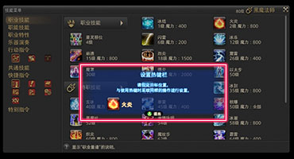
;;;

;;;.guide .col .grow
按下 X 键就进入了“设置热键栏模式”。

※会出现模式状态的窗口。

此时按下你想要施放技能的按键，技能就会自动设置过去。
;;;
;;;

#### 也可以把虚拟鼠标功能打开，可以像移动鼠标一样操作光标。

;;;.guide .cols2
;;;.guide .col
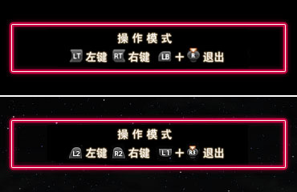
;;;

;;;.guide .col .grow

* 打开/关闭虚拟鼠标操作模式
  * Windows：`L`（`LB`）+ 右摇杆按键  
  * PS4：L1+R3 
* 移动光标
  * Windows/PS4：右摇杆  
* 左键单击/右键单击
  * Windows：`LT`/`RT`  
  * PS4：`L2`/`R2`

;;;
;;;

:::

#### ③ 选中想要使用的技能，就可以使用它！

;;;.guide .cols2
;;;.guide .col

;;;

;;;.guide .col .grow
选择想要使用的技能。

下面讲解如何设置热键栏的热键。
;;;
;;;

## 热键栏

热键栏的每个格子都可以绑定一个快捷键，点击热键栏上的图标，或是按下对应的快捷键，都可以立刻使用出对应的技能。

### 显示在热键栏上的技能下方的数字是什么？

;;;.guide .cols2
;;;.guide .col
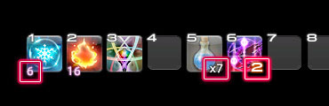
;;;

;;;.guide .col .grow
**图标左下：** 该技能所消耗的资源（技力/魔力/制作力/采集力）  
**图标右下：** 物品持有数量 或 可多次施放技能的剩余施放次数

;;;
;;;

### 想要把快捷键改得更顺手一点

绑定在热键栏上的快捷键可以随时自由改变。
把快捷键改成更舒服的按键，让游戏玩起来更舒畅吧。

#### ① 从快捷指令 > 系统中选择键位设置！

;;;.guide .cols2
;;;.guide .col
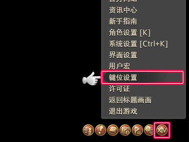
;;;

;;;.guide .col .grow
从快捷指令 > 系统中，选择键位设置。
;;;
;;;

#### ② 选中“热键栏”标签，点击想要设置的热键栏位的“键位设置”框！

;;;.guide .cols2
;;;.guide .col
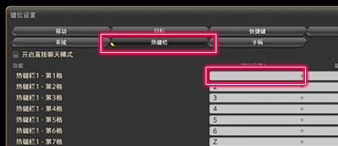
;;;

;;;.guide .col .grow
从“热键栏”标签中，选择想要设置快捷键的栏位，点击相应的“键位设置”。

※选中的栏位会高亮显示。
;;;
;;;

#### ③ 用键盘按下想要设置的按键，就设置好了！

;;;.guide .cols2
;;;.guide .col
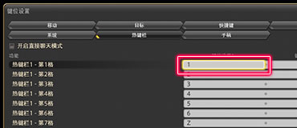
;;;

;;;.guide .col .grow
用键盘按下想要设置的按键，就设置好了。

※会在相应的地方显示玩家按下的按键。
;;;
;;;

### 想删掉没放技能的空栏位

;;;.guide .cols2
;;;.guide .col
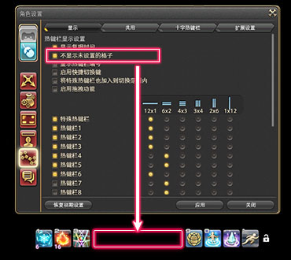
;;;

;;;.guide .col .grow
勾选快捷指令 > 系统 > 角色设置 > 热键栏设置 > 显示标签中的热键栏显示设置下的“不显示未设置的格子”，就会隐藏没有放置技能的空栏位。

※虽然栏位是透明的，但是还是可以放置技能。

;;;
;;;

## 常用键盘热键

键位设置除了可以修改热键栏绑定的热键，还可以修改其他常用的一些功能按键，新人玩家比较常用到的有：

* `Tab`可以快速选择屏幕上的敌人，<i class="xiv mouse-left-button"></i>点击屏幕上的敌人或小队列表上的敌人名字，都可以选中敌人。
* `PrintScreen`（有的键盘上会简写为`PrtSc`）可以快速截图，另外如果按下`ScrollLock`（有的键盘上会简写为`ScrLk`）会隐藏屏幕中所有UI组件，再按一下恢复原样。
* `R`或`鼠标中键`默认自动前进键，只要按任意方向键就可以解除自动前进状态。
* `X`可以隐藏玩家名牌，在人非常多（比如活动任务）时，点不到NPC或任务点的话，按住`X`就可以轻松点到了。
* `F1`可以快速选择自己，`F2`~`F4`可以快速选择小队列表中的第2~第4名队员。

想了解更多完整的热键介绍，可以查看[键盘热键及指令详解](/basic/config.md#常用键盘热键)。

## 十字热键栏（手柄用）

十字热键栏是为了让手柄也可以快速使用技能而设计的十字型布局热键栏。角色的每个职业都可以设置最多8套热键栏。把常用的技能放在热键栏1里吧。

十字热键栏需要按下`LT`/`RT`键的同时，使用手柄的按键（以及方向键）进行操作。

;;;.guide .cols2
;;;.guide .col
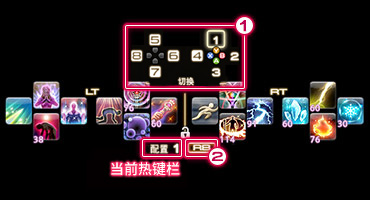
;;;

;;;.guide .col .grow
十字热键栏可以通过以下方法进行切换。

1. 切换到任意热键栏：
`R`（`RB`）+ 各个按键（包括方向键）
2. 只切换放置了技能的热键栏：
`R`（`RB`）

;;;
;;;

### 按住操作增强设置？

十字热键栏除了可以按住`R`（`RB`）切换热键栏之外，在按住操作增强设置生效的情况下，同时按住左摇杆按钮（`LT`）/右摇杆按钮（`RT`），就可以临时切换到指定的另外一个热键栏。

解除按住状态之后，临时切换也将失效，不需要手工切回原来的热键栏，用2套热键栏操作感觉超棒。设置起来也很简单，一定要用用看。

#### ① 从系统中选择角色设置！

;;;.guide .cols2
;;;.guide .col
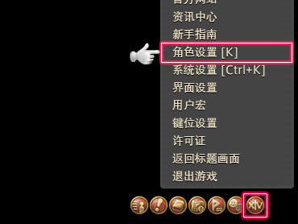
;;;

;;;.guide .col .grow

选中快捷指令 > 系统 > 角色设置。

;;;
;;;

#### ② 选择同时按住操作中，想要显示的十字热键栏编号！

;;;.guide .cols2
;;;.guide .col
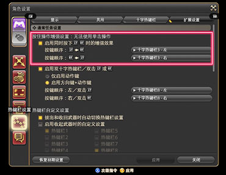
;;;

;;;.guide .col .grow

选中热键栏设置 > 十字热键栏设置 > 扩展设置中的“启用同时按下LT/RT时的增强效果”前的方块，启用按住操作增强设置。

另外在这里也可以选择设置双十字热键栏。

启用后，在其下方的下拉框中设置扩展操作想要切换的热键栏编号即可。

;;;
;;;

#### ③ 使用同时按下操作，使用技能！

;;;.guide .cols2
;;;.guide .col

;;;

;;;.guide .col .grow

使用同时按住操作，确认切换的目标热键栏之后，使用技能吧。

※如果按住操作下，能够显示指定热键栏的话，就证明设置正确。

;;;
;;;

> 想了解更多关于手柄的操作和设置，请浏览[手柄从入门到躺下的基础教程](https://bbs.nga.cn/read.php?tid=24728851)。