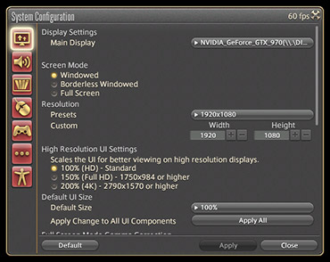

# UI Guide Overview

## Preface

This guide will  cover the basics of UI elements including how they are used, how to  change their settings, as well as frequently asked questions regarding  them. We encourage anyone having trouble with the UI to refer to this  guide for a possible solution to their problem.

### For Beginners

For players new to the game, we recommend  reviewing the table of contents to select a topic you wish to learn more  about. A search function is also available for those who know  specifically what they wish to check.

1. Enter a term to search.
2. Find a topic and review its contents.
3. Try out what you've learned!

Though repositioning and resizing elements of  the UI may seem intimidating, even minor adjustments can make all the  difference in how you experience the game. Try starting with something  small and work your way up to bigger changes.

### Getting Started

For players new to the game, we recommend  reviewing the table of contents to select a topic you wish to learn more  about. A search function is also available for those who know  specifically what they wish to check.

;;;.guide .cols2
;;;.guide .col .figcap

For Mouse Users
;;;
;;;.guide .col .figcap

For Gamepad Users
;;;
;;;

## The Configuration Menus

### Where Customization Begins

The two primary menus used to make changes  to the UI are Character Configuration and System Configuration. They can  be accessed at any time, so don't hesitate to open them up and test out  their various settings.

;;;.guide .cols2

;;;.guide .col

;;;

;;;.guide .col

;;;

;;;

### Accessing the Menus

;;;.guide .cols2

;;;.guide .col

;;;

;;;.guide .col .grow

Both menus can be accessed by left-clicking on the System icon found at the bottom right of the screen.

They can also be acccessed via keyboard shortcuts.

* Character Configuration: K
* System Configuration: Ctrl+K

;;;

;;;

### Menu Contents

;;;.guide

|          |                                                              |
| -------- | ------------------------------------------------------------ |
| 角色设置 | 包括操作设置、物品设置、界面设置、名牌设置、热键栏设置和消息窗口设置 |
| 系统设置 | 包括显示设置、声音设置、图像设置、鼠标设置、手柄设置、其他设置和辅助功能设置 |

;;;

:::segment grey

本文翻译自 UI Guide 主题站，原文链接：[UI Guide Overview](https://na.finalfantasyxiv.com/uiguide/how/)  
© 2010 - 2019 [SQUARE ENIX](https://na.square-enix.com/us/home) CO., LTD. All Rights Reserved.

:::