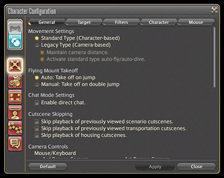
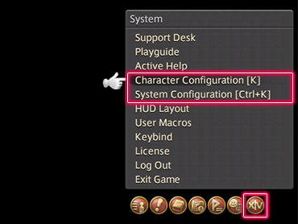

# UI 指南 - 前言

## 前言

《最终幻想14》的 UI 界面可以根据玩家的使用习惯自由定制。这个 UI 指南会你怎么使用游戏的界面、如何修改设置，并回答一些关于 UI 的常见问题。如果你对调整 UI 有什么问题，都可以先来看看这个指南，说不定就能解决你的问题。

### 新手起步

如果你是刚开始玩《最终幻想14》的新玩家，你可以先看看侧边栏的目录有没有比较感兴趣的内容。<!--如果有想要了解的内容，也可以尝试用关键字搜索，在游戏里不断尝试吧！-->

虽然重新调整 UI 看起来有些吓人，但是即使是很小的调整也会让你体验游戏的方式有所不同。试着先从小的调整开始，朝着更大的方向进行。

### 从哪开始进行游戏设置？

可以从快捷指令的系统菜单中打开游戏中的设置。

;;;.guide .cols2
;;;.guide .col .figcap

键盘鼠标模式
;;;
;;;.guide .col .figcap

手柄操作模式模式
;;;
;;;

## 设置菜单

### 游戏中的各种设置

最终幻想14中可以对游戏系统、画面、操作等各个方面进行各种设置。和角色有关的设置在“角色设置”中，和系统相关的设定则是在“角色设置”里。这些设置可以随时更改，所以放轻松，大胆去尝试吧。

;;;.guide .cols2

;;;.guide .col

;;;

;;;.guide .col

;;;

;;;

### 设置菜单

;;;.guide .cols2

;;;.guide .col

;;;

;;;.guide .col .grow

角色设置和系统设置都在快捷菜单的系统菜单里。

点击系统菜单，就能找到这两个设置了。

当然你也可以直接使用快捷键打开这两个菜单：

* 角色设置：K
* 系统设置：Ctrl+K

;;;

;;;

### 具体可以设置的内容

;;;.guide

|          |                                                              |
| -------- | ------------------------------------------------------------ |
| 角色设置 | 包括操作设置、物品设置、界面设置、名牌设置、热键栏设置和消息窗口设置 |
| 系统设置 | 包括显示设置、声音设置、图像设置、鼠标设置、手柄设置、其他设置和辅助功能设置 |

;;;

:::segment grey

本文翻译自 UI Guide 主题站，原文链接：[UI Guide Overview](https://na.finalfantasyxiv.com/uiguide/how/)，部分内容根据国服情况有所调整。 
© 2010 - 2019 [SQUARE ENIX](https://na.square-enix.com/us/home) CO., LTD. All Rights Reserved.

:::
