# 界面指南
<FloatTOC/>
FF14的界面展示了大量信息，同时可以根据玩家的习惯自由定制。下面会介绍FF14游戏的界面阅读与修改的方法，如果你是第一次玩这类游戏，推荐你完整阅读下面的介绍；如果你已经是一位经验丰富的游戏玩家，也可以直接调整一下[让战斗更方便的设置](/ui/how.md)，然后直接阅读其他感兴趣的部分，或者直接在游戏中体验学习。

> * [如何设置技能/快捷栏](/ui/hotbar.md)
> * [如何设置其他界面](/ui/config.md)
> * [让战斗更方便的设置](/ui/how.md)

## 界面介绍

游戏界面包含了很多个界面窗口，它们都可以根据你的使用习惯和操作方法调整尺寸、位置、布局等等。一边进行冒险，一边调整觉得不舒服的地方吧！

虽然重新调整 UI 看起来有些吓人，但是即使是很小的调整也会让你体验游戏的方式有所不同。试着先从小的调整开始，朝着更大的方向进行。

### 非战斗时

;;;.guide 
;;;.guide .col .sticky
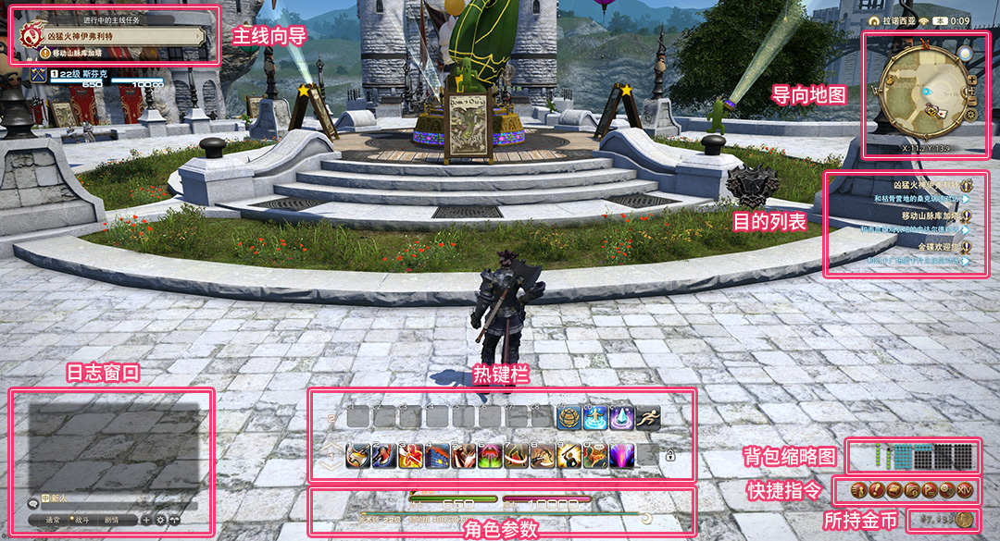
;;;
;;;.guide .col .grow 

#### 主线向导

根据玩家的游戏主线进度，提示玩家接下来要去往的地方。 如果忘了自己要去哪里，就点一下向导上的任务名，然后过去看看吧。 

#### 日志窗口

这里会显示聊天的内容，战斗日志，还有游戏内广播等等。如果日志太多了读起来很痛苦，可以点右下角的[齿轮]按钮过滤一下。

另外点`[+]`的话，还可以添加一个窗口，在这个窗口里只保留自己想见到的信息，读起来就更轻松了。一定要尝试一下哦。 

#### 热键栏

在热键栏上放上技能、道具之类的，就可以直接点击热键就用。热键的布局也可以根据自己的喜好定制！而且热键本身也可以自由更换。

手柄使用的热键栏为十字热键栏，可以通过`LT`、`RT`（PS4/PS5手柄为`L2`、`R2`）快速切换热键栏。

[点我查看热键栏与热键介绍](/ui/hotbar.md)。

#### 角色参数

这里显示角色的基本参数、等级、经验值、休息奖励等信息。 

休息奖励是指你在城市或者其他休息区挂机或者下线的时候，自动累积的经验值奖励。所以要下线的时候，记得找个城市或者休息区再下线哦！ 

#### 导向地图

这里显示角色周边情况的迷你地图。点击这个小地图，还可以打开地区地图。 

只要你去过的地图就会自动记录。不断前往未知的地方，完成地图的记录吧！四处移动的同时也不要忘了与以太之光进行共鸣哦！ 

#### 目的列表

这里显示了接受的任务、理符的目的地，以及要完成它们所需的行动步骤。 

点击任务的名字就会弹出目的地所在的地图，立刻动身前往目的地吧。完成蓝字所显示的要求并向NPC报告，就可以完成任务了。 

#### 背包缩略图

背包空间的使用情况，现在装备的情况都可以从这里一目了然。点击这个缩略图的话，就可以跳转到角色信息或者背包中直接确认。 

#### 快捷指令

游戏中的菜单，在本站中基本以“菜单”称呼。点击按钮的话会显示相应的详细信息。 

手柄玩家没有[快捷指令]，可以按`START`键（PS4和PS5手柄为`OPTION`键）打开指令菜单。

#### 所持金币

角色所持有的金币数量。 

使用鼠标左键单击，会弹出货币窗口，窗口中会显示军票、工票、金碟币等等其他类型货币的持有数量。 

;;;
;;;

### 战斗时

;;;.guide 
;;;.guide .col .sticky
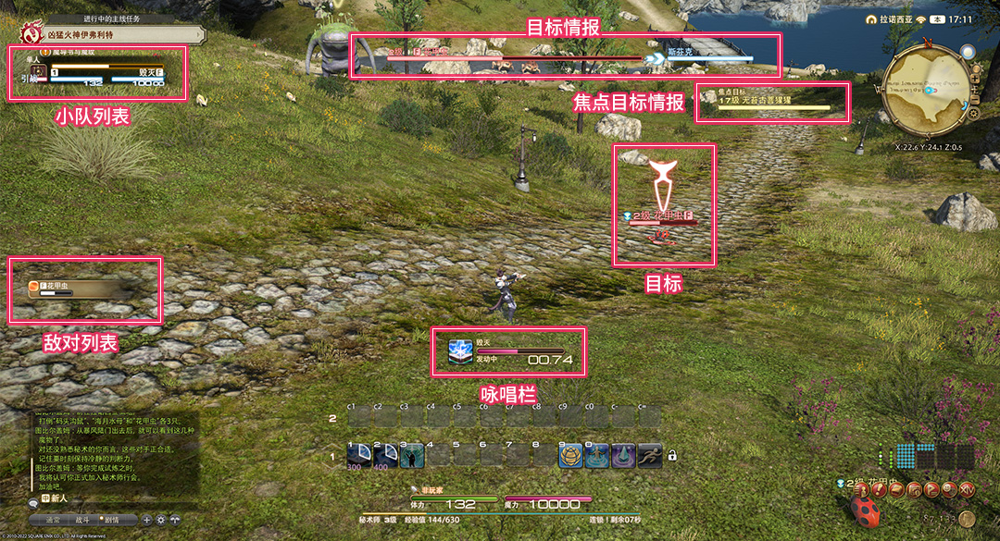
;;;
;;;.guide .col .grow 

#### 小队列表

包括自己在内的小队成员的列表。 在战斗中也会显示仇恨顺序、Buff/Debuff（强化状态/弱化状态）的信息。点击小队成员，也可以直接选中目标成员。

※在默认设定中，单人不组队的话是不会显示小队列表的。

#### 敌对列表

这里显示战斗中的敌人，以及它们的仇恨情况。  仇恨图标是红色话，就会被敌人攻击，要注意哦。 

[什么是仇恨？如何分辨仇恨？](/basic/how.md)

#### 目标/目标情报

自己选中的目标、物体的信息。目标情报右边，会显示目标的目标。 

#### 焦点目标情报 

这里显示自己设为焦点的目标情报。 一般来说，只有选择了目标之后，才会显示目标信息，但是如果将其设为焦点的话，就可以在屏幕上固定显示某一个目标的信息了，非常方便。一定要好好利用这个功能。

::: segment grey

**设置焦点目标的方法** 

①选中想要设为焦点的角色/敌人  ②鼠标右键（手柄为`X`或`□`键）从子命令中选择“焦点目标” ③焦点目标的情报就会固定显示出来了 

:::

#### 咏唱栏

当使用需要咏唱时间的技能时就会出现，会显示到放出技能为止所剩的时间。 

;;;
;;;

### 名牌

敌人的名牌会根据目标，以及目标的交战状态而改变颜色。

;;;.guide .cols2
;;;.guide .col

;;;
;;;.guide .col .grow
没有在战斗，闲逛状态的敌人
;;;
;;;

;;;.guide .cols2
;;;.guide .col

;;;
;;;.guide .col .grow
自己搭档或小队成员率先进攻，正在战斗中的敌人
;;;
;;;

;;;.guide .cols2
;;;.guide .col
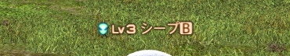
;;;
;;;.guide .col .grow
主动攻击型的敌人，正在进行攻击，或者是连锁中的敌人
;;;
;;;

;;;.guide .cols2
;;;.guide .col

;;;
;;;.guide .col .grow
自己搭档或小队成员以外的人率先进攻，正在战斗中的敌人
;;;
;;;

### Q: 为什么敌人名字前面的图标不一样？

;;;.guide .cols2
;;;.guide .col
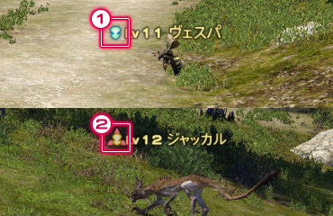
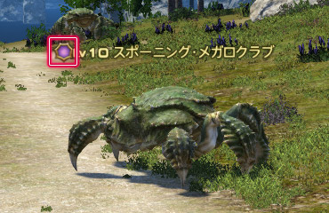
;;;

;;;.guide .col .grow
敌人名牌左边的图标，表示对方是否是主动攻击型的敌人。图标的形状表示对方的种类、强弱。

**①蓝色的图标**
就算靠近也不会主动进攻，是被动型的敌人。

**②红色图标**
靠近的话就会主动袭击过来，是主动型的敌人，要注意哦。
※提高自身等级之后，对方就不会再主动进攻了。

另外，敌方名牌根据临危受命，或特殊副本内容不同，而有专门的图标表示。具体信息可以看[这里](https://ff14.huijiwiki.com/wiki/%E6%95%8C%E4%BA%BA%E7%B1%BB%E5%9E%8B)。
;;;
;;;

## 改变界面部件的布局

所有界面部件的布局，都可以从快捷指令 > 系统 > 界面设置中变更。

首先从调整位置、大小，这些比较简单上手的部分开始吧。

[我是高清屏幕，UI特别小怎么办？](/ui/battle.md)

::: collapse 没有灵感，想看看大家是怎么摆的！

;;;.guide .cols3
;;;.guide .col .figcap

图片来自抹茶群热心网友
;;;
;;;.guide .col .figcap

图片来自抹茶群热心网友
;;;
;;;.guide .col .figcap
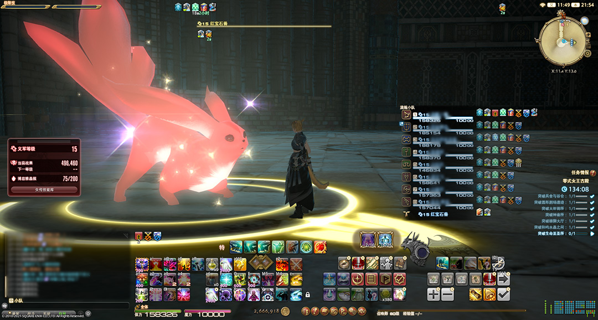

图片来自红宝石兽
;;;
;;;

;;;.guide .cols3
;;;.guide .col .figcap
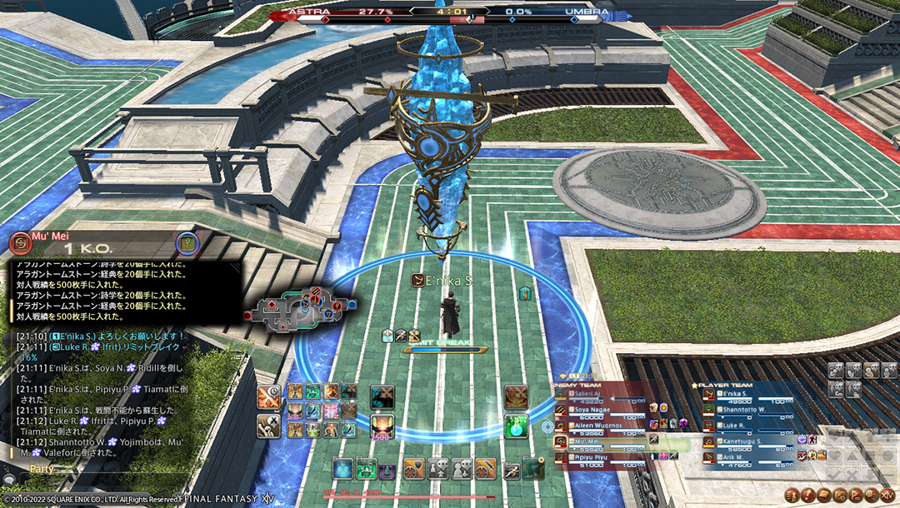

【PVP】图片来自艾尼卡 
;;;
;;;.guide .col .figcap
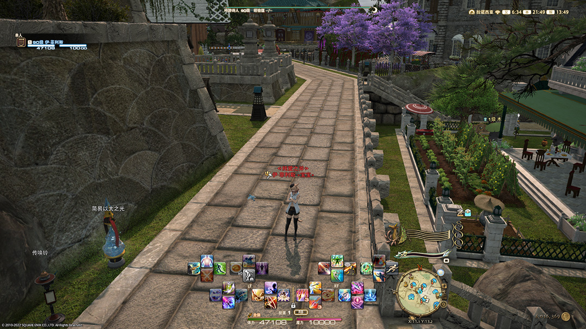

【手柄】图片来自抹茶群热心网友
;;;
;;;.guide .col .figcap
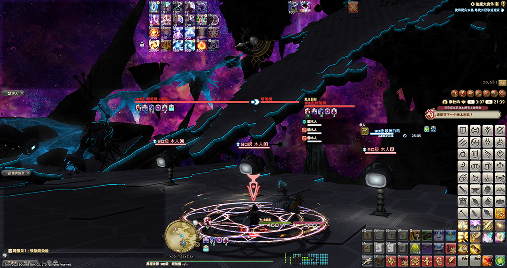

图片来自宏学杂技学家
;;;
;;;

;;;.guide .cols2
;;;.guide .col .figcap
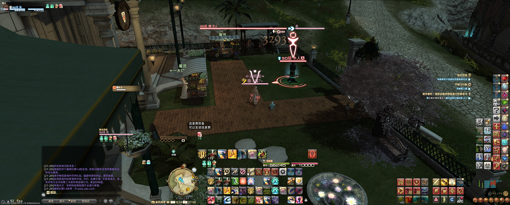

【带鱼屏】图片来自Wiki群热心网友
;;;
;;;.guide .col .figcap
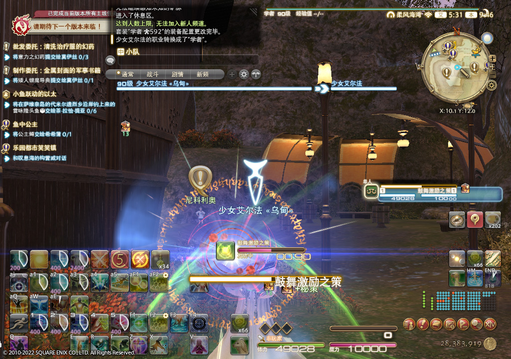

【小屏】图片来自抹茶群热心网友
;;;
;;;

:::

#### ① 快捷指令 > 系统中选择“界面设置”。

;;;.guide .cols2
;;;.guide .col
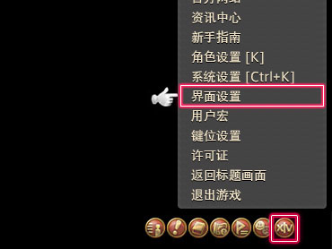
;;;
;;;.guide .col .grow
快捷指令 > 系统中选择“界面设置”。
※游戏界面会变成“界面设置模式”，此时就可以改变界面布局和设置了。
;;;
;;;

#### ② 选中想要改变的界面窗口，调整布局。

;;;.guide .cols2
;;;.guide .col
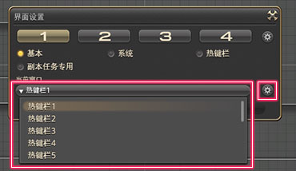
;;;

;;;.guide .col .grow

**选择界面部件的方法**  
在界面设置中，可以从“当前窗口”的下拉菜单中选择想要设置的界面部件。
※选中的界面部件边框会变为黄色。

**移动位置**  
选中界面部件之后，就可以拖拽它到任意地方。
;;;
;;;

;;;.guide .cols2
;;;.guide .col
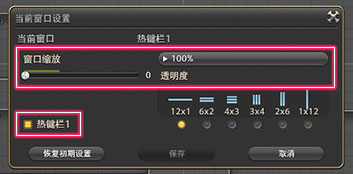
;;;

;;;.guide .col .grow
**改变尺寸和透明度**  
在界面设置中，点击当前窗口右边的齿轮图标（当前窗口设置），可以修改窗口尺寸和透明度。
选中窗口按 `Ctrl`+`Home` 快捷键，也可以改变窗口尺寸。

**显示/隐藏切换**  
右键界面部件，就可以切换显示/隐藏部件。  
※隐藏的界面部件的名字会变为紫色。
;;;
;;;

;;;.guide .cols2
;;;.guide .col
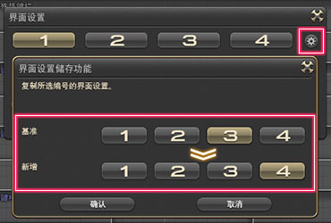
;;;

;;;.guide .col .grow
**复制布局**  
点击界面设置右上角的齿轮图标（界面设置储存功能），选中想要复制的目标编号，然后点击确认按钮。。
;;;
;;;

#### ③ 设置全都保存好了！

;;;.guide .cols2
;;;.guide .col
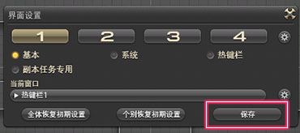
;;;

;;;.guide .col .grow
如果调整好了界面设置，点击保存按钮就搞定了。快点去试试吧。

※布局之外的界面设置，可以在角色设置中的界面设置里找到。

;;;
;;;

> * [如何设置技能/快捷栏](/ui/hotbar.md)
> * [如何设置其他界面](/ui/config.md)
> * [让战斗更方便的设置](/ui/how.md)