##  マーケット

ファイナルファンタジーXIVでは、NPCショップでのアイテム取引のほか、「マーケットボード」を通して冒険者間で自由にアイテムの取引が行えるマーケット機能をご用意しています。ぜひ活用してみてください！

※アイテム出品についてはリテイナーを通じて行うため、リテイナー機能を開放している必要があります。

### Q: マーケットはどこにあるんですか？

;;;.guide .cols2
;;;.guide .col
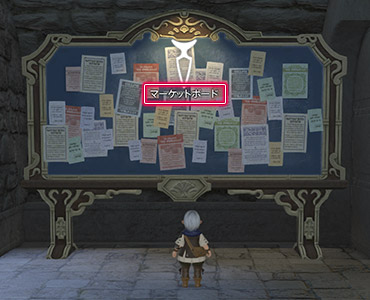
;;;

;;;.guide .col .grow
マーケットは、各都市や居住区などに設置されている「マーケットボード」から利用できます。
マップ内のボードアイコンが目印です。

※出品リストは全マーケットボードで共通です。
※アイテム出品については、リテイナーを通じて行うため、機能を開放しておきましょう。
;;;
;;;

### Q: マーケットボードの使い方が分かりません

;;;.guide .cols2
;;;.guide .col
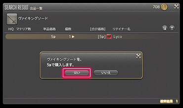
;;;

;;;.guide .col .grow
アイテムの購入は、マーケットボードをクリックして表示される「アイテムサーチ」から行います。

「アイテムサーチ」では、テキスト検索をはじめ、武器の種類や部位別のカテゴリ検索などが行えます。まずは、お目当てのアイテムを探しましょう。

欲しいアイテムが見つかったら、選択して購入しましょう。
;;;
;;;

### Q: アイテムが多すぎて、探したいアイテムが見つけられません

装備品など、検索結果が多すぎてお目当てのアイテムが見つけられない場合は、「カテゴリサーチ」で装備レベルやクラス／ジョブを指定してみましょう。表示数を絞り込むことができます。

;;;.guide .cols2
;;;.guide .col .figcap .grow
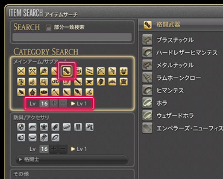

**メインアーム／サブアームの場合**
カテゴリを選択し、装備レベルを入力して、下部の「検索する」ボタンを選択！
;;;
;;;.guide .col .figcap .grow
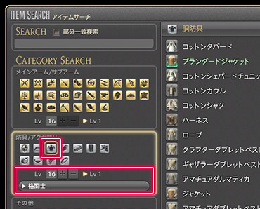

**防具／アクセサリの場合**
カテゴリを選択し、装備レベルの入力とクラス／ジョブを選んで、下部の「検索する」ボタンを選択！
;;;
;;;

##### 「部分一致検索」のススメ

;;;.guide .cols2
;;;.guide .col
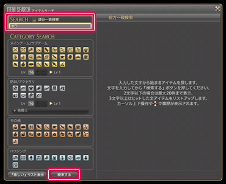
;;;

;;;.guide .col .grow
調べたいアイテムの名称が少しでも分かる場合は、アイテムをかなりの数まで絞り込むことができる「部分一致検索」がおすすめです！

テキスト検索上部の「サーチ」エリアの「部分一致検索」チェックボックスを有効にして、分かる範囲でテキストを入力し、[Enter]キーを押すもしくは「検索する」ボタンを押して検索してみましょう。

※検索結果が右側に表示されます。
;;;
;;;

## 取引履歴

### Q: 欲しいアイテムがどの位の価格で取引されているか知りたい

マーケットでは、冒険者が価格を自由に設定できるため、同じ商品でも販売価格に差異があります。
そんな時はマーケットボードから「過去の取引履歴」を開き、いままでの取引履歴と出品価格と比較してみましょう。
決めづらい出品価格も、取引履歴を参考にすればかんたんに設定できます。ぜひ活用してみてください。

##### 「取引履歴」を確認してみよう！

##### ① マーケットボードを開き、「アイテムサーチ」から見たいアイテムを選択！

;;;.guide .cols2
;;;.guide .col
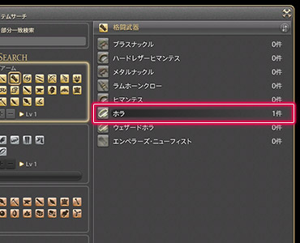
;;;

;;;.guide .col .grow
「マーケットボード」を開き、確認したいアイテムを選択します。
;;;
;;;

##### ② 「出品一覧」から、右上の「過去の取引履歴を表示」ボタンを選択！

;;;.guide .cols2
;;;.guide .col
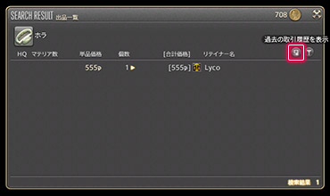
;;;

;;;.guide .col .grow
「出品一覧」から、右上の「過去の取引履歴を表示」ボタンを選択してアイテムの取引履歴を表示します。
;;;
;;;

##### ③ 該当アイテムのマーケットでの過去の取引履歴を確認！

;;;.guide .cols2
;;;.guide .col
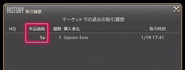
;;;

;;;.guide .col .grow
「取引履歴」では、該当アイテムの単品価格や販売個数、購入者名、取引時間など、マーケットでの過去の取引履歴がまとめて確認できます。
;;;
;;;

## 「欲しい」リスト

### Q: マーケットでよく調べるアイテムをすぐに検索できるようにしたい

マーケットボードには、気になるアイテムの情報を一時的にリストアップしておける「欲しい」リスト機能があります。
よく見るアイテムを登録しておけば、ダイレクトに出品数や価格が検索できるようになり、とても便利です。
※「欲しい」リストおよび集計データは、サーバー停止のたびにクリアされます。

##### 「欲しい」リストを登録してみよう！

##### ① マーケットボードを開き、アイテムを検索！

;;;.guide .cols2
;;;.guide .col
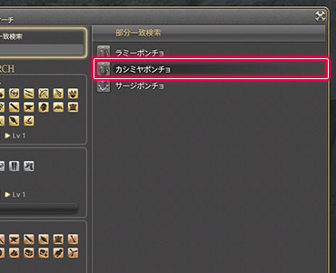
;;;

;;;.guide .col .grow
マーケットボードを開き、登録したいアイテムを検索します。
;;;
;;;

##### ② アイテムを右クリックして、サブコマンドから「欲しいリスト」登録を選択！

;;;.guide .cols2
;;;.guide .col
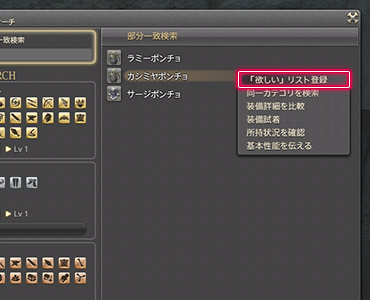
;;;

;;;.guide .col .grow
アイテムを右クリックして、サブコマンドから「欲しい」リスト登録を選べば、リストに登録できます。
;;;
;;;

##### 「欲しい」リストを確認してみよう！

##### ① マーケットボードを開き、「欲しい」リスト表示ボタンを選択！

;;;.guide .cols2
;;;.guide .col
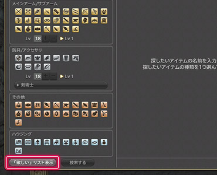
;;;

;;;.guide .col .grow
マーケットボードを開き、左下にある「欲しい」リスト表示ボタンを選択します。
;;;
;;;

##### ② 「欲しい」リストから、検索したいアイテムを選択して詳細を確認！

;;;.guide .cols2
;;;.guide .col
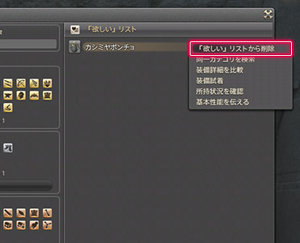
;;;

;;;.guide .col .grow
「欲しい」リストから見たいアイテムを選べば、該当アイテムの出品リストをすぐに確認できます。
ぜひ利用してみてください。

※アイテムを右クリックし、サブコマンドから「欲しい」リストの削除を選べば、登録解除もその場で行えます。
;;;
;;;
