## HUD

### 游戏画面上常见的信息

HUD是Head Up  Display的缩写，也就是游戏画面中一直显示的界面部件。HUD包含了很多个界面窗口，它们都可以根据你的使用习惯和操作方法调整尺寸、位置、布局等等。一边进行冒险，一边调整觉得不舒服的地方吧！

### Q: 不清楚界面部件的名字、使用方法

所有界面部件的名称都记载在下方，默认界面会根据操作模式不同而有所区别。

- [键盘鼠标模式](https://jp.finalfantasyxiv.com/uiguide/know/#)
- [手柄操作模式](https://jp.finalfantasyxiv.com/uiguide/know/#)

#### 键盘鼠标模式：非战斗时

 

|                        |                                                              |
| ---------------------- | ------------------------------------------------------------ |
| 主线向导   | 根据玩家的游戏主线进度，提示玩家接下来要去往的地方。如果忘了自己要去哪里，就点一下向导上的任务名，然后过去看看吧。 |
| ログウインドウ         | チャットをはじめ、バトル中のログやゲームアナウンスを表示するウインドウです。 ログが多すぎて読みきれない場合は、右下の[歯車]ボタンから内容をフィルタリングしてみましょう。  さらに[+]ボタンからタブを追加して、そのタブに見たい情報だけを表示すればさらに見やすくなります。ぜひ試してみてくださいね。 |
| ホットバー             | アクションやアイテムを登録しておけば、ショートカットキーですぐに使えるようになる便利なバーです。 レイアウトは自分好みにカスタマイズが可能！ショートカットキーも自由に変更が可能です。 |
| キャラクターパラメータ | キャラクターパラメータやレベル、取得経験値、レストボーナス情報が表示されます。 レストボーナスは、都市などのレストエリアで滞在またはログアウトすることで蓄積される経験値ボーナスです。ゲームのログアウトは、都市で行うよう心がけましょう！ |
| ナビマップ             | キャラクター周辺のミニマップです。クリックするとエリアマップが開きます。 マップは訪れることで自動的に記録されます。未開の地にはどんどん足を運んで地図を完成させましょう！移動が楽になるエーテライトの交感も忘れずに！ |
| 目的リスト             | 受けているクエストやリーヴの目的とクリアするための行動が示されたリストです。 クエスト名を選択すると次の目的地が表示されるので、すぐに向かいましょう。目的を達成したら報告してクエスト完了です。 |
| 装備・所持品サイン     | 所持品の空き状況と、今どの部位に装備品を付けているかが一目で分かるリストです。 クリックすれば、キャラクター情報と所持品が直接確認できます。 |
| メインコマンド         | ゲーム内メニューの一覧です。 [メインコマンド]ボタンをクリックすると詳細が表示されます。 |
| 所持金                 | キャラクターが持っている所持金です。 左クリックすると、軍票やスクリップ、MGPなどの所持数が確認できます。 |

#### マウス操作モード：戦闘時

 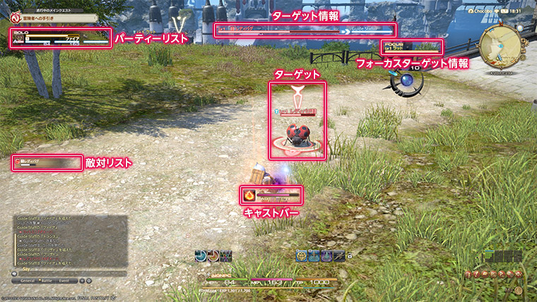

|                            |                                                              |
| -------------------------- | ------------------------------------------------------------ |
| パーティリスト             | 自分を含めたパーティメンバーのリストです。 バトル中は、敵視の順位やバフ／デバフ状態なども表示されます。クリックすることで直接キャラクターをターゲットすることもできます。 ※デフォルト設定では、ソロ状態ではパーティリストは表示されません。 「敵視」について パーティリストや敵対リストには、バトル中「敵視」の状況が表示されます。 「敵視」とは、敵へのアクションによって蓄積される、敵の「怒り指数」のようなものです。パーティリストでは、数字が小さいほど敵視は高く、[A]のキャラクターは敵から攻撃を受けます。   **「敵視」はどうやって貯めるんですか？**  通常「敵視」はタンクに集まっていますが、「敵視」は攻撃やヒールでも上昇するため、DPSやヒーラーが襲われるケースもあります。このようなケースでは、「敵視」をタンクに回収してもらう必要があります。   **どう対処すればいいんですか？**  **タンク：** 敵視を上昇させるアクションを使い、「敵視」を自分に集めましょう。  **DPS：** 敵視を下げるアクションがあれば使い、タンクと同じターゲットを攻撃しましょう。「敵視」がタンクに回収されたら全力で攻撃しましょう。  **ヒーラー：** 敵視を下げるアクションがあれば使い、可能な範囲でヒールを調整して「敵視」をタンクに回収してもらいましょう。   このように、タンクが一身に敵視を受けることで、DPSは攻撃に専念でき、ヒーラーは安心して回復が行え、タンクは確実にヒールを受けることができます。   レベルが上がることに「敵視」の管理は大切なポイントになってくるので、少しずつ慣れていきましょう！ |
| 敵対リスト                 | 戦闘中の敵のリストと「敵視」の蓄積状況がそれぞれ表示されます。 敵視アイコンが「赤」になると襲われてしまいますので、気を付けましょう。 |
| ターゲット／ターゲット情報 | 自分が選択しているキャラクターやオブジェクトの情報です。 右側の情報は、自分の選択している対象がターゲットしているキャラクターの情報です。 |
| フォーカスターゲット情報   | 自分がフォーカスターゲットしたキャラクターの情報です。 ターゲットするだけでは、選択を解除するとターゲット情報が消えてしまいますが、フォーカスターゲットしておけば、画面上に常時対象の情報を表示しておくことができ大変便利です。ぜひ活用してみてください。   **フォーカスターゲットの指定方法**  ①フォーカスターゲットしたいキャラクターを選択  ②サブコマンドから「フォーカスターゲット」を選択 ③フォーカスターゲット情報が画面に固定表示されます |
| キャストバー               | 実行までに時間を有する魔法やアクションを使う際に、実行までの残り時間を表示するバーです。 |

### Q: HUDのレイアウトはどこで変更するの？

各HUDのレイアウトは、メインコマンド＞システムメニュー＞「HUDレイアウト変更」から変更できます。
まずは、位置の移動やサイズ調整など、かんたんなところから始めてみましょう。

#### HUDレイアウトを変更してみよう！

#### ① メインコマンド＞システムメニューから、「HUDレイアウト変更」を開きます。

;;;.guide .cols2
;;;.guide .col
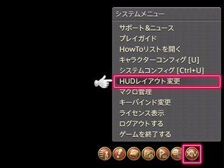
;;;
;;;.guide .col .grow
メインコマンド＞システムメニューから、「HUDレイアウト変更」を開きます。  
※画面が「HUDレイアウトモード」になり、HUDのレイアウトが変更できるようになります。
;;;
;;;

#### ② 変更したいHUDを選択して、レイアウトを調整します。

;;;.guide .cols2
;;;.guide .col
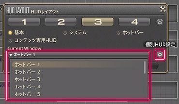
;;;

;;;.guide .col .grow

**HUDの選択方法**  
「HUDレイアウト」内にある「Current Window」プルダウンから変更したいHUDをクリックします。  
※選択されているHUDはフレームが黄色になります。

**位置の移動**  
HUDを選択し、任意の場所にドラッグ＆ドロップします。
;;;
;;;

;;;.guide .cols2
;;;.guide .col
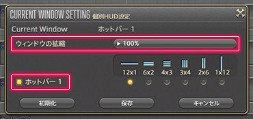
;;;

;;;.guide .col .grow
**サイズの変更**  
「HUDレイアウト」内にある歯車アイコン（個別HUD設定）を選んで、「ウインドウの拡縮」プルダウンから任意のサイズを選択します。  
Ctrl+Homeでも同様の変更が行えます。

**表示／非表示の切替**  
HUDを右クリックで表示の切替が行えます。  
※非表示のHUDは名称部分が紫色になります。
;;;
;;;

;;;.guide .cols2
;;;.guide .col
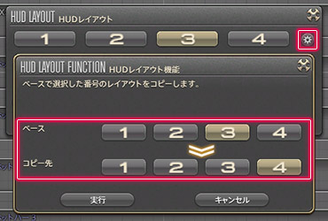
;;;

;;;.guide .col .grow
**レイアウトのコピー**  
「HUDレイアウト」内にある歯車アイコン（HUDレイアウト機能）を選んで、コピーしたいHUDとコピー先の番号を選んで「実行」ボタンをクリックします。
;;;
;;;

#### ③ 内容を保存して完了です！

;;;.guide .cols2
;;;.guide .col
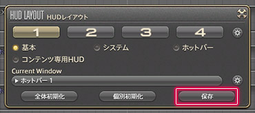
;;;

;;;.guide .col .grow
レイアウトの調整が終わったら、「保存ボタン」を押して完了です。さっそく試してみましょう。

※レイアウト以外のHUD設定は、キャラクターコンフィグ内の「ユーザーインターフェース設定」から行えます。

→HUDに関するその他の質問は[こちら](https://jp.finalfantasyxiv.com/uiguide/search/?q=HUD)
;;;
;;;

## アクション

### ゲーム内で行う行動の総称

ファイナルファンタジーXIVでは、魔法を唱えたりアイテムを使うなど、ゲーム内で行うさまざまな行動をまとめて「アクション」と呼んでいます。アクションは「アクションリスト」から確認できます。

### Q: アクションの使い方がわかりません

アクションは、ホットバーやXHB（クロスホットバー）にアイコンをセットして使用します。  
クロスホットバーは、同時押しなどのホールド操作拡張設定を活用するとより便利に使う事ができます。

#### ホットバーにアクションを登録して使ってみよう！

#### ① アクションリストを開き、登録したいアクションを選択します

;;;.guide .cols2
;;;.guide .col

;;;

;;;.guide .col .grow
メインコマンド＞マイキャラクター＞アクションリストから、登録したいアクションを選択します。

Tips：  
ホットバーのスロットにはアクションの他にも、マウントやミニオン、エモート、アイテムなども登録できます。よく使うものはセットしておくと便利です。
;;;
;;;

#### ② 選択中のアクションアイコンを、ホットバーまでドラッグして登録！

;;;.guide .cols2
;;;.guide .col

;;;

;;;.guide .col .grow
選択中のアクションをホットバーまでドラッグして登録します。
;;;
;;;

#### ③ 使用したいアクションを選択して発動！

;;;.guide .cols2
;;;.guide .col

;;;

;;;.guide .col .grow
使用したいアクションを選択します。

→アクションに関するその他の質問は[こちら](https://jp.finalfantasyxiv.com/uiguide/search/?q=アクション)
;;;
;;;

## ホットバー

### すぐにアクションやアイテムを使えるようにするショートカット機能

「ホットバー」は使いたいアクションを任意のスロットに配置し、すぐに使えるようにするショートカット機能です。  
登録後は、「アイコンをクリック」または「ショートカットキーを押す」ことですぐに実行できます。

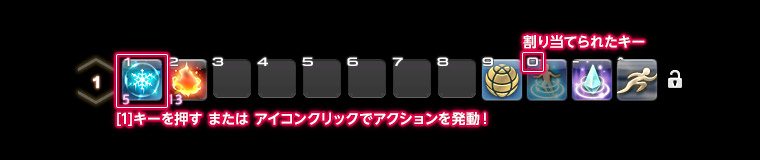

### Q: ホットバーの登録方法が分かりません

ホットバーへの登録は、アクションアイコンをホットバーまでドラッグして登録します。
PlayStation®4では、「[パッドマウスモード](https://jp.finalfantasyxiv.com/uiguide/faq/#entry-interface_pad_mouse)」に切り替える、もしくはタッチパッドで同様の操作が行えます。

#### ホットバーにアクションを登録して使ってみよう！

#### ① アクションリストを開き、登録したいアクションを選択！

;;;.guide .cols2
;;;.guide .col
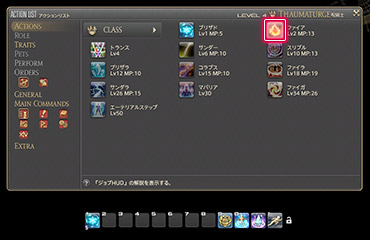
;;;

;;;.guide .col .grow
メインコマンド＞マイキャラクター＞アクションリストから、登録したいアクションを選択します。

Tips：  
スロットにはアクションの他にも、マウントやミニオン、エモート、アイテムなども登録できます。よく使うものはセットしておくと便利です。
;;;
;;;

#### ② 選択中のアクションアイコンを、ホットバーまでドラッグして登録！

;;;.guide .cols2
;;;.guide .col
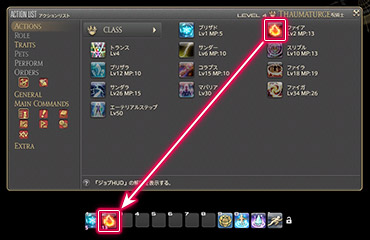
;;;

;;;.guide .col .grow
選択中のアクションをホットバーまでドラッグして登録します。

※ホットバーにアクションがセットされます。
;;;
;;;

### Q: コントローラーだけでホットバーの登録はできますか？

;;;.guide .cols2
;;;.guide .col

;;;

;;;.guide .col .grow

はい。可能です。「パッドマウスモード」に切替えれば、コントローラのみでマウス同様の操作が行えます。

**モードの開始/終了**

Windows版：Lボタン(LB)+右スティックボタン  
PlayStation®4版：L1ボタン+R3ボタン

**マウスポインタの移動**

Windows版：右スティック  
PlayStation®4版：右スティック

**左クリック/右クリック**

Windows版：左トリガー(LT)/右トリガー(RT)  
PlayStation®4版：L2ボタン/R2ボタン
;;;
;;;

関連：
[Q: ゲームパッド（コントローラー）だけでマウス操作がしたい](https://jp.finalfantasyxiv.com/uiguide/faq/#entry-interface_pad_mouse)

### Q: ホットバーに登録したアイコンの下にある数字はなに？

;;;.guide .cols2
;;;.guide .col
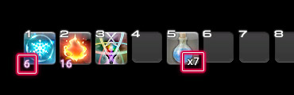
;;;

;;;.guide .col .grow
**アイコン左下：**消費TPまたは消費MP（CP/GP）  
**アイコン右下：**所持数

Tips:  
CP：クラフターポイント　GP：ギャザラーポイント
;;;
;;;

### Q: ショートカットキーを自分の使いやすいものに変更したい

ホットバーにバインドされているショートカットキーは、いつでも自由に変更できます。
使いやすいキーにセットして、ゲームをスムーズに進めましょう。

#### キーバインドを変更してみよう！

#### ① メインコマンド、システムメニューから「キーバインド変更」を選択！

;;;.guide .cols2
;;;.guide .col
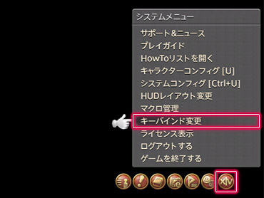
;;;

;;;.guide .col .grow
メインコマンド＞システムメニューから、「キーバインド変更」を選択します。
;;;
;;;

#### ② 「ホットバー」タブを選択し、設定したいホットバースロットの「キー設定」を選択！

;;;.guide .cols2
;;;.guide .col
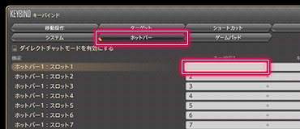
;;;

;;;.guide .col .grow
「ホットバー」タブから、設定したいスロットの「キー設定」を選択します。

※選択しているスロットがハイライトされます。
;;;
;;;

#### ③ スロットに設定したいキーをキーボードで入力して完了！

;;;.guide .cols2
;;;.guide .col
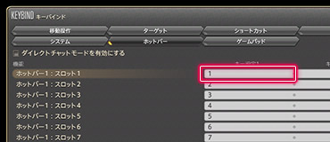
;;;

;;;.guide .col .grow
設定したいキーをキーボードで入力して完了です。

※入力したキーが表示されます。
;;;
;;;

### Q: 空のスロットの枠を消したい

;;;.guide .cols2
;;;.guide .col
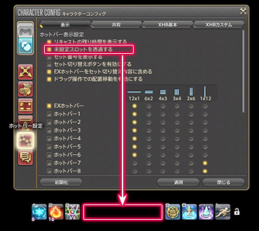
;;;

;;;.guide .col .grow
メインコマンド＞システムメニュー＞キャラクターコンフィグ＞ホットバー設定＞「表示」タブの「ホットバー表示設定」から、「未設定のスロットを透過する」を有効にすることで、空のスロットを透過表示できます。

※枠が透過状態でもアクションの登録は行えます。

→ホットバーに関するその他の質問は[こちら](https://jp.finalfantasyxiv.com/uiguide/search/?q=ホットバー)
;;;
;;;

## XHB（クロスホットバー）

### ゲームパッドからすぐにアクションやアイテムを使えるようにするショートカット機能

XHB（クロスホットバー）は、ゲームパッドでアクションを実行するための十字型のパレットです。キャラクターごとに各クラス最大8セットまで登録が可能です。よく使うアクションは、SET1に登録しておきましょう。

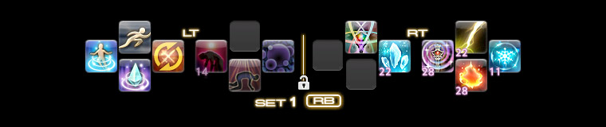

### Q: XHB（クロスホットバー）の使い方が分かりません

XHB（クロスホットバー）は、左トリガー(LT)/右トリガー(RT)（PlayStation®4版：L2ボタン/R2ボタン）を押しながらゲームパッドのボタン（または方向キー）を入力することで実行できます。

#### XHBにアクションを登録して使ってみよう！

#### ① アクションリストを開き、登録したいアクションを選択！

;;;.guide .cols2
;;;.guide .col
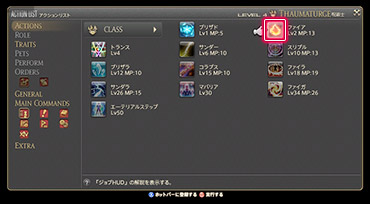
;;;

;;;.guide .col .grow
メインコマンド＞マイキャラクター＞アクションリストから、登録したいアクションを選択します。

Tips：  
スロットにはアクションの他にも、マウントやミニオン、エモート、アイテムなども登録できます。
;;;
;;;

#### ② Xボタン（PlayStation®4版：□ボタン）を押して「ホットバー登録モード」に入る

;;;.guide .cols2
;;;.guide .col
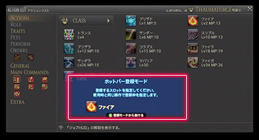
;;;

;;;.guide .col .grow
Xボタン（PlayStation®4版：□ボタン）を押して「ホットバー登録モード」に入ります。

※モード状態を表すウインドウが表示されます。
;;;
;;;

#### ③ 使用時と同じ操作を行い、アクションを登録して「ホットバー登録モード」から抜ける

;;;.guide .cols2
;;;.guide .col
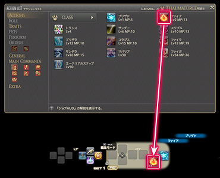
;;;

;;;.guide .col .grow
使用時と同じ操作を行い、アクションを登録して「ホットバー登録モード」を抜けます。

※XHB（クロスホットバー）はキャラクターごとに各クラス最大8セットまで登録が可能です。
;;;
;;;

#### ④ 使用時と同じ操作を行い、アクションを実行！

;;;.guide .cols2
;;;.guide .col

;;;

;;;.guide .col .grow
使用時と同じ操作を行い、アクションを実行します。
;;;
;;;

### Q: XHB（クロスホットバー）を切替えたい

;;;.guide .cols2
;;;.guide .col
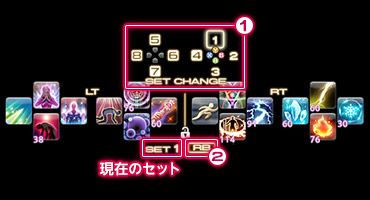
;;;

;;;.guide .col .grow
XHB（クロスホットバー）は、下記の方法で切替えることができます。

**①任意のセットへの切替**

Rボタン(RB)（PlayStation®4版：R1ボタン）+各種ボタン（または方向キー）

**②アクション登録セットのみの切替**

Rボタン(RB)（PlayStation®4版：R1ボタン）

Tips:  
2セットのみの切替であれば、もっと素早く操作できる「ホールド操作拡張設定」がオススメ！詳しくは[こちら](https://jp.finalfantasyxiv.com/uiguide/know/#entry-xhb_hold)
;;;
;;;

### Q: ホールド操作拡張設定ってなんですか？

XHB（クロスホットバー）は、Rボタン(RB)（PlayStation®4版：R1ボタン）でのセット切替操作のほかに、「ホールド操作拡張設定」を有効にすることで、左トリガー(LT)/右トリガー(RT)（PlayStation®4版：L2ボタン/R2ボタン）の同時押し操作で、ホールド状態中の表示を一時的に指定した別セットの情報に切替えることができます。

ホールド状態を解除すれば切替状態も解除されるため、元のセットに戻す必要がなく、2セット分の操作がぐっと楽になります。設定も簡単なので、ぜひ使ってみてくださいね。

#### 同時押し操作を使ってみよう！

#### ① システムメニューからキャラクターコンフィグを選択！

;;;.guide .cols2
;;;.guide .col
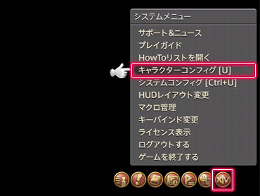
;;;

;;;.guide .col .grow

メインコマンド＞システムメニュー＞キャラクターコンフィグを選択します。

;;;
;;;

#### ② ホットバー設定＞XHBカスタムから「ホールド操作拡張設定」を有効にします

;;;.guide .cols2
;;;.guide .col
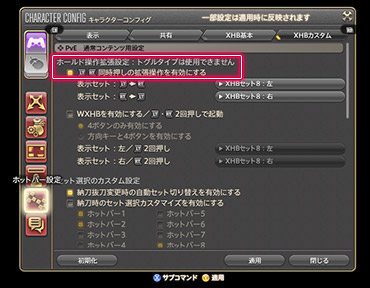
;;;

;;;.guide .col .grow

ホットバー設定＞XHBカスタムタブにある「ホールド操作拡張設定」の「LT/RT同時押し（PlayStation®4版：L2/R2同時押し）の拡張操作を有効にする」チェックボックスをオンにします。

Tips:  
同じ画面でWXHB（ダブルクロスホットバー）機能を有効にすることもできます。

;;;
;;;

#### ③ 同時押しの操作中、表示させたいXHBのセット番号を選択！

;;;.guide .cols2
;;;.guide .col
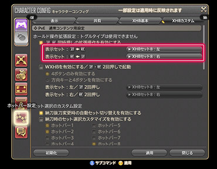
;;;

;;;.guide .col .grow

LT/RT同時押しの操作中に表示させたいXHB（クロスホットバー）のセット番号を指定します。

**Windows版**

表示セット：LT→RT  
左トリガー(LT)を押したまま右トリガー(RT)を押す  
表示セット：RT→LT  
右トリガー(RT)を押したまま左トリガー(LT)を押す

**PlayStation®4版**

表示セット：L2→R2  
L2ボタンを押したままR2ボタンを押す  
表示セット：R2→L2  
R2ボタンを押したままL2ボタンを押す

;;;
;;;

#### ④ 同時押しの操作を行い、アクションを実行！

;;;.guide .cols2
;;;.guide .col

;;;

;;;.guide .col .grow

同時押しの操作を行い、セットが切り替わっていることを確認してアクションを実行します。

※ホールド操作中、指定したセットが表示されていれば正しく設定されています。
;;;
;;;

